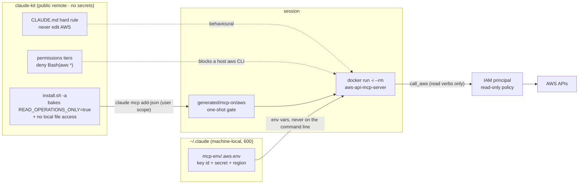

# AWS via the aws-api-mcp-server Docker image (read-only)

Design for wiring Claude Code into the TKLS AWS account **read-only**, following
the same pattern as `docs/github.md`: an official upstream MCP server run as a
container over stdio, registered at user scope by `install.sh`, credentials kept
outside this repo, and the whole thing behind the kit's one-shot startup gate.

Status: **wired.** `install.sh -a` registers it; `-A` deregisters it; `-l aws`
logs out. Set up a read-only IAM user first (see Credentials below).

## The hard rule

**Claude never changes anything in AWS.** No create, no modify, no delete, no
tag edit, no start/stop - reads only, on every tier, in every session. This sits
alongside never-commit / never-push in `claude-md/CLAUDE.md`. If a task appears
to need a write, Claude says what it would run and stops; a human runs it.

Read-only is enforced in three independent places, because any one of them can
be misconfigured:



1. **IAM** - the credentials belong to a principal that can only read. This is
   the only layer that is a real security boundary; the other two are guard
   rails against mistakes, not against a determined process.
2. **`READ_OPERATIONS_ONLY=true`** - baked into the registration as a fixed
   constant (like `GITHUB_READ_ONLY=1` for github-mcp-server), not sourced from
   the credentials file, so editing credentials cannot switch it off. The server
   then matches every CLI command against its known read-only list and refuses
   anything else.
3. **The kit's own rules** - the CLAUDE.md hard rule, plus a `Bash(aws *)` deny
   on every permission tier so Claude cannot route around the MCP by shelling
   out. (The host has no `aws` CLI installed and must not get one - everything
   runs in a container.)

## What you get

The server exposes `call_aws` (runs a validated AWS CLI command) and
`suggest_aws_commands` (natural language -> candidate commands). In practice that
means Claude can answer things like "which RDS instances are within 10% of their
allocated storage", "what does this security group actually allow", "which
resources have no Project tag", "when did that snapshot complete" - the same
questions the DevOps notes answer by clicking through the console, but without
the clicking. See `knowledge/aws-production-deployments.md` for the environment
shape those questions are usually about.

## Credentials: outside the kit, always

This repo has a public remote, so nothing secret goes in it - `.gitignore` is not
a security control. Credentials live at:

```
~/.claude/mcp-env/.aws.env    # mode 600, machine-local, never git-tracked
```

with:

```
AWS_ACCESS_KEY_ID=...
AWS_SECRET_ACCESS_KEY=...
AWS_REGION=eu-west-2
```

`install.sh -a` prompts for these (hidden input, blank keeps the existing value),
writes them with `chmod 600`, and passes them to the container as bare `-e VAR`
flags so the values never appear in a process listing or in `~/.claude.json`
beyond the env block. `install.sh --fresh` preserves `~/.claude/mcp-env/`.

The account behind those keys should be a **dedicated read-only principal**, not
a personal login - so CloudTrail attributes agent activity separately from yours.
Start from the AWS-managed `ReadOnlyAccess` policy and add an explicit `Deny` for
the data-bearing reads (see Limitations).

## How it is wired

A copy of the github wiring with different constants:

1. **Flags**: `-a` / `--with-aws`, `-A` / `--without-aws`, and `aws` as a `-l` /
   `--logout` target (removes the registration, deletes
   `~/.claude/mcp-env/.aws.env`, prints where to deactivate the access key).
   `-a` was freed by dropping `--with-atlassian` (use `-jc`, flags bundle); the
   atlassian teardown is now `-J`.
2. **`aws_secrets="${mcp_env_dir}/.aws.env"`** next to `github_secrets` /
   `atlassian_secrets`.
3. **`applyAws()`** modelled on `applyGitHub()`: checks docker + claude, loads
   any saved values, prompts when interactive (hidden input; blank keeps the
   existing value), saves at mode 600, builds the env JSON, registers with
   `claude mcp add-json aws ... -s user` behind `mcpGate aws`, then touches
   `generated/mcp-on/aws` to pre-arm the gate.
4. **Image**: `public.ecr.aws/awslabs-mcp/awslabs/aws-api-mcp-server:latest`,
   container name `claude-mcp-aws`, run as
   `docker run -i --rm --name claude-mcp-aws -e ... <image>` - the same
   `docker rm -f` reuse as github, so one container at most.
5. **Fixed constants** in the env block, never read from the credentials file,
   so editing credentials cannot switch them off:
   `READ_OPERATIONS_ONLY=true`, `AWS_API_MCP_TELEMETRY=false` (upstream default
   is `true`, and the commands describe client infrastructure), and
   `AWS_API_MCP_ALLOW_UNRESTRICTED_LOCAL_FILE_ACCESS=no-access` (upstream
   default is `workdir`).
6. **Permission tiers**: `"Bash(aws *)"` in `deny` and `mcp__aws` in `allow`, on
   all four `settings/permissions/*.json`.
7. **CLAUDE.md**: the hard rule.
8. **Skill**: `skills/awsmcp/SKILL.md`, matching `githubmcp` - context on what
   the server can and cannot do, plus the one action of touching
   `generated/mcp-on/aws` and telling you to reconnect in `/mcp` when the tools
   are missing.

Then:

```bash
cd ~/claude-kit && ./install.sh -a -p standard
```

Restart Claude Code, and `/mcp` should show `aws` connected. Like every other MCP
in this kit the server is **gated**: a fresh session starts no container and shows
`aws` as failed until `~/claude-kit/generated/mcp-on/aws` exists; `install.sh`
pre-arms it once, and after that it is one `touch` + reconnect per session.

## Limitations

- **IAM is the only real boundary.** `READ_OPERATIONS_ONLY` and the kit rules are
  guard rails. If the credentials can write, something eventually will. Grant
  read-only at the IAM end and treat the rest as belt and braces.
- **"Read-only" still reads secrets.** The managed `ReadOnlyAccess` policy allows
  `secretsmanager:GetSecretValue`, `ssm:GetParameter` (including SecureString),
  `s3:GetObject` and `kms:Decrypt`. Any of those can pull credentials or patient
  data into the model's context. Attach an explicit `Deny` for them - the agent
  needs metadata (describe/list), not payloads.
- **Everything it reads is client data.** Instance names, tags, CIDRs, endpoints
  and log lines identify customers, and they land in session transcripts. None of
  it may be pasted into this repo; that is the same rule as the rest of the kit.
- **Console-only work is out of scope.** The server drives the AWS CLI, so
  anything that only exists as a console wizard, a CloudShell script or a Session
  Manager shell cannot be done through it - which covers most of the build
  procedures in the DevOps notes. It is for reading state, not for building.
- **Credential lifetime.** The kit expects a **dedicated IAM user with a
  long-lived read-only access key** - it has no session-token refresh, and there
  is no `aws sso login` on the host (no CLI is installed there, by rule). A
  long-lived key is the trade for that simplicity: rotate it on a schedule, and
  `install.sh -l aws` when you are done with it. Identity Center credentials
  work only until the permission set's session duration expires, after which the
  server 401s until `AWS_SESSION_TOKEN` is re-pasted.
- **Single region per session.** `AWS_REGION` sets the default; anything outside
  it needs an explicit `--region` in the command.
- **Output size and cost.** Describe calls across a large estate return a lot of
  JSON, which burns context fast; CloudWatch metric queries are billable. Ask
  narrow questions with `--query` filters.
- **Not multi-tenant, and injectable.** Upstream states the server is
  single-user. Tag values, log lines and instance descriptions are attacker- or
  client-controlled text; treat anything read back as data, never as
  instructions.
- **The gate is one-shot.** Every new session starts with the server off. That is
  deliberate - no AWS container runs unless you asked for one this session.

https://awslabs.github.io/mcp/servers/aws-api-mcp-server
https://github.com/awslabs/mcp/tree/main/src/aws-api-mcp-server
