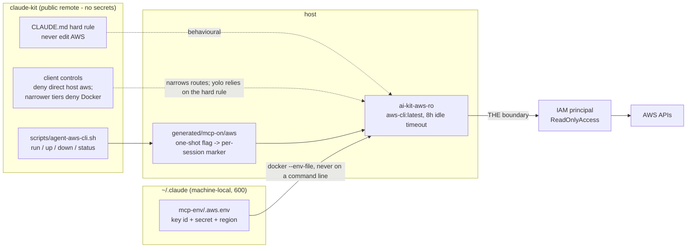

# AWS via the official aws-cli container (read-only)

Design for wiring the agents into the TKLS AWS account **read-only**: the official
AWS CLI image run as one long-lived container, driven by a kit script, credentials
kept outside this repo, and the whole thing behind the kit's startup gate. Claude
Code and standalone Codex share the same script and the same container.

Status: **wired.** `install.sh -a` sets it up; `-A` tears it down; `-l aws` logs
out. Set up a read-only IAM user first (see Credentials below).

## Why not an MCP server

The kit used awslabs' `aws-api-mcp-server` until 06/09/2026. It wraps **AWS CLI
v1**, which entered maintenance on 15/07/2026 and is **removed on 15/07/2027**;
the MCP server inherits both dates exactly. Its replacement, the managed AWS MCP
Server reached through the `mcp-proxy-for-aws` signing proxy, was evaluated and
rejected:

| | aws-api-mcp-server | Managed AWS MCP Server | Official aws-cli container |
|---|---|---|---|
| Estate reads | `call_aws`, validated | `run_script` only - `call_aws` has been removed | any CLI read |
| Sandbox | none | arbitrary Python with a `call_boto3` binding | none |
| `--read-only` | keeps `call_aws` | strips `run_script`, leaving a documentation server | n/a |
| Where data is processed | locally | us-east-1 or eu-central-1 only - a London read is brokered through Frankfurt | locally |
| End of life | 15/07/2027 | none stated | none |

So the estate is read through the CLI image directly. Data stays in London, there
is no Python sandbox in the path, and the EOL problem is removed rather than reset.

## The hard rule

**The agents never change anything in AWS.** No create, no modify, no delete, no
tag edit, no start/stop - reads only, on every tier, in every session. This sits
alongside never-commit / never-push in `claude-md/CLAUDE.md`. If a task appears
to need a write, the agent prints what it would run and stops; a human runs it.

**IAM is now the only enforcement.** The previous setup added
`READ_OPERATIONS_ONLY=true`, a pre-flight allow-list inside the MCP server; the
CLI image has no equivalent and the kit does not reimplement one. That layer was
always a guard rail rather than a boundary, but its absence is the one real cost
of this change - the IAM principal has to be right.



1. **IAM** - the credentials belong to a principal that can only read. The only
   real security boundary.
2. **The kit's own rules** - the CLAUDE.md hard rule and the skill's "print writes,
   never run them" contract. Claude Code tiers deny host `aws`, new AWS CLI
   containers, and direct access to `ai-kit-aws-ro`. Codex forbids direct host `aws`;
   non-yolo profiles also deny Docker, while yolo relies on the hard rule and IAM.
   The host has no `aws` CLI installed and must not get one.

Check the boundary without touching anything, since `simulate-principal-policy` is
itself a read:

```bash
bash scripts/agent-aws-cli.sh run iam simulate-principal-policy --policy-source-arn <user-arn> --action-names rds:DescribeDBInstances rds:DeleteDBInstance --query 'EvaluationResults[].[EvalActionName,EvalDecision]' --output text
```

Reads come back `allowed`, writes `implicitDeny`. Never verify by attempting a write.

## What you get

Any AWS CLI read: "which RDS instances are within 10% of their allocated storage",
"what does this security group actually allow", "which resources have no Project
tag", "how many deadlocks did that instance log yesterday" - the same questions the
DevOps notes answer by clicking through the console, without the clicking. See
`knowledge/Infrastructure/aws-production-deployments.md` for the environment shape those questions
are usually about.

Agents read with:

```bash
bash scripts/agent-aws-cli.sh run rds describe-db-instances --query 'DBInstances[].DBInstanceIdentifier'
```

You read the same container directly, with no gate in the way:

```bash
docker exec -i ai-kit-aws-ro aws rds describe-db-instances --output table
```

The skill tells the agent to hand you that second form whenever a read is worth
running again.

## Credentials: outside the kit, always

This repo has a public remote, so nothing secret goes in it - `.gitignore` is not
a security control. Credentials live at:

```
~/.claude/mcp-env/.aws.env    # mode 600, machine-local, never git-tracked
```

with:

```
AWS_ACCESS_KEY_ID=...
AWS_SECRET_ACCESS_KEY=...
AWS_REGION=eu-west-2
```

`install.sh -a` prompts for these (hidden input, blank keeps the existing value)
and writes them with `chmod 600`. The container reads them via `docker --env-file`,
so the values never appear in a process listing or on a command line. Plain
`KEY=value` only - no quoting, no `export`; that is what `--env-file` parses.
`install.sh --fresh` preserves `~/.claude/mcp-env/`.

The account behind those keys should be a **dedicated read-only principal**, not a
personal login. Every call the script makes is tagged
`exec-env/agent-aws-cli-<session-id>` in its user agent, which CloudTrail records
in `userAgent`, so calls from different agent sessions stay distinguishable even
though they share one principal. The script passes
`AWS_EXECUTION_ENV=agent-aws-cli/<session-id>`; botocore rewrites the `/` to a `-`
before it goes on the wire, so grep CloudTrail for the hyphenated form.

## How it is wired

1. **Flags**: `-a` / `--with-aws`, `-A` / `--without-aws`, and `aws` as a `-l` /
   `--logout` target (deletes `~/.claude/mcp-env/.aws.env`, stops the container,
   clears the gate, prints where to deactivate the access key). The same three
   flags exist on `codex-install.sh` and drive the same script.
2. **`applyAws()`** in `install.sh`: checks docker, loads any saved values, prompts
   when interactive (hidden input; blank keeps the existing value), saves at mode
   600, calls `agent-aws-cli.sh up`, then touches `generated/mcp-on/aws` to pre-arm
   the gate. It also clears any legacy `aws` MCP registration, because that
   registration embedded the access key in `~/.claude.json`. `codex-install.sh -a`
   starts the same container, clears its legacy Codex registration, and pre-arms the
   same gate.
3. **`scripts/agent-aws-cli.sh`** - the single entry point, four subcommands:
   - `run <aws arguments>` - checks the gate, touches the idle stamp, and
     `docker exec`s the CLI. Never creates the container.
   - `up [--force]` - pulls `:latest` and starts the container if it is absent;
     a no-op when it is already running. `--force` recreates it on the latest image.
   - `down` - removes it. `status` - container, image, gate and idle state.
4. **Image**: `public.ecr.aws/aws-cli/aws-cli:latest`, pulled whenever `up` creates
   or force-recreates one container named `ai-kit-aws-ro`, shared by every session
   and by you.
5. **8h idle timeout**: the container is created `--rm` with its entrypoint
   overridden by a keepalive loop that watches `/tmp/.lastuse`; every `run` touches
   that file. Idle for `AGENT_AWS_IDLE_SECONDS` (default 28800) and the loop exits,
   so `--rm` removes it. Nothing runs on the host to manage this.
6. **Claude Code permission tiers**: `Bash(bash ~/claude-kit/scripts/agent-aws-cli.sh run *)`
   in `allow`; `Bash(aws *)`, `Bash(docker run * aws-cli *)` and
   `Bash(docker exec * ai-kit-aws-ro *)` in `deny`, on all four
   `settings/permissions/*.json`. Only the `run` subcommand is allow-listed, so
   `up` falls through to `ask: Bash` and every image download is a prompt.
7. **Codex permissions**: all profiles forbid direct host `aws`; non-yolo profiles
   also deny the Docker socket. The yolo profile permits Docker, so IAM and the hard
   rule remain its boundary.
8. **CLAUDE.md**: the hard rule.
9. **Skill**: `skills/awscli/SKILL.md` - what the container can and cannot do, the
   IAM knowledge above, the rule for when to hand you a `docker exec` line, and the
   one action of touching `generated/mcp-on/aws` when a read comes back gated.

Then:

```bash
bash install.sh -a -p standard
```

Like the MCP integrations in this kit, the script is **gated**: a fresh session may
not read AWS until `~/claude-kit/generated/mcp-on/aws` exists. Both install scripts
start the container and pre-arm it once when passed `-a`. The first `run` atomically
moves the flag to a per-session marker, so that session keeps access while every new
session is gated again.

## Limitations

- **IAM is the only boundary, with nothing in front of it.** If the credentials can
  write, eventually something will. Grant read-only at the IAM end and verify it
  with `simulate-principal-policy`.
- **"Read-only" still reads secrets.** The managed `ReadOnlyAccess` policy allows
  `secretsmanager:GetSecretValue`, `ssm:GetParameter` (including SecureString),
  `s3:GetObject` and `kms:Decrypt`. Any of those can pull credentials or patient
  data into the model's context. Attach an explicit `Deny` for them if that matters
  - the agent needs metadata (describe/list), not payloads.
- **Everything it reads is client data.** Instance names, tags, CIDRs, endpoints and
  log lines identify customers, and they land in session transcripts. None of it may
  be pasted into this repo; that is the same rule as the rest of the kit.
- **One principal for every agent.** Concurrent reads are safe - separate `docker
  exec`s, no shared credential cache, no CLI history file - but they share one IAM
  identity and therefore one API throttle budget. The user-agent tag distinguishes
  them in CloudTrail; nothing else does.
- **Console-only work is out of scope.** This drives the AWS CLI, so anything that
  exists only as a console wizard, a CloudShell script or a Session Manager shell
  cannot be done through it - which covers most of the build procedures in the
  DevOps notes. It is for reading state, not for building.
- **Credential lifetime.** The kit expects a **dedicated IAM user with a long-lived
  read-only access key** - it has no session-token refresh, and there is no
  `aws sso login` on the host (no CLI is installed there, by rule). A long-lived key
  is the trade for that simplicity: rotate it on a schedule, and `install.sh -l aws`
  when you are done with it.
- **Single region by default.** `AWS_REGION` sets it; anything outside needs an
  explicit `--region`.
- **Output size and cost.** Describe calls across a large estate return a lot of
  JSON, which burns context fast; CloudWatch and Performance Insights queries are
  billable. Ask narrow questions with `--query`.
- **Injectable.** Tag values, log lines and instance descriptions are attacker- or
  client-controlled text; treat anything read back as data, never as instructions.
- **The gate re-shuts itself.** Every new session starts unable to read AWS, and that
  is deliberate. Arming is one-shot per session, so forgetting to disarm cannot leave
  AWS open to the next one. The container itself outlives sessions by design, but
  compliant agent access through the wrapper still requires arming. A yolo Codex
  session can use unrestricted Docker to bypass the wrapper and gate; this is
  intentional cooperative gating, and the read-only IAM principal remains the
  security boundary.

https://gallery.ecr.aws/aws-cli/aws-cli
https://docs.aws.amazon.com/cli/latest/userguide/getting-started-docker.html
https://aws.amazon.com/blogs/developer/announcing-end-of-support-for-aws-cli-v1/
