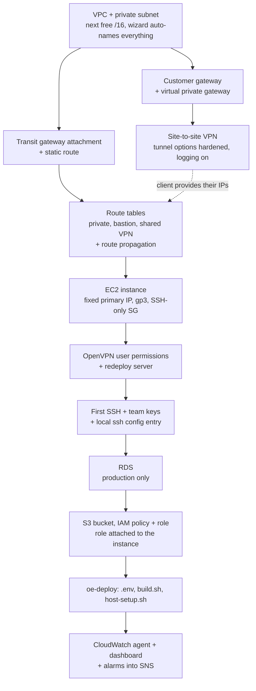

# How production deployments are done on AWS

Distilled from the DevOps team's rough AWS notes (OneNote export, 2023-07 to
2025-09, plus the "new customer lower deployment" walkthrough). It describes the
shape of a hosted OpenEyes environment and the order things happen in - not a
runbook. The step-by-step versions live in the TKL knowledge base; the drafted
set is `/home/toukan/aws-infrastructure-notes.txt` (outside this repo, because
it carries client-identifying names and internal ranges).

Region is London. Everything is tagged `Project: <client>` (lower case) - the
tag drives cost allocation, and untagged resources get hunted down periodically
via Resource Groups -> Tag Editor.

## Shape of a client environment

One VPC per client hosted in AWS, with a single AZ and a single private subnet -
no public subnet, no NAT gateway, no VPC endpoints. Inside it:

- **EC2**, Ubuntu Server 24.04 LTS (the only version new builds use), gp3 root
  volume, no public IP, one SSH-only security
  group. Its primary IP is fixed by convention so the environment is
  identifiable from the address alone (a distinct last octet per environment
  type: production, lower, DM).
- **RDS (MariaDB 11.8, graviton db.m8g classes), production only.** Lower
  environments run the database in a
  container instead. Encrypted, private, deletion protection on, automated
  backups with 7-day retention, storage autoscaling, Performance Insights and
  Enhanced Monitoring on, single-AZ (no standby).
- **S3 bucket per client** for database dumps and protected files, versioned and
  SSE-S3 encrypted, reached through an IAM role attached to the instance - not
  through keys on the host. The host's root-level `aws-cli` and `~/.aws` are
  deliberately removed; the containerised `aws-cli` service does the work.
- **Connectivity**: a site-to-site IPsec VPN per client (AES256 / SHA2-256, a
  single DH group - the highest the client's device will accept, agreed and set
  identically at both ends - DPD action Restart, tunnel logging into a CloudWatch
  log group), and a transit gateway attachment plus route-table entries joining
  the VPC to the ToukanLabs network and the OpenVPN server. Route propagation on
  the private route table is easy to miss and is the usual cause of "the client
  cannot reach the database". Some clients come in over HSCN instead, which is
  routing on the shared public route table rather than a per-client VPN.

Application deployment itself is oe-deploy: a per-environment folder on the
instance, `.env` + `build.sh` + `host-setup.sh`, with compose bringing up the OE
stack. AWS supplies the machine, the database endpoint, the bucket and the
monitoring - it does not change how the application is built.

## Build order for a new environment

The client's own IP addresses usually arrive late, so the VPN is created against
a placeholder customer gateway and the static routes are filled in afterwards.

## Changing production safely

The rough notes are consistent on one point: **take the restore point first**,
and check what the restore actually costs you.

- Before any RDS upgrade: a manual snapshot (minutes, not hours - a multi-TB
  instance snapshots in well under 10).
- Before destructive EC2 work: an AMI, or an EBS snapshot of the root volume.
  Both are tagged and described with who took them, why, and a review date.
- Instance-class changes on a live database (e.g. moving to graviton) go through
  a **blue/green deployment**: green is a read-only replica, changes are made
  there, then Actions -> Switch over. Multi-TB switchovers have taken around two
  hours end to end. Afterwards the deployment and the old instance are deleted,
  which needs deletion protection removed first.
- Resizing an EC2 instance means stopping it, changing the type, and then
  updating `my.cnf` to match the new memory (back the old one up first) and
  re-running host setup so Docker picks up the new size.
- Rolling back an RDS from a snapshot **creates a new instance**, so the endpoint
  URL and IP change. To keep the URL you must delete the old instance first and
  restore into the same identifier - do that before starting the restore, and
  copy every advanced setting across by hand. Then update the endpoint in `.env`
  and rebuild.
- Disk growth is done live: extend the EBS volume in the console, then
  `growpart` + `resize2fs` on the machine.

## Monitoring and backups

Metrics come from the CloudWatch agent plus collectd on each machine, wired in
by oe-deploy's host setup; the dashboards and alarms are generated per client by
a script run from CloudShell rather than clicked together. Alarms notify an SNS
topic (a new topic needs its email subscription confirmed before it does
anything). Log groups need a retention set explicitly or they keep everything
forever.

Backups are a script from the internal bash repo, run inside `screen` and teed
to a dated log, with an RDS variant for production. It dumps the databases,
strips the line RDS rejects, adds routines/events/triggers, tars the protected
files and copies the lot to the client's S3 bucket.

## Gotchas worth remembering

- Overlapping CIDR ranges between clients are unroutable and only surface when
  someone cannot connect - check the existing ranges before allocating.
- An RDS has a dynamic IP: the client's firewall has to allow the whole subnet
  range, not one address.
- Deleting a "stuck" RDS from the console is often greyed out; the CLI delete
  with `--skip-final-snapshot` works.
- Hitting an instance-class capacity limit in an AZ is an account-level limit
  and needs an AWS admin to raise it.
- An EC2 instance can hold exactly one IAM role, so that role has to carry every
  policy the machine needs (backup + CloudWatch).
- Machines are decommissioned slowly: written permission, powered off for a
  week, imaged, then terminated.

## Risks in the current approach

Read as a critique of the process the notes describe, not of any one build. The
estate is assembled by hand from console screenshots, and most of these follow
from that.

1. **The RDS rollback destroys the rollback.** Restoring from a snapshot creates
   a new instance with a new endpoint, so the procedure deletes the old instance
   first in order to reuse the identifier. That gives up the last known-good
   copy before you know the restore worked. A DNS alias in front of the endpoint
   removes the reason to delete anything.
2. **No infrastructure as code.** Per-client VPC, VPN, EC2, RDS, bucket and role
   are click-built: no review, no diff, no drift detection, no rebuild path. It
   is also why the procedures have to be this long.
3. **IAM policies are cloned by pasting another client's JSON** and editing the
   bucket ARN. One missed edit is silent cross-client data access and nothing in
   the process catches it.
4. **CIDR allocation is "sort the list and take the next free"** with no
   register. An overlap surfaces only when a client cannot connect, by which
   point the VPC exists.
5. **Key handling.** `.pem` files are shared with the team by hand and master DB
   passwords are hand-copied into a vault. No per-user keys, no Session Manager,
   no rotation story.
6. **Default-open security groups.** The launch wizard offers SSH from
   `0.0.0.0/0`, and the port-opening procedure treats `0.0.0.0/0` as ordinary.
   On a private-subnet-only estate it should never appear.
7. **Root EBS volumes are unencrypted** while RDS is encrypted. Account-level
   EBS default encryption fixes it once instead of per instance.
8. **Tagging is retrofitted.** A standing procedure for hunting untagged
   resources is a symptom; a tag policy enforces it at creation.
9. **Line-number-based config edits** ("remove lines 569-571") break on any
   upstream change, and helper scripts are pulled into CloudShell through
   tokenised raw git URLs that expire and land in shell history.
10. **Single-AZ, single-instance production with no standby.** Defensible if
    that RTO is agreed with the client, but it currently reads as a default
    rather than a decision.
11. **Scheduler role grants `ec2:Start*`/`Stop*` on `Resource: "*"`.** A
    start/stop schedule for one client can act on every instance in the account.
12. **Snapshots and AMIs carry "remove after \<date\>" in the description**
    instead of a lifecycle policy, so cost and clutter accumulate.
13. **Bus factor.** Several procedures end in an unfinished marker or "ask
    \<name\>" - the same single point of failure as the missing IaC, in the
    documentation layer.

Fix order if it ever gets budget: 1, 3, 5 and 11 are the ones with a blast
radius beyond a single environment; 2 is the root cause of most of the rest.
