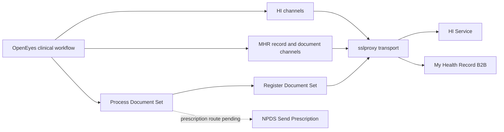

# ADHA and My Health Record integration with OpenEyes

## What ADHA and My Health Record mean for OpenEyes

ADHA is the **Australian Digital Health Agency**, the Australian Government
agency responsible for national digital health initiatives and the System
Operator of My Health Record. My Health Record is the national service through
which individuals and healthcare providers can access shared health information.
It can hold specialist letters, medicines information, summaries and diagnostic
reports. [Agency role][agency] [System Operator][governance]
[My Health Record overview][mhr]

For this project, OpenEyes supplies the local ophthalmology workflow and clinical
content. Mirth/BridgeLink channels connect it to national identity and document
services. The integration lets OpenEyes identify the patient, clinician and
organisation, retrieve shared documents, and publish selected clinical documents.
Electronic prescribing is a related, unfinished workstream. [H1, R1]

| Component | Role | Relationship to OpenEyes |
|---|---|---|
| ADHA | Agency, standards and connection/conformance guidance; My Health Record System Operator. | Defines the national systems and requirements that this integration must meet. |
| Healthcare Identifiers Service, or HI Service | National identity service operated by Services Australia in partnership with ADHA. | Searches and validates identifiers used in clinical exchanges. |
| My Health Record, or MHR | Shared national health information service. | Receives selected OpenEyes documents and provides records/documents for retrieval. |
| PCEHR | Earlier name: Personally Controlled Electronic Health Record. [Official glossary][glossary] | Still appears in MHR channel names, SOAP operations and schemas. |
| Mirth / BridgeLink | Integration engine. | Transforms OpenEyes data, routes requests, signs XML and processes responses. |
| National Prescription Delivery Service, or NPDS | Prescription delivery infrastructure. | Separate planned route for electronic prescriptions and pharmacy retrieval. |

The identifier types describe different participants. An IHI identifies the
patient; an HPI-I identifies an individual healthcare provider; an HPI-O
identifies a healthcare provider organisation. An IHI lookup alone does not
establish that an accessible My Health Record exists, hence the separate MHR
existence and access operations. The HI Service exposes SOAP web services for
identifier searches and validation. [Healthcare identifiers][hi] [R1]

## Project architecture

The backend is grouped into HI, MHR and NPDS channel families. The inspected
implementation uses SOAP/XML for national service requests and CDA documents
for MHR uploads. ADHA's B2B Gateway supports clinical software uploading and
retrieving documents. [B2B Gateway][b2b] [R1]



The handover describes OpenEyes webhooks feeding document processing. In the
inspected export, `MHR - Process Document Set.xml` actually has a File Reader
source for `*.xml`. The webhook-to-file delivery step is therefore a handover
description of the surrounding integration, not something established by this
channel alone. Several other channels accept JSON or HTTP query parameters;
there is no single input format shared by every exported channel. [H1, R1]

## HI Service channels

| Export in `MirthChannels` | Purpose and evidence |
|---|---|
| `HI - Search IHI.xml` | Looks up a patient's Individual Healthcare Identifier. |
| `HI - Replica IHI.xml` | Sends `notifyReplicaIHI` with an IHI and comment. The handover calls this recording the replica identifier returned by a search. The implementation and OE-16843 instead connect it to reporting a suspected duplicate IHI. |
| `HI - Search HPI-I.xml` | Looks up an individual provider. The latest inspected change accepts the `AHPRA` identifier type in the OpenEyes request. |
| `HI - Validate HPI-I.xml` | Provider identifier validation channel, also present in the branch though omitted from the handover's inventory. |
| `HI - Search HPI-I Batch.xml` | Submits multiple provider lookups and captures the returned batch identifier. |
| `HI - Retrieve HPI-I Batch.xml` | Retrieves results using that batch identifier. Its destination is queued and handles the service's not-yet-ready response. |

Batch submission and result retrieval are separate asynchronous steps. The
submission channel hands the batch identifier to the retrieval channel; a
successful submission is not the completed provider result set. [H1, R1, J1]

## My Health Record operations

| Export in `MirthChannels` | Purpose and boundary |
|---|---|
| `MHR - PCEHR Exists.xml` | Checks whether a record exists. The handover specifies calling this first before other MHR actions. The separate exports do not themselves enforce a universal call order. |
| `MHR - Access PCEHR Record.xml` | Requests access using an access code or emergency access. These are the two branches visible in this export. |
| `MHR - Get Document List.xml` | Retrieves document metadata for selecting a document; it does not retrieve the document contents. |
| `MHR - Download Document.xml` | Retrieves the selected document contents. |
| `MHR - Process Document Set.xml` | Builds the clinical document and selects the document-specific destination. |
| `MHR - Register Document Set.xml` | Builds XDS metadata, signs and packages the document, then submits the upload. |
| `MHR - Get Document ID.xml` | Additional document-ID lookup export found in the branch. |
| `MHR - Get View.xml` | Additional view retrieval export; branch history describes a Health Record Overview CDA render. |
| `MHR - Remove Document.xml` | Additional document removal export. Its presence does not establish that the OpenEyes UI exposes it. |

ADHA also documents normal access without a code, access with a code, and
emergency access. Emergency access requires a qualifying emergency and a user
warning; it should not become an automatic recovery action when normal access
fails. This is a requirement to reconcile with the OpenEyes UI, not a verified
UI capability. [Gain access guide][access]

The handover's existence-first convention should be kept distinct from gaining
access. ADHA explicitly states that uploading a document does not require the
Gain Access operation. [Upload guide][upload]

## Document creation and upload

The handover describes two stages: Process Document Set compiles OpenEyes data
into **CDA**, the Clinical Document Architecture XML representation; Register
Document Set adds **XDS**, the document-sharing metadata, creates the signed
package and uploads it. The source exports substantiate that division. [H1, R1]

| Document route | Filter in the inspected Process Document Set export | Reported project status |
|---|---|---|
| Event summary | `Details.Type == OphCiExamination` | Handover reports successful Clinical Package Validator validation. |
| Specialist letter | `Details.Type == OphCoCorrespondence` | Generation exists; handover says validator testing remains outstanding. |
| Diagnostic imaging report | `Details.Type == OphGeneric` and `Details.SubType == OCT` | Handover calls this a recent addition, roughly a month before that meeting. Branch history dates initial support to 20 July 2026. |
| E-prescription | `Details.Type == OphDrPrescription` | Generation/routing scaffold exists, but sending through NPDS is unfinished. |

The handover says only examination events and document events are supported
OpenEyes sources. Preserve that as the reported supported scope at handover;
the export has the more specific filters above. A filter and generation code
do not prove that the corresponding end-to-end workflow is supported.

The notes describe nonmatching events cascading to the next channel. More
precisely, these are filtered **destination connectors within Process Document
Set**. MHR document destinations target Register Document Set; the prescription
destination targets NPDS. An unmatched event has no matching route here. [R1]

### CDA package and signature

The inspected Register Document Set code builds this ZIP layout:

```text
IHE_XDM/
  SUBSET01/
    CDA_ROOT.XML
    CDA_SIGN.XML
```

The handover writes `IGXDM/Subset01/CDA_ROOT.xml` and `CDA_SIGN.xml`, while also
warning that lowercase extensions fail validation. Use the exact uppercase
paths above from the code. The 8 September 2026 branch change explicitly fixes
extension capitalisation as a conformance requirement. [H1, R1]

Process Document Set creates the CDA content. Register Document Set writes
`CDA_ROOT.XML` to disk, generates the detached manifest and electronic signature,
and adds `CDA_SIGN.XML` to the ZIP. The manifest contains the reference and digest
for the CDA root. The handover describes constructing that manifest manually;
the inspected implementation calls `generateDetachedManifest` and uses Java's
XML Signature framework to calculate its digest from the saved root file.
The ZIP is then Base64-encoded into the upload request. [R1]

### Shared code templates and identifiers

| Library | Responsibilities |
|---|---|
| `Libraries/XML Signing.xml` | Java-backed XML signing, detached manifest generation and verification of selected signed elements using keystore/truststore material. |
| `Libraries/CDA.xml` | Serialises clinical and contextual data, including author, custodian and adverse reactions. Author and legal authenticator share an author object in the document transformers. |
| `Libraries/Code Systems.xml` | Enum-style coded-concept definitions: code-system identifier, code-system name, code and display text. |
| `Libraries/XDS.xml` | UUID-to-OID conversion; association, classification, external-identifier and slot renderers; XDS identifier constants. |

The handover explains that UUIDs are converted to OIDs for XDS metadata while
the original UUID remains in the document. The inspected MHR generators instead
set the CDA document ID to `uuidToOid(UUIDGenerator.getUUID())`, and Register
Document Set reuses it for XDS unique identifiers. The helper produces a
`2.25.<decimal UUID>` OID. Other element IDs still use UUIDs, and the unfinished
prescription generator uses a UUID document ID. The old UUID/OID explanation
and an inline comment in Register Document Set do not describe all current
paths accurately. [H1, R1]

## Configuration, certificates and transport

**NASH** means National Authentication Service for Health. Its PKI certificates
support authenticated exchanges with MHR and the HI Service; an organisation's
healthcare identifier is embedded in its certificate. Test certificates have
separate permitted uses and cannot be used for production access.
[Services Australia NASH guidance][nash]

| Configuration | Handover requirement and inspected boundary |
|---|---|
| HPI-O | Identifies the organisation; the handover says multi-tenant requests carry it. Upload processing derives it from the document's author organisation, but some MHR lookup/access channels still read the global `HPIO` setting. Tenant handling needs verification across every route. |
| Keystore path, password and alias | Supplies the private key/certificate for XML signing. Code uses `keystorePath`, `keystorePassword` and `keystoreAlias`. |
| Truststore path, password and alias | The handover lists all three for verification. Inspected configuration accesses use `truststorePath` and `truststorePassword`; a universal `truststoreAlias` setting was not found. |
| Vendor ID | Integration vendor identifier. Several HI channels read `vendorId`; do not substitute a clinician or organisation identifier. |
| Product version | Handover reports this is now configurable to meet ADHA versioning requirements. Exported templates still contain literal versions, including `10.0.8` and `V10`; generalised runtime configuration was not demonstrated. |

The handover records an nginx Docker service called `sslproxy` in
`integrations-compose.yml`, using NASH certificate material described as PKCS12
keystores to support SSL connections for Mirth. Channel destinations reference
that proxy. The notes associate it with SOAP signing and "PLS". Signing is
implemented in Mirth's Java/XML code; the proxy supplies the transport layer.
"PLS" is not expanded in the notes or verified here and must be clarified
before treating it as a separate service or silently changing it to TLS. The
compose definition and certificate mounts were not inspected. [H1, R1]

At handover, keystore and truststore files had reportedly already been supplied
for nginx and Mirth. A receiving deployment still needed the corresponding
keystore secrets and configuration paths. The files were believed to be in
Keeper, but their location, access permissions and permitted sharing were
unconfirmed. These are reported prerequisites, not a claim that this workspace
contains usable credentials. [H1]

The handover reports an ADHA-related restriction to Australian developers on
this project and asks whether that restriction also covers certificates.
Retain this as an unresolved project/access condition. The official material
reviewed does not substantiate a blanket nationality rule. Confirm the actual
project agreements, certificate licence terms and authorised recipients with
the project owners before distributing material. If Keeper access is unavailable,
the handover's fallback is to arrange an approved one-time secure transfer through
the responsible access administrator. Keep certificates, passwords and client
data outside this knowledge repository. [H1]

## Electronic prescribing

The handover's "Send prescription" item belongs to the NPDS workstream. It is
waiting on the integration specification. `NPDS - Send Prescription.xml` exists,
but its service URL, WSDL, service and port are blank, and the operation selector
is still a placeholder. Its presence and the CDA prescription filter do not
establish a working prescription service. [H1, R1]

The intended patient experience is a token sent to a phone, then presented to a
pharmacy. Official guidance describes delivery by SMS or email and use of the
token to retrieve the prescription from the delivery service. This is a
different transaction from uploading clinical information to MHR.
[Electronic prescriptions][ep]

OE-17790 adds planned requirements: receive prescription-created xAPI webhooks,
include only items with the dispense condition `Send to ePrescription Service`,
send each item separately, validate the generated content and transform the
response for OpenEyes. These are ticket requirements, not completed behavior.
[J3]

## OpenEyes frontend and remaining work

The handover reports two configurable national identifier fields added to
**Update General Practitioner**, with frontend work still underway. It does
not identify both field types, so do not infer their labels from the count.
[H1]

Related development tickets describe patient IHI/status display, provider
HPI-I/status display, lookup and validation actions, provider-identifier data
models, duplicate checking and a bulk provider-identifier import command.
These broaden the intended OpenEyes integration; their presence in tickets
does not verify the screens or command in a deployed application. [J2]

| Area | Evidence and work still required |
|---|---|
| Frontend | Complete the outstanding screens and identifier interactions reported in the handover. |
| Error handling | Handover says most channels pass upstream errors through with minimal processing. Improve the information returned to OpenEyes, especially for clinically sensitive MHR workflows. |
| Signature verification | Shared verification returns a Boolean, as the handover notes. Current code logs some signature/reference failures and can raise exceptions, but does not provide a consistent structured explanation to OpenEyes. |
| Clinical Package Validator | Handover says it can check an individual XML file or a whole package. Event summary reportedly passed; specialist letter still requires validation. No validator report was supplied or reproduced here. |
| Diagnostic imaging | Initial code exists. Validation and supported workflow coverage remain unestablished by this review. |
| Package attachments | Register Document Set still contains attachment TODOs; do not infer complete attachment packaging from the imaging filter. |
| Role codes | The 8 September change uses ANZSCO occupation codes and explicitly leaves OpenEyes-role-to-ANZSCO mapping as a TODO. |
| Deployment configuration | Confirm certificate access, secret mounts, paths, multi-tenant HPI-O handling, product versions and the webhook/file delivery boundary. |
| NPDS | Obtain the specification and complete the sending channel and response/error handling. |

ADHA's Clinical Package Validator page identified version 3.6 as current when
checked. It explicitly requires additional tests before declaring full software
conformance. A successful package validation therefore supplies only part of the
acceptance evidence. [Clinical Package Validator][validator]

The local Jira snapshot supports treating this as unfinished integration work:

| Ticket | Recorded status in the snapshot inspected on 16 September 2026 |
|---|---|
| OE-16834 - overall HI/MHR integration | In Development |
| OE-16835 - HI Service; OE-16836 - MHR | In Test |
| OE-16837 to OE-16841 - HI channel tasks; OE-16847 - MHR upload | In Test |
| OE-16842 - identifier models; OE-16845 - views | In Progress |
| OE-16843 - identifier services | In Test |
| OE-16844 - bulk import command | New Task |
| OE-17789 - NPDS integration | Ready for Dev |
| OE-17790 - NPDS sending channel | New Task |

Some descriptions still use earlier PASAPI/HL7 wording;
use the inspected channel contracts when discussing the current export. [J1-J3]

### Follow-up actions retained from the handover

1. Confirm the restrictions on NASH certificate access, sharing outside the
   Australian development team and storage in Keeper.
2. Confirm Keeper access and upload the required files to the approved credential
   store. Arrange the approved one-time secure transfer if access is unavailable,
   then configure secrets and paths.
3. Use the next integration handover meeting to resolve credentials, required
   files and channel questions. The source says Thursday at the usual meeting
   time, after the returning integration developer is available; the undated
   note does not establish a calendar date or a currently scheduled meeting.
4. Run specialist-letter output through the Clinical Package Validator and
   retain the results. Preserve the distinction between the reported event-summary
   result and independently reproduced validation.
5. Finish the frontend and error-handling work, and resolve the pending NPDS
   specification and implementation.

## Evidence and lookup scope

| Ref | Source and reproducibility boundary |
|---|---|
| H1 | `~/adha-integration-handover-notes.md`, all eight sections. Meeting-relative dates and reported validation/access facts remain attributed to that undated handover. |
| R1 | `~/MirthChannels`, branch `adha/hi-service`, commit `25a7ffa0b8c8c615e372298dd712dd3e292f3af7`, dated 9 September 2026. The remote branch tip matched this SHA when checked. Inspected the HI/MHR/NPDS exports, shared libraries and relevant history without changing the checkout. |
| J1 | Supplementary development tickets OE-16834 through OE-16841 in `~/jira-corpus/oe-development/issues/`. |
| J2 | Supplementary development tickets OE-16842 through OE-16845 in the same directory. |
| J3 | Supplementary development tickets OE-16847, OE-17789 and OE-17790 in the same directory. |

Targeted searches covered `~/confluence-corpus` and
`~/jira-corpus/tkls-all`, using raw structured-text search and the existing
offline full-text index, including its extracted attachment text. Search terms
included ADHA, My Health Record, PCEHR, HI Service, Healthcare Identifiers, IHI,
HPI-I and NPDS. Broader searches for NASH, digital health and Australia produced
no relevant ADHA project material in those requested corpuses. Unrelated hits
were excluded without reading their full files. This is a search finding, not
proof that no material exists in an unindexed image or unavailable attachment.

The shared index surfaced the specific OE development tickets listed above,
outside `tkls-all`; only those relevant issue files were then read as
supplementary project evidence. No exhaustive corpus reading was performed.
Official links below were checked separately. No authenticated ADHA transaction,
OpenEyes UI session, certificate inspection or validator execution was performed.

[agency]: https://www.digitalhealth.gov.au/about-us
[governance]: https://www.digitalhealth.gov.au/about-us/policies-privacy-and-reporting/my-health-record-legislation-and-governance
[mhr]: https://www.digitalhealth.gov.au/initiatives-and-programs/my-health-record
[glossary]: https://www.digitalhealth.gov.au/support/glossary
[hi]: https://www.digitalhealth.gov.au/healthcare-providers/initiatives-and-programs/healthcare-identifiers
[b2b]: https://implementer.digitalhealth.gov.au/resources/services/my-health-record/my-health-record-b2b-gateway
[access]: https://implementer.digitalhealth.gov.au/resources/my-health-record-b2b-gateway-gain-access-to-a-my-health-record
[upload]: https://implementer.digitalhealth.gov.au/resources/my-health-record-b2b-gateway-upload-document
[nash]: https://www.servicesaustralia.gov.au/software-vendors-and-developers-for-nash-pki?context=20
[ep]: https://www.digitalhealth.gov.au/initiatives-and-programs/electronic-prescriptions
[validator]: https://implementer.digitalhealth.gov.au/resources/clinical-package-validator-v3-6
