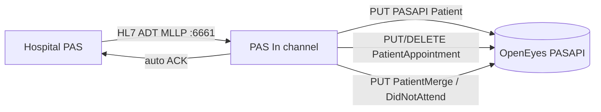
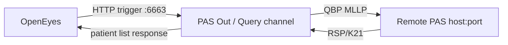
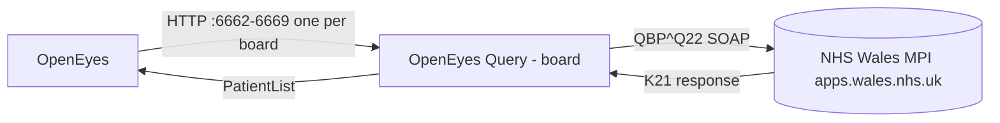
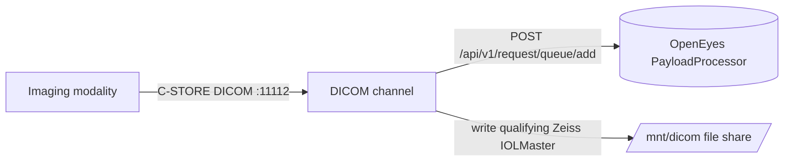
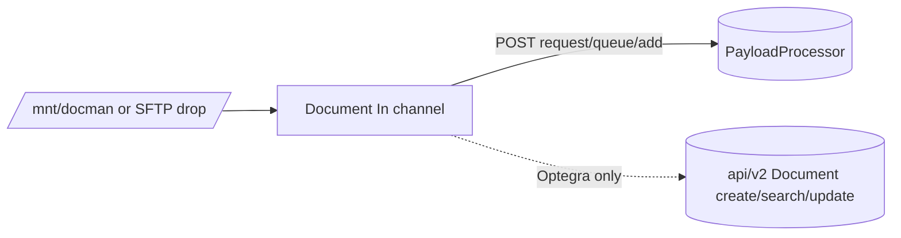
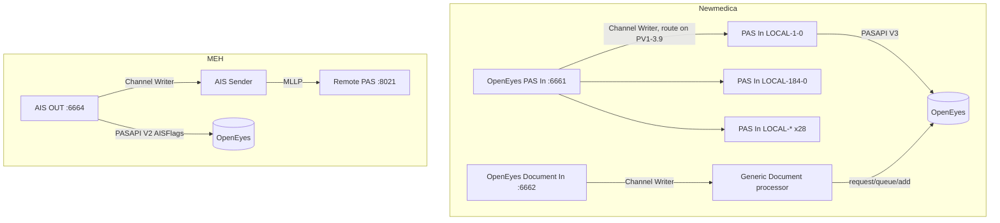

# Dataflows (Phase 7)

End-to-end message flows across the estate, built from the deep records' `routing` blocks
(`deepdive/_slices/*.json`), the Phase 3 port map and the Phase 1 dependency edges. Every
edge below is a directly-read connector or Channel Writer target. Ports shown are the
de-facto conventions (`networking/port-map.md`); treat them as per-site parameters.

## Five canonical pipeline archetypes

The 102 channels reduce to five repeating shapes. A new site is a selection of these.

### 1. PAS Inbound (hospital PAS -> OpenEyes)

Present at every instance. Second inbound feeds add a parallel listener (EK :6671
Maidstone; Optegra/Sussex/Portsmouth :6662 migration or second PAS). Newmedica differs -
see cross-channel routing.

### 2. PAS Outbound / Query (OpenEyes -> remote PAS or MPI)

PAS-Outbound family (Bedford, Bolton, EK, ENHT, MEH, Pennine, Portsmouth, Sussex). Wales
is the SOAP/MPI variant of this shape (below).

### 2b. PDQ / MPI query (Wales, SOAP)

8 near-identical board channels, one HTTP listener port each, differing only by assigning
authority + MPI endpoint. The prime templating family alongside Newmedica PAS-In.

### 3. DICOM ingestion (modality -> PayloadProcessor + IOLMaster file)

Every instance. The channel filters on AET / SOP / manufacturer to decide whether a study
also goes to the IOLMaster file path. DICOM listen port is the least-standard parameter
(11112 usual; 11113/11114 Optegra/Newmedica; 11118/11119 Kingston/Pennine/Wales).

### 4. Document / correspondence ingestion (file or SFTP -> OpenEyes)

ENHT/MEH/Optegra Docman, Portsmouth document-in set, Optegra Document Migration. Optegra
is the only site using the OpenEyes Document API directly; the rest go via PayloadProcessor.

### 5. Document / correspondence outbound (OpenEyes -> external share)

Bedford, Bolton, EK (x3), Kingston, Portsmouth (x2), Sussex. Auth here is SFTP/SMB
password, not OpenEyes Basic.

## Cross-channel routing (Channel Writer edges)

Three instances chain channels internally rather than one channel per flow:

- **Newmedica PAS In** is a router: it reads a global hospital-mapping table and fans one
  MLLP feed out to 28 per-practice Channel Writers, each posting PASAPI V3. This is the
  single most important non-trivial dataflow in the corpus.
- **Newmedica Document In** hands off to a shared `Generic Document processor` (plus an
  `OLD` variant) for the PayloadProcessor submission.
- **MEH AIS OUT** both posts AISFlags to OpenEyes and forwards via `AIS Sender` to the
  remote PAS - the only AIS flow in the estate.

## Per-instance flow summary

| Instance | Inbound | Query/Out | DICOM | Doc-in | Doc-out | Cross-channel |
|---|---|---|---|---|---|---|
| Bedford | PAS IN :6661 | PAS OUT :6663 | :11112 | - | Document OUT, PP upload | - |
| Bolton | PAS IN :6661 | PAS OUT :6663 | :11112 | - | Correspondence OUT | - |
| EK | PAS IN :6661, Maidstone :6671 | PAS OUT :6663 | :11112 | - | 3x correspondence | - |
| ENHT | PAS In :6661 | PAS Out :6663 | :11112 | Docman | - | - |
| Kingston | OpenEyes PAS :6662 | - | :11112 + :11118/:11119 | Correspondence (ORU) | - | - |
| MEH | OpenEyes PAS v2 :6661 | PAS Query :6663 | :11112 | Docman | - | AIS OUT -> AIS Sender |
| Newmedica | OpenEyes PAS In :6661 | PAS Out :6663 | :11114 | Document In :6662, Generic proc | Docman | PAS In fan-out x28; Doc In -> Generic |
| Optegra | PAS IN V2 :6661 | - | :11112 + :11113 (HFA2) | Docman, Document Migration | - | - |
| Pennine | OpenEyes PAS :6662 | PAS Query :6663 | :11118/:11119 (x2 pairs) | - | - | - |
| Portsmouth | PAS IN V2 :6661 | PAS OUT :6663 | :11112 | HL7 :6662 + 3x SFTP | 2x SFTP | - |
| Sussex | PAS IN :6661, Migration :6662 | PAS OUT :6663 | :11112 | - | Document Delivery | - |
| Wales | PAS IN :6661 | 8x PDQ :6662-6669 | :11118 | - | - | - |

## Pennine DICOM collision - resolved by the deep-read

Phase 3 flagged two channels bound to :11118 and two to :11119 and hypothesised the
`OpenEyes DICOM *` channels superseded the `DICOM_1111x` ones. **The deep-read overturns
that**: the `DICOM_11118` / `DICOM_11119` channels are the **current** ones (they carry
AET-derived identifiers, Zeiss/SOP source-platform filters and dynamic routing), while the
same-port `OpenEyes DICOM IOLMaster Channel` / `OpenEyes DICOM Channel` are **legacy**
(no transformer, static identifiers). Both pairs write `/mnt/dicom` and POST
PayloadProcessor, so only one of each pair can be enabled. The legacy pair is the one that
shares ids `eee5caa4` / `ba5419a3` with Kingston - i.e. Pennine forked its own AET-aware
DICOM channels and left the imported-standard ones dormant. Confirm against the
deployed/enabled flag before any redeploy (still the gating unknown).
