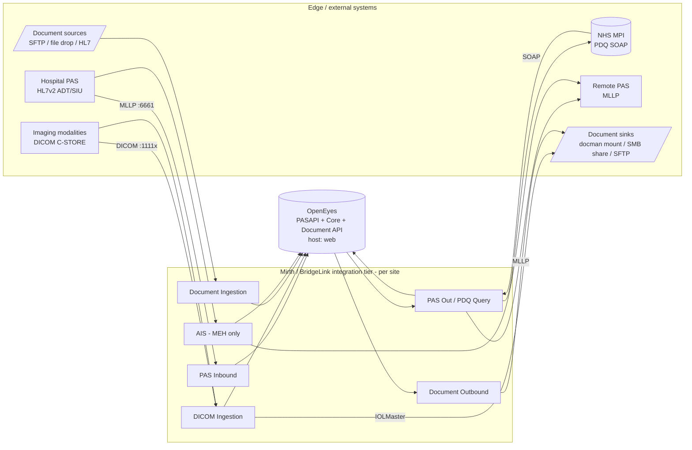
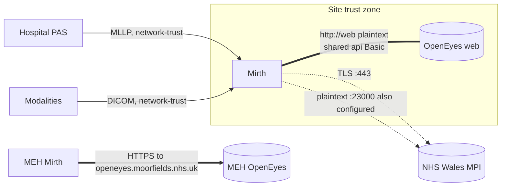

# Integration overview (Phase 16)

The estate-level, system-integration reading of the corpus: what external systems each
OpenEyes deployment integrates with, across which boundaries, under what contracts, and
where the coupling points and single points of failure are. This sits above the Phase 7
message pipelines (`dataflows/dataflows.md`) - that doc shows *how a message flows through
a channel*; this one shows *how the estate hangs together as an integration system*. All
facts trace to the wave artifacts (`ai-corpus/channels.jsonl`, `taxonomy/`, `networking/`,
`openeyes/`, `security/findings.md`).

## The estate is 13 instances of one reference integration

Every instance is the same shape: **Mirth/BridgeLink is the integration tier between a
site's source/edge systems and that site's OpenEyes.** A site is a selection from a fixed
menu of integration roles; no instance invents a new class of integration.

Read it as a **contract map**: OpenEyes is always the hub; Mirth adapts each edge protocol
(HL7v2 MLLP, DICOM, SOAP PDQ, files) to the OpenEyes HTTP APIs and back.

## External systems each instance integrates with

Derived from the per-channel categories and endpoints (`ai-corpus/channels.jsonl`; the
per-instance port detail is in `dataflows/dataflows.md`). "Y" = at least one channel of
that role; this is the *integration surface*, not a channel count.

| Instance | Hospital PAS in | Remote PAS out | NHS MPI (PDQ) | Imaging (DICOM) | Doc source in | Doc sink out | AIS |
|---|:-:|:-:|:-:|:-:|:-:|:-:|:-:|
| Bedford | Y | Y | | Y | | Y | |
| Bolton | Y | Y | | Y | | Y | |
| EK | Y | Y | | Y | | Y | |
| ENHT | Y | Y | | Y | | Y | |
| Kingston | Y | | | Y | | Y | |
| MEH | Y | Y | | Y | | Y | Y |
| Newmedica | Y | Y | | Y | Y | Y | |
| Optegra | Y | | | Y | Y | Y | |
| Pennine | Y | Y | | Y | | | |
| Portsmouth | Y | Y | | Y | Y | Y | |
| Sussex | Y | Y | | Y | | Y | |
| Wales | Y | | Y | Y | | | |

Reading of the estate:
- **Universal core:** every site integrates a Hospital PAS inbound feed, DICOM imaging, and
  OpenEyes. That triple is the minimum viable OpenEyes integration.
- **Wales is the outlier on identity:** it is the only site querying an external **MPI**
  (PDQ SOAP), and it does so 8 ways - one channel per health board.
- **MEH is the outlier on AIS:** the only site with an AIS integration.
- **Document integration is optional and mostly outbound:** the common case is document
  *delivery* out of OpenEyes - a channel picks OE-generated correspondence off a local
  mount and writes it to a remote share (the "Docman" lineage is `File Reader /mnt/docman
  -> File Writer <remote host>`, an outbound sink, not an ingest). Ten sites have a
  document-outbound role; only **Newmedica, Optegra and Portsmouth** additionally *ingest*
  documents into OE, and Optegra is the only one calling the OpenEyes Document API directly
  (`v2/Document`) rather than via PayloadProcessor. Pennine and Wales have no document role.
  - *Classification caveat:* the Phase 2 human-readable matrix (`taxonomy/channel-types.md`)
    lists the ENHT/MEH/Optegra "Docman" channels under document *ingestion*; the connectors
    (source = `File Reader /mnt/docman`, destination = `File Writer` to a remote host) and
    the authoritative `taxonomy/channel-types.json` both classify them as document
    *outbound*. This doc and `ai-corpus/` follow the JSON; the markdown matrix's Doc-In
    assignment for those channels is a summarisation error to reconcile in a cleanup pass
    (`unresolved/questions.md`).

## Data domains and their integration contracts

The channels move six data domains between the edge and OpenEyes. Sync/async and
replay-safety are the properties that matter for reliability and testing.

| Domain | Direction | Edge protocol | OE contract | Sync? | Replay-safe? |
|---|---|---|---|:-:|:-:|
| Patient demographics | PAS -> OE | HL7v2 ADT (MLLP) | PASAPI Patient (upsert by hospital number) | async | yes (upsert) |
| Appointments | PAS -> OE | HL7v2 ADT/SIU (MLLP) | PASAPI PatientAppointment (by visit id) | async | yes (upsert) |
| Patient identity / merge | PAS -> OE | HL7v2 ADT^A40 | PASAPI PatientMerge | async | **no** (stateful) |
| Identity resolution (MPI) | OE -> MPI -> OE | SOAP PDQ (QBP^Q22) | HTTP-in, PatientList back to OE | sync | yes (read) |
| Imaging / biometry | modality -> OE | DICOM C-STORE | PayloadProcessor `request/queue/add` (+ IOLMaster file) | async | **no** (duplicate job) |
| Documents / correspondence | files <-> OE | file / SFTP / SMB | PayloadProcessor or `v1`/`v2/Document` | async | **no** (duplicate doc) |

The "no" rows are the operational care-points: a naive replay of a merge, a PayloadProcessor
submission or a document create can mis-merge or duplicate. This drives both the reliability
recommendations (REL-1/2) and the test isolation rules (`testing/strategy.md`).

## Integration boundaries and trust

Where each flow crosses a boundary is the security-relevant integration fact (full findings:
`security/findings.md`).

- **Mirth <-> OpenEyes** is the busiest boundary and is normally **internal** (`http://web`,
  co-located container) carrying the shared `api` Basic credential in clear (SEC-1/SEC-2).
  Its safety rests entirely on the site trust zone being isolated - an **unresolved**
  deployment fact. MEH is the proof the estate can cross this boundary over TLS when Mirth
  and OE are not co-located.
- **Mirth <-> external NHS systems** (Wales MPI): TLS is configured (`:443`) but a plaintext
  `:23000` alternative is also present (SEC-4) - confirm which is active.
- **Edge -> Mirth** (PAS MLLP, DICOM, HTTP listeners): authentication is network-level, not
  message-level - the 18 HTTP listeners are `authType=NONE` on `0.0.0.0` (SEC-3/SEC-6). The
  integration assumes a trusted site network.

## Coupling points and single points of failure

The integration's shared dependencies - the things whose failure is not contained to one
channel:

| Coupling point | Scope of blast | Evidence |
|---|---|---|
| The OpenEyes `web` endpoint | all OE-bound channels in a site fail together on OE outage | 294 `http://web` endpoints; one host per site |
| The shared `api` credential | one rotation/compromise is estate-wide | 356 identical occurrences (SEC-2) |
| Newmedica globalMap routing tables | the 28-way PAS-In fan-out breaks if the map is empty after restart | `hospitalMapping`/`channelLookup` (REL-3, unresolved) |
| NHS Wales MPI availability | all 8 Wales query channels depend on one external MPI | `mpilivequeries.cymru.nhs.uk` |
| `/mnt/*` file mounts | document/DICOM file flows depend on the mount being present | `/mnt/dicom`, `/mnt/docman`, `/mnt/document-upload` |
| No queue/retry on async feeds | a transient dependency blip errors messages rather than deferring them | REL-1/REL-2 |

## Life of the dominant message (ADT -> OpenEyes patient)

The single most common integration path, end to end, showing where reliability and identity
concerns bite:

1. Hospital PAS opens an MLLP connection to the site's PAS-In listener (`:6661`) and sends an
   HL7v2 ADT message.
2. The source transformer parses PID/PV1 (and MRG for a merge) and the channel decides the
   PASAPI call(s): Patient upsert, PatientAppointment, PatientMerge, DidNotAttend.
   - **Newmedica differs:** the inbound channel is a *router* - it reads a globalMap
     hospital-mapping table and Channel-Writes to one of 28 per-practice sub-channels
     (`dataflows/dataflows.md`), each of which makes the PASAPI call.
3. The destination HTTP Sender calls `http://web/PASAPI/V{1,2,3}/...` with preemptive Basic
   auth (the shared `api` credential). The PASAPI version implies the OE release floor
   (V1<=OE8, V2=OE9-10, V3=OE11+; `unresolved/questions.md`).
4. OpenEyes applies the change. On success the source auto-ACKs the PAS. On a downstream
   error, most channels do **not** queue or retry (REL-1/REL-2) - the message errors and
   needs reprocessing or an upstream resend.

The identity domain is the sharp edge: a merge (step 2) is stateful and not replay-safe, and
where a site cannot resolve identity locally it round-trips to the MPI first (Wales' PDQ
path) before the demographics land in OpenEyes.

## How to use this with the rest of the corpus

- Per-channel specifics behind any box here: `ai-corpus/channels.jsonl` (+ `summary.json`
  for the aggregates that back the matrices).
- The message-level pipeline for each archetype: `dataflows/dataflows.md`.
- The boundary/coupling risks stated as findings with severities: `security/findings.md`.
- The OE API contracts each flow targets: `openeyes/api-usage.md`; identity/version bands:
  `unresolved/questions.md`.
