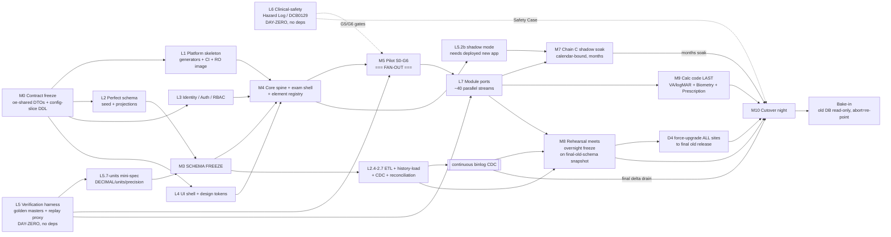

# OpenEyes → Laravel: AI-Authored, Human-Verified Rewrite — Master Plan

> **Status:** design & planning document — a blueprint, **not** an instruction to implement. Prepared 2026-07-01, enriched 2026-08-19, consistency-audited 2026-08-20 (v4).
>
> **Changelog:**
> - v1, 2026-07-01 - initial plan, §1-§19.
> - v2, 2026-08-19 - every quoted number re-verified against the v26.0.9 checkout and a live v26.1 sample DB (Appendix D); internal contradictions fixed (laterality -> `eye_id`, no MySQL ENUM (§5.8.0 #15), current/latest mechanism order, projection placement, module/file/LOC counts, stale paths and dangling cross-refs, conversational remnants); §4.8, §4.9, §5.9, §5.10, §7.9, §9.1, §10.1 and §19 (iv) added inside existing sections; §20-§27 and Appendices A-D added; §11 extended to all 19 brief requirements plus the documentation imperative; §17 gains §7.5 migration discipline and the identifier-case rule.
> - v2 scope rule - §1-§19 keep their numbering so every existing cross-reference still resolves; new material is appended at the end of the section it extends or in §20+.
> - v3, 2026-08-20 - all 35 §26 decisions confirmed in plain English and folded into the body with their rationale (Q2 frontend, Q8 identifiers, Q9 history and Q20 config format were revised during confirmation); §26 becomes the closed decision record and the interim decisions file is retired; the walking-skeleton priority (one real page up and viewable end-to-end first) added to §12 and §18.
> - v4, 2026-08-20 - full consistency pass: 42 review findings fixed (sample/perf datasets onto the Q24/Q26 CSV pipeline, cookbook schema names via the §5.1 category mechanism, CSO-only divergence gate in the §25 RACI, Q26 profile names, patient-linkage arithmetic, stale cross-refs and counts).
>
> **Companion:** `openeyes-laravel-rewrite-plan.md` v0.6 (execution plan) - see §20. **Requirements source:** the 19-item brief - see §11. **Divergence register:** §27. **Decision record:** §26 - all 35 decisions closed 2026-08-20; the interim `openeyes-laravel-rewrite-decisions.md` companion was folded into this document and deleted.
>
> **Document map:** §1–§4 context, locked decisions & architecture · §5 schema — incl. **§5.8 rules for a perfect schema** and **§5.8.0 canonical decisions that govern on any conflict** · §6 data migration · §7 TDD + human-in-the-loop verification · §8–§10 forward-version lifecycle, dev-experience & clinical safety · §11–§16 requirements matrix, roadmap, risks, assets, anchors, plan-verification · **§17 developer-notes cookbook · §18 critical-path & parallelisation · §19 additional considerations & sharp edges**.
>
> **Added 2026-08-19:** §4.8 cross-cutting subsystems; §4.9 admin surface and config import/export; §5.9 schema inventory by family; §5.10 performance pathologies; §7.9 existing verification assets; §9.1 developer-environment facts and the legacy CI baseline; §10.1 hazard seed list; §19 (iv) legacy behaviours that bite during parity; §20 relationship to the v0.6 execution plan; §21 security architecture; §22 observability, SLOs and health; §23 backup, DR and capacity; §24 cutover-night runbook and rollback; §25 roles, governance and cadence; §26 decision record (Q1-Q35, closed 2026-08-20); §27 divergence register - how OpenEyes worked, how it works now, and why; Appendix A module inventory; Appendix B integration surface catalogue; Appendix C glossary; Appendix D numbers and counting rules.

---

## 1. Context — why this, why now

OpenEyes (`/home/toukan/openeyes`, host checkout = `master` at v26.0.9, `develop` at
pre-v26.1; numbers in this document are as of 2026-08-19 unless stated, Appendix D) is
a ~1.15M PHP LOC ophthalmology EHR (~765k excluding migrations and tests, plus ~300k
JS) built on **Yii 1.1, which is end-of-life**. The community has already accepted the
strategic direction (**ADR-0012, 2025-07-09**): replatform to Laravel, capturing
framework-agnostic logic in `oe-shared/`, with Laravel (`oe-laravel/`) piggybacking
on the same database. The xAPI work funded the first building blocks; the app today
is a **working Yii 1.1 + Laravel 12 hybrid** (12.61 in today's `composer.json`) routed by
`index.php` (`/xapi`, `/l/` → Laravel; everything else → Yii). The rewrite targets the
latest stable Laravel major at kickoff (13.x; Laravel publishes no LTS line, so the
brief's "latest LTS" means the latest stable major - §20 Framework major row).

**Today's stack, as the brief describes it and as the checkout confirms:** the web image
is Ubuntu 24.04 LTS + Apache 2.4 (mpm-event) + PHP-FPM 8.4; the database is MariaDB
11.8 (the current LTS); everything runs dockerised (image builder + compose on VMs,
Helm on Kubernetes); a `master` container runs the cron schedule from the same image.
The brief's policy - track the latest stable PHP and the latest MariaDB LTS - carries
into the rewrite unchanged (§8). OpenEyes is AGPL-3.0 software stewarded by the
Apperta Foundation; the public community-edition mirror lags the private development
tip by up to about a quarter, which §8 and §13 take into account.

This plan goes beyond ADR-0012's incremental strangler: it defines a **complete,
greenfield rewrite onto a brand-new "perfect" schema**, migrated in a **single
big-bang overnight cutover**, with the new app **shadow-tested against the old app
for months** first. The defining property is that **AI writes the code and humans
(clinicians + a named Clinical Safety Officer) stay in the loop to verify behaviour
parity** — because a mis-migrated clinical value or a hallucinated formula can harm a
patient. The plan exists to fix ~17 long-standing "bugbears": an EOL framework, an
unbounded-growth schema, config tangled into patient data, slow pages on large
datasets, weak test/documentation coverage, and a heavy deploy footprint.

**Intended outcome:** a Laravel rewrite that is a *drop-in replacement* (same admin
categories, near-identical UX, initially pixel-identical), on a normalized,
segmentable, prunable schema, provably behaviour-equivalent to the old app, cut over
with **< 1 day (targeting overnight) downtime**, and engineered for a fast-moving FOSS
community and for AI-assisted development.

**Plan lifecycle (§26 Q31).** This plan is a first attempt, written against v26.0.9 /
develop; at kickoff the rewrite re-baselines on `develop` (or the latest v26 release)
and the plan is re-run against that shape before build starts. The end state is one
final version of the new application with **every client cut over to it** - the legacy
line ends; there is no permanent dual estate.

---

## 2. Locked decisions (from clarification)

| # | Decision | Rationale |
|---|---|---|
| D1 | **Framework: latest stable Laravel** (modular monolith). Not Yii3, not a Rust/Go core. | Richest ecosystem + largest AI-training corpus (best AI-authoring accuracy) + biggest contributor pool + builds on the accepted ADR-0012 investment. Yii3 has near-zero AI corpus; a Rust core fights velocity for CRUD/forms that aren't CPU-bound. |
| D2 | **Runtime: FrankenPHP worker mode** in one web container (Apache+PHP not split). | Single static binary (Caddy+PHP) replaces Apache+FPM: higher concurrency, resident app, HTTP/2+3, fewer/smaller image layers. |
| D3 | **Cutover: big-bang greenfield + one fast ETL**, minimal overnight freeze. New app built & shadow-tested for months first. | Matches the user's own framing (new schema + high-speed convert + drop-in). No pinned *old* version needs to read the new schema. |
| D4 | **One migration source version.** All sites force-upgrade to the *final* old release (e.g. v26.1.6) **before** migrating to v27.0.0. | ETL only ever converts **one known schema** — build/optimise/verify against exactly that shape. Massive simplification and safety win. |
| D5 | **Multi-version = the new app's *forward* lifecycle only** (~3 releases from edge get bugfix support; best-effort, not a deal-breaker). Old+new never share a DB. | Removes the most expensive requirement (permanent additive-only tax) and reduces it to bounded expand/contract. |
| D6 | **Verification: clinicians + a named CSO; full DCB0129/DCB0160** clinical-safety governance in scope. | OpenEyes is clinical software; NHS deployment mandates a Clinical Safety Case + Hazard Log signed by a CSO. AI cannot self-certify. |
| D7 | **Tenancy: single institution per patient now, with a nullable link-table seam** to go many-to-many later. | Keeps migration 1:1 and behaviour unchanged; future-proofs cross-trust shared-care without a schema break. |
| D8 | **Data scale: large (>50M events, >500 GB).** Archival/sharding essential from day one; freeze needs online pre-sync + CDC delta. | Sizing the ETL and growth-control design. |
| D9 | **Sidecars minimal:** only headless Chrome is externalised (official image). Everything clinical/admin/API stays in the Laravel core. Image built for **fast, cache-friendly layer pulls**. | User's explicit steer: don't split Apache+PHP; keep support surface small. |
| D10 | **Stateless web container: read-only root FS, no runtime writes.** Durable files → object storage (existing FileStorage S3 backend); scratch → tmpfs; sessions/cache/queue → Redis; assets baked immutable into the image; logs → stdout. | User's explicit steer: divergent per-container assets cause incidents; many bind-mount dirs are an ops burden; writes to non-volumised FS are slow under overlay2. Statelessness also unlocks clean horizontal autoscale (§4.7). |
| D11 | **Deployment target: Kubernetes AND docker-compose, both first-class** (RESOLVED - §26 Q1, 2026-08-20). One image, container-configurable to run as a single server or as one of many web backends; Helm for scale-out, compose for single-site/dev. Container requirements in §4.7. | Stateless pods + HPA fit D10/D8/high-concurrency; small sites keep the familiar compose path; both targets are specified in the v0.6 execution plan (§20) and both exist locally today. |

---

## 3. Two hard constraints that shape everything

1. **Behaviour conservation.** Until a clinician explicitly approves a deviation, the
   new system must reproduce the old system's *observable* behaviour — including its
   quirks. The old app is the specification; we capture it as **executable oracles**
   before writing new code.
2. **AI cannot certify its own clinical safety.** AI writes both code and (much of the)
   tests, so tests alone are untrustworthy. Every gate that matters is backed by an
   *independent* signal the code-author did not produce: **mutation testing**,
   **differential replay against the real old app**, and **human/clinician
   adjudication**.

Everything below serves these two constraints.

---

## 4. Target application architecture

### 4.1 Framework, runtime, modularity
- **Latest stable Laravel**, **FrankenPHP worker mode** (D1/D2). Legacy Yii stays on
  Apache+FPM only during the shadow/build period; the shipped product is a single
  FrankenPHP image. **Worker-mode discipline is a clinical-safety requirement:** no
  request/patient state in singletons or statics (cross-request leakage between
  patients is a safety bug). Enforce via Larastan rules + Octane-safe patterns +
  per-request context reset (auth, current-institution, Carbon "now", RNG seeds) +
  worker max-request recycling.
- **Modular monolith, package-per-module.** Each `Oph*`/core module is a Laravel
  package (ServiceProvider, routes, migrations, models, DTOs, Vue components, print
  views, tests, machine-readable manifest). **Deptrac** enforces layer boundaries
  (Domain ← Application ← Infrastructure ← HTTP) and module isolation (module A reaches
  module B only via published contracts in `oe-shared`). This is what makes "one
  release doesn't break another" and "AI can't accidentally couple modules" real.

### 4.2 Clinical event/element model (the domain spine)
- Core defines `EventType` and `ElementType` **contracts** + a **registry** populated
  at boot by each module's ServiceProvider. Core never references a concrete element.
- **Each element type is a cohesive vertical slice** (model + migration + DTO +
  validation + Vue SFC + print partial + tests) in one folder — the unit AI authors
  and humans verify.
- **`make:element` / `make:module` artisan generators** scaffold the whole slice to the
  strict standard (huge for AI velocity + consistency).
- **Tame OphCiExamination (2,431 files, 2,229 PHP - Appendix D)** by splitting it into sub-packages by element
  group (VA/refraction, IOP/drops, anterior/posterior segment, diagnoses/risks,
  injections, letters); the exam *shell* just composes registered elements.

### 4.3 Frontend - familiar old skin while porting, close visual parity after functional coverage (REVISED - §26 Q2, §26.5)
- **Vue 3 + Inertia.js from day one** (§26 Q2, revised 2026-08-20; supersedes the v0.6
  "Blade byte-identical first" recommendation in §20 decision 1). The rewrite never
  builds a Blade page layer: every page is a Vue page rendered through Inertia with
  server-side routing/auth, reusing the existing Vue 3.5 + Vite 7 investment. Rationale:
  building a Blade layer only to replace it post-cutover is throwaway work; parity is
  provable on rendered output instead.
- **Function first during the module fan-out:** the first few pages establish a very
  familiar old skin by reusing the legacy CSS and markup structure. After that,
  functional coverage, persistence, validation, APIs, deterministic tests, and
  accounting gates take priority over per-page pixel tuning. Close visual parity with
  v26 remains the end-state acceptance goal and is measured by the quarantined visual
  suite after broad functional coverage. The parity oracle in §7.2 (a) compares
  rendered pages (visual/DOM snapshots), not byte-identical server HTML.
- **New theme switchable shortly after go-live:** express *all* colour/spacing/
  typography as **CSS custom properties (design tokens)**, initialised to the current
  OpenEyes values so a quarantined visual-regression suite passes pixel-for-pixel.
  Reskin = **swap the token set / component skins** in one deliberate, human-approved
  commit; behavioural tests stay green because they assert
  roles/labels/`data-test`/ARIA, never pixels. The global **light/dark toggle is kept**.
- **A strict written UI rulebook** governs every component (spacing, states, keyboard,
  ARIA), and **every component documents where it is used** (generated usage index) so
  a change's blast radius is visible (req 15a/19d). The end state must be **extremely
  fast**: the §4.6 budgets apply to first render and to client-side navigation. Admin
  "same categories, simpler layout" = keep RBAC/route/behaviour identical while the
  visual baseline changes under explicit sign-off.

### 4.4 Sidecars — minimal (D9)
- **Externalise only:** headless-Chrome render (official image; keeps Chrome's huge
  layers off the app image and out of every app update). Keep DICOM (Orthanc/PACS),
  antivirus (ClamAV), and the HL7/FHIR gateway (Mirth/BridgeLink) as the *already-
  external* services they are. Optional: a search sidecar (Meilisearch) only if
  profiling shows `LIKE` scans hurt the OLTP DB.
- **Everything clinical/admin/RBAC/SSO/xAPI/webhooks stays in the Laravel core.** Never
  split the event/element model across network hops. Target **≤ ~5 supporting
  services total**, each behind a stable contract, each independently replaceable (that
  is the only place a future Rust/Go rewrite is cheap and safe).

### 4.5 Container & image-layer strategy (fast, cache-friendly pulls — D9)
- Multi-stage BuildKit build, layers ordered by change frequency:
  `slim base OS` → `PHP+extensions` (rarely changes, cached) → `composer vendor`
  (changes on dep bump) → `built frontend assets` (separate stage) → `app code` (top,
  changes each release). App-only releases re-pull only the small top layer.
- Shared base image across web/manager/master (one download, reused). Registry with
  zstd compression; pin digests. Chrome stays a separate image so app updates never
  re-ship it.

### 4.6 Scalability / concurrency / "every page fast on large data" (req 9, 14)
- Read replicas (Eloquent read/write split); **hard-cached `oe_config`/`oe_sys`**
  (decoupled + mostly-immutable) in Redis with tag invalidation; **Horizon** queues
  (letters, webhooks, exports, PAS sync, AV) off the request path.
- **CQRS-lite read projections** for expensive composite screens (patient banner,
  examination timeline, worklists) — the main lever for fast pages on huge datasets.
- **Keyset/cursor pagination** (never `OFFSET`) + **virtualized Vue rendering** for big
  tables/timelines.
- **Enforce performance as a contract:** per-page **query-count + latency budgets**
  asserted in CI (Pest query-count assertions); N+1 fails the build.

### 4.7 Stateless web container — read-only root FS, no runtime writes (D10; req 11, 14)
The shipped web container holds **no durable state and writes nothing to its own
filesystem at runtime.** This is the *enforceable* definition, not an aspiration —
and it directly kills the three pains you named (divergent per-container assets, a pile
of dirs to volumise, slow non-volumised writes under overlay2):
- **Read-only root filesystem** (`read_only: true` / K8s `readOnlyRootFilesystem: true`
  + `securityContext` no-write). Any runtime write to the image FS *fails* → replicas
  physically cannot diverge (kills "one container has misbehaving assets"). **Asserted
  in CI:** boot the image read-only and run smoke tests; a write attempt is a build
  failure.
- **Durable files → object storage, not bind mounts.** Reuse the existing **FileStorage
  module's S3 backend** (already pluggable local-FS/S3 — `c-oe-components`) as the *only*
  supported production backend. Today's four bind-mount trees — `event_images/`,
  `protected/files/`, `DicomFiles`, `event_export_location` (NOD/analytics) — become
  S3-compatible buckets/prefixes (self-hosted **MinIO** FOSS, or AWS S3); DICOM stays in
  the PACS/Orthanc sidecar. Result: **zero app-data volumes to manage** and no
  ReadWriteMany-PVC problem (which is exactly what otherwise blocks horizontal scale).
- **Scratch → tmpfs (RAM), never overlay2.** The unavoidable ephemeral writes (PHP
  upload tmp, TCPDF/FPDI/PDF temp, image-processing scratch) mount a small **tmpfs** at
  exactly those paths. RAM-backed → no overlay2 copy-up penalty (kills "writing to a
  non-volumised FS slows the system due to overlay2"). Overlay2's cost is the copy-up of
  the whole file on first write from a lower layer; the fix is to *never write to the
  overlay*, not to volumise more paths.
- **Framework caches: route/view/event baked at build; config compiled at start into
  tmpfs (§26 Q15).** `artisan route:cache/view:cache/event:cache` + `optimize` run in
  the image build; `config:cache` runs once at container start - after the `*_FILE`
  secret loader, writing into a tmpfs `bootstrap/cache` - because config is per-site
  while the image is not (D10 holds: nothing writes to the image FS). **Vite/Tailwind
  assets are content-hashed and baked into the image layer** — the current
  runtime-generated, non-git-tracked `cachebuster.txt` is replaced by the immutable
  build id, so **every replica serves byte-identical assets** (the root of the
  "misbehaving assets" incidents).
- **Session / cache / queue → Redis** (already present) — not filesystem sessions, and
  not per-container APCu as a source of truth (per-container APCu divergence is part of
  today's symptom). Keep OPcache immutable-baked read-only; put shared/config cache in
  Redis with tag invalidation.
- **Logs → stdout/stderr** (twelve-factor), collected by the platform; no in-container
  log files.
- **Chromium already externalised (D9)** → its temp/profile writes leave the web
  container entirely (also retires the `.puppeteerrc.cjs` `temporaryDirectory` mkdtemp
  fragility).
- **Caddy/FrankenPHP writable needs:** TLS terminates at Traefik/ingress, so Caddy needs
  no ACME state; point any Caddy/XDG data dir at tmpfs. **`oe-manager` and the
  `master`/cron container follow the same rules** — their exports (NOD/analytics) write
  to object storage, not a mounted dir.

**Container requirements (RESOLVED - §26 Q1).** The shipped web image must satisfy all
of these, each asserted in CI:
1. **Slim** - no build toolchain, no dev dependencies, no unused extensions.
2. **Permission fixing happens in the manager container only** - the web entrypoint
   never `chown`s or `chmod`s anything.
3. **One log stream in one location** - stdout/stderr only; no second log file anywhere.
4. **Stateless** - this whole subsection.
5. **Strict none-or-one DB query on startup** - container boot performs zero DB queries,
   or at most the single `oe:schema:verify` fingerprint check; asserted by a
   query-counting boot test.
6. **Non-root** - the app user owns nothing it can write except tmpfs.
7. **No known-vulnerable components** - the §21 supply-chain gate (zero fixable
   HIGH/CRITICAL) blocks release.

**Development image variant (§26 Q15):** a separate dev image layered on the production
one adds git (and dev tooling) so developers can switch config and branches in-container
exactly as today; it is never deployed to a client environment.

**Payoff:** any replica is disposable and interchangeable → clean horizontal
autoscaling (req 14), trivial blue-green, a genuinely lightweight image (req 11), and no
"which container has the good copy of the file" incidents.

### 4.8 Cross-cutting subsystems the modules stand on (legacy mechanism -> rewrite implication)

Every L7 module stream (§18) calls into the same dozen core mechanisms, and that is where parity
breaks silently: none of them has a mechanism document in the legacy tree (§13), so §7.2 and §27
must reconstruct them from code. Parity here means reproducing the *mechanism* (precedence order,
side effect, sentinel, timing window), never the code. Each block reads: legacy tables and classes
(v26.0.9, counts as of 2026-08-19) -> the gotchas that bite -> where it lands (`oe_*` schema per
§5.1, rule per §5.8.0) -> the §7.2 channel that proves it. §4.2, §5.4 and §5.6 are pointed at, not
restated.

**Worklists and pathways.** Tables `worklist`, `worklist_definition` (+ `_mapping`,
`_mapping_value`, `_display_context`), `worklist_patient` (+ `_attribute`), `worklist_filter`,
`pathway`, `pathway_step`, `pathway_step_type`, `pathway_type`. Classes: `WorklistManager` (1,754
lines: definitions, RRule instance generation, patient mapping, display order),
`WorklistFilterQuery` (854 lines of raw `CDbCommand` SQL), `Pathway` (826), `WorklistController`
(2,418), `PathstepObserver` on the legacy string events
`event_created`/`event_updated`/`psd_created`, `GenerateWorklistsCommand` (cron). Gotchas: check-in
is the magic string `short_name === 'checkin'` (`Pathway.php`); automatic worklists strip seconds (a
23:59:59 definition yields a 23:59:00 list); unbooked lists = mapping key `UNBOOKED` +
`mapping_value = "true"` + setting `include_subspecialty_name_in_unbooked_worklists`;
`WorklistManager::updatePathwayStatus` auto-starts a pathway on PAS `Status = Attended` and *undoes*
a completed check-in when it flips back to `scheduled`. Lands: definitions and pathway/step types in
`oe_config`; `worklist_patient` in `oe_ephemeral` (§5.1; its truncation rule must respect open
pathways, which reference it via `pathway.worklist_patient_id`, a numeric id - no cross-schema FK); `pathway`/`pathway_step` carry check-in
times a clinician reads, so the §5.8.0 #2 test puts them in `oe_clinical`; the list view is
latest-per-group over a set -> maintained projection (§5.8.0 #1 escalation (b), L2.3), keyset only
(Rule 15). Proven by §7.2 (a) list snapshots + (b) step-transition deltas.

**Settings hierarchy.** 11 tables: `setting_metadata`, `setting_field_type`, `setting_group` + eight
value tables (`setting_installation`, `_institution`, `_institution_subspecialty`, `_site`,
`_specialty`, `_subspecialty`, `_firm`, `_user`; `m130913_000000_consolidation`); keys are defined
only by migrations (214 migration files touch `setting_metadata`; no seed file, no admin UI creates
a key); six field types. `SettingMetadata::getSetting()` walks `$CONTEXT_CLASSES` in literal order
User -> Firm -> InstitutionSubspecialty -> Subspecialty -> Specialty -> Site -> Institution ->
Installation -> `default_value` (Site loses to Firm and Subspecialty); a file `params[$key]` wins
over the whole hierarchy and returns *before* the cache; `settingCache` = `CApcCache` or
`CFileCache`, invalidated by a sha1 of `information_schema.tables.UPDATE_TIME` over the nine setting
tables with a 5 s debounce. Gotchas: context is read from the session inside the model (not a pure
function); `element_type_id = 0` sentinel ("problematic" per its own docblock); `'off'` is a string
sentinel. Lands: `oe_config` (§5.1), metadata/defaults as git CSV seeds (§5.7), sentinel designed out
(§5.3), one resolver with the same nine-step precedence, hard-cached in Redis per §4.6,
export/import per §4.9. Proven by §7.2 (a) snapshots under each scope + a frozen resolver vector
table.

**Current context (institution / site / firm).** Tables `institution`, `site`, `firm`,
`subspecialty`, `specialty`, `service_subspecialty_assignment`, `institution_authentication`,
`user_authentication`, `user_firm`, `user_site`, `firm_user_assignment`, `user_session`. Session
keys `selected_institution_id/site_id/firm_id` are set by `UserIdentity` at login (fallbacks:
`institution_id`/`site_id` cookies, then `user.last_firm_id/last_site_id`), switched by
`SiteAndFirmWidget`, hydrated by `OESession` (`CDbHttpSession` on `user_session`);
`DataContext::addEventConstraints` narrows `BaseAPI` event queries to the current firm/subspecialty;
Laravel seeds the same trio in `InitialiseApplicationContextFromRequest`. Gotchas: institution
scoping is opt-in (`Institution::getTenanted()`), not a global scope - `Institution::defaultScope()`
only sets `ORDER BY`; `Institution::getCurrent()` throws without a session, so CLI/queue code must
seed context; a firm with `institution_id IS NULL` is a legacy "global firm";
`SessionSiteChangedSystemEvent` wipes cached worklist filters. Lands: the L3.1 `oe_config` slice + a
request-scoped `CurrentContext` DTO (§17 §4, sharp edge #18), institution/firm identity snapshotted
onto clinical rows (§5.1), tenancy per §20 decision 16. Proven by §7.2 (a)/(b) under each
institution x site x firm permutation of the sample DB.

**Patient identity and merge.** Tables `patient`, `patient_identifier`, `patient_identifier_type`
(`usage_type` LOCAL/GLOBAL), `patient_identifier_status`, `patient_merge_request`, `contact`,
`address`, `gp`, `practice`, `commissioning_body*`. Classes: `PatientIdentifierHelper` (33 static
methods), `PatientMerge::merge()` (walks episodes, legacy episodes, change-tracker episodes,
diagnoses, genetics, hotlist, worklists, trials and PatientTicketing tickets in sequence, one
`update*` method each), `PASAPI/resources/PatientMerge` (duplicate detection at ingest, setting
`pasapi_automerge`). Gotchas: `patient.hos_num/nhs_num` survive only as columns whose labels are
rewritten at runtime (`Patient.php:339-342`); merge provenance lives in soft-deleted identifier rows
(`markIdentifierDeleted(..., $deleted_by_patient_id)`), not only in `audit`;
`Patient::beforeValidate` auto-sets `is_deceased` when `date_of_death` is dirty; identifier search =
per-type `validate_regex` + zero-padding fallback. Lands: spine + identifiers in `oe_clinical`,
`patient_identifier_type` in `oe_config`; lineage per §5.4, no `hos_num` column per §17 §3.3, `_bin`
identifiers per §5.6 and §5.8.0 #12. Proven by §7.2 (b) row-level merge deltas + (a) banner
snapshots.

**Event lifecycle (incl. the two event buses).** Tables `event`, `event_type`, `element_type`,
`event_draft`, every `et_*` table and its `_version` twin. Classes: `Event` (1,362 lines),
`BaseEventTypeController` (3,778:
create/view/update/print/delete/request-deletion/draft/image/history actions), copy-forward via
`BaseAPI::getLatestElement/getElementFromLatestEvent`. Gotchas: no lock table - `Event::isLocked()`
returns `delete_pending`, `lock()/unlock()` = MySQL `GET_LOCK('openeyes.event:<id>')` in a busy-wait
loop, `isLockedByAge()` is off by one day; `defaultScope()` hard-filters `deleted = 0`; `hasPDF()`
has an unconditional `return false` (OEM-281); amendments chain on `parent_id`; `is_automated` +
JSON `automated_source`. Two buses share one `event` config key: legacy string observers
(`event_created`, `event_updated`, `step_started`, `psd_created`, `firm_changed`,
`after_medications_save`) and typed `*SystemEvent` listeners; Webhooks subscribes to `'*'`, buffers
per transaction, flushes at `EndRequestSystemEvent` through 22 payload classes (every dispatched
event persisted). Lands: `oe_clinical` (drafts `oe_ephemeral`, registry `oe_sys`, §4.2); the redesigned
in-transaction history twins replace `_version` (§5.3, §26 Q9); one typed bus with sync in-transaction listeners (§5.8.0 #4,
§17 §3.5), webhook dispatch on the outbox; `delete_pending` kept as an explicit legacy state (§26 Q4);
`GET_LOCK` -> optimistic concurrency (§17 §4; §27 DIV-007). Proven by §7.2 (a)/(b) per action type,
(c) prints, (e) webhook payloads.

**Correspondence, esign and print.** Chain `document_set -> document_instance ->
document_instance_data -> document_target -> document_output` (+ `document_log`),
`et_ophcocorrespondence_letter`, `ophcocorrespondence_letter_macro` +
`_firm/_institution/_site/_subspecialty`. Classes: `CorrespondenceCreator`, `DocumentManager`,
`DocManDeliveryCommand`, `DocmanRetriever`. Three renderers coexist: Puppeteer
(`DocumentRenderServicePuppeteer`; `BaseEventTypeController::setPDFprintData()` renders
`http://localhost/...` via `PUPPETEER_BASE_URL`), TCPDF (`Event::getBarCodeSVG` barcodes) and
LibreOffice headless for the CVI ODT (`ODTTemplateManager`, `cviTemplate.odt`). Esign has no
`esign_*` tables: per-module `et_<module>_esign` x4 (correspondence, cvi, prescription, consent) +
`*_signature` on `BaseEsignElement`/`BaseSignature`, `signature_request`, `user_pincode`. Gotchas:
docman is a filesystem drop (PDF + XML into a configured directory) fed by an HTTP self-request with
a hardcoded cookie jar (sharp edge #20); macro scoping is a second scoping mechanism incompatible
with `setting_*`; "sent" state is spread over `document_output` + `document_log` with a deliberate
email delay (`getDelayedEmailRecipients()`). Lands: chain, letters, signatures in `oe_clinical`;
macros, letter strings, templates in `oe_config` on the one scoping hierarchy (a §27 entry); blobs
to object storage, Chrome the one sidecar (D9/D10, §4.4, §4.7); signatures in-transaction (§5.8.0
#4); latest letter per episode per §5.8.3 Example 4. Proven by §7.2 (c) byte-stable re-render + (b)
delivery deltas.

**Theatre booking and sessions.** OphTrOperationbooking tables `et_ophtroperationbooking_operation`,
`ophtroperationbooking_operation_session`, `_sequence(_interval)`, `_theatre`, `_ward`, `_booking`,
`_erod(_rule,_rule_item)`, `_whiteboard(_settings,_settings_data)`; the OphTrOperationnote,
OphTrConsent, OphTrIntravitrealinjection and OphTrLaser families sit on top. Classes:
`OphTrOperationbooking_API::generateSessions()` (`:355-460+`, flagged `TODO: refactor`),
`GenerateSessionsCommand`, `BookingController`, `WaitingListController`, `TheatreDiaryController`,
`OphTrOperationbookingObserver` (`firm_changed -> resetSearch`). Gotchas: session generation is raw
`strtotime`/`mktime` (horizon `+13 months`, resumes from the latest existing session date + 1 day
per sequence, hardcoded `interval_id == 1` one-off / `== 6` monthly-by-week-of-month branches, a
weekly `interval - 86400` fudge) - DST-sensitive, preserve exactly; ERoD is rule-driven and stamped
per operation; whiteboard settings moved to `setting_*`
(`m191114_003526_move_whiteboard_tab_settings_to_system_settings`) yet
`ophtroperationbooking_whiteboard_settings(_data)` still exists. Lands: sequences, theatres, wards,
rules in `oe_config`; sessions, bookings, operations in `oe_clinical`; UTC storage + `Europe/London`
display (§5.6, Rule 23); the diary is latest-per-group over a set (§5.8.0 #1 (b), #6 `#[HotPath]`).
Proven by §7.2 (d)-style vectors (sequence + horizon in -> sessions out, across DST boundaries) +
(a) diary/waiting list snapshots + (c) admission letters.

**Prescribing and dm+d.** Tables `medication`, `medication_set` (+ `_item`, `_item_taper`, `_rule`,
`_auto_rule_*`), `medication_attribute*`, `medication_form/_frequency/_duration/_route`,
`medication_search_index`, `event_medication_use`, `allergy`, `risk`, the pre-dm+d
`drug`/`medication_drug`/`archive_medication` still referenced by old events,
`et_ophdrprescription_details/_esign`, `ophdrpgdpsd_*`, `et_drug_administration`, dm+d staging `f_*`
(`f_ampp2`, `f_vmpp2`, ...). Classes: `EventMedicationUse`, `MedicationSet`,
`MedicationUsageLinkManager`/`Linker`/`LinkHandler`, `LatestEventMedicationFinder`, widget
`MedicationManagement`, commands `ImportDrugsCommand` (`f_*` -> `ref_*`),
`PopulateAutoMedicationSetsCommand`, `UpdateMedicationLinksCommand`. Gotchas: `event_medication_use`
is a self-linked chain (`copied_from_med_use_id`, `latest_med_use_id`,
`latest_prescribed_med_use_id`, `prescription_item_id`, `stopped_in_event_id`, `bound_key`)
recomputed by the `ClinicalEventSaveCompleteSysEvent` listener, so the "current medication list" is
derived - reproduce the linker, not the table; auto medication sets are materialised cache; risks
are added by `HistoryRisksManager` on `after_medications_save`. Lands: dm+d in `oe_sys` from git
(§5.7), sets and dispense config in `oe_config`, prescriptions + `event_medication_use` in
`oe_clinical` with the current list as a decision-bearing in-transaction projection (§5.8.0 #1, #2,
#4; Rule 7); DECIMAL doses (§5.6). Proven by §7.2 (d) dosing vectors + (b) link-chain deltas (the
linker output is the oracle) + (c) prints.

**RBAC and audit.** Tables `authitem`, `authassignment`, `authitemchild`,
`sso_roles_auth_assignment`, `audit` +
`audit_action/_ipaddr/_server/_type/_useragent/_module/_model/_trail`, `user`,
`user_authentication`, `institution_authentication`, `user_session`, `user_pincode`, `ldap_config`,
`sso_config*`. Classes: `AuthManager` (caching `CDbAuthManager`), `AuthRules` (`canEditEvent`,
`canDeleteEvent`, `canRequestEventDeletion`), YiiAuth `AuthItem`/`BizRuleResolverService`,
`OEAdminRBACMigration::createAdminManageTasks`, `Audit` + `AuditService` (the `oe-shared` contract),
`UserIdentity`, `SsoController`, `BreakGlass` (`patientHealthboard()` vs `userHealthboard()`),
`ResetUserLockCommand`. Facts: ~176 `Oprn*` + `Task*` items composed into roles via `authitemchild`;
bizrules are strings in `authitem.bizrule` dispatched by name; `AuthManager` memoises per request
(edits invisible within a request); `user_authentication` states
LOCKED/SOFTLOCKED/EXPIRED/CURRENT/STALE, threshold `params['pw_status_checks']['pw_tries']`;
`OprnApi` (seeded by `m140310_122107_api_authitems`) gates PASAPI and xAPI. Gotcha: `Audit::save()`
drops IP/server/UA/institution/site/firm when `REMOTE_ADDR` is absent (CLI/queue audits are
context-less) and auto-creates lookup rows on every miss. Lands: L3.1 slice + L3.4 Gate/Policy port
in `oe_config`/`oe_sys`; `oe_audit` month-partitioned append-only (§5.1, §5.5); break-glass
guaranteed-durable (§5.8.0 #4 exception, L3.5); HTTP Basic + `OprnApi` frozen on the compatible API
(§20 decision 13); hardening in §21. Proven by §7.2 (b) audit deltas per request + (a) the
allowed/denied matrix (§7.3).

**Menu cache.** The main menu is built by `MenuHelper` and cached per session id + institution +
patient; PatientTicketing's `getMenuItems` is the single biggest contributor to that build; the
admin menu is `params['admin_structure']` + `ModuleAdmin::getAll()` (which renames a module's
`admin_menu` key to its event-type name), gated per item by
`uri`/`restricted`/`module`/`parameter`/`requires_setting`, whole categories suppressed by env
`OE_EXCLUDE_ADMIN_STRUCT_LIST`, and an absent `restricted` falls back to `OprnInstitutionAdmin`
(`AdminMenuHelper`). Gotcha: a per-session key means a cold build per login and per patient switch,
in a per-container APCu/file cache (the divergence symptom of §4.7). Lands: menu definitions come
from the module registry (§4.2, §4.9); the rendered menu is a decision-neutral cache (§5.8.0 #2) in
Redis keyed on role set + institution + site + enabled modules, never per session; patient-dependent
items resolve per request from the banner DTO (L4.5); no static caches (sharp edge #18); budgeted in
§5.10. Proven by §7.2 (a) navigation snapshots per role x context.

**Patient search.** Identifier search runs through `PatientIdentifierHelper`: per-type
`validate_regex` plus a zero-padding fallback (`getPaddedTermRegexResult`), so behaviour is
configuration-driven; the search screen also drives a live PAS demographic search/refresh through
the PASAPI client (`PasSearchManager`, `PasSearch(Builder)`, `PatientCacheUpdater`,
`resolvers/ResolveBy*Identifiers`); OECaseSearch is a hand-rolled query compiler
(`CaseSearchParameterStore`, `DBProvider`, one `*Parameter.php` per searchable field emitting its
own SQL fragment; saved in `case_search_saved_search`); the hotlist is `user_hotlist_item`
(`CloseHotlistItemsCommand`). Lands: one `patient_search_projection` (§17 §3.3, L2.3) -
decision-neutral under §5.8.0 #2 so rebuildable, `_bin`-collated identifiers (§5.6, §5.8.0 #12),
keyset only (Rule 15), always a sargable predicate (Rule 16), a search sidecar only if measured
(§4.4); case search becomes one query builder over the same projection, saved searches are user
config in `oe_config`; the PAS refresh is an outbound contract (Appendix B). Proven by §7.2 (a)
result-set snapshots for a frozen term corpus (padded, regex and partial terms) + (e) the outbound
PAS search contract.

**PAS sync (PASAPI / HL7 inbound).** `protected/modules/PASAPI` (193 files):
`V1Controller`/`V2Controller`/`V3Controller` (plain `CController`, XML only, HTTP Basic +
`checkAccess('OprnApi')`, CSRF disabled for the `PASAPI/` prefix, headers
`X-OE-UPDATE-ONLY`/`X-OE-PARTIAL-RECORD`); resources `Patient`, `PatientAppointment`, `PatientMerge`
(+ create-only `DidNotAttend`, `WorklistDefinition`), AIS flags on V2/V3, and the HL7 v2 shim family
(`HL7_A03/A08/A11/A13`, `HL7_Patient`, ...) that the HL7 gateway feeds; tables `pasapi_assignment`,
`pasapi_xpath_remap` + `pasapi_remap_value` (per-institution XPath remap),
`patient_pas_last_update`; env `OE_PASAPI_ENABLE`/`OE_PASAPI_PROXY`, curl timeout 10 s; settings
`pasapi_automerge`, `gp_label`. `is_automated` + JSON `automated_source` on `event` (mirrored on
`DeletedEvent`) are set by `EventCreator`, `ExaminationCreator`, `DidNotAttendCreator`,
`MessageCreator` and `DrugAdministrationCreator` - not by PASAPI itself. Gotcha: a demographics
update has side effects (pathway auto-start/undo above, automerge at ingest) that are part of the
contract. Lands: `/PASAPI` V1-V3 frozen byte-compatible under the same rule as §20 decision 13;
remap tables and PAS config in `oe_config`; `patient_pas_last_update` as a decision-neutral cache
(§5.8.0 #2); `automated_source` as validated JSON (§5.6); side effects as in-transaction listeners
(§5.8.0 #4). Proven by §7.2 (e) contract snapshots (XML in -> rows + response out) + (b) DB deltas;
partner retest ownership in Appendix B.

Every block whose behaviour changes in the rewrite gets a `DIV-NNN` entry in §27 before the code
ships; the integration surfaces named above (PASAPI, docman, webhooks, PAS search) are catalogued
with their partners in Appendix B.

### 4.9 Admin surface: categories, one page pattern, and the config import/export API

Reqs 10, 12, 19e and 19f are one design: the admin surface is a registry of declarative screens
(same categories, one layout, one way to fill a page in) and every screen is also a config family
(exported and imported independently of patient data). §4.3 governs look-and-feel parity and §5.1
the `oe_config` split; this subsection fixes the page pattern and the export contract.

**Legacy facts (v26.0.9, counted 2026-08-19).** The menu is `params['admin_structure']`
(`protected/config/core/admin.php`: 52 entries in 8 categories) plus 106 module entries via two keys
(`admin_structure` merges into a core category; `admin_menu` is renamed to the module's
`event_type.name` by `ModuleAdmin::getAll()`) = 158 entries. OphCiExamination declares no entry yet
owns 77 admin pages; the sitemap (§14, captured on develop) counts 33 admin sections / 267 pages.
Two generic patterns coexist - `BaseAdminController::genericAdmin()` (88 uses; its POST deletes any
row not posted) and the `Admin` component (27 files) - plus a legacy widget; 104 admin controllers /
881 `action*` methods / ~509 views over two URL namespaces (`/oeadmin`, `/Admin/<controller>`); one
lookup page costs 6 artefacts. RBAC = the `OprnInstitutionAdmin` default gate
(`BaseAdminController::accessRules()`); `OEAdminRBACMigration::createAdminManageTasks()` is used by
3 migrations, so 158 entries share ~10 authitems. Settings = 11 tables, keys defined only by 214
migrations (§4.8). Import/export: `ImportConfigurationCommand` (one XLSX per institution, 10 fixed
tabs, import-only), `RefMedicationAdminController::actionExport` (the only admin-page export; XLSX
unreadable by `MedicationSetImportCommand`), an eyedraw CSV download, and `DataPatchCommand` (a
`MigrateCommand` fork tracked in its own `datapatch_migration` table) as the de-facto
per-institution config channel - nothing round-trips.

**Category contract.** The rewrite keeps the sitemap's 33 admin sections as its top-level categories
(named list with page counts in the §14 sitemap index; totals in Appendix D) - not the config array,
because six sections (examination, allergies, therapy-application, payload-processor-api, leaflets,
referral) have no `admin_structure`/`admin_menu` declaration at all. A contract test pins the
category list and the 267 legacy page paths against the legacy sitemap: each page maps to exactly
one new screen or to a recorded merge, and a merge, rename or retirement is a §27 entry (DIV-NNN)
before it ships. The two URL namespaces collapse into one; legacy paths redirect (route parity per
§4.3; one §27 entry).

**One page pattern (req 19e).** An admin page is a declarative `AdminScreen` definition - model or
resource, columns, form fields, filters, ordering, scope (installation / institution / site), the
RBAC task and the config family it belongs to - rendered by ONE admin layout and ONE form contract
(frontend per §20 decision 1). `php artisan make:admin-screen` (§17 recipe 5.4) is the only way to
add a page: it emits the definition, the FormRequest, the screen test, the BSpec stub and the page's
own RBAC task (`TaskAdminManage<Page>` plus its installation-scope variant), generalising
`createAdminManageTasks()` from 3 migrations to every page. The form contract never deletes rows
absent from a submit (explicit delete only; `genericAdmin()`'s delete-any-row-not-posted behaviour
is a §27 entry) and audits every write to `oe_audit` as `genericAdmin()` writes `Audit::add('admin',
...)` today. Settings pages are the same pattern over `setting_metadata` with the §4.8 hierarchy
level as a filter; a setting key is a row in the `oe_config` git seed (§5.7), never a migration insert.

**Import/export contract (req 19f).** Every admin page is one config family, and every family has:

1. `GET` / `PUT /api/v1/admin/<family>` - the family's **CSV document** (§26 Q20), natural keys
   only (never autoincrement ids), `?dry_run=1` returns the diff without writing, PUT is
   idempotent (a second PUT of the same document is a no-op), auth per §20 decision 13 gated by
   the page's RBAC task.
2. The CLI twin `php artisan oe:config:export --family=<f> --out=<dir>` / `oe:config:import
   --family=<f> --from=<dir> [--dry-run]` (adopted by reference from the v0.6 plan, §20);
   `--family=all` walks the registry, writes one CSV per family and stitches them into **one
   Excel workbook - one sheet per family** - as the human-facing artefact; import accepts the
   workbook or the CSV directory, explodes the workbook back to per-family CSVs and bulk-loads
   them at `LOAD DATA` speed (§26 Q20: one format for export, import, seeds and the sample DB).
3. "Seed format = export format": the git seeds for `oe_config` (a fourth git-tracked layer beside
   the three in §5.7) are the export of the reference
   instance, so a per-institution repository of CSV files (plus its stitched workbook) replaces
   `DataPatchCommand`'s PHP patches, `ImportConfigurationCommand` and the one XLSX export
   (§27 entries).
4. A round-trip CI job per family: export -> empty instance (§5.7 empty-start) -> import -> export,
   byte-equal per family CSV.

Natural keys are mandatory because admin rows are FK targets of clinical rows - 16 admin-editable
legacy tables are (inbound FKs: `subspecialty` 48, `site` 45, `firm` 43, `institution` 31,
`element_type` 31, `disorder` 27; `user` 136 via audit stamps):

| Admin table | Clinical referrers (legacy FK) | Natural key in the export |
|---|---|---|
| `institution` | `event`, `event_draft`, `audit`, `secondary_signatory` | institution code |
| `site` | `event.site_id`, `event_draft`, `et_ophcocvi_eventinfo`, `audit` | site code |
| `firm` | `event.firm_id` + `event.service_firm_id`, `episode.firm_id`, `referral`, `audit` | firm code |
| `subspecialty` | `service_subspecialty_assignment` -> `firm` -> `event`/`episode`; `common_ophthalmic_disorder`, `letter_template` | subspecialty ref-spec |
| `element_type` | every `et_*` table and all 8 `setting_*` value tables | registry id from the `oe_sys` seed (§5.7) |
| `worklist_definition` / `pathway_type` / `pathway_step_type` | `worklist` -> `worklist_patient.patient_id`; `pathway`, `pathway_step` per patient | name within its institution scope (key set finalised during §4.9 detailed design) |

The other eight (`event_type`, `disorder`, `user`, `medication_set`, letter macros, examination
workflows, `gp`/`practice`, `ethnic_group`, ...) follow the same rule; clinical rows keep the §5.1
snapshot of config identity, so an import that renames a firm never rewrites history.

**Performance (req 10).** Every list screen is keyset-paginated on its serving index (§5.8.1 Rule
15), filters and sorts run server-side, and the screen test asserts the §4.6 query-count budget so a
per-row lazy load fails the build. The menu is compiled from the `AdminScreen` registry at build
time (§20 decision 14); per request only the RBAC task check and `requires_setting` lookups against
the hard-cached `oe_config` run (§4.6; the §5.10 menu-cache row).

Cross-references: §4.3, §4.8, §5.1, §5.7, §5.8.0 #13 (export jobs follow its replica-only read
rule), §17 recipe 5.4, §20 decisions 1/13/14, §26, §27 seeds (admin page pattern, `DataPatchCommand`
replacement, `genericAdmin()` deletes, URL namespaces), §11 rows 10/12/19e/19f.

### 4.10 Complete data API and deterministic data generation

Every recordable capability has a versioned API contract. This includes every
Examination event and element, every other clinical event type, and every admin
configuration family. The UI calls the same application Actions as the API, so UI and
API validation cannot drift. Admin families support authenticated import and export;
clinical resources support create, read, update, soft-delete, and fixture generation
where the corresponding UI supports the operation.

Test-only data generation is exposed through an explicitly non-production TestHelper
API backed by the same factories and Actions. It is deterministic: callers provide a
seed and clock, generated identifiers are returned, and no generator reads wall-clock
time or uncontrolled randomness. OpenAPI is generated from the route/resource
registries. The feature register fails its completeness check if a data-bearing feature
has no API operation, no deterministic generator, or no contract test. Bulk import and
export are asynchronous only at the transport boundary; validation and accepted-row
semantics remain identical to the synchronous application Action.

---

## 5. The new "perfect" schema (requirement 1)

### 5.1 Seven logical schemas on one MariaDB 11.8 instance (§26 Q6)
Directly delivers segmentation (1e), classification/truncation (1f), and config↔patient
decoupling (12):

| Schema | Class | Contents | Policy |
|---|---|---|---|
| `oe_sys` | **Immutable reference** | dm+d drugs, ICD/disorders, OPCS/procedures, countries/languages, `element_type`/`event_type` registry, role/permission defs, never-changing system tables (`eye`, `gender`) | Read-only at runtime; replaced wholesale from git per release; backed by git not DB |
| `oe_config` | **Customizable config** | institutions, sites, firms, specialties, users, `setting_*` hierarchy, `patient_identifier_type`, pick-lists | Admin-editable; **exportable/replaceable independent of patients**; cache hard |
| `oe_clinical` | **PHI / patient data** | patient spine, episodes, events, all `et_*` elements, identifiers, document metadata | PITR backups; the sharding/archival target |
| `oe_ephemeral` | **Truncatable** | `event_draft`, `worklist_patient`, `ai_*` embeddings/conversations, sessions, job queues | **Truncate when nobody logged in**; never in backups-of-record |
| `oe_audit` | **Append-only** | audit/access log (incl. reads/exports) | Month-partitioned; retention policy; no versioning |
| `oe_history` | **App-written history** | one `<t>_history` twin per versioned `oe_clinical`/`oe_config` table, written in the same transaction as the base-row change (§5.3) | Skipped by routine dumps; movable to slower storage; RANGE-partitioned by year; never read on a hot path |
| `oe_archive` | **Cold** | offloaded history partitions + archived patient closures | Cheaper storage / separate instance |

- **No cross-schema foreign keys.** MariaDB *allows* same-instance cross-DB FKs, but
  they would defeat "replace config independently", "export without complex joins", and
  future sharding. Integrity is **real FKs within a schema**, **app-layer + nightly
  reconciliation across** schemas (safe because `oe_sys`/`oe_config` IDs are stable and
  never reused).
- **Snapshot config identity onto clinical rows** (historical fidelity): the event
  carries the institution's natural key (`institution_code`) + denormalized
  `institution_label` (and firm) *as they were at event time* - natural keys, never
  numeric ids (§26 Q8) - so `oe_config` can be wiped/replaced without rewriting what a
  past event's context "was". This is deliberate audit-style denormalization, distinct
  from read projections.
- **Developers never type a database name (§26 Q6).** Every table declares its category
  exactly once (in its migration/manifest: `sys` / `config` / `clinical` / `ephemeral` /
  `audit` / `history` / `archive`); the generators map category -> schema, the query
  layer resolves the schema from the model, and a CI lint fails any migration or query
  that hardcodes a schema name. The split therefore costs developers nothing day-to-day
  while buying independent export, truncation and archival per class.

### 5.2 Normalization vs read performance (1a, 1b, 1c, 9)
- **BCNF write model** (normalize `person` out of `patient`, historical names as rows,
  identifiers as rows).
- Read performance via **(a) covering indexes, (b) STORED generated columns** for
  indexable derivations (e.g. `normalized_nhs_number`), and **(c) explicitly-maintained
  denormalized read-projection tables** (`patient_search_projection`,
  `event_timeline_projection`, worklist read models) — **never** by denormalizing a
  source-of-truth column. Projections update **synchronously in-transaction** for
  read-after-write correctness (EHR: correctness > latency), or via outbox+CDC for
  heavy aggregates.

### 5.3 Versioning redesign — app-written history twins, not system versioning (1c, 13a; §26 Q9)
- **What legacy does:** ~1,070 shadow `_version` tables (1,072 on a live v26.1 sample
  DB - count on a live DB, Appendix D) written by `BaseActiveRecordVersioned`, which
  copies the pre-change row on every save/update/delete and reconstructs "save groups"
  with a fragile 2-second `version_date` window (no transaction id exists). The
  *mechanism* is right - the app owns its history - but extremely inefficient: an extra
  `INSERT ... SELECT` per row touched (the source of a documented S->X lock deadlock),
  the base table's whole index set duplicated on every twin, and history sitting in the
  same schema as the hot data.
- **Decision (§26 Q9, revised 2026-08-20): keep app-level history, redesigned; do NOT
  use MariaDB `WITH SYSTEM VERSIONING`.** System versioning was evaluated (an earlier
  draft of this section adopted it) and rejected: it complicates FKs, partitioning and
  online DDL on versioned tables, records only *when* (never who/why), makes bulk
  history back-loading during ETL awkward (`system_versioning_insert_history` games),
  and ties growth control to `SYSTEM_TIME` partition DDL. A redesigned app writer gives
  the same audit value with none of those constraints.
- **The redesigned mechanism:** every versioned table `<t>` in `oe_clinical`/`oe_config`
  has an append-only history twin `oe_history.<t>_history` (§5.1). The history row is
  written **in the same transaction** as the base-row change, **one insert per changed
  row**, built **from the in-memory row image** - never `INSERT ... SELECT`, so no
  re-read and no S->X deadlock. Every history row carries an explicit **`transaction_id`**
  (one per DB transaction), replacing the legacy 2-second grouping window, plus the
  operation type and `changed_at`/`changed_by`.
- **Efficiency requirements (all CI-asserted; §26 Q9):**
  1. Twins carry **minimal indexes** - PK + one lookup key `(<parent_key>,
     transaction_id)` - never a copy of the base table's index set.
  2. **No hot-path read ever touches a history twin**; history serves audit and
     timeline-history views only.
  3. An update touching **only maintenance columns** (the §5.8.0 #3 exclusion list)
     writes **no history row** - the app-level replacement for per-column
     `WITHOUT SYSTEM VERSIONING`.
  4. `oe_history` is **skipped by routine dumps** and movable to slower storage (§23).
  5. Twins are **RANGE-partitioned by year**, so prune/archive/offload stays a
     partition op into `oe_archive` (§5.5).
- Keep app-recorded `last_modified_user_id` on the base row; `oe_audit` still covers
  reads/exports/logins. **Not used** for `oe_ephemeral` (no history) or `oe_sys` (git
  is its history).
- **Design out the `element_type` id=0 sentinel hack** (used only to dodge "unique
  index permits multiple NULLs" for `setting_*`): use an emulated partial unique index
  (generated column + `UNIQUE`, §5.8.5 and §17 Rule 3.2a - MariaDB has no partial or
  functional indexes) or a separate global-settings table. Removes the `id > 0` filter littered through the
  code.

### 5.4 Keys, identity, merge (1e, archival; §26 Q8)
- **Numeric ids only - no UUIDs anywhere** (§26 Q8, revised 2026-08-20): every table's
  sole row identity is `id BIGINT UNSIGNED AUTO_INCREMENT` (clustering/FK locality — a
  16-byte secondary identity would bloat every secondary index across 1,000+ tables for
  a benefit this plan does not need). External identity uses **patient identifiers**
  (NHS/hospital numbers via `patient_identifier`) and **natural keys** on config rows
  (§4.9); the ETL maps old->new identity with a plain numeric `id_map` (§6). Recorded
  trade-off: rows have no globally unique identity, so a future cross-instance
  merge/dedup would need an identity scheme designed *then* (§27 entry) - a cost
  deferred rather than paid on every index now.
- **Standardise all IDs on `BIGINT UNSIGNED`** — fix the legacy `int(11)`/`bigint`
  inconsistency (overflow + FK type-mismatch silently disabling indexes).
- **First-class patient-merge lineage** (today's `PatientMerge` loses provenance): add
  `merged_into_patient_id` + `merge_status` (PHP enum `MergeStatus` {active, merged, superseded} stored as `TINYINT UNSIGNED` + CHECK, §5.8.0 #15), stamp
  `origin_patient_id` on reassigned episodes/events, keep the losing patient as a
  **tombstone** (not hard-deleted, so `oe_audit` FKs stay valid), and record a
  reversible `patient_merge_event`.

### 5.5 Archival & unbounded-growth control (1f, 13a, 13b)
- **"Patient as one exportable entity" (13b):** `patient_id` on every clinical
  row; a documented **"patient closure"** (patient → episodes → events → elements →
  children → document metadata) walked by an export routine that emits a portable
  bundle (rows + FileStorage/S3 blobs). Config/reference referenced by stable natural
  keys that travel with the bundle (§26 Q8) → **no cross-schema joins**.
- **Shared-row ownership (§26 Q25):** shared tables (`contact`, `address`, rows owned by a
  worklist or a session rather than by one patient) carry an explicit owner column plus an
  owner-kind flag, so "everything belonging to patient X" is a reliable query; legacy's
  indistinguishable patient and staff contacts are exactly the trap this removes.
- **Version history growth:** the `oe_history` twins are RANGE-partitioned by year
  (§5.3); the retention job `EXCHANGE`s/`DROP`s cold partitions to `oe_archive`.
- **Audit growth:** RANGE-partition `oe_audit` by month; drop/archive per retention
  policy (mind NHS access-log obligations).
- **Patient archival (13b):** `archived_at` flag + move the closure to `oe_archive`.
- **Sharding-by-patient (design-ready, don't build now):** hash the patient id → N
  logical shards (§20 decision 16); the multi-schema + patient-hash +
  no-cross-patient-hot-FK design makes it a later config change, not a rewrite.

### 5.6 Clinical-semantics fidelity (safety-critical — do not lose these)
- **Tri-state assertions:** `no_allergies_date`/`no_risks_date` mean "clinician asserted
  NONE as of date" ≠ NULL "never asked". Model explicitly:
  `allergy_assertion(patient_id, status, asserted_at, asserted_by)` with `status` a PHP enum
  `AssertionStatus` {unknown, none, present} stored as `VARCHAR(16)` + CHECK (§5.8.0 #15); map the legacy date → `none`. Losing the tri-state is a safety
  regression.
- **DECIMAL not FLOAT** for all clinical values (dosing/readings), with **explicit
  units** (mmHg, logMAR vs Snellen, mg).
- **UTC storage** + display timezone (legacy datetimes are naive local; multi-site + DST
  mis-orders events). `en-GB`/`Europe/London` display convention pinned everywhere.
  **One temporal type per concept (directive, 2026-08-20):** every point-in-time column
  is `DATETIME` in UTC; `DATE` is reserved for genuine calendar facts (date of birth,
  "asserted none as of" dates); the same concept never mixes the two across tables, and
  day filters never wrap the column in `DATE()` (Rules 26-27).
- **Soft-delete keeps the legacy flavours (§26 Q4):** clinical rows keep `deleted`
  (+ `delete_reason`, deleted-by audit stamp), org/config rows keep `active`, and
  `event.delete_pending` stays an explicit **state** excluded from read projections.
  Rationale: clinicians, reports and integrations already speak these column names; a
  rename to `deleted_at`/`voided_at` was considered (§20 decision 3) and rejected as
  churn without benefit. Deleted rows are excluded from unique constraints via an
  emulated partial index (a generated `live_*` column that is `NULL` unless
  `deleted = 0` + `UNIQUE`, §5.8.5, §17 Rule 3.2a).
- **Charset/collation:** `utf8mb4` + `utf8mb4_uca1400_ai_ci` for text, `utf8mb4_bin`
  for JSON/hash/identifier columns. **Identifiers (NHS number, MRN) case-sensitive
  `_bin`** to prevent accent/case-folding false patient matches. One collation per join
  key (mixed collations silently disable indexes).
- **Validated JSON** (`CHECK json_valid`) — never carry PHP `serialize()` forward.

### 5.7 Seeding — three git-trackable layers (1g, 1h)
- **System/reference (`oe_sys`)** is the *source of truth in git*: small curated
  registries (`element_type`, `event_type`, roles) as
  **per-family CSV files** (PR-reviewable; the same format the §4.9 exporter emits -
  seed format = export format, §26 Q20); large vocabularies (dm+d, ICD-10, OPCS, SNOMED
  subsets) as committed **normalized CSV snapshots + checksum**, produced by a
  deterministic importer from official releases. CSVs bulk-load at `LOAD DATA` speed
  and stitch into the one §4.9 Excel workbook for humans. *SQL dumps are build artifacts, never the source.*
  (Note licence constraints — e.g. SNOMED CT via NHS TRUD: commit the **importer +
  checksum**, not the licensed payload, where redistribution is disallowed.)
- **Empty-start invariant (1g):** DDL builds empty; seeders idempotent
  (`ON DUPLICATE KEY UPDATE` / truncate-and-reseed for reference). vN app always gets vN
  reference.
- **Sample dataset (1h):** generated end to end by the §4.9 CSV pipeline (§26 Q24): a
  deterministic generator (fixed RNG seed) emits per-family CSVs and bulk-loads them, so the
  sample DB is an inspectable, diffable artefact rather than a maintained SQL dump - strictly
  separate from reference seeding.
- **Perf dataset (1h):** the same generator at scale: four profiles `tiny` / `legacy-like` /
  `config-heavy` / `history-heavy` (§26 Q26), built on demand at a chosen **scale (N patients)**,
  deterministic seed, realistic distributions (age/disorder prevalence, events- and
  elements-per-patient), loading at **`LOAD DATA` speed** (never Eloquent-per-row).

---

## 5.8 Rules for a Perfect Schema — engineered for data-retrieval speed and schema simplicity

**North star.** Two properties dominate every decision below, and they reinforce each other: **(1) data-retrieval speed** and **(2) schema simplicity**. The operational definition of "fast" is narrow and testable — *every hot-path read resolves to a primary-key lookup or a single contiguous index range scan, with no temporary table and no filesort* — and "simple" means *a reviewer can name the one index that serves each hot query without running `EXPLAIN`*. The requirement is stronger than "make slow queries fast": **query shapes that cannot be index-optimised must never be needed in the first place.** The canonical shape we design *out of existence* is the **cross-table group-wise maximum** — the latest/greatest row per group where the **group key lives in one table and the ordering (MAX) key lives in a different table** — forcing a join + `GROUP BY`/window that no single index can cover and that MariaDB resolves with `Using temporary; Using filesort`. OpenEyes is riddled with it today: `Patient::getLatestExaminationEvent()` (Patient.php:1382) groups by `episode.patient_id` but orders by `event.event_date`; "latest VA/IOP per eye" reads a `ophciexamination_visualacuity_reading` / `..._intraocularpressure_value` row whose ordering key `event.event_date` is two joins away. The new schema makes that retrieval *impossible to need*.

### 5.8.0 Canonical decisions across the deep sections (these govern on any conflict)

The deep sections of this plan (§5.8 below, plus §17 Developer Notes, §18 Critical-Path, §19 Sharp Edges) were authored and adversarially reviewed independently and overlap. Where they differ in emphasis or appear to contradict, **these decisions are authoritative**.

1. **One "latest / current" mechanism, in a single preference order.** DEFAULT = **derive-on-read**: `WHERE parent_key = ? [AND eye_id = ?] ORDER BY clinical_ts DESC, id DESC LIMIT 1`, served by a **covering index** `(parent_key[, eye_id], clinical_ts DESC, id, <payload>)`. For a *single* parent this is a backward index range scan with **no filesort** and is the first choice — it is **permitted, not forbidden**. Escalate ONLY when (a) a *measured* read budget is missed, or (b) the read is **latest-per-group across a set** (worklists/dashboards over many patients). Escalation order: (2) a **maintained projection table** (one row per group, PK = group key), then (3) a **`current_*` pointer FK** on the parent, and last (4) an **`is_current` flag**. A pointer/flag may live **only on a non-versioned helper row** (see decision 3). The smell-list bans the `ORDER BY … LIMIT 1` shape only when the covering index is absent, or when it is used for latest-per-group across a set.

2. **Projection placement by the "decision-bearing" test.** A projection a clinician **reads to make a clinical decision** (patient banner, examination timeline, current problem/medication list) lives in **`oe_clinical`** and is maintained **inside the write transaction**. A **decision-neutral** projection (search index, activity/worklist-ordering cache, counters) may live in **`oe_ephemeral`** and be rebuilt asynchronously. Because `oe_ephemeral` is truncatable, **nothing decision-bearing may live there** — this overrides any Developer-Notes sample that places `event_timeline_projection` in `oe_ephemeral`.

3. **History exclusion of maintenance columns.** `current_*` / `is_current` / derived `live_*` columns sit on each table's history-writer **exclusion list** (§5.3): an update touching only excluded columns writes no history row, so their churn adds no history - the app-level replacement for per-column `WITHOUT SYSTEM VERSIONING` (§26 Q9). Consequence: their prior values are **unrecoverable** from the history twin, so they may carry **no clinical meaning** — permitted only as pure bookkeeping caches. Anything clinically meaningful stays fully history-written.

4. **Transactional integrity of derived + audit writes.** Decision-bearing projection/pointer updates and routine audit writes are dispatched by **synchronous, in-transaction** domain-event listeners; a `ShouldQueue` or `DB::afterCommit` listener on such an event **fails an architecture test** (async breaks read-after-write atomicity — a clinical-safety bug). **Exception:** break-glass and access-audit records must be **guaranteed-durable even if the clinical write rolls back** (separate connection / transactional outbox), so an abandoned or failed access attempt is still logged.

5. **Canonical laterality model (one encoding everywhere).** Per-eye rows carry `eye_id` using the OpenEyes convention **LEFT = 1, RIGHT = 2, BOTH = 3** (matches the legacy `eye` table). A binocular/"both" measurement is a **single row with `eye_id = 3`**, never two rows. Covering indexes lead `(patient_id, eye_id, clinical_ts DESC, id)`. Tri-state per-eye assertions (e.g. no-abnormality-this-eye) use explicit `*_status` columns on the parent per §5.6. This reconciles the `ENUM('R','L','BOTH')` vs `CHAR(1)` vs two-value `Eye` enum divergence across the drafts.

6. **"Hot path" is machine-defined, so the gates are enforceable.** A query is *hot* iff its repository method carries a `#[HotPath]` attribute (equivalently: lives in a ReadModel namespace, or is reachable from a route tagged `tier:interactive`). Every `#[HotPath]` method ships an EXPLAIN-assertion test: `type` in {const, eq_ref, ref, range}; `Extra` contains `Using index` and **never** `Using temporary` / `Using filesort`. The §5.8.6 smell-list and §19 gates key off this marker rather than an informal notion of "hot".

7. **Monotonic sequence / counter reads** (injection number N per eye, visit number) use a **maintained counter projection** (`patient_id, eye_id -> next_seq`, in `oe_clinical`, updated in the write transaction) with its own reconciler — never a runtime `COUNT(*)` or window over history.

8. **Why "latest never touches history" holds (mechanism).** History lives in a physically separate table (`oe_history.<t>_history`, §5.3), never in the base table. A current-row query touches only the base table and its indexes, so the covering "latest" index does not degrade as history accumulates - by construction, with no special predicate needed.

9. **Row identity is the numeric PK - no UUID column exists (§26 Q8, revised 2026-08-20).** Earlier drafts carried a `uuid BINARY(16)` dual key; it was removed: external references use patient identifiers and config natural keys (§5.4), and the ETL's old->new identity is the plain numeric `id_map` (§6). Consequence: nothing may mint, index or expose a row UUID. Tests inject a **frozen Clock** so golden-master vectors stay deterministic.

10. **Validation split (not duplication).** FormRequests own **input/shape** validation (types, required, ranges -> user-facing messages). Domain value-objects/services own **business invariants** (typed exceptions). These are *different* checks and both are legitimate; the rule is "no *duplicated* rule", not "no domain validation".

11. **Altering a big clinical table on 11.8 — one runbook.** Base tables are plain InnoDB (no system versioning, §5.3), so standard online DDL applies. Add a column: `ALGORITHM=INSTANT` (11.4+ permits any position). Add a secondary index: `ALGORITHM=INPLACE` — does **not** rebuild the table. Genuine rebuild: gh-ost/pt-osc, rehearsed on a prod-sized copy first. The history twin gets its own independent, far cheaper `ALTER` (minimal indexes, §5.3). Populate any new pointer/flag/projection column **set-based** (one `UPDATE … JOIN` / `INSERT … SELECT`), never row-by-row, then reconcile.

12. **Collation policy (stated once).** `utf8mb4` + `utf8mb4_uca1400_ai_ci` for human text; **`utf8mb4_bin`** for identifiers, hashes and every join key. One collation per join key — mixed collations silently disable indexes.

13. **Shadow/CDC read-load isolation.** Both the months-long differential shadow proxy (§7.2) and the ETL binlog CDC (§6) read from a **replica**, never the live clinical primary, so parallel-run adds no read load to production.

14. **Buffer-pool working set is a tracked capacity metric.** "Hot index stays RAM-resident" (§5.8 Rule 19) is sized in the deployment layer: budget `innodb_buffer_pool_size` >= summed size of hot serving indexes + working set at the >50M-event / >500 GB target (D8), and monitor buffer-pool hit-rate as a release gate.

15. **No MySQL `ENUM` columns (added 2026-08-19).** A closed value set is a PHP-backed enum (`enum VaMethod: int`) stored as `TINYINT UNSIGNED` + `CHECK` when the column sits in a hot serving index, else as `VARCHAR(32)` + `CHECK`; a set an administrator may edit is a lookup table in `oe_config`, never an enum. *Rationale:* extending a MySQL `ENUM` is an `ALTER TABLE` rebuild of a large clinical table, and its history twin's DDL must follow in step (the lifecycle caveat in §17 §1 and §8), the legacy schema already carries `ENUM` columns on 23 tables that migrations have to rewrite, and the cookbook's own element example already uses `string('left_status', 16)` + a PHP enum (§17 §1) - this rule makes that form the only form. The five earlier `ENUM(...)` sketches in §5.4, §5.6, §5.8.3 and §17 §7.1 were rewritten to this rule; the v0.6 execution plan bans `ENUM` for the same reason (§20 decision 4).

### 5.8.1 The ruleset (27 rules)

**(A) Retrieval-first design — design the hot queries, then the indexes, then the tables.**
1. **Enumerate the hot reads before drawing a single table.** Each screen/report/API declares its query, cardinality, and latency budget first; tables exist to make those queries index-only. *Rationale: tables drawn from an ER diagram optimise storage, not the reads clinicians run 10⁶×/day.*
2. **Every hot read must name its serving index in the migration/PR.** If no *single* index can serve a hot read, the **schema** is wrong, not the query. *Rationale: an unservable query is a schema defect caught at design time, not a tuning problem found in production.*
3. **One row = one answer.** Shape rows so the answer to a hot query is a PK lookup or one index range — never an aggregate across a join. *Rationale: aggregation-across-a-join is exactly the shape no index can cover.*
4. **Budget and assert every hot read in CI:** bounded rows examined; `type` ∈ {`const`,`eq_ref`,`ref`,`range`}; `Extra` contains `Using index` and **never** `Using temporary`/`Using filesort`. *Rationale: performance is a contract, not an aspiration (§4.6, §7.7).*

**(B) Normalisation vs maintained read structures.**
5. **Normalise the write model to BCNF; never denormalise a source-of-truth column.** *Rationale: two writable copies of one fact is a clinical-safety hazard — they diverge (§5.2).*
6. **Buy read speed only with derived structures you can drop and rebuild** — covering indexes, generated columns, and maintained "latest/current" projections — never by corrupting the normal form. *Rationale: derived data is disposable and reconcilable; denormalised truth is neither.*
7. **Keep derived "latest" projections OUT of the history twins and out of backups-of-record, and put maintenance pointer/flag *columns* on the history-writer exclusion list (§5.3, §5.8.0 #3).** A pure maintenance denormalisation (a "current" pointer, an `is_latest` cache flag) is not clinical truth, so its churn must add **zero** history rows. *Rationale: versioning a rebuildable cache doubles write amplification for data you can regenerate (see the exclusion lever in §5.8.5).*
8. **Maintain pointers/flags/projections inside the same write transaction as the base row.** *Rationale: a stale "current examination" pointer is a safety bug — correctness > latency (§5.2).*

**(C) Key & index locality.**
9. **One key everywhere (locked D; §26 Q8):** small monotonic `BIGINT UNSIGNED` PK for clustering + FK locality, and **no UUID column at all** — a 16-byte secondary identity would ride into every secondary index across 1000+ tables for nothing this plan needs. *Rationale: InnoDB copies the PK into every secondary index; keep it 8 bytes and monotonic. External identity is patient identifiers + natural keys (§5.4), resolved at the boundary, never stored per row.*
10. **Composite index order is E-S-R: Equality columns → the single Sort (`ORDER BY`) column → Range column → covering payload.** *Rationale: only equality-prefix + one index-ordered sort column yields ordered output; a range predicate placed **before** the sort column scatters rows across the sort key and forfeits index order, reintroducing a filesort. You get index-ordered output for at most one column, and only if every column left of it is an equality match.*
11. **Put the grouping key and the ordering key on the SAME row (the single-row rule).** A group key and its MAX key in different tables is a design bug, full stop. *Rationale: this is the one structural change that lets a single composite index serve "latest per group".*
12. **Prefer covering indexes for hot reads.** InnoDB appends the PK to every secondary index for free, so PK columns are already "in" the index; target `Using index` with no table lookup. *Rationale: a covering index turns a read into a pure B-tree walk. Note: MariaDB has **no Postgres-style `INCLUDE`** — every "payload" column is a real key part that adds to key length and to the write cost of the index; add only what the hot read returns.*

**(D) Anti-patterns to design OUT.**
13. **No cross-table group-wise maximum on any hot path.** Collapse it with a pointer, flag, projection, or co-location (§5.8.2). *Rationale: the named anti-pattern; unservable by any single index.*
14. **No correlated subqueries and no `id IN (SELECT MAX(...) … GROUP BY …)` on the hot path.** *Rationale: forces per-outer-row execution or a materialised derived table + filesort.*
15. **No `ORDER BY` on a non-leading-indexed or mixed-ASC/DESC column on the hot path; no `OFFSET` pagination — keyset only, reusing the serving index.** *Rationale: either the index provides the order or a filesort does; `OFFSET` re-reads the skipped prefix.*
16. **No hot `SELECT` from an `et_*` / reading / value table without a sargable `patient_id`/`eye_id` predicate that hits an index.** Never reach an element by event-join alone. *Rationale: element tables grow to tens of millions of rows; an unpredicated element read is an unbounded scan.*

**(E) Classification, growth & partition-friendliness.**
17. **Pick the leading index column so it is also the partition-pruning column** (`patient_id` or time). *Rationale: hot ranges then align with partitions and cold data offloads by `DROP`/`EXCHANGE PARTITION` (§5.5).*
18. **Design "latest" so it never touches history.** It queries only the base table's current rows; history lives in the separate `oe_history` twin (§5.3), so no serving key ever spans history. *Rationale: the legacy `latest_*` shapes and any in-table history scheme make "latest" scan history; the twin keeps the base B-trees history-free by construction (§5.8.0 #8).*
19. **Size every hot index and projection against >50M events at design time** (locked D8); a hot index must stay RAM-resident. *Rationale: a "fast" plan that spills its index to disk isn't fast at scale.*

**(F) Clinical-semantics fidelity.**
20. **Store clinical values as `DECIMAL` with explicit units on the same row as their grouping/ordering keys, ordered by a UTC clinical timestamp** (§5.6). *Rationale: co-locating the value with the key makes the latest-value read index-only; DECIMAL/units/UTC keep it clinically correct.*
21. **Preserve source fidelity — store the original recorded notation/method alongside any canonicalised value.** VA is not just a logMAR number: keep the recorded form (Snellen `6/9`, ETDRS letters, `CF`/`HM`/`PL`/`NPL`) and method, with the canonical `DECIMAL` as a derived companion (nullable for qualitative readings that have no finite logMAR). *Rationale: collapsing to one number silently discards the clinician's recorded observation — a §5.6 safety regression.*
22. **Encode tri-state and soft-delete IN the index.** "Latest/current" predicates must exclude soft-deleted rows and respect the `asked / answered-none / present` distinction (`no_allergies_date`/`no_risks_date`), via a generated-column partial-style index (§5.8.5). *Rationale: leaking deleted rows into "current" or losing the tri-state is a safety regression.*
23. **Snapshot the ordering key (event/measurement clinical time) onto the measurement row as UTC.** "Most recent" is defined by *clinical* time, not row-insert order. *Rationale: backdated/corrected entries must sort by when they clinically happened.*

**(G) Simplicity / principle of least joins.**
24. **Treat join-count on a hot read as a schema-quality metric** and minimise it by co-location and projections — not by nested views. *Rationale: fewer joins = fewer ways the optimizer picks a bad plan, and a simpler thing for a human (and a clinician verifier) to check.*
25. **One collation per join/identifier key; one ID type (`BIGINT UNSIGNED`) everywhere; if a hot query needs a comment to explain why it's fast, the schema is too clever.** *Rationale: a mixed collation or `int`↔`bigint` mismatch on a join key silently disables the index and reintroduces filesorts (§5.6); and legibility is a first-class goal for AI-authored code plus clinician verification — prefer the boring pointer/flag/projection a reviewer verifies by eye.*

**(H) Temporal consistency (directive, 2026-08-20).**
26. **One temporal vocabulary.** Every point-in-time column is `DATETIME` in UTC (Rules 20, 23); `DATE` is reserved for genuine calendar facts (date of birth, "asserted none as of" dates); the same concept never appears as `DATE` in one table and `DATETIME` in another, and never as a string. *Rationale: mixed temporal types on one concept force implicit casts in joins and comparisons, and a cast on the column side of a predicate disables the index.*
27. **Day/period filters are half-open ranges on the bare column** - `col >= :day AND col < :day + INTERVAL 1 DAY` - **never a function wrapped around the column** (`DATE(col) = :day`, `YEAR(col) = :y`, `DATE_FORMAT(col, ...)`): MariaDB cannot serve a function-wrapped column from an index. Legacy report and worklist SQL filters by day exactly this way (`DATE(t.last_modified_date) = DATE('2026-08-20')`) and pays a full scan for it. The query layer ships `whereDay()`/`whereDayRange()` helpers that emit the half-open form, so the sargable shape is also the easiest one to type. *Rationale: the function form is evaluated per row; the half-open range is one contiguous index range scan (Rule 16).*

### 5.8.2 Latest / current-per-group solution catalog

Every technique turns a cross-table group-wise maximum into an **O(1) PK lookup** or a **single index range scan**. All are compatible with the schema split (pointer/flag/projection live in the **same schema as the group parent** — no cross-schema FK).

| # | Technique | How the read collapses | Write cost | Consistency maintenance | Use when |
|---|---|---|---|---|---|
| **(a)** | **Current-pointer FK on the parent** — `patient.current_examination_event_id`, `episode.latest_letter_event_id`, `eye.latest_iop_reading_id` (or a thin child `patient_current_event(patient_id, event_type_id, event_id)`, PK `(patient_id,event_type_id)`), each on the **history-writer exclusion list** (Rule 7, §5.3) | `SELECT … WHERE id = parent.current_…_id` → **`eq_ref`/`const` PK lookup** | +1 parent-row UPDATE per relevant insert; the parent emits **no** history row because the pointer column is excluded from the history writer; **circular FK** (child→parent and parent→child) so the column is **nullable**, inserted child-first then back-filled | In the write transaction; conditional `UPDATE … WHERE :new_order_key >= current_order_key` to win races | Exactly one "current" per parent is read constantly (patient banner, "open latest exam"). Lowest read cost. |
| **(b)** | **`is_current`/`active_key` flag + partial-style covering index** (emulate a partial index with a generated column that is `NULL` for non-current rows, §5.8.5) | `SELECT … WHERE active_key = :pid` → **`ref`, one row, index-only** | +2 row writes on a genuine state change (flip old off, set new on); a `UNIQUE` on the generated column alone enforces "≤1 current per group" | In-transaction flip; the emulated unique index makes a torn double-current uncommittable | The "current" set is queried *and* filtered further (e.g. active prescriptions). Enforces the single-current invariant for free. |
| **(c)** | **Materialised "latest" projection table**, one row per group, **PK = group key** (`patient_eye_latest_va (patient_id, eye_id)`, `patient_latest_event (patient_id, event_type_id)`), **non-versioned/rebuildable** (Rule 7) | `SELECT … FROM projection WHERE patient_id = :pid [AND eye_id = :eye]` → **PK/`const`, fully covering** | +1 upsert per base insert; a small extra table | In-transaction upsert **or** outbox+CDC for heavy aggregates (§5.8.4) | Composite screens/worklists reading many groups at once (timeline, worklist read models). The CQRS-lite read model of §4.6/§5.2. |
| **(d)** | **Co-locate the ordering key on the same row as the grouping key (the single-row rule)** so one composite index serves it: `event(patient_id, event_type_id, event_date, …)`, `va_measurement(patient_id, eye_id, measured_at, logmar_value, …)` | Single group: `WHERE patient_id=:p AND event_type_id=:t ORDER BY event_date DESC LIMIT 1` → **backward range scan, LIMIT 1, no filesort**. Many groups: **loose index scan** for the MAX date | Storing an immutable FK (`patient_id`) redundantly on the child. **Not free under merge:** a first-class patient merge (§5.4) re-stamps `patient_id` across *all* of a patient's event rows — a bounded but real mass UPDATE that also emits history on versioned tables; merges are rare and run as an offline maintenance job | None in normal operation (the key never changes); merge re-stamp is the only writer | Almost always the **first choice** — it removes the join instead of adding a structure. Layer (a)/(b)/(c) on top only where a per-group PK lookup is also wanted. |
| **(e)** | **Covering composite index + window / loose-index-scan, kept genuinely index-only** | `ROW_NUMBER() OVER (PARTITION BY patient_id ORDER BY event_date DESC)` **or** loose-index-scan `MAX(event_date) … GROUP BY patient_id` | None (pure index) | None | Only when (d) already co-located the keys **and** you accept the caveats below. Never to rescue a cross-table version. |

**When each still filesorts / fails (be explicit):**
- **(a)** never filesorts (PK lookup) — but a stale pointer is a *correctness* bug (§5.8.4), and it introduces a **circular FK** (insert-order discipline).
- **(b)** stays index-only only if the composite index covers the selected columns; the emulated "partial" index **still stores entries for the `NULL` (non-current) rows** (MariaDB does not skip NULLs), so it is sargable and correct but **not** as space-lean as a true partial index — the projection (c) is the truly-small option. The `UNIQUE` must be on the **generated column alone** (multiple `NULL`s are permitted) — a `UNIQUE(gen_col, id)` enforces *nothing* because `id` is already globally unique.
- **(c)** never filesorts; cost is the extra write and the reconciliation obligation (§5.8.4).
- **(d), loose index scan** fires only under strict preconditions (§5.8.5) and **returns the MAX *value*, not the companion row** — for the full latest row across many groups add a second `ref` lookup keyed by `(group, max_date)` or fall back to (a)/(c). For a **single** known group, `WHERE group=? ORDER BY order_key DESC LIMIT 1` is a plain backward range scan and is the cleanest of all.
- **(e), window functions still materialise + filesort** unless the input already arrives in `PARTITION BY, ORDER BY` order via a chosen index — and even then MariaDB 11.8's window executor **buffers rows into a temporary table** and does **not** push `LIMIT`/`WHERE rn=1` down. Safe only over a set already narrowed by a sargable predicate; wrong for "latest across all patients".

### 5.8.3 Worked OpenEyes examples

Each shows the BAD cross-table group-wise maximum, the schema change, the AFTER query, the **exact serving index**, and the confirmation it is index-only. The generated "live/active" columns below are part of the **greenfield DDL**, so no online rebuild is paid at build time (the INSTANT/INPLACE notes in §5.8.5 apply only to *later* additions on a live table). There is no row `uuid` (Rule 9, §26 Q8); rows are addressed by their numeric PK.

**Example 1 — Latest examination event per patient** (today: `Patient::getLatestExaminationEvent()`, Patient.php:1382; group key `episode.patient_id`, order key `event.event_date`).

```sql
-- BAD: group key on episode, order key on event -> JOIN + sort; across all patients it is
-- "Using temporary; Using filesort"
SELECT e.*
FROM event e
JOIN episode ep ON ep.id = e.episode_id
WHERE ep.patient_id = :pid AND e.event_type_id = :examType AND e.deleted = 0
ORDER BY e.event_date DESC, e.created_date DESC
LIMIT 1;
```
Schema change: **co-locate the immutable `patient_id` onto `event`** (technique d) and fold soft-delete into a generated "live" key so the hot index is a clean E-S-R shape (deleted rows are physically excluded from the slice, not filtered mid-scan). Add the pointer child (technique a) for the O(1) banner read.
```sql
-- event carries patient_id (BIGINT UNSIGNED, oe_clinical, immutable) + the legacy deleted flag (§26 Q4)
ALTER TABLE event
  ADD COLUMN live_patient_id BIGINT UNSIGNED
    AS (IF(deleted = 0, patient_id, NULL)) STORED;   -- deleted rows -> NULL slice
CREATE INDEX ix_event_latest
  ON event (live_patient_id, event_type_id, event_date, id);   -- clean E -> Sort -> covering PK

-- AFTER (single patient): backward range scan, LIMIT 1, no join, no filesort
SELECT id, event_date
FROM event
WHERE live_patient_id = :pid AND event_type_id = :examType
ORDER BY event_date DESC, id DESC
LIMIT 1;                       -- EXPLAIN: type=range, Extra="Using index"

-- AFTER (banner, O(1)): PK lookup via the pointer child
SELECT event_id FROM patient_current_event
WHERE patient_id = :pid AND event_type_id = :examType;   -- type=const, one row
```
The `ORDER BY` is uniform-direction (`event_date DESC, id DESC`), so MariaDB serves it with a **backward index scan** — no descending index and no filesort. The **all-patients report** (`SELECT live_patient_id, event_type_id, MAX(event_date) … WHERE live_patient_id IS NOT NULL GROUP BY live_patient_id, event_type_id`) can use a **loose index scan** because `event_date` now *immediately* follows the group prefix (soft-delete is no longer interleaved) — but this is a batch/report path: **gate it on `EXPLAIN` showing `Using index for group-by`**, and if the plan falls back, read from the projection (c) instead. Loose scan returns only the MAX date, so fetch companion rows via a second `ref` on `(live_patient_id, event_type_id, event_date)` or the pointer.

**Example 2 — Current active prescription per patient** (today: `et_ophdrprescription_details` → `event` → `episode`, filter patient + active, order `event_date`).

```sql
-- BAD: two joins to reach patient_id, order key on event
SELECT d.*
FROM et_ophdrprescription_details d
JOIN event e   ON e.id  = d.event_id
JOIN episode ep ON ep.id = e.episode_id
WHERE ep.patient_id = :pid AND d.is_active = 1 AND e.deleted = 0
ORDER BY e.event_date DESC;
```
Schema change: **`is_active` flag + emulated partial *unique* index** (technique b). `is_active` is genuine clinical state (discontinuation), so it stays versioned; the derived `active_patient_id` is `NULL` unless the row is the active, non-deleted one.
```sql
ALTER TABLE prescription
  ADD COLUMN active_patient_id BIGINT UNSIGNED
    AS (IF(is_active = 1 AND deleted = 0, patient_id, NULL)) STORED,
  ADD UNIQUE KEY uq_active_rx_per_patient (active_patient_id);   -- gen col ALONE: <=1 active/patient, NULLs exempt

CREATE INDEX ix_active_rx ON prescription (active_patient_id, prescribed_at, id);

-- AFTER: ref lookup on the non-null "current" slice, index-only
SELECT id, prescribed_at
FROM prescription
WHERE active_patient_id = :pid;      -- type=ref, Extra="Using index"; DB guarantees one row
```
The `UNIQUE` on the generated column alone lets **MariaDB itself** enforce "at most one active prescription per patient" (multiple `NULL`s don't collide) — invariant and fast read from one structure.

**Example 3 — Most recent VA and IOP per eye** (today: the reading rows carry `value` + `side`, but the ordering key `event.event_date` is **two joins away** via `element_id → et_… → event`).

```sql
-- BAD: value+eye on the reading row, order key two joins up; group-wise max across 3 tables
SELECT r.side, r.value
FROM ophciexamination_visualacuity_reading r
JOIN et_ophciexamination_visualacuity el ON el.id = r.element_id
JOIN event   e  ON e.id  = el.event_id
JOIN episode ep ON ep.id = e.episode_id
WHERE ep.patient_id = :pid
  AND (r.side, e.event_date) IN (SELECT r2.side, MAX(e2.event_date) ...);   -- derived-table + filesort
```
Schema change: the **single-row rule** (technique d) — a normalised measurement row carrying the group keys (`patient_id`, `eye_id` - LEFT = 1, RIGHT = 2, BOTH = 3 per §5.8.0 #5), the UTC ordering key (`measured_at`, snapshot of clinical time), the `DECIMAL` canonical value **and the original recorded notation/method** (Rule 21); plus a per-eye projection (technique c) for the banner.
```sql
CREATE TABLE va_measurement (
  id             BIGINT UNSIGNED AUTO_INCREMENT PRIMARY KEY,
  patient_id     BIGINT UNSIGNED NOT NULL,
  eye_id         TINYINT UNSIGNED NOT NULL,          -- FK eye: LEFT=1, RIGHT=2, BOTH=3 (§5.8.0 #5); binocular VA = one row with eye_id=3
  measured_at    DATETIME     NOT NULL,             -- UTC, snapshot of clinical time
  method_id      TINYINT UNSIGNED NOT NULL,          -- PHP enum VaMethod {snellen, etdrs, logmar, qualitative}; CHECK (method_id BETWEEN 1 AND 4) (§5.8.0 #15)
  recorded_value VARCHAR(16)  NOT NULL,             -- source notation: '6/9','75 letters','CF','HM'
  logmar_value   DECIMAL(4,2) NULL,                 -- canonical; NULL for CF/HM/PL/NPL (no finite logMAR)
  qualitative    VARCHAR(8)   NULL,                  -- PHP enum VaQualitative {CF, HM, PL, NPL} + CHECK; set when method = qualitative (§5.8.0 #15)
  deleted        TINYINT(1) UNSIGNED NOT NULL DEFAULT 0,   -- legacy flavour kept (§26 Q4)
  live_key       BIGINT UNSIGNED AS (IF(deleted = 0, patient_id, NULL)) STORED,
  KEY ix_va_latest (live_key, eye_id, measured_at, logmar_value, id)
);

-- AFTER (one eye): backward range scan, LIMIT 1, single table, no filesort
SELECT logmar_value, measured_at
FROM va_measurement
WHERE live_key = :pid AND eye_id = 2              -- RIGHT (§5.8.0 #5)
ORDER BY measured_at DESC
LIMIT 1;                              -- type=range, Extra="Using index" (recorded_value via 1-row PK read)

-- AFTER (both eyes at once, O(1)): PK lookup on the projection, fully covering the display payload
SELECT eye_id, logmar_value, recorded_value, method_id, qualitative, measured_at
FROM patient_eye_latest_va WHERE patient_id = :pid;   -- PK=(patient_id,eye_id)
```
The numeric banner is served index-only from `ix_va_latest`; the recorded notation for a qualitative reading (`CF`/`HM`/…) comes from the single PK row read or, for a multi-eye banner, from the projection (which stores the full payload). The IOP case is identical (`iop_measurement(patient_id, eye_id, measured_at, mmhg_value DECIMAL(4,1), method_id, …)`, `patient_eye_latest_iop`). Both VA and IOP now sort by *clinical* time, in one index, per eye.

**Example 4 — Latest correspondence letter per episode** (today: `et_ophcocorrespondence_letter` → `event`, order `event_date`; signed historical letters must re-render byte-stable — §7.2c).

```sql
-- BAD: order key on event, grouped per episode
SELECT l.*
FROM et_ophcocorrespondence_letter l
JOIN event e ON e.id = l.event_id
WHERE e.episode_id = :eid AND e.deleted = 0
ORDER BY e.event_date DESC LIMIT 1;
```
Schema change: **current-pointer on the parent** (technique a) — `episode.latest_letter_event_id`, on the history-writer exclusion list (§5.3) — because "the current letter of this episode" is read far more than written, and a signed letter is immutable.
```sql
-- episode.latest_letter_event_id BIGINT UNSIGNED NULL (history-writer exclusion list, §5.3),
--   FK -> event(id) (nullable; child-first insert; pointer churn emits no history row)
SELECT ev.id, ev.event_date
FROM episode ep
JOIN event ev ON ev.id = ep.latest_letter_event_id
WHERE ep.id = :eid;                   -- type=eq_ref, two PK lookups, no sort, no scan
```

### 5.8.4 Consistency maintenance for derived "current/latest" structures

| Mechanism | Atomicity / rollback | Read-after-write | Testability | Verdict for clinical data |
|---|---|---|---|---|
| **App-layer, in the write transaction** (domain event handled synchronously; pointer/flag/projection updated before `COMMIT`) | Pointer and base row **commit or roll back together** — no torn state | **Immediate** | High — plain Pest/unit tests, no DB-vendor magic | **Recommended default.** |
| **DB triggers** | Atomic with the write | Immediate | Poor — hidden per-row logic, can't call app services, fires under raw ETL | Avoid for business rules; acceptable only for a mechanical mirror. |
| **Async CDC / outbox** (Debezium/Maxwell → projector) | Eventually consistent; base commits without the projection | **Lags** (ms–s) | Medium | Only for **heavy aggregate** projections that tolerate staleness — **never** for a "current" pointer a clinician acts on. |

**Recommended default:** maintain pointers, flags, and single-row-per-group projections **synchronously inside the write transaction** via a domain event handled before commit (Rule 8). Concurrency: two events racing to become "current" are resolved by a **conditional advance** — `UPDATE parent SET current_id = :new WHERE :new_order_key >= current_order_key` — and/or the emulated **partial unique index** (technique b), which makes a double-current physically uncommittable; take `SELECT … FOR UPDATE` on the parent where strict ordering is required. **Failure semantics:** any exception rolls back the base write *and* the derived update as one unit, so the invariant "pointer/flag/projection ⇔ base truth" holds at every commit boundary; there is no window in which the banner shows a stale "latest".

**Write-cost caveat (flagged now; mitigations in §8):** techniques (a) and (b) concentrate writes on a **hot parent/flag row** (contention under concurrent events for the same patient); keep the maintenance pointer/flag columns on the history-writer exclusion list (Rule 7, §5.3) so their churn emits no history, and prefer the non-versioned projection (c) over the flag (b) when flip-rate is high.

**Periodic reconciliation job (proves derived == truth).** A scheduled job recomputes the true latest per group from base tables and diffs it against the maintained structure — the same discipline as the cross-schema reconciliation in §5.1 and the clinical-grade migration reconciliation in §6 (step 5). It runs on a **replica batch**, deliberately using the group-wise-max shape we ban on hot paths (here it is the oracle, not the query):
```sql
-- expect zero rows; any row is drift. NOT LATERAL (MariaDB 11.8 lacks LATERAL): correlated on a replica.
SELECT p.id AS patient_id, p.current_examination_event_id AS stored, x.truth
FROM patient p
LEFT JOIN (
  SELECT e.live_patient_id AS patient_id,
         (SELECT e2.id FROM event e2
           WHERE e2.live_patient_id = e.live_patient_id
             AND e2.event_type_id = :examType
           ORDER BY e2.event_date DESC, e2.id DESC LIMIT 1) AS truth
  FROM event e
  WHERE e.event_type_id = :examType AND e.live_patient_id IS NOT NULL
  GROUP BY e.live_patient_id
) x ON x.patient_id = p.id
WHERE NOT (p.current_examination_event_id <=> x.truth);   -- NULL-safe mismatch, legibly written
```
It emits a metric + alert on any mismatch and can **auto-heal** by recomputing the pointer/flag or rebuilding the (non-versioned, disposable) projection from base truth. Because projections are rebuildable by definition, reconciliation is also the recovery procedure.

### 5.8.5 MariaDB 11.8-specific levers and their exact preconditions

| Lever | Fires only when… | Gotcha it removes / imposes |
|---|---|---|
| **Covering index (`Using index`)** | *every* referenced column (SELECT + WHERE + ORDER BY) is in the index; InnoDB implicitly appends the clustered PK, so PK cols are covered | No table lookup — the target for all hot reads (Rules 4, 12). **No `INCLUDE`:** payload columns are real key parts (key-length/write cost); add only what the read returns, and keep `uuid` out (Rule 9). |
| **History-writer column exclusion** (app-level, §5.3 - not a MariaDB feature) | a column sits on the table's exclusion list; an UPDATE touching **only** excluded columns writes **no** history-twin row | Lets a maintenance pointer/flag (`current_examination_event_id`, `latest_letter_event_id`, `is_latest`) live on a history-twinned parent **without** bloating history (resolves Rule 7 vs techniques a/b). Genuine clinical state (e.g. `is_active` discontinuation) *stays* history-written. Replaces MariaDB's per-column `WITHOUT SYSTEM VERSIONING` (system versioning evaluated and rejected, §26 Q9). |
| **`STORED` generated column + functional/partial-style index** | index a `… AS (expr) STORED` (deterministic) column | Enables `normalized_nhs_number` (§5.2) and the **partial-index emulation** `active_key AS (IF(cond, key, NULL)) STORED` + `UNIQUE`/index (technique b). **Caveats:** MariaDB still stores index entries for the `NULL` rows (no true partial index) — sargability + a single-current constraint, not Postgres-grade space savings; and the `UNIQUE` must be on the **generated column alone**. |
| **`VIRTUAL` generated column + index** | index a `… AS (expr) VIRTUAL` column; the index materialises the computed value | Same covering/sargability behaviour via the index, but the column is **not** stored in the base row — so it can be added to a huge live table with **INSTANT** (column) + **INPLACE** (index) instead of a rebuild. Prefer `VIRTUAL` when adding a "live/active" key to an existing large table online. |
| **Loose index scan (`Using index for group-by`)** | **single table**; `GROUP BY` is a **leftmost prefix** of an index; the only aggregate is `MIN()`/`MAX()` on the column **immediately following** the group prefix; no other non-indexed columns; any `WHERE` is equality on prefix columns (an `IS NOT NULL` range on the prefix is only *sometimes* accepted) | Skip-scan touching one entry per group — **but returns the MAX value, not its companion row** (fetch via a second `ref` on `(group,max)` or a pointer/projection). **Never fires across a join** — hence Rule 11. **Verify with `EXPLAIN`;** if it doesn't fire, fall back to the projection. |
| **Backward index scan** | single-group `ORDER BY … DESC LIMIT n` where all `ORDER BY` columns share one direction on an existing index | Serves "latest for *this* patient/eye/episode" with **no filesort and no descending index** required. |
| **Descending index (10.8+, incl. 11.8)** | you need mixed `ASC`/`DESC` ordering a backward scan can't give | Use only when tiebreak direction differs; otherwise a plain index + backward scan is simpler. |
| **Window functions** | — | **Always materialise into a temporary table and filesort** unless input arrives in `PARTITION BY, ORDER BY` order via a chosen index — and even then the executor **buffers rows and does not push `LIMIT`/`WHERE rn=1` down**. Safe only over a set already narrowed by a sargable predicate; **wrong** for "latest across all groups" (Rule 14, technique e). |
| **PARTITION pruning** | the WHERE compares the **partitioning column directly** (no wrapping function): a `patient_id`/date range, or a year-range predicate on a RANGE-partitioned `oe_history` twin (§5.3) | Hot ranges read one/few partitions; history and cold (`oe_archive`) partitions are skipped (Rules 17, 18). A "latest" query that omits the partition key scans all partitions. |
| **`ALGORITHM=INSTANT` DDL** | add a nullable column; add a `VIRTUAL` generated column; add a column at any position (11.x) | Add an `is_current` flag or a virtual "live/active" key to a huge live table **without a rebuild** (later additions only). |
| **`ALGORITHM=INPLACE, LOCK=NONE` DDL** | add a secondary index (incl. on a virtual column) online | Add a "latest" serving index to a 50M-row table with concurrent DML. |
| **Table rebuild (INPLACE/COPY) — *not* INSTANT** | adding a **`STORED`** generated column materialises data | On the greenfield schema the column exists from DDL day one (no cost). To add one to an existing very large table, prefer `gh-ost`/`pt-online-schema-change` (adopted in §8) — or use a `VIRTUAL` column to avoid the rebuild. |

### 5.8.6 Schema-smell checklist (reviewer + CI linter enforceable)

A hot-path query or migration that trips any rule **fails the build** (the schema arm of the §4.6/§7.7 performance-as-a-contract gates). "Hot-path" = any query on a patient banner, examination/timeline screen, worklist, search, or high-QPS API.

1. **No cross-table group-wise maximum.** Fail any hot query whose `GROUP BY`/`PARTITION BY`/`MAX`/`MIN`-selecting `ORDER BY` **group key and ordering key resolve to different base tables.** Every "latest/current X" MUST read a maintained **pointer, flag, projection, or co-located single-row** structure.
2. **No correlated subquery, and no `id IN (SELECT MAX(...) … GROUP BY …)`, on a hot path.**
3. **No `GROUP BY` spanning two base tables** in a hot query.
4. **No `ORDER BY` on a non-leading-indexed or mixed-direction column** on a hot path; **no `OFFSET`** pagination (keyset only).
5. **No hot `SELECT … FROM et_*`/reading/value table without a sargable `patient_id`/`eye_id` predicate** that hits an index.
6. **Every declared "latest/current X" has a maintained pointer/flag/projection AND a registered reconciliation query** (§5.8.4); a "latest" with no maintainer is a fail.
7. **`EXPLAIN` on every hot query in CI:** reject any plan containing `Using temporary` or `Using filesort`; reject `type = ALL`, and reject `type = index` (full index scan) **on a large table** (a covering `type=index` scan of a small projection is fine).
8. **Every hot read names its single serving index** in the PR; a hot read with no covering/serving index is a fail (Rule 2). There is no row `uuid` to index (Rule 9, §26 Q8).
9. **No new `FLOAT` on a clinical value; `DECIMAL` + explicit unit column required** (§5.6); the ordering key is UTC `DATETIME`; the **original recorded notation/method is preserved** alongside any canonical value (Rule 21).
10. **"Current/latest" predicates exclude soft-deleted rows and honour tri-state** — via the generated `live_*`/`active_*` column, not a mid-scan filter — asserted by test (Rules 22, technique b).
11. **One collation per join/identifier key; all IDs `BIGINT UNSIGNED`** — a migration introducing a mismatched collation or ID type on a join key fails (Rule 25).
12. **Maintenance pointer/flag columns sit on the history-writer exclusion list (§5.3); derived "latest" projection *tables* have no history twin and are absent from backups-of-record** (Rule 7); a `UNIQUE` that includes the PK alongside a partial-style key (e.g. `UNIQUE(gen_col, id)`) is a fail (enforces nothing); a projection with a history twin is a fail.
13. **No function wrapped around an indexed column in a hot predicate** (`DATE(col) =`, `YEAR(col) =`, `DATE_FORMAT(col, ...)`, `LOWER(col) =`, arithmetic on the column side) - rewrite as a half-open range or a `STORED` generated column (Rules 26-27, §5.8.5); caught by the #7 EXPLAIN-in-CI gate plus a SQL lint on captured hot queries.

### 5.9 Schema inventory by family (v26.0.9) and the stable core

**Counting rule.** A "base table" is a `BASE TABLE` in `information_schema.tables` whose name does
not end in `_version`; twins and views are counted separately; a family is a `LIKE 'prefix%'` match
on the name. Every figure was taken on 2026-08-19 against a live v26.1 sample DB (MariaDB 11.8): the
migration tree creates only 939 tables (767 via `OEMigration::createOETable`), so counts in this
plan are live-DB figures, never migration greps, and "(count on a live DB)" marks a figure whose
authority is the live DB: re-run it from the same query at each re-baseline, never trusted from
the printed value.

| Family prefix | Base tables | Purpose | Target schema (§5.1) | Notes |
|---|---|---|---|---|
| `ophciexamination*` | 249 | Examination module: 59 element models plus their child, measurement and lookup tables (VA, IOP, refraction, history, risks, allergies, workflows) | `oe_clinical` for elements, readings and assignments; lookups, pick-lists and workflows to `oe_config` | Largest family (514 migrations); the per-eye VA/IOP tables are the Rule 20/21 exemplars and the source of the six `latest_*` views (§5.10) |
| `et_*` | 231 | One element table per element class across every event-type module | `oe_clinical` | See the `et_` paragraph below; the name shape `et_<module>_<element>` is kept (§17 §7.1) |
| `ophtroperationnote*` | 69 | Operation note: procedures, anaesthetic and delivery, cataract details, complications, surgeon roles | `oe_clinical`; procedure and complication lookups to `oe_sys`/`oe_config` | `et_ophtroperationnote_cataract_version` is the largest `_version` table by size on the sample DB |
| `f_*` | 47 | dm+d drug dictionary (`f_vtm`, `f_vmp`, `f_vmpp`, `f_amp`, `f_ampp`, ingredients, lookups) | `oe_sys` | Reference only; `f_amp_amps` ~142k rows on the sample DB, replaced wholesale per release |
| `ophtroperationbooking*` | 37 | Theatre booking: operations, sessions, sequences, theatres, wards, ERoD rules, whiteboard | `oe_clinical` for operations and bookings; theatres, wards, sequences and rules to `oe_config` | Session generation is raw date math that must be preserved exactly (§4.8) |
| `ophtrconsent*` | 36 | Consent forms, procedure, leaflet, benefit and complication lookups | `oe_clinical` for forms; lookups to `oe_config` | Two tables reference `contact` directly (cross-patient blocker, §5.5) |
| `ophcocorrespondence*` | 25 | Letters: macros, templates, recipients, enclosures, esign, print queue | `oe_clinical` for letters and recipients; macros and templates to `oe_config` | Macros are institution/site scoped (§4.8); signed letters must re-render byte-stable, §7.2 (c) |
| `medication*` | 23 | Prescribable medication model: catalogue, sets, set items, attributes, routes, frequencies, local formularies | `medication` and attribute tables to `oe_sys`; sets, `medication_institution`, local rules to `oe_config` | `medication_attribute_assignment` ~939k and `medication_set_item` ~148k rows: the biggest tables on the sample DB are reference, not clinical |
| `worklist*` | 16 | Worklists, definitions, mappings, attributes, display contexts, patient entries | Definitions and mappings to `oe_config`; `worklist_patient` to `oe_ephemeral` (§5.1) | Generated by cron; unbounded-growth candidate (§5.5) |
| `setting_*` | 11 | Settings hierarchy: `setting_metadata`, `setting_field_type`, `setting_group` plus eight scope value tables | `oe_config` | Keys are defined only by migrations; exported as a git seed (§5.7); the `element_type` id=0 sentinel goes (§5.3) |
| `audit*` | 9 | `audit` plus normalised satellites (`audit_action`, `audit_ipaddr`, `audit_model`, `audit_module`, `audit_server`, `audit_type`, `audit_useragent`) | `oe_audit` | Append-only, month-partitioned (§5.1); excluded from legacy versioning; most rows carry a NULL `patient_id` |
| `document_*` | 7 | Document sets, targets, outputs, instances and their data | Instances and data to `oe_clinical`; sets, targets, recipient output types to `oe_config` | Delivery envelope batches recipients, so it is not a per-patient closure (§5.4) |
| `patient*` | 19 | Patient spine: `patient`, `patient_identifier`, `patient_identifier_type`, measurements, allergy/risk/diagnosis assignments, merge requests | `oe_clinical`; `patient_identifier_type` and display preferences to `oe_config` | `patient_id` appears on 47 base tables (35 with an enforcing FK, 12 without - 4 of those mean another entity, §5.4) and 53 `v_patient_*` views; 36 tables FK `patient` directly (37 constraints - `patient_merge_request` twice via `primary_id`/`secondary_id`); the FK closure from `patient` reaches 439 of 1,295 base tables; 4,270 FKs in total (Appendix D) |
| `pathway*` | 9 | Pathway types and step types (config); pathway, step and comment instances (per visit) | Types to `oe_config`; instances to `oe_clinical` | `pathway`, `pathway_step` and the two comment tables grow per visit (§5.5) |
| `patientticketing_*` | 22 | Virtual-clinic tickets, queues, queue sets, categories, outcomes, filters, user widgets | Tickets and assignments to `oe_clinical`; queues, queue sets, filters to `oe_config` | `patientticketing_ticket.patient_id` has no FK today (§5.4); queue-set count drives the legacy menu build (§5.10) |
| `mview_*` | 1 | `mview_datapoint_node`, the analytics datapoint store | `oe_ephemeral` as decision-neutral, rebuildable projections (§5.8.0 #2) | Consumers named in Appendix B before placement is frozen |
| `webhooks_*` | 2 | `webhooks_subscriber`, `webhooks_subscriber_event` | `oe_config` | No delivery log exists today; deliveries become Horizon jobs with a delivery table in `oe_ephemeral` (§4.4, §4.6) |
| `jobs` / `failed_jobs` | 2 | Laravel queue tables, the only two `oe-laravel` migrations | `oe_ephemeral` | `database` queue replaced by Redis + Horizon (§4.6); `failed_jobs` stays for forensics |
| `_version` twins | 1,072 | Shadow history tables created by `createOETable($versioned)` and `GenerateVersionMigrationCommand` | none: replaced by the `oe_history.<t>_history` twins (§5.3) | 1,072 of 1,295 base tables (83%) have a twin; 1,071 have a PK; 19 carry a back-reference FK; no `transaction_id`; 41 MB = 7.4% on a fresh restore (not representative) |
| views | 57 | 53 `v_patient_*` reporting views plus the `latest_*` family and their layer-1 `*_examination_events` views | none: replaced by projections or derive-on-read (§5.8.2) | The `latest_*` six are pathology 2 in §5.10 |

**Stable core.** These tables keep their legacy names and column semantics (key and stamp standardisation
aside, Rule 9 and §17 §7.1) and must round-trip through the §6 ETL with a zero-difference
reconciliation: `user`, `authitem`, `authassignment`, `authitemchild` (`user_session` is `oe_ephemeral` state, never round-tripped); `patient`,
`patient_identifier`, `patient_identifier_type`, `contact`, `address`; `episode`, `event`,
`event_type`, `element_type`, `eye`; `institution`, `site`, `firm`, `subspecialty`; the `setting_*`
hierarchy; `audit` and its satellites. Everything else may be reshaped under §5.8 provided the §7.2
golden masters still pass; this list is the minimum the differential proxy compares row-for-row.

**The `et_` count.** Three honest numbers disagree for structural reasons: migrations create 185
distinct `et_` tables (141 via `createOETable`), the 270 `Element_*` classes reference 223 distinct
`tableName()` values, and a live v26.1 sample DB holds 231. The gaps are hand-written `createTable`
calls, data migrations, renamed or retired elements whose tables were never dropped, and element
classes that share a table or map to none. The rewrite inventories elements from the live-DB list
reconciled against the `element_type` registry (`ExtractElementTypeTableNamesCommand`), never from
the migration tree; an `et_` table with no live `element_type` row is an `oe_archive` candidate, not
a port.

**Schema hygiene fixed by construction.** The sample DB shows 53 base tables without a primary key
(Rule 9 gives every table a `BIGINT UNSIGNED` PK; §5.8.6 #11 lints the ID type);
111 without `created_user_id`, so ~91% carry the four stamps today (the `clinicalStamps()` macro in
§17 §1 and the audit-stamps row in §17 §7.1 make it 100%; §5.3 keeps `last_modified_user_id` beside
the history twins); 23 with `ENUM` columns (§5.8.0 #15: PHP-backed enum + `CHECK`, or an `oe_config`
lookup); 7 distinct collations (§5.8.0 #12 and Rule 25: one collation per join key, `utf8mb4_bin`
for identifiers; §5.8.6 #11); `deleted` on 54 and `active` on 217 (kept as-is: §26 Q4
retains the legacy flavours - `deleted` for clinical rows, `active` for config rows - per the
§17 §7.1 soft-delete and soft-state rows; Rule 22 and §5.8.6
#10 put the flag in the index via generated `live_*` keys); 1 `_version` table without a PK (`et_ophindnasample_sample_version`, moot under §5.3 because shadow tables
cease to exist); 0 uppercase table names (the identifier-case row in §17 §7.1, req 19a, inherits
parity for free and only has to hold for new names).

**Data dictionary.** Legacy documents the schema in a spreadsheet
(`protected/migrations/data/dictionary_comments.xlsx`) that `yiic importdatadictionarycomments`
(`ImportDataDictionaryCommentsCommand`) loads into MySQL table and column `COMMENT`s;
`createOETable($comment)` accepts a table comment "for data dictionary purposes". The rewrite
inverts the direction: every table and column carries a `COMMENT` in its migration, each carrying
`legacy=<table>` (or `legacy=<table.column>`) and, where behaviour changed, `div=DIV-NNN` (§27); the
§5.8.6 linter fails a migration that creates an uncommented table or column.

### 5.10 Known performance pathologies to design out

Each row is a pathology measured or traced on v26.0.9: the legacy mechanism named so a reviewer
recognises it when it tries to come back, the rule or decision that makes it structurally
impossible, and the gate that proves the rule held. Figures come from test instances of varying size
and describe shape, not any deployment. A pathology that reappears without a failing gate is a gate
defect first and a code defect second.

| Symptom | Legacy cause | Rule/decision that prevents it | Gate that proves it |
|---|---|---|---|
| Deadlocks and lock waits on `event` under concurrent saves; one save locks the row S, then X, then X again | `BaseActiveRecordVersioned::updateByPk` snapshots with `INSERT INTO <t>_version ... SELECT ... FROM <t> WHERE id = ?` (shared next-key locks under REPEATABLE READ) before the `UPDATE` takes X, so two sessions on one row deadlock deterministically; the same order applies to `updateAll`/`deleteByPk`/`deleteAll`; the event-save transaction then holds X across element saves, attachments, audit and listeners and writes the row twice (`saveEvent()` with version, `updateEventInfo()` without); `Event::lock()` is an uncapped `SELECT GET_LOCK(?, 1)` busy-wait held across the PDF render; `UniqueCodeMapping::lock()` issues `LOCK TABLES`, which implicitly commits the open transaction | §5.3 redesigned history writer: the twin insert is built from the in-memory row image, so there is no app-side `INSERT ... SELECT` snapshot statement to upgrade from; §5.8.0 #3 and Rule 7 keep churny maintenance columns on the history-writer exclusion list; §17 §4 closes every transaction with `DB::transaction` and forbids advisory locks and `LOCK TABLES`; PDF render leaves the write transaction for the Horizon queue (§4.6) and the Chrome sidecar (§4.4); §27 records `Event::lock()` -> optimistic concurrency | §7.7 concurrency test: N parallel saves of one event complete with zero deadlocks and one history row per save; EXPLAIN-in-CI (§5.8.6 #7) on the save path; sharp edge #10 skew benchmark against a patient with thousands of events |
| A "latest allergy / medication / family history" read that costs ~2 ms for one patient costs tens of seconds population-wide (case search) | Six `latest_*` views implemented as self-join anti-joins over layer-1 `*_examination_events` views that join `et_ophciexamination_* -> event -> episode`; group key (`episode.patient_id`), sort keys (`event.event_date`, `created_date`) and row identity (`et_*`) sit on three tables and `event.event_date` has no index, so the plan is a materialised derived table plus filesort: 77.7 s cold / 7.2 s warm for ~70k rows on a large test instance, and the allergy view (1.67M rows) did not finish in 150 s; a `RANK()` rewrite still materialises once | §5.8.0 #1 derive-on-read with a covering index for one patient; Rule 11 single-row rule (grouping key and `clinical_ts` snapshotted onto the element row, Rule 23); Rule 13 no cross-table group-wise maximum; §5.8.2 (b)/(c) flag or projection for latest-per-group across many patients; sharp edges #1/#2 keep the two shapes apart | §5.8.6 #1 and #7 EXPLAIN-in-CI; §7.2 (b)/(d) differential against the legacy view output on the sample dump; sharp edge #10 skew benchmark (one patient with thousands of events, one institution with most of the events) |
| Connection count tracks web concurrency one-to-one; a burst hits the shared `max_user_connections` ceiling and requests fail at connect time while the DB is idle | One PDO connection per PHP process per request, no pool and no persistent links (`OEDbConnection` sets no `PDO::ATTR_PERSISTENT`); session storage (`CDbHttpSession` over `user_session`) rides the same connection; the Laravel side opens its own; every container shares one DB user, so `max_user_connections` (700 against `max_connections` 1200 on the sample instance) is the binding ceiling, and per-request TLS adds a handshake to each | §4.1 FrankenPHP worker mode: one long-lived connection per worker, so connections track worker count, not request rate; §17 §4 every transaction closed, no leaked state; sessions and cache on Redis (§4.7); reads on replicas (§4.6) | §22 connection budget: workers x replicas + Horizon + scheduler + integration pools <= `max_user_connections` with stated headroom, checked by the readiness probe and carried as a §23 capacity row |
| Queued work (letters, exports, webhooks, PAS sync) stalls, a Redis or worker container is OOM-killed (exit 137), jobs disappear | `QUEUE_CONNECTION` defaults to `database` drained by a per-minute cron `queue:work --max-time=60`; Horizon runs only when enabled and only through predis (no phpredis); Redis ships with `maxmemory 0`, so a growing queue grows until the container limit kills it, any policy other than `noeviction` evicts jobs, and the RDB snapshot fork needs copy-on-write headroom | §4.4/§4.6 Horizon on Redis is the only queue; §4.7 Redis is a first-class service sized per §23: `maxmemory` <= 50% of the container limit, `maxmemory-policy noeviction`, persistence chosen explicitly; `failed_jobs` kept for forensics | §22 queue SLO (oldest-job age, failed-job rate, Redis used memory vs `maxmemory`) with alerts; §23 capacity row for Redis; a CI smoke that enqueues and drains on the read-only image |
| A handful of tables occupy most of the buffer pool, hit rate drops, and a "point read" costs seconds | A resident footprint that tracks table size rather than query selectivity means something is scanning it: a poller on a queue-shaped table whose only index had cardinality 1 and whose `status` column was unindexed full-scanned ~2M rows once per second (4.3 s -> 0.7 ms after one composite index); a session table kept tens of thousands of expired rows resident because probabilistic GC did not keep up | §5.8.0 #14 buffer-pool working set is a tracked capacity metric; Rule 19 every hot index sized to stay RAM-resident at >50M events; Rule 4 bounded rows examined; §5.5 prunes or partitions queue, session and log tables (`oe_ephemeral`, `oe_audit`) | §23 capacity model plus buffer-pool hit-rate as a release gate (§5.8.0 #14); per-table residency census against on-disk size in the §22 runbook; `Innodb_buffer_pool_reads` delta tracked week over week |
| Name search slows with patient count; identifier search fans out across every searchable identifier type and a PAS | `PatientLocalSearch` runs `first_name LIKE 'x%'` / `last_name LIKE 'x%'` against `contact` with LIKE escaping disabled (a typed `%` or `_` becomes a wildcard, and a leading one is unindexable) plus `patient.dob` equality; number search tries each identifier type's `validate_regex` and pad format in PHP, then `patient_identifier.value =` OR-ed across types, then merges a PAS lookup | §5.2 and §17 §3.3 maintained `patient_search_projection` (`_bin` collated, normalised name and identifier columns, Rule 25); the Rule 16 principle applied to search: every predicate sargable, user wildcards escaped, prefix-only patterns; Rule 15 keyset pagination with the sharp edge #11 total order; §4.4 search sidecar only if profiling shows `LIKE` scans hurt the OLTP DB | §4.6 per-route query-count and latency budget on the search route asserted in CI; §5.8.6 #7 EXPLAIN-in-CI on the projection read; sharp edge #10 benchmark at the D8 patient count |
| Cold-start and expiry spikes (first requests after deploy, and every 300 s per table); a column added out of band is silently dropped from writes; a bad secret at boot breaks every DB call while health checks stay green | Yii `schemaCachingDuration => 300` with an absolute APCu TTL costs two `SHOW` statements per table per expiry (a 107-table page: ~146 extra statements and ~47 ms; the whole schema ~1 s cold), and AR mass-assignment filters against the cached column list; merged config and setting metadata live in per-container APCu, flushable only by a loopback-gated `apc_clear.php` (CLI cannot reach the web segment, N replicas = N segments); the settings cache invalidates on a sha1 of `information_schema.tables.UPDATE_TIME` over nine setting tables with a 5 s debounce; Laravel config is baked by `artisan optimize` at container start from env, so an empty TLS CA secret bakes a broken DB config | §4.7 route/view/event caches baked at image build and config compiled at container start into tmpfs (§20 decision 14, §26 Q15), read-only root FS, shared cache in Redis with tag invalidation, never per-container APCu as a source of truth; migrations are the only DDL path, so the schema is code and nothing introspects it on the request path | Boot-time gate: the image boots read-only and `/readyz` passes `oe:schema:verify` (migration hash == DB) before it takes traffic (§22); CI asserts zero schema-introspection statements on a warm hot path |
| A query filtering `col IN (:outer_a, :outer_b)` full-scans despite an index on `col` | MariaDB never uses an index for `col IN (outer_ref, outer_ref)` where the list members reference the outer row (a correlated IN-list); on a cross-charset compare the implicit `CONVERT` lands on the indexed side and disables it | Rule 14 no correlated subqueries on the hot path; Rule 25 and §5.8.0 #12 one collation per join key; rewrite as COALESCE'd single-equality probes or a JOIN, converting the outer side | §5.8.6 #2 linter and #7 EXPLAIN-in-CI (`type` in {const, eq_ref, ref, range}, no `Using temporary`) |
| First page after login and first view of each patient are slow; warm-session benchmarks hide it | `MenuHelper::getMenu()` builds the main menu with ~230 lazy queries in an institution with many PatientTicketing queue sets (`getMenuItems`), then caches it for 3600 s per session id + institution + patient; `invalidateCache()` bumps a namespace key rather than deleting, so every fresh login and each newly viewed patient pays the full build | §4.8 menu precomputed per role + institution (patient-independent items) with patient-dependent items read from the §5.2 projections; §4.6 per-page query budget; §17 §4 no per-session static caches in worker mode | §4.6/§22 per-page query-count ceiling (<=12 per page, <=5 per XHR) asserted on a fresh login in CI; the §7.7 benchmark harness logs in fresh for every run |

**Measuring the legacy baseline.** Per-statement cost comes from `mysql.slow_log` with
`log_output=TABLE`, `long_query_time=0` and `min_examined_row_limit=0` (the shipped value of 2
silently drops rows examining fewer than two rows); the slow log records `SHOW FULL COLUMNS` but not
`SHOW CREATE TABLE`, so introspection time is under-counted by half. Slow-log time is page-load
scoped (XHRs included) while `window.execution_time` is main-document scoped: never divide one by
the other. The Yii debug bar turns on per-statement `enableProfiling`/`enableParamLogging` and
contaminates every number on the box (pages issue 14k-42k statements); menu cost needs a fresh login
per run; restore every server variable you change.

**Gate mechanics.** Rows 1, 2, 6 and 8 key off the `#[HotPath]` marker (§5.8.0 #6): every marked
repository method ships an EXPLAIN assertion and a rows-examined bound (Rule 4), and the §5.8.6
linter runs on every migration. Rows 6 and 9 are Pest query-count assertions against the §22
ceilings. Rows 3, 4, 5 and 7 are deployment gates: a readiness probe and a capacity row each, owned
by §22 and §23. Sharp edge #10 supplies the skewed fixtures (one patient with thousands of events,
one institution with most of the events and many queue sets) without which rows 1, 2 and 9 pass on
any sample DB and fail in production.

The gates above are the performance arm of §7.7; the SLIs they feed are tabulated in §22, and §23
sizes the buffer pool, Redis and connection budgets they assume.

---

## 6. Data migration — big-bang, one source, extremely fast (req 17, 1d)

**Premise (D3/D4):** everyone force-upgrades to the **final old release** first, so the
ETL converts exactly **one known schema**. The new app is fully built and
shadow-validated for months before the cutover night.

**Engine: set-based, not framework migrations.** Laravel migrations/Eloquent are far
too slow for >500 GB. Use **same-instance cross-schema `INSERT..SELECT`**
transformations, chunked by PK range and **parallelized per table**, orchestrated by a
thin CLI (Go/PHP-CLI). Data never leaves the DB server → fastest possible.

**Speed target and cadence (§26 Q3, Q35):** the rehearsed benchmark is **400 GB
converted AND validated in about 4 hours** - bulk parallel load per table family, no
row-at-a-time path anywhere, with the freeze-window fast-tier reconciliation (step 5)
inside that budget. Cutovers run **per client, one overnight window each**, smallest
client first and spaced out, each rehearsed several times before its live night (§24).
Brand-new clients start on a fresh empty-plus-seed install and never run the ETL.
Preparatory blob removal (e.g. `AttachmentDataBlobDumpCommand`) may land on the legacy
`develop` line ahead of time to shrink the converted set.

**Phased cutover to hit an overnight freeze (D8: large data):**
1. Build the empty new schema from git DDL.
2. **Online bulk preload** against a replica/snapshot while prod runs (no freeze):
   parallel `INSERT..SELECT old→new`.
3. **Delta sync via binlog CDC** (Debezium/Maxwell/native replication) applied through
   the *same* transforms, **idempotently** (upsert keyed by the explicit numeric
   **`id_map` `(old_table, old_pk) -> new_pk`**; no UUID identity exists, §26 Q8).
4. **Freeze:** stop writes to old, drain final delta.
5. **Reconciliation (clinical-grade):** per-table row counts; **per-row checksums**
   (hash over normalized columns) old↔new; strict **referential-integrity scan** (zero
   orphans); **per-patient closure hash** with stratified sampling; **dual-run
   derived-output diff** (VA/logMAR, IOP, injection counts computed on both systems);
   **clinician spot-check sign-off** on a sampled cohort; results persisted to a
   `migration_reconciliation` report.
6. **Flip** (blue-green) → smoke tests → go/no-go.
7. **Reversibility:** keep the old DB **read-only and intact** (never drop). During a
   bake-in window, new is authoritative, old is retained; abort = re-point to old.
   Preserved/mapped IDs make this feasible.

**Triage decisions:**
- **~1,070 `_version` tables (1,072 live, Appendix D):** migrate **tip rows** into the new base
  tables; load selected clinical-legal history rows into the `oe_history.<t>_history` twins as
  **plain bulk INSERTs carrying their original timestamps** (§5.3 - the app history writer is
  inactive during the ETL bulk load); **archive the rest as-is to `oe_archive`**.
- **`audit` (+satellites):** **archive, don't rehydrate** — bulk-copy into `oe_audit`
  cold partitions (append-only anyway; legacy `audit.data` was PHP-serialize, later
  nulled). Start new audit fresh.
- **`event_draft` / ephemeral:** **truncate — do not migrate.**

**File/blob migration (parallel track → object storage, for D10):** the current
bind-mount trees (`event_images/`, `protected/files/`, `event_export_location`) sync to
object storage via a checksummed copy (e.g. `rclone`/`aws s3 sync`) **ahead of** the
freeze (they are append-mostly), with a final delta during freeze; the ETL rewrites
FileStorage references to S3 keys. DICOM already lives in the PACS/Orthanc sidecar. Runs
concurrently with the row ETL; reconciled by **object count + per-object checksum**. This
is also what makes the new web tier stateless from day one (no file bind mounts to
carry forward).

**Pre-migration data-quality audit (mandatory):** legacy RI gaps (orphan events,
`0`/NULL sentinel FKs, self-referential config defaults) will break a strict new
schema. Scan, **quarantine** failing rows with remediation rules, and get **clinician
decisions on ambiguous orphans** before enabling FKs. (An unlikely late old-schema fix
affecting the ETL is low-risk and handled by re-running the idempotent transforms.)

**Migration inventory (counts as of 2026-08-19):** what the ETL has to read, listed once so the
transform set (§20 decision 17), the `migration_reconciliation` report (step 5) and Appendix D quote
the same numbers (tree counts are v26.0.9; database counts come from a live v26.1 sample DB, never
from the migration tree; counting rules in Appendix D).
- **Schema source in git:** 732 core + 1,437 module migrations = 2,169
  (`protected/migrations/*.php`, `protected/modules/*/migrations/*.php`); 1,335 of them extend
  `OEMigration` (~1,850 lines, ~80 helpers) and 414 use `createOETable`, which appends the four
  audit stamps (`created_user_id`/`created_date`/`last_modified_*`, default `1901-01-01 00:00:00`)
  and, with `$versioned=true`, the `<t>_version` twin.
- **Schema as it exists:** the migrations create only 939 tables, so the source inventory is read
  from the live DB: 1,295 base tables + 1,072 `_version` + 57 views (37 `v_*` reporting views are
  migration-defined; 53 views carry `patient_id` - the `v_patient_*` family, today's nearest
  per-patient extraction API).
- **Per-instance deltas:** `DataPatchCommand` may have applied site-specific migrations from an
  external path (`datapatch_migration` ledger, hand-written PHP outside this repo), so the D3/D4
  "one known schema" premise is verified per instance by diffing `tbl_migration` +
  `datapatch_migration` against the release - never assumed.
- **Legacy upgrade tooling the D4 force-upgrade relies on:** `oe-checkout.sh <tag>`/`oe-update.sh`
  -> `oe-fix.sh` -> `oe-migrate.sh` (Yii `migrate --all --interactive=0`, then `artisan migrate
  --force`, unconditional, log-grepped for errors); `OEMigrateCommand` interleaves core + module
  migration paths into one ordered run; there is no downgrade and no schema-version check, so the
  pre-upgraded snapshot of §18 Chain A is produced by exactly this path and verified by
  `tbl_migration`, not by a version string.
- **Load order for the bulk preload (step 2):** FK depth from `patient` is 0..6 (36 tables at depth
  1, 242 at depth 3 = `patient -> episode -> event -> et_*`, 439 of 1,295 base tables in the
  closure) and the inbound-FK hubs are `user` 136, `event` 205, `subspecialty` 48, `site` 45, `firm`
  43, `institution` 31, `element_type` 31, `disorder` 27 - hubs and reference first, then
  `episode`/`event`, then the depth-3 `et_*` fan-out in parallel.
- **Reference seed today:** 766 migrations INSERT rows on the research-round snapshot (244 core /
  522 module; 759 = 244/515 on the v26.0.9 re-run, Appendix D); 62 of them load 361 CSVs through
  `OEMigration::initialiseData()` (`nn_table.csv`, header row = columns, `migrations/testdata/`
  overlay in test mode); `oe-laravel` has 0 seeders. These files are the raw material for the §5.7
  `oe_sys` layer; the ETL maps legacy reference rows onto the vN seed by natural key, it does not
  copy them.
- **Blob store 1 - protected files:** `protected_file` rows fanned across
  `basePath/files/<uid[0]>/<uid[1]>/<uid[2]>/<uid>` (`ProtectedFile.php:146`, `chmod 0777` on save;
  300 rows on the sample DB) - migrate with per-object checksum (file track above).
- **Blob store 2 - durable uploads:** `basePath/event_images` and `basePath/media_data`
  (`EventImageManager`, `MediaData`; `event_image` 454 rows) - migrate; the render scratch in
  `sys_get_temp_dir()/event_<id>_images` (`Event.php:827`) and `event_images/<microtime>`
  (`EventImageGenerator.php:106`) is regenerated, never migrated.
- **Blob store 3 - DICOM intake queue:** `dicom_file_queue`, `dicom_file_log`, `dicom_import_log`
  (`DicomFiles` model, `runQueueProcessor.php` file watcher) - drain before the freeze, migrate
  nothing.
- **Blob store 4 - outbound drops:** `event_export_file_drop*` tables + the drop directory
  (`EVENT_EXPORT_DIRECTORY`, default `/tmp/event-export-file-drop`), the docman, NOD and CXL drops -
  deliver and drain before the freeze (§24), never migrate.
- **Blob store 5 - in-DB blobs:** `attachment_data.blob_data` (PayloadProcessor intake);
  `AttachmentDataBlobDumpCommand` already moves them out to `ProtectedFile` - run it before the row
  ETL so the new schema never carries them (blobs live in object storage: §5.5 bundle, file track
  above).
- **Object-storage target is new code:** the `FileStorage` module (`DiskInterface`,
  `FileStorageFactory`, `LocalFileStorage` - the only atomic writer) has its S3 driver stubbed and
  commented out (`FileStorage/config/common.php:28-38`); the full writer list is sharp edge #20.
- **Sample DB:** not generated - a deploy-supplied dump from a separate `sample` module
  (`oe-reset.sh` imports `sample/sql/openeyes_sample_data.sql` or `sample_db.zip`; `--demo` replays
  `sample/sql/demo/*`): 2,284 patients / 6,916 events / 1,251 episodes. In the rewrite the sample
  dataset is **constructed from the CSV seeds** (§26 Q20/Q24), so the dump-shipping `sample` repo
  disappears; deploy-supplied add-on modules are rewritten as ordinary modules (§26 Q24).
- **Its shape is not representative:** the top 15 tables by rows are all reference data
  (`medication_attribute_assignment` 939k, `medication_set_item` 148k, dm+d `f_*`, `disorder` 62k;
  clinical starts at #16 with `event`), and `_version` is 41 MB against 520 MB base (7.4%) only
  because it is a fresh restore - 1,072 of 1,295 base tables (83%) carry a `_version` twin, so on a
  long-lived instance history is the dominant growth term (§5.3, §23).
- **No generator, no perf tooling:** the legacy tree has no patient/event generator (factories 159
  core + 496 module + 87 Laravel and 181 seeder files are per-test; the only `Populate*` commands
  are config backfills) and no load tooling (no k6/JMeter/Locust); "empty + seed" today is
  `oe-reset.sh --clean-base` (migrate from zero: reference rows + CSV users, zero patients, no scale
  knob).
- **Fixtures for the ETL:** the four profiles under their decided §26 Q26 names `tiny` /
  `legacy-like` / `config-heavy` / `history-heavy` (v0.6 §6.8's minimal / sample-legacy /
  config-full / history-large, adopted by reference in §20); `legacy-like` is literally the
  transforms run over the legacy sample dump and is kept as their permanent regression fixture.
- **Scale generation is new work, not a port:** `oe:sample:generate --scale=N` (§5.7 perf dataset;
  v0.6 calls it `oe:seed:build --profile=<name> --scale=N`) has no legacy ancestor to characterise.
- **ETL rehearsal data:** rehearsals at >500 GB run on the pre-upgraded prod-sized snapshot (§18
  Chain A), never on a generated set - `history-heavy` (heavy-tailed per sharp edge #10) is for the
  new app's perf tests, not an ETL source.

**Known-unknowns to triage before ETL:** each item gets an owner, a transform rule, a reconciliation
check in step 5 above, and - where the new app will behave differently from the Yii app - a §27
entry written before the transform ships.
- **`hos_num`/`nhs_num` -> identifier rows:** legacy identity already lives in `patient_identifier`
  by `patient_identifier_type.usage_type` LOCAL/GLOBAL; the two `patient` columns survive only as
  relabelled legacy fields (`Patient.php:339-342`) and do not exist in the new schema (§17 §3.3).
  Triage: column values that disagree with identifier rows are quarantined, not auto-resolved;
  `m200909_142753_delete_hos_num_and_nhs_num_from_views` already stripped both columns from the
  reporting views.
- **Merged patients / identifier provenance:** merge provenance sits in soft-deleted identifier rows
  plus `pas_patient_merged`, which `GenerateVersionMigrationCommand` excludes from versioning -
  merged-patient history is thinner than everything else. The §5.4 lineage
  (`merged_into_patient_id`, `merge_status`, `origin_patient_id`, tombstones) is populated from
  `PatientMergeRequest` + `pas_patient_merged` and flagged "reconstructed" in the reconciliation
  report.
- **`no_allergies_date` and siblings:** `archive_no_allergies_date` /
  `archive_no_family_history_date` / `archive_no_risks_date` are "clinician asserted none as of
  date" markers, not archival signals; map per the §5.6 tri-state and never read them as retention
  input.
- **`is_deceased` / `date_of_death`:** `is_deceased` is auto-set from `date_of_death` on save and
  neither drives anything today (no last-event-age query, no `archived` flag, no retention table);
  the §23 retention classes depend on them, so the ETL reconciles the pair (flag without date, date
  without flag) and reports the disagreements before any archival rule reads them.
- **`delete_pending` / `deleted` / `active`:** `Event::isLocked()` returns `delete_pending`
  (`Event.php:773`) and `Event::defaultScope()` hard-filters `deleted = 0`; `deleted` exists on 54
  tables, `active` on 217. `delete_pending` stays the explicit state of §5.6; the soft-delete
  question is closed (§26 Q4: the legacy flavours are kept), so the event transform's target column
  set is the legacy one - `deleted`, `active`, `delete_pending` - unchanged.
- **`event_date` vs `created_date`:** different columns, both naive local (`created_date` is the
  `createOETable` audit stamp with the `1901-01-01` default - a sentinel to quarantine); legacy
  ordering `event_date DESC, created_date DESC` is non-unique (sharp edge #11). Convert both to UTC
  (§5.6); the history load seeds the twin's `changed_at` from `version_date`/`last_modified_date`,
  never from `event_date`.
- **`_version` rows carry no transaction id:** the only grouping is the 2 s `version_date` window
  (`BaseActiveRecordVersioned::$version_date_interval`; 0 version tables have a transaction column),
  so the new history twins (§5.3, §18 Chain A history-load path) cannot reproduce legacy "save
  groups" exactly - back-loaded rows get a synthetic `transaction_id` per 2 s window, and a
  point-in-time read inside such a window may show a half-saved event. Record it as a §27 entry, not
  as a defect.
- **`_version` physical leftovers:** 19 `_version` tables still carry the `<t>_aid_fk`
  back-reference and `et_ophindnasample_sample_version` has no PK (1,071 of 1,072 do) - drop or
  ignore before the tip-row copy in the triage decisions above.
- **`patient_id` that is not `patient.id`:** 47 base tables carry the column - 35 with an
  enforcing FK, 12 without (the separate 36-table / 37-constraint direct-FK count adds
  `patient_merge_request`, which references `patient` twice via `primary_id`/`secondary_id`,
  not via a `patient_id` column) - and in 4 of the 12 it means another entity
  (`genetics_patient_diagnosis`/`_pedigree`/`_relationship` -> `genetics_patient.id`,
  `patient_statistic_datapoint` -> `patient_statistic.id`). A naive `WHERE patient_id = ?`
  mis-selects in those four, so the §5.5 closure walk is FK-driven with the 12 as explicit
  overrides.
- **Live clinical tables with no FK to `patient`:** `ophciexamination_ivt_booking`,
  `ophinbiometry_measurement`, `patientticketing_ticket` - orphan-scan and enforce before the ETL,
  not after. Pre-ETL gate: `VerifyForeignKeysCommand` (declared FKs present and consistent) on the
  frozen source, plus an `information_schema` orphan scan on the 12 unenforced columns and on the 53
  base tables with no PK (the engine chunks by PK range, so they need a synthetic key first).
- **Cross-patient rows - people and places:** `contact` (referenced by 15 tables; patient and staff
  contacts are indistinguishable), `address` (hangs off `contact`, no FK into it), `gp`/`practice`,
  `ophtroperationbooking_operation_session` (a shared theatre slot), `worklist`/`worklist_patient` -
  each gets an owner class (the ownership rule §23 requires) before the §5.5 per-patient
  bundle/prune is trusted.
- **Cross-patient rows - envelopes and config:** `ophcocorrespondence_letter_macro*`,
  `document_set`/`_target`/`_output`, the referral tables, `audit` (FKs to `patient` and to
  `firm`/`site`/`institution`), the `medication_set*` formulary (`medication_set_item` 148,500
  shared rows), and `patient_measurement` (referenced by element rows, so deletion order matters).
- **Unbounded tables with no legacy pruning:** `audit` + 7 satellites (only dev `oe-reset.sh
  --clear-audit` truncates), `Api/Request` (`request_details` 5,036 rows on a 2k-patient sample),
  `event_image`, `protected_file`, `dicom_*`, 7 `*_log` tables,
  `worklist_*`/`pathway*`/`patientticketing_*` (generators only add), `event_export_file_drop*`,
  `jobs`/`failed_jobs` (no `queue:prune-failed`), `ai_*`; `archive_*` (7 tables) are dead-schema
  remnants, not a tier.
- **What legacy prunes:** `user_session` (`cleardownsession` 03:00) and `event_draft`
  (`clearexpireddrafts` 00:00) = 2 of 13 cron entries; `hotlist` closes but never deletes. Every
  table in the bullet above gets a retention class in §23 before it gets a target table (the triage
  decisions above already settle `audit` and `event_draft`).
- **Institution ownership is not a predicate:** `institution_id` sits on 89 base tables,
  `subspecialty_id` on 54, `site_id` on 50, `firm_id` on 35 (~150-170 tables in the union, plus
  FK-only join tables), with no consistent nullability; the 50 site-only tables need a `site ->
  institution` hop. The ETL stamps the tenancy column of §20 decision 16 from the nearest scoped
  ancestor and reports rows where the hops disagree.
- **Views and their consumers:** the 57 live views (37 `v_*` reporting views defined in migrations,
  `v_anon_patient_details` included) and the analytics `mview_*` are read by OECaseSearch, analytics
  and BI consumers; views are not migrated - each is re-created on the new schema or replaced by a
  projection, with its consumer named in Appendix B.
- **In-flight state at freeze:** 13 cron entries (13 fragments in `protected/scripts/.cron/`, one
  per entry), a `database` queue driver run as `artisan queue:work --max-time=60` from cron,
  DB-backed `user_session` rows and `event_draft` - drain `jobs`, swap the crontab and drop
  sessions/drafts on the night (§24); none of it is ETL input.
- **Structural gaps the transforms must absorb:** 111 base tables lack `created_user_id` (nothing to
  seed the audit stamps from), 23 carry ENUM columns (§5.8.0 #15), 7 collations are in use (§5.6
  one-collation-per-join-key) - each becomes a rule in the transform set, not ad hoc SQL.
- **Cleardown policy for seed regeneration:** the only reset today is `oe-reset.sh` (drop DB,
  re-import the dump; `--clean-base`, `--demo`, `--clear-audit`, `--drop-archive`, `-f <file>`); no
  console cleardown command exists. In the rewrite the `legacy-like` fixture is regenerated only
  by re-running the transforms over the frozen legacy dump - transforms are the source, the dump is
  a build artefact (§5.7) - so a hand-edited fixture is a defect.

---

## 7. TDD + human-in-the-loop verification methodology (req 2, 3, 4, 5, 6)

### 7.1 The pipeline (per module → per feature/page)
Seven stages, seven gates (G0-G6). `[H]` = human required; `[H-CSO]` = Clinical Safety Officer.

| Stage | Activity | Artifact | Gate |
|---|---|---|---|
| S0 Characterize | Capture old behaviour as oracles (HTTP/DB/PDF/calc/xAPI) vs the running sample instance | Characterization Record + golden masters | **G0 [H]**: faithful-capture review |
| S1 Specify | Write the **Behaviour Spec (BSpec)** per page from the sitemap seed + CR | tracker-held BSpec bundle (§7.3; §20 decision 11) | **G1**: BSpec lints (all controls/states/validations/permissions covered) |
| S2 Red | Generate failing PHP + Playwright tests from the BSpec | tests (failing) | **G2 [CI]**: red evidence captured |
| S3 Green | AI implements against Laravel + new schema | new code | **G3 [CI]**: green + coverage + **mutation** thresholds |
| S4 Differential | Old vs new side-by-side; diff HTTP/DB/PDF/calc/xAPI | Diff Report + Parity Ledger | **G4 [CI]**: zero un-triaged diffs |
| S5 Evidence | Assemble screenshots/diffs/coverage/mutation/runbook video | Evidence Package | — |
| S6 Sign-off | Human reviews; clinician for clinical modules | signed Sign-off Record | **G5 [H / H-CSO]** then **G6 [H]** release |

Human is **mandatory** at G0, G5-clinical (H-CSO), G6-release; **sampled** at
G5-non-clinical; **automatable** G1–G4 (human only on failure — they *adjudicate
exceptions*, they don't re-derive specs by hand).

### 7.2 Characterization / golden masters (capture the OLD app first)
Five channels, run against the running **sample** box + sample dump (synthetic →
covers most PII concerns):
- **(a) Page and response snapshots** (approval tests). For JSON/xAPI and other
  non-HTML responses: canonicalized bodies (strip CSRF/timestamps/ids). For pages: the
  old skin is re-rendered by Vue + Inertia from day one (§4.3, §26 Q2), so the parity
  oracle is the **rendered page** - normalised-DOM plus visual comparison in a browser -
  never byte-identical server HTML.
- **(b) DB-state deltas** — given seed X + request Y, assert identical row/audit delta
  (mechanically protects "never bypass audit").
- **(c) Rendered-PDF/letter comparison** — `pdftotext` semantic diff + rasterized
  visual diff (`OphCoCorrespondence` is high-risk; signed historical letters must
  re-render **byte-stable**).
- **(d) Clinical-calculation input→output vectors — the crown jewels.** Drive the *old*
  PHP directly to freeze thousands of vectors incl. boundary/degenerate inputs for:
  IOL biometry (`OphInBiometry/models/OphInBiometry_Calculation_Formula.php`), VA
  conversions (`OphCiExamination/components/traits/VisualAcuity_API.php`; CF/HM/PL/NPL
  boundaries), dosing (`OphDrPrescription/...`). New code must reproduce every vector
  exactly (documented, clinician-approved tolerance only where the old code itself uses
  floats). **Derive these from the legacy system's real outputs + published clinical
  references — never from AI-generated tests.**
- **(e) xAPI/integration contract snapshots** — freeze old payloads; gate the new app
  (Pact + Spectral). Covers HL7/FHIR/PAS.
- **Differential proxy:** fans each request to old (Yii) + new (Laravel), canonicalizes
  and diffs - pages at the rendered-DOM/screenshot layer per (a), JSON/PDF at the body
  layer. **Replay mode** (offline corpus) + **shadow mode** (mirrored live read
  traffic during the months-long shadow build). *Most differential-testing effort is
  the canonicalization/normalization layer* (ids/timestamps/ordering differ between two
  DBs) — under-invest here and G4 becomes a wall of false diffs and reviewers
  rubber-stamp.
- **Legacy anchors and divergences:** every Characterization Record entry carries the
  legacy anchors (class/method, table/column, migration id, setting key, sitemap route -
  all at v26.0.9) that §27 entries cite; a divergence found during characterization is
  opened as a `DIV-NNN` entry (§27) *before* the parity test is masked - a mask or
  `parity_exception` without a DIV id fails CI.

### 7.3 Behaviour Spec (BSpec) — single source of truth (req 3, 6)
Seed from the existing **390-page / 62-area sitemap**
(`oe-frontend-tests/docs/sitemap/sitemap.index.json` + per-area control inventories +
screenshots + sha1). Per §20 decision 11 (§26 Q12) the BSpec is the **tracker-held per-feature bundle** -
feature spec, walks (its executable half), facts, test plan and parity masks on the tracker work
item, not YAML files in a repo; a repo export is added only if versioning proves necessary. Each
bundle covers: route, `requires`, RBAC
allowed/denied, controls (name/selector/kind/required), states (empty/single/large/
error), validations (+messages, +source), side-effects (db/audit/xapi/pdf/email),
`calculations:` ref to vector tables, `golden_masters:` links, navigation,
`clinical_risk`, numbered `human_test_steps`, and `open_questions` (unknowns flagged,
never guessed). **A Playwright test, an in-app help page, and a human tester all read
the same BSpec** → requirements 3 and 6 are the same deliverable. Kept living by a CI
job that re-crawls the old app, recomputes sha1, and **fails if a source page changed
but its BSpec didn't**.

### 7.4 Playwright for every page (req 5) + visual parity (req 7)
- **Taxonomy** (tag each): smoke/reachability (exists), functional CRUD, validation/
  negative, RBAC, empty-state, large-dataset/perf, accessibility (axe-core, WCAG 2.2
  AA — NHS requirement), cross-browser, **visual-regression (quarantined pixel-parity
  suite only)**.
- **Scale to 390+ pages** by data-driven generation from BSpecs (as
  `oe-frontend-tests/tests/admin/admin-pages.spec.mjs` already iterates a fixture),
  reusing POMs/settle helpers from `openeyes/playwright/support/pom` + the harness plan
  primitives. Seed via **TestHelper API/factories** by default; **UI-only** only when
  the create flow *is* the thing under test. Existing suites, the sitemap and their traps are
  inventoried in §7.9.
- **`workers:1` DB-deadlock ceiling:** keep serial for write-heavy suites; parallelize
  read-only suites and **shard across separate DB instances/containers** (one DB per
  shard) rather than more workers on one DB.
- **Visual parity:** only the quarantined suite asserts pixels (baseline = the sitemap
  crawler's screenshots). Design tokens make a later reskin a one-commit re-baseline;
  all other suites survive because they assert behaviour/semantics. During broad
  functional porting, pixel work is limited to the familiar shared shell and a small
  representative first-page set. Page-specific pixel tuning resumes as a deliberate
  end-state visual-parity pass after the functional, API, and accounting gates are
  broadly green.
- **Determinism is mandatory:** browser tests use fixed clocks, seeded factories or the
  deterministic TestHelper API, stable selectors, explicit readiness signals, and
  isolated data. Retries may diagnose infrastructure but never turn a failed assertion
  green. Timeouts, network races, shared mutable fixtures, order dependence, and
  probabilistic assertions are defects that block the test from entering the suite.

### 7.5 Code-file accounting & deprecation (req 4)
**Machine-maintained FileLedger** — one row per old tracked file (all 14,125 at v26.0.9; `git ls-files | wc -l`, Appendix D):
`old_path | sha1 | kind | status{ported|replaced-by|obsolete|deferred|not-started} |
legacy_symbols | new_path(s) | equivalent_symbols | bspec_id(s) | oedoc_slug(s) |
test_id(s) | coverage% | signoff_id`. Generates
`DEPRECATED.md` + a dashboard. Old files removed only at G6, with a tombstone kept.
**CI honesty checks:** fail if any old file lacks a ledger row; if a module is released
while any file is `not-started`; if a file is `obsolete` without a sign-off; every
`ported` file must have ≥1 passing test *and* ≥1 golden master. This makes it
**impossible for AI to silently drop a file**, and provides the requirement→old-feature
→spec→test→new-code→sign-off **traceability matrix**. The FileLedger `status` of a
file that is `replaced-by` different behaviour (not a straight port) links the `DIV-NNN`
entry that records the difference (§27); the v0.6 tracker app implements the ledger
(§20).

### 7.6 Built-in docs, docs-as-code (req 6)
From each BSpec generate: (1) in-app `/help/<bspec_id>` "how to use" pages shipped
*inside* the Laravel app (versioned with the feature); (2) "how a human tests this"
runbook; (3) the **executable runbook** the harness runs — so documented test steps ==
executed Playwright steps. A CI **doc-drift gate** regenerates docs when a BSpec
changes. Docs cannot drift from behaviour.

**Documentation baseline (revised 2026-08-24):** the OeDocumentation module is the
primary user-facing source. Its app-mirroring corpus contains about 700 pages under
`docs/**`; page front matter records URI, admin URI, source reference, and review
status, while `data/coverage.json` maps discovered routes to document slugs. The
existing brand link, inline tooltips, module READMEs, ADRs, ERD, and the xlsx data
dictionary remain secondary evidence. Before a legacy function is implemented, its
feature row records the OeDocumentation topic/route lookup, matching slug and status,
or an explicit `not-documented` result. Missing documentation is queued and does not
block the functional port. The rewrite ports the documentation module and corpus into
the Laravel application, preserving route-to-help resolution while generating the new
help pages, test runbooks, and old/new/why pages from BSpecs and divergence records.
The data-dictionary-in-schema habit is kept with a recorded purpose and source evidence
for every table and column.

### 7.7 TDD discipline enforced in CI
- Red-green evidence captured (a PR adding implementation without a preceding failing
  test is flagged).
- Coverage gates on the changed module (higher bar for clinical).
- **Mutation testing (Pest 4 `--mutate`, §26 Q13) — the keystone** (not present today). Primary defence
  against **AI writing vacuous passing tests**; per-module MSI gate, clinical
  calculators near 100%; a surviving mutant on a VA/IOL/dosing calc **fails the build**.
  Run diff-scoped (whole-repo on ~1.15M PHP LOC is too slow).
- **Pest architecture tests:** controllers don't touch the DB directly, clinical calc
  code is pure/side-effect-free, audit writes aren't bypassed, no `env()` outside
  config.
- **Contract tests** (Pact/Spectral) for xAPI/HL7/FHIR/PAS. Golden-master/approval
  tests run as ordinary PHPUnit.

### 7.8 Governance & pilot (req 2, safety)
- **Gate ownership:** G5-clinical + G6-clinical = the **CSO** (mandated by DCB0129/
  DCB0160). Hard rule: the model that authored a module may not produce its own
  sign-off interpretation — independent signals only.
- **Evidence Package** per module: BSpec, red+green runs, coverage+MSI, Diff Report,
  calc-vector table, visual-parity diff, a11y report, runbook video, Parity Ledger.
- **Throughput (stop humans being the bottleneck):** risk-based tiering by
  `clinical_risk`; a **side-by-side reviewer UI** (old | new | diff | golden-master
  delta | approve/reject); batch by module; green-G4 pages get lightweight attestation.
- **Pilot the whole pipeline (S0→G6) on ONE small, low-risk module first**
  (e.g. a self-contained admin section or `PatientTicketing`/`OphCoTherapyapplication`)
  to calibrate thresholds and the reviewer UI. **Sequence
  `OphCiExamination`/`OphInBiometry`/`OphDrPrescription` LAST**, under strictest CSO
  gating.

### 7.9 Verification assets that already exist (and their traps)

§14 lists the assets; this adds the ones it does not name and the trap each carries, so §7.2-§7.4
start from them.
- **`oe-frontend-tests` (end-user Playwright suite).** Three projects behind one `setup` login:
  `admin` (a ~267-page reachability/archetype spec + 33 deep section specs), `app` (80-page
  reachability fixture + read-only gesture specs) and `seed` (`tests/seed/`, 29 tests in 6 spec
  files (30 runs with the shared login setup) that load demo data into the sample instance;
  idempotent on re-run; its 29-token manifest installs only when every test passes). `admin`/`app`
  are today's nearest page-level smoke suite for §7.4; `seed` is a reusable fixture loader for
  golden-master capture (§7.2).
- **The sitemap.** `oe-frontend-tests/docs/sitemap/sitemap.index.json` = 62 areas / 390 pages / 33
  admin sections. Trap: captured on `develop` (the file records `oeVersion` = `UNRELEASED`), not on
  v26.0.9 - re-crawl against the pinned source version (D4) and diff before it seeds BSpecs.
- **`oe-map` (code map).** A deterministic structural map of the checkout (every PHP/JS symbol plus
  `extends`/`implements`/`imports` edges, tagged by framework and era), rebuilt in ~12 s and queried
  as read-only SQL - the cheap way to enumerate "every subclass of `BaseEventTypeElement`" for the
  FileLedger (§7.5) and §9.
- **Traps baked into the legacy UI (re-learn nothing):** (1) `networkidle` never settles (the app
  long-polls) - wait on `domcontentloaded` + `load` + a short settle; (2) list rows open records by
  JS row-click, not `<a href>` - click `table.standard tbody tr:has(td)` and assert the landing URL;
  (3) Yii lowercases controller segments in redirects - match post-save URLs case-insensitively; (4)
  one diagnoses admin form has a broken autocomplete - seed it through its commonly-used-diagnosis
  `<select>`; (5) `yiic eventimage` cannot drive renders on sample containers: it self-requests the
  render URL with the docman credentials, ignores the HTTP code, prints success and deletes the
  existing `event_image` rows first - render through a direct admin web session instead (post
  `LoginForm[institution_id]` + `LoginForm[site_id]`, then GET `/{module}/default/createImage/{id}`;
  `event_image` is a regenerable cache, not clinical data); (6) a relocated Puppeteer
  `temporaryDirectory` in `.puppeteerrc.cjs` must be created by the rc itself (`fs.mkdtemp` does not
  create parents) or every PDF/image render returns 500; (7) one unbooked worklist per day - the
  day's first saved event claims the patient and later same-day saves add nothing, so post-save
  checks enumerate all of today's unbooked lists and fixtures create the event under test first
  (sharp edge #25).
- **Execution harness.** The tracker, walks and feature register that drive this machinery are
  specified in the v0.6 plan - §20.

### 7.10 Continuous accounting registers

The following machine-readable registers are updated as part of each unit. Recording
is part of implementation, not a retrospective documentation phase, but a missing
OeDocumentation page is queued rather than allowed to block the port.

| Register | Required fields | Generated answer |
|---|---|---|
| FileLedger | legacy path and sha, symbols, disposition, equivalent new paths and symbols, tests, sign-off | every old code file accounted for; percentage complete by file, LOC, module, and risk-weight |
| FeatureDocumentationLedger | feature id, legacy symbols/routes, OeDocumentation query, slug, review status or `not-documented`, Laravel help slug | which copied functions were already documented and which documentation remains |
| LegacyBugRegister | stable bug id, observed behaviour, reproducer, affected versions, risk, parity class, tests, disposition | known old defects, including bugs intentionally quarantined for parity |
| LearningRegister | stable learning id, evidence, scope, decision or reusable rule, linked files/features | durable implementation lessons that later ports reuse |
| DataDictionary | legacy and new schema/table/column, purpose, ownership, lifecycle, units, keys, expected cardinality, hot reads, source evidence | why every data object exists and how it maps |
| ApiCoverageRegister | feature id, REST operations, import/export operations, generator/factory, OpenAPI operation ids, contract tests | all clinical and admin data can be generated, imported, exported, and verified where applicable |
| PageRegister | route name and URI template, feature id, navigation parent, RBAC, parameters, page component, BSpec, Playwright ids, help slug | a complete generated sitemap and deterministic test inventory |

CI validates referential integrity across the registers. A ported FileLedger row must
resolve to a feature, test, documentation check, data mapping where applicable, and
any divergence or bug record. The dashboard reports raw file percentage and weighted
functional percentage separately, so copied assets cannot make clinical completion
look better than it is.

---

## 8. Multi-version forward lifecycle (req 15d) — bounded, best-effort (D5)
- No old+new on one DB. After migration, support ~**3 releases from edge** for
  bugfixes; older must upgrade (stated harshly-if-needed, best-effort otherwise).
- **Expand/migrate/contract ("parallel change"):** additive-only within the support
  window; backfill + dual-write during transition; drop old shapes only after the
  oldest supported version retires. Compatibility shims = **views** over new tables,
  renames = generated mirror columns.
- **CI gate:** a `schema_version ↔ supported_app_versions` matrix asserting each
  supported version's expected columns/types/views still hold; every migration tagged
  with its expand/contract phase. Online DDL (`ALGORITHM=INSTANT/INPLACE` or gh-ost/
  pt-osc for big alters).
- **Two-track versioning:** additive, contract-tested **API versioning** (xAPI/webhooks
  /PAS) + immutable **per-version images** + blue-green + **feature flags** +
  **semantic-release**.
- **Legacy cadence facts the N-1 rule must assume (2026-08-19, Appendix D):** the
  legacy repo carries 461 tags, about 6.4 per month over the last 30 months including
  RC/pre tags, and 613 remote branches; a major shipped roughly yearly (v6 2022, v7
  2023, v8 2024, v9 2024, v10 2025, v11 2025) until the year-based `v26` scheme (a
  `12.0.0-alpha1` was renumbered to `v26.0.0`; GA 2026-05, `v26.1.0-pre3` is the latest
  pre-tag); branching is gitflow (`master`/`develop`/`release/NN.0.x` plus historic
  `hotfix/*`); three or four majors receive tags in the same month through 2026, so
  several majors are supported at once in the field. The version is the `OE_VERSION`
  env string shown in the brand flyout and `site/debuginfo`; nothing in the code
  branches on it, there is no compatibility mechanism (no `version_compare`, no feature
  flags, no expand/contract convention - `dropOEColumn`/`renameOEColumn` are used
  destructively), `oe-migrate.sh` applies Yii then Laravel migrations unconditionally
  with no downgrade path, and the repo has no CHANGELOG, release notes or versioning
  policy. The public community-edition mirror lags the development tip by up to about a
  quarter. The rewrite's rule therefore assumes at least two supported lines in the
  field and a mirror one quarter behind: Pennant flags, expand/contract, additive-only
  schema between minors, `/api/v1/version` + `oe:about` replacing the env string, and a
  CHANGELOG + release notes generated from §27 entries and ADRs on every tag.

---

## 9. Developer experience for AI + community + high cadence (req 15, 16)
- **Blast radius (15a):** Deptrac dependency graph + module manifests (static impact) +
  **coverage-based impact analysis** (which tests cover changed lines → minimal CI set)
  + the **`understand-anything` knowledge graph** as a live repo map for AI.
- **AI-consumable (15b):** small cohesive vertical-slice files; explicit typed
  contracts (interfaces + DTOs in `oe-shared`); ADRs (strong existing habit); machine-
  readable module manifests + generated OpenAPI; a `CLAUDE.md`/`AGENTS.md` per module
  stating its contracts/invariants; `make:element`/`make:module` generators so AI emits
  standard-shaped code. Code comments explain *why*, cite the legacy reference
  (`#[LegacyRef]`, §27) and the clinical rationale - never narrate *what* the next line
  does (req 19c; `#[LegacyRef]` is also what makes "touching code shows what else might
  break" real: CI prints the LegacyRef + DIV set a PR touches, req 19d).
- **Strict standards as CI *tests*, not guidelines (16):** Pint/PHP-CS-Fixer, **Larastan
  level max**, Rector, Pest + arch tests, **Pest `--mutate`** (§26 Q13), ESLint/Prettier/`vue-tsc`,
  Spectral, Deptrac layering, conventional commits, semantic-release, CODEOWNERS per
  module. (Repo already ships PHPStan/PHPCS/Rector per-flavour — extend, don't invent.)
  The legacy CI is diff-scoped (changed files only), runs no tests in GitHub Actions,
  excludes `protected/components` from PHPCS, has 0 custom sniffs and 0 custom Rector
  rules, and sits behind a 76,208-line / 12,696-entry PHPStan baseline (§9.1) - the
  rewrite runs full-tree analysis at PHPStan max with a zero baseline, custom sniffs for
  the §17 §7.1/§7.4/§7.5 rules, and the full test suite in CI on every PR from day one.
  Migrations follow §17 §7.5: DDL-only, set-based data moves, no loops without
  `#[ExceptionalMigration]` (req 19b).

### 9.1 Developer environment facts the rewrite must respect

What a developer (human or AI) meets on a v26.0.9 deployment, recorded so the new app either keeps
the behaviour or writes the departure down (§27). Target shape: §4.4, §4.5, §4.7; secrets §21;
health and caches §22; release and upgrade mechanics §8. Counts as of 2026-08-19.

**Container topology.** One image family: `web` (`oe-web-live`, Apache 2.4 mpm-event + PHP-FPM 8.4,
`index.php` the only entry), `oe-manager` (same stack `FROM` the web image, admin/offloaded ops, tag
must match `web`), `master` (cron - the same image stack as `web`, differing only in entrypoint;
runs the 13 cron entries in `protected/scripts/.cron/` via `cronrunner.sh`, incl. `artisan
queue:work --max-time=60` every minute for the `database` queue), `db` (MariaDB, named volume),
`redis` (queue + cache, exercised only when `QUEUE_CONNECTION=redis`; Horizon on `/l/horizon`),
`traefik` (HTTP reverse proxy), `bridgelink` (Mirth fork, pinned patch tag - the HL7/PAS channel).
Four bind-mount trees survive upgrades (`event_images/`, `protected/files/`, `DicomFiles`,
`event_export_location`) - §4.7 turns them into object storage and sharp edge #20 lists the other
writers; the rewrite keeps the shape (shared base image across web/manager/master, §4.5),
externalises only Chromium (D9) and keeps everything else in the one Laravel image.

**Config assembly and the APCu merged-config cache.** `OEConfig::getMergedConfig($env)` is the only
assembler; load order (later wins): `core/common.php` -> `core/<env>.php` -> `core/admin.php` ->
each active module's `config/common.php` + `config/<env>.php` (sub-modules recursed) ->
`local/common.php` -> `local/<env>.php` -> `local/admin.php`; the active-module list comes from the
`modules` key in core + local plus `/config/modules.conf`. The result is cached in APCu as
`oe_merged_config_<env>` (`OE_CONFIG_TEST_RUNNING=1` bypasses the read but still re-stores); table
schemas are cached alongside (`schemaCachingDuration => 300`, `common.php:332`). The only flush is
`apc_clear.php` (repo root, 18 lines), gated on `REMOTE_ADDR` in `127.0.0.1`/`::1`: a CLI `php
apc_clear.php` or any `yiic` run cannot reach the web SAPI's segment, the `::1` branch is
unreachable on the SSL vhost, the only callers are `oe-fix.sh:280`, `.githooks/oe-common.sh:12` and
the `clearapc` alias in `protected/scripts/profile.d/oe-shortcuts.sh:45`, and a separate manager
container, a multi-replica deployment or DDL applied straight to the DB has no hook at all. The
failure is silent: Yii AR mass-assignment filters against the cached column list, so a column added
out of band is dropped from INSERT/UPDATE without an error. The Laravel side bakes env into
`bootstrap/cache/config.php` at container start (`artisan optimize`), so an env change after boot is
ignored until recreate. Rewrite: caches built at image build / container start (§4.7, §20 decision
14), `oe:schema:verify` at boot (§22), and a §27 entry for the APCu flush path it replaces.

**Credentials, keys and build-time files.** DB credentials: `/etc/openeyes/db.conf` (INI) wins
outright when present; otherwise the `/run/secrets/DATABASE_USER` / `DATABASE_PASS` files beat the
`DATABASE_USER` / `DATABASE_PASS` env vars, which beat hardcoded defaults
(`protected/config/core/common.php:74-82`); `oe-laravel/config/database.php:40-48` reads the same
env/secret names but never `db.conf`, so a `db.conf`-only host runs the two frameworks on different
credentials. `DATABASE_SSL_ENABLED` gates the PDO SSL attributes, and an empty `MYSQL_ATTR_SSL_CA`
secret breaks every Laravel connection while the Yii healthcheck stays green.
`OE_COOKIE_VALIDATION_KEY`: `/run/secrets/` file first, else env, else empty - `CSecurityManager` is
registered only when non-empty (`common.php:1341-1352`), so the key is silently optional today and
must persist across deploys or every session invalidates (rewrite: `APP_KEY` / `APP_KEY_FILE`,
mandatory at boot, §21). About 20 secrets accept the `/run/secrets/<NAME>` file form with env
fallback (§21). `cachebuster.txt` (`protected/config/`, not git-tracked) pins the asset-URL
timestamp at build; without it each config-cache reset mints `date('YmdHis')`
(`common.php:1253-1256`), so replicas serve differently-keyed assets - §4.7 replaces it with the
immutable build id.

**Environment variables the rewrite inherits.** Names already carrying the `OE_` prefix, or
Laravel-native, are kept; each rename or retirement below is a §27 entry; `env()` is read only in
`config/` (§17 §7.4), so the whole mapping is one file.

| Env var | Legacy meaning | Rewrite: keep / rename (mapping) | Notes |
|---|---|---|---|
| `OE_MODE` | `live` = production; anything else = debug and loads `TestHelper` (`common.php:579`, `:1217`); a deployment label, not a code-freeze test | keep; feeds `APP_ENV` / `APP_DEBUG` in `config/app.php` | `oe-laravel/phpunit.xml` forces `OE_MODE=test` |
| `OE_VERSION` | `params['oe_version']`, default `UNRELEASED` (`common.php:975`); brand flyout, `site/debuginfo`, telemetry; nothing branches on it | keep as the build input for `/api/v1/version` + `oe:about` | `protected/version.txt` = literal `3.0`, read by nowhere; no successor |
| `DATABASE_HOST/PORT/NAME/USER/PASS` (+ `_TEST` triad, `DATABASE_SSL_*`) | resolution order above | keep names; mapped once in `config/database.php` | `db.conf` retired (§27 entry) |
| `QUEUE_CONNECTION` | default `database` (`oe-laravel/config/queue.php`); `redis` needs the redis container + Horizon | keep; default becomes `redis` (§4.4, §4.7) | `database` queue + cron worker -> Redis + Horizon is a §27 seed entry |
| `REDIS_HOST/PORT/PASSWORD` (+ `REDIS_USERNAME/DB/URL`) | Laravel-native (`config/database.php:99-104`) | keep | mandatory once sessions/cache move to Redis (D10) |
| `PUPPETEER_BASE_URL` | `params.puppeteer.baseUrl`, default `http://localhost/` (`common.php:355`): the self-request URL `DocumentRenderServicePuppeteer` renders against | rename -> `OE_RENDER_BASE_URL`, pointing at the render sidecar (D9, §4.4) | self-request through the proxy is the legacy shape |
| `OE_PASAPI_ENABLE` | PASAPI `enabled` only when set and not literally `false` (`PASAPI/config/common.php:77`); unset = disabled | keep | `OE_PASAPI_URL` / allowed params already moved to admin |
| `OE_PASAPI_PROXY` | curl proxy for the outbound PAS client (`:87`), marked deprecated | retire: admin-held config family (§4.9) | §27 entry |
| `OE_DOCMAN_EXPORT_DIRECTORY` | `docman_export_dir`, default `/docman` (`common.php:781`); non-empty gates the 21:00 `docmandelivery` cron | keep name; value = object-storage prefix (§4.7) | `OE_DOCMAN_USER/PASSWORD` secrets; defaults exist (§21) |
| `OE_PORTAL_ENABLED` | `TRUE` gates the hourly `portalexams` cron | keep | `OE_PORTAL_{USERNAME,PASSWORD,CLIENT_ID,CLIENT_SECRET}` file-form secrets |
| `OE_HSCIC_REGION` | non-empty gates the 04:15 `hscic` cron (`import-hscic-data.sh --region`) | keep | script default `england` |
| `HIE_REMOTE_URL/USR_ORG/USR_FAC/EXTERNAL/ORG_USER/ORG_PASS/AES_ENCRYPTION_PASSWORD` | Cerner HIE deep link (`common.php:572-578`, secret-file-or-env); menu gated on `hie_remote_url` | rename -> `OE_HIE_*` | §27 entry; `CITO_*` follows the same rule |
| `OE_ENABLE_VIRUS_SCANNING` | `true` -> `enable_virus_scanning` on (`common.php:628`); scanner hardcoded to `tcp://clam:3310` | keep; add `OE_CLAMAV_ADDRESS` for the hardcoded host (§21) | ClamAV stays external (§4.4) |
| `CRON_*_SCH` | 10 of the 13 cron entries accept a schedule override; three names carry the typo `GENERTAE` (`CRON_GENERTAEWORKLISTS_SCH`, `CRON_GENERTAESESSIONS_SCH`, `CRON_GENERTAEUNIQUECODES_SCH`) | retire: schedules live in the Laravel scheduler with a per-job `OE_SCHEDULE_<JOB>` override; typo'd names corrected | §27 entry; deploy templates change in the same release |

**Legacy standards and CI baseline (what the rewrite must not inherit):**
`.github/workflows/static-analysis.yml` is diff-scoped - `git diff --name-only ... | grep '\.php$'`,
then PHPCS / PHPStan / Rector `--dry-run` / an invalid-`use` grep over those files only ("No PHP
file changes detected; skipping"), so pre-existing violations never surface; it then
`repository_dispatch`es Cypress + Playwright to a private runner repo and **no test job exists in
GitHub Actions** (`.travis.yml` dead; `build-live-images.yml` fires on tags) even though 334 + 764
Yii, 317 Laravel and 122 shared test files, 31 Playwright and 294 Cypress specs exist with no
`composer`/`npm` `test` script. PHPStan runs at level 3 for Yii behind `phpstan-yii-baseline.neon`
(76,208 lines / 12,696 entries) and level 4 for Laravel and shared; `phpcs.xml`/`phpcs.yii.xml` drop
the class-name, namespace and camelCase sniffs and exclude `protected/components` entirely; 0 custom
sniffs, 0 custom Rector rules, `.prettierrc.json` = `{}`, no sniff knows about table names or
migrations, and the standard is an external wiki page checked by humans via the PR template.
`.githooks/` is opt-in (`core.hooksPath`): pre-commit runs phpcbf+phpcs, lets Rector **write**,
skips Yii PHPStan "due to runtime performance", and `post-checkout` does `git pull --no-verify`.
Version = the `OE_VERSION` env string: no version endpoint, no usable `version_compare`, nothing
branches on it. Upgrade = `oe-checkout.sh <tag>` -> `oe-fix.sh` -> `oe-migrate.sh`: Yii `migrate
--all` THEN `artisan migrate --force`, unconditional, tee'd to `protected/runtime/migrate.log` and
grepped for "error/exception/warning"; `dropOEColumn`/`renameOEColumn` used destructively; no
downgrade, no parallel-version path, no schema-version check. The rewrite's counter-rules:

1. Full-tree static analysis on every PR: PHPStan/Larastan level max over the whole repo, zero
   baseline - a baseline file in the tree is itself a CI failure; the per-flavour configs are reused
   (§9), the diff-scoping is not.
2. Custom sniffs/rules, in-repo and versioned, for §17 §7.1 (naming incl. lowercase identifiers),
   §17 §7.4 (CI-failing smells) and §17 §7.5 (migration discipline); the standard is the repo, not a
   wiki page.
3. Hooks are mandatory and mirrored in CI: installed by `composer install`, check-only (no tool
   writes in pre-commit), no flavour skipped, no `--no-verify`; a hook CI does not also run is not a
   rule.
4. The full suite (Pest unit/feature/arch, query-count, §7.4 Playwright, mutation on `high`-risk
   calculators) runs in the public workflow on every PR; private-runner dispatch may add capacity,
   never replace the job; `composer test` exists.
5. Version is an artefact: `/api/v1/version` (app, schema, git sha, build id) + `oe:about`;
   `OE_VERSION` stays the build input; `protected/version.txt` gets no successor.
6. Migrations are expand/contract and phase-tagged (§8); `oe:migrate` refuses a contract step while
   a version inside the support window still needs the old shape; no `--all`-then-grep-the-log.
7. `oe:schema:verify` runs at boot as the readiness probe (§22) and in CI after migration: expected
   tables, columns, views, indexes and COMMENTs - a mismatch fails readiness instead of silently
   dropping attributes.

---

## 10. Clinical safety & regulatory workstream (parallel, first-class — D6)
- **DCB0129 (manufacturer) + DCB0160 (deploying org):** Clinical Safety Case Report +
  Hazard Log signed by a named CSO — a **hard go-live blocker**, run *in parallel* with
  development from the pilot, not bolted on.
- **Medical-device status (MHRA/UKCA; EU MDR/CE):** modules that calculate something
  informing diagnosis/treatment (IOL biometry SRK/T, Barrett II, Hoffer Q, Haigis; dose
  calcs; risk scores) may make the software a **SaMD**; a rewrite can trigger
  re-certification — treat these as a separate, more heavily controlled stream. Confirm
  current classification before touching them.
- **Also required:** DSP Toolkit/IG, DTAC, a **DPIA (UK GDPR)**, Caldicott, pen test
  before go-live, DR/backups spanning both systems during parallel-run.
- **AGPL-3.0 continuity + AI-code provenance:** rewrite stays AGPL; keep sidecar
  boundaries clean (network-use clause); adopt a **DCO/CLA + provenance policy + CI
  licence scanning** (AI can emit other-licensed snippets).
- **Golden-master parity ≠ bug-for-bug forever:** every diff/BSpec carries a
  **`parity_class`** — `faithful` (reproduce), `bug-quarantine` (reproduce now, ticket
  a desired-behaviour test), `corrected-with-approval` (fix now, clinician-signed). AI
  never silently "fixes" clinical logic.
- **AI data governance:** never feed real patient data to AI tooling/non-prod; use
  **deterministic pseudonymisation** (consistent fake NHS numbers/DOBs preserving RI)
  for any real-traffic capture; scrub screenshots/PDFs in Evidence Packages.
- **GDPR erasure vs immutable audit/versioning:** **crypto-shredding** (per-patient key;
  erase key to render history unreadable while preserving referential/statistical
  shape) — also serves single-patient offload.
- **Change management:** even pixel-identical, micro-differences in latency/focus/
  shortcuts/validation timing break clinician muscle memory → parallel-run, super-users,
  training, explicit rollback-trigger criteria; the human testers are the early-warning
  system.

### 10.1 Clinical-safety hazard seed list (DCB0129 form)

A seed for the DCB0129 Hazard Log (§18 L6.1), not the log itself: the CSO owns the log, numbers the
hazards, rates likelihood, severity and initial/residual risk and signs the residual risk off; this
table only hands the first hazard review (§25 cadence) the hazards the plan already knows about, in
the log's own columns, so it starts from evidence rather than a blank sheet. Every row cites the
legacy mechanism (v26.0.9) that causes or controls the hazard today, the control this plan adds, and
the verification that proves the control is in place; a row whose verification is not yet a CI gate
or an Evidence Package item (§7.8) is open by definition, and a "new control" that departs from
legacy behaviour needs its DIV-NNN entry (§27) before it is relied on.

| # | Hazard | Cause | Effect | Existing control (legacy) | New control | Verification |
|---|---|---|---|---|---|---|
| 1 | Wrong-eye data: a value from one eye shown, copied forward or treated as the other eye | A per-eye read or copy-forward (`BaseAPI::getLatestElement`) without an `eye_id` predicate; a "both eyes" measurement stored as two rows and read as one | Treatment, injection or laser planned for the wrong eye | `eye` lookup table (LEFT=1, RIGHT=2, BOTH=3) and `eye_id` on per-eye rows; `DataContext::getPrincipalEye(Patient)`; clinician reads the side from the screen | §5.8.0 #5 one laterality encoding, BOTH = one row with `eye_id` 3, indexes lead `(patient_id, eye_id, clinical_ts DESC, id)`; Rule 16 no hot read without a sargable `patient_id`/`eye_id` predicate; sharp edge #3 | sharp edge #19 mutant "drop the `WHERE eye_id`" must be killed; §7.2 (d) vectors per eye; §7.4 per-eye screens in the walk corpus |
| 2 | Unit or scale drift on a clinical value (VA notation, IOP, refraction, dose units) | Canonicalising VA to one number and discarding the recorded form; FLOAT storage; a unit implied by a column name rather than stored | A value read on the wrong scale (logMAR read as Snellen, CF/HM/PL/NPL collapsed to a number) | Conversion code in `VisualAcuity_API.php`; notation chosen at display time | Rule 20 DECIMAL + explicit unit + UTC clinical ts on the same row; Rule 21 source notation and method kept, canonical DECIMAL as the derived companion; §5.6 | §7.2 (d) VA vectors including the CF/HM/PL/NPL boundaries; §16 #3 mutation ~100% on calc code; schema linter (§5.8.6) rejects FLOAT clinical columns |
| 3 | Stale "latest" value at decision time (banner, medication list, latest exam element) | A pointer or projection maintained after the save instead of inside it; a cached read served after a write; the legacy `event_medication_use.latest_med_use_id`/`latest_prescribed_med_use_id` chain is recomputed by a listener (`ClinicalEventSaveCompleteSysEvent` -> `MedicationUsageLinkManager`) after the save, not in it | Clinician prescribes or decides against the previous value | `BaseAPI::getLatestElement/getElementFromLatestEvent` read live rows each request; the medication linker runs in the same request | §5.8.0 #1 derive-on-read default (`ORDER BY clinical_ts DESC, id DESC LIMIT 1` on a covering index); #2 decision-bearing projections in `oe_clinical` only; #4 sync in-transaction listeners (`ShouldQueue` on such an event fails the arch test); sharp edge #8 | sharp edge #7 recompute-from-source reconciler + drift metric (reported into this log); arch test on listener placement; sharp edge #19 mutants on the serving query |
| 4 | Merge or unmerge leaves a patient's record split or under another patient | Legacy `PatientMerge::merge()` walks episodes, legacy episodes, diagnoses, genetics, hotlist, worklists, trials and tickets sequentially (one `update*` method each) with no single unit of work; an unmerge with no reversible record | History shown under the wrong patient or missing; a decision made on half a record | `isMergable()`/`comparePatientDetails()` gate, `patient_merge_request` workflow, provenance via soft-deleted identifier rows (`markIdentifierDeleted()`), `pas_patient_merged` | §5.4 `merged_into_patient_id` + `merge_status`, `origin_patient_id` stamped on re-pointed rows, losing patient tombstoned, reversible `patient_merge_event`; one transaction, re-stamp as an offline job (§5.8.2 (d)) | §7.2 (b) row-level deltas for merge and unmerge; per-patient closure hash before/after (§6 step 5); unmerge round-trip test in the Evidence Package |
| 5 | Amendment chain broken: a superseded event read as current | `event.parent_id`/children chain not carried through ETL or not set on a new amendment | Clinician acts on an amended-away value; amendment history invisible | `event.parent_id` chain (§4.8 event lifecycle block) | FK-enforced parent link in `oe_clinical` (§4.2); the §5.3 history twins keep the superseded states; ETL maps `parent_id` through `id_map` (§6) | §6 step 5 zero-orphans scan includes `parent_id`; §7.2 (b) deltas on amend; timeline snapshot (§7.2 (a)) shows the amendment marker |
| 6 | Allergy (and risk) tri-state collapsed: "never asked" shown as "no allergies", or the reverse | Legacy encodes the assertion as a date (`no_allergies_date`/`no_risks_date`); ETL or a read model maps it to NULL or to "no rows" | Drug given to a patient whose allergy status was never asked | `no_allergies_date`/`no_risks_date` plus module APIs; `latest_allergy_examination_events` view | §5.6 `allergy_assertion(status, asserted_at, asserted_by)` with {unknown, none, present}; legacy date -> `none`; Rule 22 tri-state in the serving index | §6 step 5 derived-output diff asserts the date -> `none` count; §7.2 (a) banner snapshots; sharp edge #19 mutants |
| 7 | Dose or calculation rounding differs from legacy (prescription, taper, IOL power) | Float arithmetic or rounding order reproduced "roughly"; a DECIMAL scale chosen below the legacy precision | Wrong dose on a prescription; wrong lens power | Legacy calc code (`OphDrPrescription`, `OphInBiometry_Calculation_Formula.php`) is the oracle, floats and all | Rule 20 DECIMAL + explicit units; calc code isolated in the §10 SaMD-controlled stream with exact legacy reproduction first | §7.2 (d) dosing and IOL vectors frozen from the old PHP; §16 #3 (tolerance only where legacy uses floats, clinician-approved); §16 #3 mutation ~100% |
| 8 | Rendered PDF differs from the letter actually signed or sent | Fonts, page breaks or renderer version change the output; legacy `Event::hasPDF()` is an unconditional `return false` (OEM-281) so letters are re-rendered on demand and print artefacts live in `sys_get_temp_dir()/event_<id>_images` | Recipient and record hold different documents; wrong content on a reprint | `DocumentRenderServicePuppeteer` rendering `http://localhost/...` via `setPDFprintData()`; `document_output` status rows | §7.2 (c) signed historical letters byte-stable on re-render; rendered PDFs stored durably in object storage (§4.7, §6 blob track); one render sidecar (§4.4) | §7.2 (c) `pdftotext` + rasterised diff in the differential proxy; §16 #2 |
| 9 | Identifier type confusion: wrong patient found, or one institution's number shown under another's label | `patient_identifier_type.usage_type` LOCAL/GLOBAL per institution; `hos_num`/`nhs_num` labels rewritten at runtime (`Patient.php:339-342`); per-type `validate_regex` + zero-padding (`getPaddedTermRegexResult`) | Wrong patient opened from search or PAS message | `PatientIdentifierHelper`, per-type display order, type-aware search | §5.6 identifiers on `_bin` collation; §4.8 patient identity block; normalised search projection (§17 §3.3) | §7.2 (a) result-set snapshots for a frozen term corpus (padded, regex, partial); §7.2 (e) PAS contract |
| 10 | Timezone / `event_date` misordering | Legacy naive local datetimes (§5.6); "latest" ordered by insert order rather than clinical time; theatre `generateSessions()` uses raw `strtotime`/`mktime` with a `-86400` weekly fudge (DST-sensitive) | Events misordered across a clock change or between sites; a backdated entry shown as latest or hidden; sessions shifted an hour | `event.event_date` + `created_date` ordering; no TZ handling | §5.6 UTC storage + pinned display zone; Rule 23 clinical time snapshotted as UTC on the row; §4.8 theatre block (interval semantics preserved exactly) | §7.2 (a)/(b) fixtures dated either side of a clock change; frozen Clock in tests (§5.8.0 #9) |
| 11 | Deleted or pending-deletion event still used as current | `Event::defaultScope()` hard-filters `deleted = 0` but three of the six `latest_*` views filter nothing, so a deleted event can be "latest"; `Event::isLocked()` returns `delete_pending`, so "locked" and "awaiting deletion" are one state | Decision on data a clinician has withdrawn | `defaultScope()`, `RemoveDraftEventAfterSoftDelete`, `m260604_123404_filter_examination_event_views_by_deleted_state` (appears incomplete) | §5.6 legacy soft-delete flavours kept (`deleted` flag + `live_*` generated keys, §26 Q4), `delete_pending` an explicit state excluded from read projections; Rule 22 soft-delete in the index | §7.2 (b) deltas on delete and request-deletion; sharp edge #19 mutants; sharp edge #24 |
| 12 | Patient missing from (or on the wrong) unbooked worklist | The day's first saved event claims the patient for its subspecialty's unbooked list; later same-day saves add nothing, silently (`UnbookedWorklist`, `WorklistManager`, `PathstepObserver` on `event_created`) | Patient not seen, or seen by the wrong clinic; automation that re-checks its own list creates duplicate events | `UnbookedWorklist` mapping (`UNBOOKED`, `mapping_value = "true"`), setting `include_subspecialty_name_in_unbooked_worklists` | §4.8 worklist block reproduces the claim rule in the write model; any change is a DIV-NNN entry (§27) | §7.2 (b) deltas for the first and second same-day save; probes span all of today's unbooked lists (sharp edge #25); §7.4 |
| 13 | Break-glass access leaves no usable record | Audit written in the clinical transaction and rolled back with it; legacy `Audit::save()` drops IP/UA/institution/site/firm when `REMOTE_ADDR` is absent (CLI/queue) and auto-creates lookup rows | Out-of-healthboard access (`BreakGlass`: `patientHealthboard()` vs `userHealthboard()`) untraceable | `BreakGlass` module, `breakGlassRequired()`, `audit` table | §5.8.0 #4 exception: break-glass/access audit guaranteed-durable on its own connection or outbox even when the clinical write rolls back; `oe_audit` append-only (§5.1); context seeded for CLI/queue (§4.8) | Test: open break-glass, abort the clinical write, assert the audit row exists with full context; §7.2 (b) audit deltas |
| 14 | Cutover loads part of the data | Freeze window overrun, CDC delta not drained, a parent table loaded without its children, blob sync behind | Recent events missing or orphaned at go-live | None: legacy `oe-migrate.sh` migrates in place with no reconciliation step | §6 steps 4-7 (freeze, reconciliation, flip, old DB read-only intact); §24 T-minus runbook with abort triggers and go/no-go; sharp edge #15 | §16 #4 rehearsal: row counts, per-row checksums, zero orphans, per-patient closure hashes, clinician spot-check, `migration_reconciliation` report |
| 15 | Worker-mode leak: one patient's data on another's screen | Patient or request state held in a singleton, static or memoised service under FrankenPHP worker mode | Clinician reads or acts on the wrong patient's values | None comparable (legacy is process-per-request; its per-request statics must be cleared in CLI, the same pattern) | §17 §4 checklist; request-scoped `CurrentContext`; `--max-requests` recycling; sharp edge #18 | §17 §4 worker-leak Pest test (patient A then B on one worker, zero of A's identifiers); Larastan/arch rule; §16 #8 |
| 16 | Decision-bearing projection truncated or rebuilt blank | A projection the banner or timeline reads placed in `oe_ephemeral` and truncated by policy, or rebuilt without its source | Banner or timeline shows nothing, or the pre-rebuild value, at decision time | None (legacy has no projections; `mview_*` analytics tables are the nearest) | §5.8.0 #2 placement test (decision-bearing -> `oe_clinical`, maintained in-transaction); sharp edge #6; `projection:rebuild` + scheduled reconciler (sharp edge #7) | Arch test on placement; CI test truncates `oe_ephemeral` and re-reads banner and timeline; reconciler drift metric |

**How a row enters and leaves the log.** The CSO transcribes a row as one hazard entry, adds
likelihood, severity and the initial risk rating (not given here on purpose: rating is a clinical
judgement, not a design fact), and links it to the module Evidence Packages (§7.8) that carry its
verification artefact. Rows whose new control is a deliberate departure from legacy behaviour (6,
11 at least; row 12 reproduces legacy) enter with their DIV-NNN id (§27) and `parity_class` (§10:
`corrected-with-approval` needs the clinician signature first). A row is closed as residual, not
deleted, when its verification is a passing CI gate or a signed Evidence Package item; a row whose
control is "clinician reads the screen" stays open. Rows 12 and 13 are organisational as much as
technical (who owns the worklist rule; who reads the break-glass report), so their entries name an
owner role as well as a control.

**What adds rows after the seed.** Four standing triggers feed the fortnightly review (§25): a
DIV-NNN entry classed `bug-quarantine` or `corrected-with-approval` on a clinical page (§27); a
surviving mutant in calc or serving-query code (sharp edge #19, §16 #3); a non-zero reconciler drift
count on a decision-bearing projection (sharp edge #7); and a G5/G6 reviewer rejection (§7.8).
Hazards deliberately not seeded here because they are organisational rather than design hazards:
clinician muscle-memory change at go-live (§10 change management, §24 rollback criteria), backup/DR
spanning both systems during parallel run (§23) and integration partner behaviour behind the xAPI
contracts (§7.2 (e)); they belong in the DCB0160 deployment log, owned by the deploying
organisation, not in the manufacturer seed.

---

## 11. Requirements coverage matrix (all 19 of the brief + the documentation imperative)

Source: the 19-item requirements brief (items 1-19 with their lettered sub-items) plus
its preamble describing today's stack (§1), and the documentation imperative added on
2026-08-19 (row 20). Rule: every row names the section that satisfies it; a
requirement with no section is a plan defect, not a gap to be filled later.

| Req | Addressed by |
|---|---|
| pre: today's stack (Yii 1.1, PHP 8.4, MariaDB 11.8 LTS, Ubuntu 24.04 image, Apache, dockerised; "latest LTS Laravel") | §1 stack paragraph; §20 Framework major row (no Laravel LTS line - latest stable major); §26 (base-image OS family) |
| Rewrite to latest Laravel | §2 D1, §4.1; §20 Framework major row |
| 1a normal forms | §5.2 BCNF write model |
| 1b/1c read-perf, MariaDB 11.8 | §5.2 covering indexes/generated cols/projections; §4.6 |
| 1d old→new fast convert (not framework) | §6 set-based `INSERT..SELECT` + CDC |
| 1e segment/export w/o joins | §5.1 seven-schema split; §5.5 patient closure |
| 1f ephemeral/system/config classes | §5.1 (`oe_ephemeral` truncatable, `oe_sys` immutable, `oe_config`) |
| 1g empty-then-git-seed | §5.7 empty DDL + git CSV seeds (§26 Q20) |
| 1h sample + perf datasets | §5.7 deterministic sample + scale-knob generator |
| 2 TDD | §7 (S2 red-first, CI gates, mutation); §25 (who verifies what); §20 decision 12 (mutation tool) |
| 3 document old frontend | §7.3 BSpecs seeded from the 390-page sitemap; §7.2 Characterization Record; §27 (the "how it used to work" half of every divergence entry) |
| 4 account for all files, flag deprecated | §7.5 FileLedger + CI honesty checks (14,125 tracked files, Appendix D); implemented by the v0.6 tracker (§20) |
| 5 Playwright every page | §7.4 taxonomy + data-driven from BSpecs |
| 6 built-in thorough docs | §7.6 docs-as-code from BSpecs + the per-module "how it worked in v26 / how it works now / why" page generated from §27; §7.9 |
| 7 style identical then reworkable | §4.3 design tokens + quarantined visual suite; §20 decision 1 (frontend) |
| 8 UX similar | §4.3 Inertia+Vue port, behaviour parity gates |
| 9 fast pages, large data | §4.6 projections/keyset/virtualization/CI perf budgets; §5.10 pathologies designed out; §22 SLOs |
| 10 same admin categories, simpler + fast | §4.3 (keep categories/RBAC, change layout under sign-off); §4.9 (33-section category contract, one page pattern, keyset lists) |
| 11 lightweight web, minimal external services | §2 D2/D9/**D10**, §4.4, §4.5, **§4.7 (stateless, read-only root)** |
| 12 config independent of patient | §5.1 schema split + snapshotted config identity; §4.9 + §5.7 ("replaceable" = export/import round-trip) |
| 13a prune/archive version history | §5.3 history twins in `oe_history`, RANGE-partitioned by year; §5.5; §23 retention classes |
| 13b archivable patient as single entity | §5.4 numeric keys + natural identity (§26 Q8) + §5.5 patient closure export; §6 known-unknowns (cross-patient rows) |
| 14 scalable/high concurrency | §4.1 FrankenPHP worker mode; §4.6; **§4.7 stateless → horizontal autoscale**; K8s/Helm; §22 (connection and queue budgets); §23 capacity model |
| 15a blast radius | §9 Deptrac + coverage-impact + knowledge graph; §27 `#[LegacyRef]` feeding `oe:impact` (fires when code is touched) |
| 15b AI-consumable | §9 (readability and comment rule); §17 cookbook |
| 15c high cadence FOSS | §9 semantic-release + per-module packages |
| 15d one release ≠ break prior | §8 expand/contract + CI compat matrix (+ the legacy cadence facts the N-1 rule must assume) |
| 16 strict standards in CI | §9; §9.1 (legacy CI baseline the rewrite must not inherit); §17 §7.4 CI smells |
| 17 drop-in + <1 day downtime | §6 big-bang overnight ETL + blue-green + rollback; §24 cutover-night runbook; §20 decision 2 |
| 18 stateless requests; filesystem changes in 1-2 locations, volumisable; container swap changes nothing | §4.7 + §2 D10; sharp edge #20 (file-writer inventory); §21 (destinations per writer category); §16 statelessness proof |
| 19 everything follows a strict documented pattern + a mechanism that keeps new developer code on it | §17 cookbook (the pattern) + §17 §7.4 CI smells (the mechanism) + §9 (arch tests, generators); §27 (divergence from the pattern is a register entry or a defect) |
| 19a table names lower case | §17 §7.1 "Identifier case" row (lowercase snake_case, ASCII) + §7.4 schema lint; legacy parity is free (0 uppercase names today, Appendix D) |
| 19b no `foreach` in migrations unless exceptional | §17 §7.5 migration discipline (`#[ExceptionalMigration]`) + §7.4 sniff; legacy: 382 of 2,169 migrations loop (Appendix D) |
| 19c code very readable and commented | §17 §7.2 conventions; §9 comment rule (why, legacy reference, clinical rationale - never what) |
| 19d touching code makes it obvious what else might break | §27 `#[LegacyRef]` + `oe:impact` blast radius printed on every PR; §9 Deptrac + coverage-impact |
| 19e admin pages consistent in how they are filled in | §4.9 one declarative page pattern (`AdminScreen` + `make:admin-screen`, recipe 5.4) |
| 19f every admin page has an import/export API | §4.9 config families: `GET/PUT /api/v1/admin/<family>` + `oe:config:export/import`, round-trip CI test; §5.7 "seed format = export format" |
| 19g patient data linked so it can be pruned patient by patient | §5.4 patient closure + §5.5 (CI lint: every patient-linked table reaches `patient` through FKs); §6 known-unknowns (47/36/12 linkage, 439-table closure, cross-patient rows); §23 |
| 19h data never grows infinitely; always a plan to offload | §5.5; §5.8.0 #11; §23 retention class per table + `oe_archive` |
| 20 divergences from legacy well documented; old OpenEyes well referenced (how it used to work, how it works now) | §27 divergence register + `#[LegacyRef]` + legacy reference corpus; §7.2, §7.5, §7.6 cross-refs; §25 (weekly parity review); §26 (register tooling decision) |
| 2026-08-24.1 function first, visual parity later | §4.3 staged frontend priority; §7.4 quarantined end-state visual suite; §26.5 directive 1 |
| 2026-08-24.2 every old code file mapped and measurable | §7.5 FileLedger; §7.10 continuous registers; §26.5 directive 2 |
| 2026-08-24.3 check each copied function in OeDocumentation | §7.6 documentation baseline; §7.10 FeatureDocumentationLedger; §26.5 directive 3 |
| 2026-08-24.4 record old bugs and lessons | §7.10 LegacyBugRegister and LearningRegister; §10 parity classification; §26.5 directive 4 |
| 2026-08-24.5 equivalent Laravel documentation module | §7.6 route-linked help corpus and drift gate; §26.5 directive 5 |
| 2026-08-24.6 API and deterministic generation for all data | §4.9 admin import/export; §4.10 complete data API; §7.10 ApiCoverageRegister; §26.5 directive 6 |
| 2026-08-24.7 document every divergence and reason | §27; §7.10 cross-register gate; §26.5 directive 7 |
| 2026-08-24.8 justify design choices | §17 cookbook, ADRs, construction record, and §27; §26.5 directive 8 |
| 2026-08-24.9 stateless lightweight web container | D9/D10; §4.5 and §4.7; §26.5 directive 9 |
| 2026-08-24.10 performance and no remote group-wise maximum | §5.8 single-row/current-pointer rules; §5.10; §7.7 query plans; §26.5 directive 10 |
| 2026-08-24.11 TDD plus deterministic clinical Playwright | §7.1, §7.4 determinism rule, §7.7; §26.5 directive 11 |
| 2026-08-24.12 preserve working and table purpose evidence | §5.9 data dictionary; §7.10 DataDictionary and LearningRegister; §26.5 directive 12 |
| 2026-08-24.13 generated whole-app sitemap | §7.3 and §7.10 PageRegister; §14 existing sitemap seed; §26.5 directive 13 |

---

## 12. Phased roadmap (unlimited time; the bottleneck is human/clinical verification, not code output)

**First visible milestone - one real page up and viewable, end to end (directive,
2026-08-20).** Before breadth, drive a walking skeleton: one real page (candidate
slice: login -> patient search -> one read-only clinical view) served by the full new
stack - Vue + Inertia rendering the old skin (§4.3), the FrankenPHP container (§4.7),
the seven-schema DB (§5.1), deployed by both compose and Helm (§26 Q1) - visible in a
browser as early as Phase 0/1 allows. Imperfection is accepted ("we can always change
if broken"): the point is to prove the whole vertical (image, config, DB, auth,
rendering, parity harness) on something real before the module fan-out, so every later
slice lands on a proven path. §18's milestones carry the same marker.

- **Phase 0 — Foundations:** deployment target resolved (Kubernetes AND compose, one
  image container-configurable - §26 Q1); stand up new-schema DDL (§5),
  the FileLedger + CI honesty checks (§7.5), BSpec schema + sitemap→BSpec generator,
  the characterization harness + **differential proxy + canonicalizer** (§7.2), add
  Pest 4 with mutation gates (`--mutate`, §26 Q13), build the reviewer UI. Kick off the
  DCB0129 Hazard Log. The execution
  harness for all of this (tracker app implementing the FileLedger, walks, feature
  register) is specified in the v0.6 execution plan - §20 (tracker, BSpec and feature
  register rows) and Appendix C for the term map.
- **Phase 1 — Pilot module (S0→G6):** prove the whole pipeline end-to-end on one small
  low-risk module; calibrate thresholds/throughput.
- **Phase 2 — Core spine + admin/config:** patient/episode/event/element engine on the
  new schema; `oe_config`/`oe_sys` decoupling; admin screens (same categories, simpler
  layouts); then **Patient Ticketing** as the first non-admin workflow (§26 Q29) - real patient
  data, no clinical calculations - proving the walking-skeleton pattern before any clinical module
  is attempted.
- **Phase 3 — Clinical modules, ascending risk;** `OphCiExamination`/`OphInBiometry`/
  `OphDrPrescription` **last** under CSO gating and calc-vector proof.
  Execution checkpoint 2026-08-25: the functional-first Examination sequence has
  reached Laser Management after Refraction, Near Visual Acuity, Clinic Procedures, Pupils, Driving Advice, Red Flags, Colour Vision, Optometrist Comments, Conclusion, Advice Given, Glaucoma Risk, Glaucoma Current Plan, Glaucoma Overall Plan, Observations, Birth History, CVI Status, History Risk, Investigation, Diagnosis, Pain, Botox Management, and Triage, including Next Steps, Clinical Outcome, Post-Op Complications,
  Facial Injections, Injection Management, linked OCT, DR, IOP History, Drug Administration, History
  Medications, Medication Management, and preceding elements recorded in the active
  handoff. Exact coverage, tests, APIs, pages, documentation checks, bugs, lessons,
  data-dictionary entries, and divergences remain generated from the application
  registers rather than duplicated here. Exact visual parity remains a later explicit
  pass after functional coverage.
- **Phase 4 — Integrations parity** (xAPI/PAS/HL7/DICOM/SSO - full catalogue in Appendix B;
  PASAPI/xAPI auth = HTTP Basic + `OprnApi` is the frozen contract, §21) behind unchanged contracts;
  months-long **shadow/differential run** against production read traffic.
- **Phase 5 — Migration rehearsals** on prod-sized copies (measure the real freeze
  window); reconciliation tooling hardened.
- **Phase 6 — Cutover:** force-upgrade sites to the final old release; online pre-load +
  CDC; overnight freeze + reconciliation + clinician sign-off + blue-green flip; old DB
  retained read-only; parallel-run bake-in; then decommission Yii.

---

## 13. Honest risks & caveats
- **Effort is multi-year even heavily AI-accelerated** (~1.15M PHP LOC, a 2,431-file exam
  module, 44 module directories, live clinical-safety + regulatory process). The architecture is
  designed to make *human verification tractable* (shadow-diffing, golden masters,
  per-module gates), not to make typing faster — verification is the real constraint.
- **Big-bang carries concentrated cutover risk;** mitigated by force-single-source-
  version (D4), months of shadow validation, prod-sized rehearsals, retained read-only
  old DB, and blue-green rollback.
- **>500 GB overnight freeze is engineering-sensitive** — validate the real window
  early; the online-preload+CDC design exists for exactly this.
- **Golden masters can encode old bugs** — `parity_class` + clinician adjudication is
  the guard.
- **AI vacuous tests & hallucinated clinical maths** — mutation testing + calc-vector
  golden masters derived from the *old system* + CSO sign-off.
- **Upstream keeps moving** during the build — nightly sitemap-sha1 + version-gate drift
  detectors; continuous rebase discipline (not a feature-freeze fork).
- **Deployment target resolved** (Kubernetes AND compose, one image container-configurable as a single server or one of many web backends - §26 Q1); the residual risk is keeping both harnesses first-class - the §4.7 container requirements are CI-asserted in both.
- **The frontend is resolved but front-loads harness cost.** §26 Q2: Vue 3 + Inertia from day one
  rendering the old skin pixel-identically (the tree has 2,274 Yii view files and 2 Blade files
  today), new theme via design tokens shortly after go-live. The parity oracle is therefore the
  rendered page (§7.2 (a)), which costs more canonicalisation than diffing server HTML - the
  differential proxy's normalisation layer is the real investment; §7.4 and §18 L4 are sized on
  that basis.
- **Two plans can drift.** This document and the v0.6 execution plan already differ on ~18
  architectural points and 27 refinements; §20 reconciles them and §25 makes "recorded in both
  files or not taken" the rule - a decision that reaches only one file is the failure mode.
- **Code lives outside the base checkout.** `oldadmin`, `eyedraw` and `SSO` are registered in the
  core `$modules` array with no directory in the repo, the `sample` module is deploy-supplied, and a
  dev container carries 58 module directories against 44 in-repo (Appendix A) - the FileLedger
  (§7.5) counts tracked files only, so deploy-supplied code needs its own inventory.
- **Integration partners set their own retest windows.** PASAPI V1/V2/V3, HL7 through the
  integration engine, the docman drop, device launchers and the external
  PayloadProcessor/IOLMasterImport daemons (Appendix B) belong to third parties whose test slots,
  not our build rate, bound the cutover date.
- **The sample DB is not representative.** 2,284 patients / 6,916 events, `_version` rows 7.4% of
  storage on a fresh restore while 83% of base tables are versioned, the 15 largest tables all
  reference data, no patient/event generator or load tool in the legacy tree (§6 inventory block) -
  the performance gates (§4.6, §5.10) and the >500 GB freeze rehearsal need a generated dataset that
  does not exist yet.
- **AI-authored code under AGPL-3.0-only.** `composer.json` declares `AGPL-3.0-only`; §10's DCO/CLA
  + provenance + licence-scanning policy is a statement, not tooling, and an emitted snippet of
  incompatible origin is indistinguishable from a human one after the fact - closed by §26 Q27
  (licence stays AGPL, DCO sign-off on every commit, human reviewer accountable), in force before
  the first merge.
- **The CSO is a key-person dependency.** G5/G6 sign-off and the Hazard Log (§7.8, §10) hang on one
  named role; absence, or 44 modules queueing at one gate, stalls §18 Chain B - §25 sets the RACI
  and the gate cadence; neither removes the dependency.
- **The history redesign is new code on the hottest write path.** §5.3 replaces both the legacy
  `_version` shadow-table writer and MariaDB system versioning (evaluated and rejected, §26 Q9)
  with app-written history twins in the same transaction; the writer must be correct on every save
  path (web, bulk, queue, CLI) and its exclusion list must never silently swallow a clinical
  change - §5.3's CI assertions (one insert per changed row, no `INSERT..SELECT`, exclusion-list
  lint) and §7.2 (b) DB-delta golden masters are the guard. Legacy `_version` rows carry no
  transaction id (the 2 s `version_date` window is the only grouping), so migrated history keeps a
  synthetic per-window `transaction_id` (§6) - §20 decision 8's spike before M3 now proves the
  twin writer, not system versioning; until it passes §5.3 is a design, not a fact.
- **FrankenPHP worker-mode state leaks.** Anything that outlives a request is a clinical-safety bug,
  not a performance bug - §17 §4 and sharp edge #18 carry the rules and the CI guards.
- **The legacy app is under-documented, so characterization costs more than it looks.** No repo
  document describes worklists, the settings hierarchy, the event/element save lifecycle, RBAC,
  patient merge/identifiers, the hotlist or correspondence (that module's README is 7 lines; 17 of
  44 modules have any README; schema documentation is one OmniGraffle ERD plus MySQL column
  comments) - §7.2 and §27 reconstruct each mechanism from code such as `WorklistManager` (1,754
  lines) and `SettingMetadata::$CONTEXT_CLASSES`, on the critical path of every module.
- **Several legacy majors live in the field at once.** 3-4 majors receive tags in the same month
  (v10/v11/v26 through 2026; ~6.4 tags/month; no CHANGELOG or versioning policy) and the public
  community mirror lags the private tip by up to a quarter - D4 means every deployment first
  upgrades to the pinned release, and §8's forward lifecycle starts from that reality, not a frozen
  fork.

---

## 14. Reusable local assets (build on, don't reinvent)
- `/home/toukan/openeyes` — the source of truth (spine models, 732 core + 1,437 module migrations, 19 ADRs).
- `/home/toukan/oe-frontend-tests/docs/sitemap/sitemap.index.json` — 390-page BSpec seed (62 areas /
  390 pages / 33 admin sections; captured on develop, not v26.0.9 - see §7.9).
- `/home/toukan/openeyes/playwright/support/pom/**` + `playwright.common.ts` — POMs,
  settle helpers, TestHelper-API seeding, `workers:1` guard.
- `~/claude-kit/todo/oe-playwright-harness-plan.md` — runbook/StepLog/version-gate/docgen
  blueprint.
- `/home/toukan/openeyes/protected/tests/OEDbTestCase.php` (+ ModelTestCase/RestTestCase
  /WithTransactions) — PHP TDD substrate for approval/DB-delta/calc-vector oracles.
- `/home/toukan/oe-deploy` + `/home/toukan/helm/openeyes` — deploy tooling.
- `<sample>-db-1` (running MariaDB 11.8) + the sample dumps `~/pptest-seed-v26-1-template-config.sql`,
  `~/pptest-dump.sql` and `~/pptest-migrated-develop.sql` — the live characterization/differential target.
- `~/claude-kit/knowledge/` (`oe-*`, `helm-*`, `mariadb-*`, `probe-discipline`,
  `code-mapping-tools`, `openeyes-knowledge-tree`) - generic lessons from running the legacy app:
  tmp-file origins, event-table lock contention, `latest_*` view performance, web/DB connection
  budgets, Horizon/Redis, cookie security, schema and startup config caches, page benchmarking,
  patient search, worklist fix patterns, event-image pipeline, attachment blob dump, cleardown
  policy/versions, buffer-pool audit, helm vs compose, helm monitoring and scheduled restarts, SSO
  setup, NOD audit validation - the inputs behind §5.10 and §21-§23.
- `~/claude-kit/skills/c-oe-*` - thirteen context skills (`c-oe-code`, `-coding-standards`,
  `-components`, `-db-schema`, `-deploy`, `-docs`, `-helm`, `-interop`, `-iolmaster-import`, `-nav`,
  `-payload-processor`, `-repro`, `-ui`) that encode how the legacy app is built, deployed,
  navigated and probed - the click-paths §7.2 captures start here.
- `~/oe-frontend-tests` - the end-user Playwright suite (`admin` + `app` + `seed` projects, the
  sitemap crawler, two container images); its seed suite and traps are in §7.9.
- the three `~/pptest-*.sql` dumps listed with `<sample>-db-1` above -
  sample-DB dumps (the source sample, the same sample after develop migrations, and a v26.1
  config-only template seed with patients cleared) - ETL fixtures and differential-run inputs
  alongside the live sample instance.
- `~/claude-kit/todo/openeyes-laravel-rewrite-plan.md` - the v0.6 execution plan (R1-R56, tracker,
  walks, feature register), reconciled with this document in §20.

## 15. Anchors (files that ground the new design)
- `protected/models/BaseActiveRecordVersioned.php` — versioning semantics to replace.
- `protected/components/PatientMerge.php` — merge behaviour to supersede with lineage.
- `protected/migrations/m140220_235959_table_versioning.php` — the versioned-table list
  to triage.
- `protected/models/Patient.php`, `Event.php`, `Episode.php`, `ElementType.php` — spine
  + tri-state + soft-delete + config-coupling to preserve.
- `index.php` — the routing seam (anti-corruption layer / shadow-run entry point).
- `docs/adr/0012-*.md` — the accepted direction this plan extends.
- `oe-shared/app/Modules/OphCiExamination/` — the framework-agnostic seam to generalize
  into the element registry.
- `docs/adr/0001-*.md` to `0019-*.md` - the 19 ADRs (0017 Webhooks has no title line; 0018 is still
  Proposed); ADR-0012 replatforming is the one this plan extends, ADR-0003/0011/0013/0014/0016 fix
  the testing, casting, DI, async-job and xAPI-doc conventions the rewrite keeps.
- `docs/asyncronous-jobs.md` (sic), `casting.md`, `code-generation.md`, `codeable-concepts.md`,
  `container.md`, `laravel-versioning.md` (+ `docs/testing/` 2 files) - the only topic docs in the
  repo; `laravel-versioning` is row versioning (`*_version` tables), not framework upgrades.
- `oe-laravel/routes/api.php` - the 13 xAPI endpoints (7 resources) behind HTTP Basic +
  `can:OprnApi` on a `yii-session` guard; the API baseline kept byte-compatible (§20 decision 13).
- `protected/scripts/.cron/` - 13 cron fragments (schedule each, env override on 10 of the 13;
  three override names carry a typo); `reportsqueue` is the default queue worker (`artisan queue:work --max-time=60`
  every minute); only 2 of the 13 prune anything - the list §24 swaps on cutover night.
- `oe-shared/app/Contracts/` - the framework-agnostic contracts shared by Yii and Laravel today
  (`Jobs/JobDispatcher`, `AsyncJob`, `Job`; `Actions/PostsHttpPayload`;
  `ProvidesApplicationContext`; DTO/Repository/Resource/Service/Routing sub-trees) - the
  published-contract seam §4.2 and §17 §2 (Rule 2.2) generalise.
- `protected/components/AuthRules.php` - the bizrule methods (`canEditEvent`, `canDeleteEvent`,
  `canRequestEventDeletion`, `hasTeamAssignment`) dispatched by name from `authitem.bizrule`
  strings; what the policy layer in §21 replaces.
- `protected/modules/OphCiExamination/components/OphCiExamination_API.php` - 5,533 lines; the
  module-API pattern (`components/<Module>_API.php` in 28 modules, Appendix A, + 5 examination trait
  APIs) whose copy-forward reads (`BaseAPI::getLatestElement`/`getElementFromLatestEvent`) define
  the "latest" semantics §5.8.2 must reproduce.
- `protected/config/core/admin.php` - `params['admin_structure']`, the 8-category / 52-entry core
  admin menu that modules extend to 158 entries; the category contract in §4.9 pins to the sitemap's
  33 sections, not to this array.
- `protected/components/MenuHelper.php` - the cached main-menu builder (`main-menu-options-<session
  id>` key, 1 h TTL; PatientTicketing `getMenuItems` the largest cost) - the §5.10 menu-cache row.

---

## 16. How we verify the plan is working (end-to-end)
1. **Pilot proves the pipeline:** one module goes S0→G6 with a signed Evidence Package
   (red+green, coverage+MSI, zero un-triaged diffs, clinician sign-off).
2. **Differential shadow run** against the running sample instance / production read
   traffic shows near-zero un-triaged diffs across HTTP/DB/PDF/xAPI channels.
3. **Clinical calc-vector suites** reproduce every frozen IOL/VA/dosing vector exactly
   (mutation score ~100% on those files).
4. **Migration rehearsal** on a prod-sized copy: reconciliation report shows matching
   row counts, per-row checksums, zero orphans, matching per-patient closure hashes, and
   a passing clinician spot-check; freeze fits the overnight window.
5. **Visual-parity suite** passes pixel-for-pixel at the default token set; behaviour
   suites pass independent of pixels.
6. **CI gates green:** Larastan max, Deptrac boundaries, mutation score via Pest `--mutate` (§26 Q13), Pest arch,
   Spectral/Pact contracts, FileLedger honesty checks, doc-drift gate.
7. **FileLedger** shows every one of the 14,125 old tracked files accounted for (Appendix D); `DEPRECATED.md`
   lists removals with sign-offs.
8. **Statelessness proof:** the web image boots with a **read-only root FS** (only
   tmpfs scratch + Redis + object storage attached) and passes the full smoke suite; a
   deliberate runtime write attempt fails the build; two replicas serve byte-identical
   assets; killing/replacing a replica mid-session loses no state.

---

## 17. Developer Notes — Sensible Patterns & Cookbook

This section is the day-to-day rulebook. It exists so that both an AI agent and a
first-week human contributor **fall into the pit of success**: the idiomatic thing is
also the correct, safe, fast, layering-legal thing. Every pattern is copy-pasteable,
targets the locked architecture (latest stable Laravel, modular monolith,
Domain-innermost layering via Deptrac, FrankenPHP worker mode, seven-schema split,
app-written history twins (§5.3, §26 Q9), numeric BIGINT keys with no UUID column
(§26 Q8), DECIMAL+units, CQRS-lite projections), and is
enforced somewhere in CI so that "the wrong way" doesn't compile, doesn't lint, or fails
a test.

**The one worked example used throughout** is the *Intraocular Pressure* (IOP) element —
the real legacy `et_ophciexamination_intraocularpressure`. In the old schema IOP is
**already a parent element plus a per-eye child table** of readings
(`ophciexamination_intraocularpressure_value` keyed by `element_id` + `eye_id` +
`reading_id`). We keep that shape because it is exactly the BCNF, per-eye,
multiply-valued, unit-bearing model the plan wants: it exercises DECIMAL+units,
eye-sidedness/laterality, per-eye tri-state (examined-but-unrecordable vs never-recorded),
projections and calc-purity all at once. **We do not collapse it into a JSON blob or a
single scalar column** (see Rule 1.2).

---

### 1. The element vertical slice — the atomic unit AI authors and humans verify

One element type = **one folder, one PR, one BSpec, one Evidence Package**. Nothing about
an element is scattered across the codebase; everything an author or reviewer needs is
co-located. `php artisan make:element` scaffolds this whole tree to the standard; you fill
the blanks.

```
packages/ophciexamination/src/Elements/IntraocularPressure/
├── element.manifest.yaml                 # authored slice descriptor → compiled into the oe_sys seed (see §1.3)
├── Domain/
│   ├── IntraocularPressure.php            # pure aggregate — NO Eloquent, NO framework
│   ├── IopReading.php                     # value object: DECIMAL value + PressureUnit + InstrumentType
│   ├── Eye.php                            # laterality enum: LEFT | RIGHT | BOTH (eye_id 1/2/3, §5.8.0 #5)
│   ├── EyeRecording.php                   # per-eye VO: status + readings (tri-state, see §1.1)
│   └── IntraocularPressureRepository.php  # repository INTERFACE (takes/returns DTOs only)
├── Application/
│   ├── RecordIntraocularPressure.php      # use-case/command handler (orchestration)
│   └── IntraocularPressureData.php        # DTO that crosses every boundary
├── Infrastructure/
│   ├── Eloquent/
│   │   ├── IopElementModel.php            # parent Eloquent model (oe_clinical.et_ophci_iop)
│   │   ├── IopReadingModel.php            # child Eloquent model (oe_clinical.et_ophci_iop_reading)
│   │   └── EloquentIntraocularPressureRepository.php   # implements the Domain interface
│   └── Projections/IopTimelineProjector.php            # read-projection updater (sync, same-connection)
├── Http/
│   ├── RecordIopRequest.php               # FormRequest — the single validation source of truth
│   ├── IntraocularPressureController.php  # thin: request → use-case → response
│   └── Resources/
│       ├── IntraocularPressure.vue        # Inertia/Vue SFC (edit + view)
│       └── print/intraocular_pressure.blade.php   # print/PDF partial
├── Events/IntraocularPressureRecorded.php # domain event (drives projection + audit)
├── Database/
│   ├── Migrations/2026_07_01_000000_create_et_ophci_iop.php
│   └── Factories/{IopElementFactory.php, IopReadingFactory.php}
└── Tests/
    ├── Unit/IopReadingTest.php            # pure calc/value-object tests (mutation-graded)
    ├── Feature/RecordIopTest.php          # HTTP→DB→projection→audit round trip
    ├── Golden/IopGoldenTest.php           # approval test vs frozen old-app vectors
    └── Arch/IopArchTest.php               # slice-local Pest architecture rules
```

**Rule 1.1 — model laterality and per-eye tri-state explicitly.** An eye is one of three
states, never conflated: **not examined** (no `EyeRecording`), **examined but no numeric
value** (`status = unable`, e.g. patient could not tolerate applanation), or **recorded**
(≥1 `IopReading`). "Examined, value 0" and "never examined" must be distinguishable — the
same safety principle as `no_allergies_date` (plan §5.6).

**Rule 1.2 — clinical numbers are DECIMAL columns in a normalized child table, never JSON
numbers.** JSON numbers are IEEE-754 doubles — i.e. exactly the FLOAT the plan forbids. A
repeating group ("readings per eye") is a child table, not an array in a blob. JSON is
allowed only for genuinely schemaless, non-computed, validated payloads (`CHECK
json_valid`), never for a value you index, sum, or compare clinically.

**Skeletons** (trimmed to the load-bearing lines):

**`Domain/IopReading.php`** — pure, no framework, mutation-tested to ~100%:
```php
namespace OE\OphCiExamination\Elements\IntraocularPressure\Domain;

/** A single IOP reading. Immutable. Value is DECIMAL-safe (string in, cast at the edge). */
final readonly class IopReading
{
    public function __construct(
        public string $value,          // canonical DECIMAL as string, e.g. "17.5"
        public PressureUnit $unit,     // enum: MMHG — units are explicit, never implied
        public InstrumentType $instrument,
    ) {
        // Illustrative guard only; the authoritative range/precision lives in the FormRequest
        // and a Domain policy sourced from the BSpec (clinically plausible 0–80 mmHg, 1 dp).
        if (!preg_match('/^\d{1,2}(\.\d)?$/', $value)) {
            throw new InvalidIopReading($value);   // typed domain exception, never \Exception
        }
    }
}
```

**`Domain/EyeRecording.php`** — the per-eye tri-state (Rule 1.1):
```php
final readonly class EyeRecording
{
    /** @param IopReading[] $readings */
    public function __construct(
        public Eye $eye,
        public EyeStatus $status,      // enum: NOT_EXAMINED | UNABLE | RECORDED
        public array $readings = [],
    ) {}
    public function isRecorded(): bool { return $this->status === EyeStatus::RECORDED; }
}
```

**`Domain/IntraocularPressureRepository.php`** — the boundary contract (DTOs only):
```php
interface IntraocularPressureRepository
{
    public function ofEvent(EventId $eventId): ?IntraocularPressureData;   // DTO or null
    public function save(IntraocularPressureData $data): IntraocularPressureData;
}
```

**`Application/IntraocularPressureData.php`** — the DTO that crosses boundaries
(idiomatic to the existing codebase: readonly, public typed props, named static factories):
```php
final readonly class IntraocularPressureData
{
    public function __construct(
        public ?int $id,               // null for a new record; the DB assigns it (§5.8.0 #9, §26 Q8)
        public int $eventId,
        public EyeRecording $left,     // always present as a VO; its status carries the tri-state
        public EyeRecording $right,
        public string $comments = '',
    ) {}

    public static function fromModel(IopElementModel $m): self { /* map parent + child rows → DTO */ }
}
```

**`Infrastructure/Eloquent/IopElementModel.php`** — Eloquent lives ONLY here:
```php
final class IopElementModel extends ClinicalElement   // shared base: casts, audit stamps, scopes, history-twin write hook (§5.3)
{
    // no $connection property: ClinicalElement resolves it from the element's category
    // (clinical -> schema, the §5.1 map) - schema names are declared once, never hand-typed
    protected $table = 'et_ophci_iop';
    protected $casts = [
        'created_date' => 'immutable_datetime',   // UTC in DB, display tz applied at the edge
    ];
    public function readings(): HasMany { return $this->hasMany(IopReadingModel::class, 'element_id'); }
}
```

**`Database/Migrations/..._create_et_ophci_iop.php`** — history twin, units baked in.
Note that `clinicalStamps()` and `historyTwin()` are **custom Blueprint macros that emit
raw `DB::statement`** — `historyTwin()` creates the append-only `oe_history.<t>_history`
twin and registers the table with the in-transaction history writer (§5.3, §26 Q9);
vanilla `Blueprint` has no `CHECK` helpers either. `OeSchema::forCategory('clinical')` resolves
the target schema from the table's category (the §5.1 category -> schema map), so migrations never
hand-type a schema name:
```php
OeSchema::forCategory('clinical')->create('et_ophci_iop', function (Blueprint $t) {
    $t->id();                                        // BIGINT UNSIGNED AUTO_INCREMENT PK — the only row identity (§26 Q8)
    $t->foreignId('event_id')->constrained('event'); // FK ONLY within oe_clinical
    $t->string('left_status', 16)->default('not_examined');   // per-eye tri-state (Rule 1.1)
    $t->string('right_status', 16)->default('not_examined');
    $t->text('comments')->nullable();
    $t->clinicalStamps();                            // created_user_id/date, last_modified_*, kept `deleted` flag (§26 Q4)
    $t->historyTwin();                               // macro → oe_history.et_ophci_iop_history twin + writer registration (§5.3)
});

OeSchema::forCategory('clinical')->create('et_ophci_iop_reading', function (Blueprint $t) {
    $t->id();
    $t->foreignId('element_id')->constrained('et_ophci_iop')->cascadeOnDelete();
    $t->unsignedTinyInteger('eye_id');               // LEFT=1 | RIGHT=2 | BOTH=3 - one encoding everywhere (see §5.8.0 #5)
    $t->unsignedTinyInteger('seq');                  // reading order within the eye
    $t->decimal('value_mmhg', 4, 1);                 // DECIMAL never FLOAT; unit in the column name
    $t->unsignedBigInteger('instrument_id');         // oe_config lookup (§5.1): numeric id, no cross-schema FK; app-layer check + nightly reconciliation
    $t->clinicalStamps();
    $t->historyTwin();
    $t->unique(['element_id', 'eye_id', 'seq']);
});
```
> **Lifecycle caveat (feeds §8 expand/contract):** base tables are plain InnoDB - no
> system versioning (§26 Q9) - so standard online DDL applies (INSTANT/INPLACE first,
> gh-ost when neither fits: the one runbook, §5.8.0 #11); the `oe_history` twin gets its
> own independent ALTER, which is cheaper (no FKs, minimal indexes). An ALTER that touches
> a history-written column ships the twin's matching ALTER in the same migration.
> (MariaDB's `JSON` type is already `LONGTEXT`
> plus an implicit `json_valid` CHECK, so an *extra* `CHECK (json_valid(...))` on a `JSON`
> column is redundant — add it only when the column is declared `LONGTEXT`.)

**`Database/Factories/IopReadingFactory.php`** — deterministic and consistent (no `randomFloat`
producing a value that contradicts the parent; seed is fixed in tests):
```php
public function definition(): array {
    return [
        'eye_id'        => 2,                      // RIGHT (§5.8.0 #5)
        'seq'           => 1,
        'value_mmhg'    => '17.5',                 // string → DECIMAL; deterministic, clinically plausible
        'instrument_id' => 1,                      // seeded oe_config instrument lookup row - admin-editable set = lookup table, not a PHP enum (§5.8.0 #15)
    ];
}
```

**`element.manifest.yaml`** — the authored descriptor the generators, the FileLedger, the
BSpec linker and Deptrac read; it is **compiled into the `oe_sys` `element_type` CSV seed**
(see §1.3; §26 Q20), which is the single source of truth at runtime:
```yaml
element:
  key: ophci.intraocular_pressure
  event_type: ophci.examination
  table: et_ophci_iop
  category: clinical                # the §5.1 category -> schema map resolves the connection; never hand-typed
  child_tables: [et_ophci_iop_reading]
  legacy_table: et_ophciexamination_intraocularpressure
  clinical_risk: high                 # gates CSO sign-off + near-100% mutation target
  units: { value_mmhg: mmHg }
  laterality: per_eye                 # element records L/R independently (tri-state)
  projections: [event_timeline_projection]
  calc_vectors: tests/Golden/vectors/iop.ndjson   # frozen old-app input→output
  bspec: tracker:ophci.intraocular_pressure   # tracker-held BSpec bundle, not a repo YAML (§20 decision 11; §26 Q12)
  contracts_exposed: []               # this element publishes nothing cross-module
```

**Rule 1.3 — one registration mechanism, not three.** The manifest is the *authored*
form; a build step compiles all manifests into the git-tracked **`oe_sys` `element_type` /
`event_type` CSV seed** (plan §4.2/§5.7; §26 Q20). At boot, each module ServiceProvider populates
the in-memory element registry **from `oe_sys`** — it does not hand-maintain a parallel
list. Author the manifest; never edit the seed or the boot registry by hand.

**Rule 1.4 — slice isolation.** If a file in this tree references a symbol from another
element's tree directly (not via `oe-shared` or its own manifest), CI fails. The slice is
the unit of isolation *and* of review.

---

### 2. Layering & boundaries

**The compile-time dependency graph** (Deptrac-enforced). Read the locked notation
`Domain ← Application ← Infrastructure ← HTTP` as *"is depended upon by"*: **Domain is
innermost and depends on nothing.** Concretely:

- **HTTP** depends on **Application** (and on DTOs). It never imports Domain internals or
  Infrastructure.
- **Application** depends on **Domain** only (entities, VOs, repository *interfaces*). It
  does **not** depend on Infrastructure.
- **Infrastructure** depends on **Domain + Application** — it *implements* their interfaces
  (repositories, projectors). Nothing depends *inward* on Infrastructure at compile time.
- The concrete wiring (interface → implementation) happens once, at the **composition root**
  (the module ServiceProvider), via container binding. That is the only place the outer
  ring is named.

There is **no `Application → Infrastructure` edge.** Application talks to the database
*through a Domain interface* whose implementation the container injects.

| Layer | May depend on | May NOT depend on | Typical contents |
|---|---|---|---|
| **Domain** | itself, PHP stdlib | Laravel, Eloquent, HTTP, other modules | entities, value objects, domain events, repo *interfaces*, pure calculators |
| **Application** | Domain | Eloquent, Infrastructure, `Request`, Blade/Vue | use-cases/commands, DTOs, orchestration, transactions |
| **Infrastructure** | Domain, Application | HTTP | Eloquent models, repo *implementations*, projectors, external gateways |
| **HTTP** | Application, DTOs | Eloquent models, Infrastructure, other modules' internals | controllers, FormRequests, resources, Vue/Blade |

**End-to-end example** — HTTP never touches Eloquent; the boundary is the interface:

```php
// Http/IntraocularPressureController.php   (thin; no DB, no Eloquent)
public function store(RecordIopRequest $req, RecordIntraocularPressure $useCase)
{
    $data = $useCase->handle($req->toData());          // DTO in → DTO out
    return back()->with('element', $data);             // never returns a model
}

// Application/RecordIntraocularPressure.php   (depends on the INTERFACE, not Eloquent)
public function __construct(private IntraocularPressureRepository $repo) {}
public function handle(IntraocularPressureData $data): IntraocularPressureData
{
    // the repo opens the transaction on the connection its category resolves to (§5.1)
    return $this->repo->transaction(
        fn () => $this->repo->save($data)              // projection + audit fire inside — see §3.4
    );
}

// Infrastructure/Eloquent/EloquentIntraocularPressureRepository.php   (the ONLY place Eloquent appears)
public function save(IntraocularPressureData $data): IntraocularPressureData
{
    $model = IopElementModel::updateOrCreate(['id' => $data->id], $this->parentColumns($data));
    $this->syncReadings($model, $data);                                 // child rows in the same transaction
    // id, eventId, patientId, takenAt - the fields the §3.5 projector consumes (§5.5 puts
    // patient_id on every clinical row)
    IntraocularPressureRecorded::dispatch($model->id, $model->event_id, $model->patient_id, $model->created_date);
    return IntraocularPressureData::fromModel($model->fresh('readings')); // map back to a DTO before crossing out
}
```

**Cross-module access** — a diagnosis element that needs "current VA" does **not**
`use OE\OphCiExamination\...\VisualAcuityModel`. It depends on a published contract in
`oe-shared`:

```php
// oe-shared: OE\Shared\Contracts\Clinical\VisualAcuityProvider
interface VisualAcuityProvider {
    public function currentForPatient(PatientId $id): ?VisualAcuitySnapshot;   // shared DTO, no Eloquent
}
```
The consumer type-hints `VisualAcuityProvider`; the exam module *binds* its implementation
in its ServiceProvider. Deptrac forbids any other coupling; the arch test (§6.6) asserts no
module imports another module's non-`Contracts` namespace.

**Rule 2.1** — A `public` method on an Application/Domain class whose signature mentions an
Eloquent model is a layering violation. Repositories take/return DTOs.
**Rule 2.2** — `oe-shared` contains only interfaces, DTOs, enums, and value objects —
**zero Eloquent, zero migrations, zero business logic.** It is the treaty, not a party.

---

### 3. Query & read-model patterns — the perfect-schema rules, in code

These are the code-level embodiment of the schema section (plan §5.2). The theme:
**"latest/current" is read by the sanctioned §5.8.0 #1 order - derive-on-read on a serving
index by default, a maintained projection/pointer/flag on measured escalation - and the
read is always index-backed.**

**3.1 Always hit an index.** Every `where`/`orderBy`/join key on a hot path must be covered
by an index whose **leading column(s) are the equality predicate(s)**. There is a
Larastan/Pest guard, but the discipline is: if you add a query, you add (or point at) the
index in the same PR, and you check `EXPLAIN` shows no `Using filesort` / `type: ALL` on
realistic data.

```php
// GOOD — composite index (patient_id, is_current) makes this a ref lookup:
$rows = PatientProblemProjection::query()
    ->where('patient_id', $id)->where('is_current', true)->get();
```

**3.2 Read "current/latest" by the one sanctioned mechanism order (§5.8.0 #1) — never an
ad-hoc `GROUP BY`/`whereHas`.** The preference order is fixed by §5.8.0 #1 and this cookbook
follows it (the earlier cookbook order flag > pointer > projection is superseded):

1. **Derive-on-read on a serving index** - `WHERE parent_key = ? [AND eye_id = ?] ORDER BY
   clinical_ts DESC, id DESC LIMIT 1` over the covering index `(parent_key[, eye_id],
   clinical_ts DESC, id, <payload>)`: the DEFAULT for a single parent (backward range scan,
   no filesort). Escalate only on a measured budget miss or for latest-per-group across a set.
2. **A projection table** (`event_timeline_projection`, `patient_search_projection`, one
   row per group, PK = group key) for composite/expensive screens and cross-patient reads.
3. **A `current_*_id` pointer column** on the parent (e.g. `patient.current_address_id`) -
   only on a non-versioned helper row (§5.8.0 #3).
4. **A boolean `is_current`** on the row, flipped inside the write transaction, last resort.
   **"Exactly one current per patient" is enforced the MariaDB way** (Rule 3.2a) — *not* a
   partial index.

**Rule 3.2a — MariaDB 11.8 has no partial/filtered indexes and no true expression indexes.**
"At most one current row per patient" is enforced with a **`STORED` generated column that
equals `patient_id` when current and `NULL` otherwise, plus a plain `UNIQUE`** — because
`NULL`s are exempt from `UNIQUE`:
```sql
ALTER TABLE patient_problem_projection
  ADD COLUMN current_patient_id BIGINT UNSIGNED
      AS (IF(is_current, patient_id, NULL)) STORED,
  ADD UNIQUE KEY uq_one_current_per_patient (current_patient_id);
-- Two rows with is_current=1 for the same patient now violate the UNIQUE key.
```
This same generated-column-→-`NULL`-→-`UNIQUE` idiom replaces every "partial unique index"
and every "deleted rows excluded from a unique constraint" requirement in the plan
(including the `element_type` sentinel retirement, plan §5.3), and every "soft-deleted rows
don't collide" case: e.g. `AS (IF(deleted = 0, nhs_number, NULL)) STORED` + `UNIQUE`
gives "unique among the living" (the kept legacy `deleted` flag, §26 Q4).

```php
// FORBIDDEN on a hot path ONLY when no covering serving index exists, or when the read
// is latest-per-group across a set of patients (§5.8.0 #1; sharp edge #2) - then it is
// a scan + filesort at scale, and worse when the group-wise max is done in PHP:
$latest = Reading::where('patient_id',$id)->latest('taken_at')->first();
// SANCTIONED (default) — the same shape over the covering index (patient_id, eye_id,
// taken_at DESC, id, <payload>): a backward range scan, LIMIT 1, no filesort:
$latest = Reading::where('patient_id',$id)->where('eye_id',$eye)
    ->orderByDesc('taken_at')->orderByDesc('id')->first();
// SANCTIONED (escalation) — the projection already stores the current value, one index seek:
$latest = ReadingCurrent::where('patient_id',$id)->first();                // (patient_id) unique
```

**3.3 Identifiers come from a projection/pointer, never from `patient.*` columns.** There is
no `patient.hos_num`/`patient.nhs_num` in the new schema — identifiers are
`patient_identifier` rows (plan §5.1, current fact). Surface NHS number / MRN via the
**maintained `patient_search_projection`** (denormalized, `_bin`-collated, case-sensitive per
plan §5.6) or a `current_identifier_id` pointer — the same "read current via a maintained
thing" rule as §3.2:
```php
// GOOD — one indexed seek; nhs_number/hospital_number are maintained columns on the projection:
$banner = PatientSearchProjection::where('patient_id', $patientId)->firstOrFail();
$nhs    = $banner->nhs_number;      // never $patient->nhs_num (does not exist)
```

**3.4 Keyset (cursor) pagination — never OFFSET, and the equality prefix must be in the
index.** A shared scope keeps every timeline/worklist/search on cursors. Keyset is only a
range seek if the index leads with the filter's equality column(s):
```php
// oe-shared: HasKeysetPagination trait — filter column(s) first, then the tie-broken sort key
public function scopeKeyset(Builder $q, ?string $cursor, int $limit = 50): Builder
{
    if ($cursor) {
        [$ts, $id] = Cursor::decode($cursor);           // opaque, signed
        $q->where(fn ($w) => $w->where('sort_key','<',$ts)
                               ->orWhere(fn ($e) => $e->where('sort_key',$ts)->where('id','<',$id)));
    }
    return $q->orderByDesc('sort_key')->orderByDesc('id')->limit($limit + 1);  // +1 = "has more"
}

// Usage — the filter equality (patient_id) leads the query AND the index:
EventTimelineProjection::where('patient_id', $patientId)->keyset($cursor)->get();
// REQUIRED index:  (patient_id, sort_key, id)   ← without patient_id as the prefix this filesorts.
```
Vue consumes the returned next-cursor and virtualizes the list.

**3.5 Update a projection inside the write transaction, driven by a domain event — and get
cross-schema atomicity right.** For an EHR, hot projections are read-after-write consistent:
the projection commits with the write. **The trap (and the fix):** two *Laravel connections*
= two PDO sessions = two independent transactions. There is no XA/2PC here, so
`DB::connection('oe_clinical')->transaction(fn () => EphemeralModel::save())` where
`EphemeralModel` uses a *different* connection is **not atomic**. Two correct options:

- **(A) Same connection, schema-qualified table (default for hot read-after-write
  projections).** MariaDB happily writes multiple schemas in **one** InnoDB transaction on
  one instance — only cross-schema *FKs* and *JOINs* are banned, not cross-schema DML. The
  decision-bearing timeline projection is category `clinical` (§5.8.0 #2), so the §5.1 map
  resolves the *same* connection - and the same transaction - as the element write with nothing
  hand-typed; a projection genuinely in another schema on the same instance gets writer-connection
  privileges there and its schema-qualified name from the same map, never hand-typed:
  ```php
  // Infrastructure/Projections/EventTimelineProjection.php
  #[TableCategory('clinical')]   // §5.1 map: decision-bearing projection -> category clinical (§5.8.0 #2)
  final class EventTimelineProjection extends Model
  {
      protected $table = 'event_timeline_projection';              // unqualified - the category resolves schema AND connection, so this is the SAME PDO session as the element write
      public $timestamps = false;
  }

  // Infrastructure/Projections/IopTimelineProjector.php  (sync, NON-queued listener)
  public function handle(IntraocularPressureRecorded $e): void
  {
      // Runs synchronously inside the SAME DB::transaction that saved the element (§2),
      // on the SAME connection → element + projection commit or roll back together.
      EventTimelineProjection::updateOrCreate(
          ['event_id' => $e->eventId],
          ['patient_id' => $e->patientId, 'summary' => $this->summarise($e),
           'sort_key' => $e->takenAt, 'is_current' => true],
      );
  }
  ```
  Caveat: this atomicity holds only while the projection schema is **co-resident on the same
  instance** — a documented sharding boundary. Projections that may move off-instance use (B).
- **(B) Transactional outbox (for heavy/cross-aggregate/eventually-consistent projections).**
  Write the element **and** a `projection_outbox` row in `oe_clinical` in one transaction
  (atomic, same connection). A Horizon worker drains the outbox and rebuilds the heavy
  projection. This is eventual, not read-after-write — use it only where a sub-second lag is
  clinically acceptable, and say so in the BSpec.

**Rule 3.5 — never wrap two Laravel connections in one connection's `transaction()` and
call it atomic.** Pick (A) or (B) explicitly.

**3.6 FORBIDDEN LIST (each has a CI guard — see §6/§7):**

| Anti-pattern | Why it's banned | Do instead |
|---|---|---|
| **N+1 queries** | O(rows) DB round-trips; kills large-data pages | eager-load (`with`) or read a projection; query-count test fails the build |
| **`OFFSET`/`->paginate()` on clinical lists** | full scan of skipped rows at depth | `->keyset($cursor)` (§3.4) |
| **Correlated subqueries on hot paths** | per-row execution, unindexable | precompute in a projection / join a derived pointer |
| **Group-wise max in application code** | pulls the world into PHP, then sorts | derive-on-read on a serving index, else projection/pointer/flag (§3.2, §5.8.0 #1) |
| **`whereHas` on a hot read path** | dependent EXISTS subquery per row | denormalize the flag onto the read model |
| **Cross-schema JOIN or cross-schema FK** | violates the seven-schema split | resolve by numeric id in the app layer / snapshot the label onto the row |
| **Two-connection "transaction"** | not atomic (no XA) | same-connection schema-qualified (A) or outbox (B) — §3.5 |
| **Partial/expression unique index** | doesn't exist in MariaDB 11.8 | `STORED` generated column → `NULL` → `UNIQUE` (Rule 3.2a) |
| **Clinical value inside JSON** | JSON number = IEEE-754 double = FLOAT | DECIMAL column in a normalized child table (Rule 1.2) |
| **Function-wrapped column in a predicate** (`DATE(col) = :day`, `YEAR(col)`, `LOWER(col)`) | unsargable - evaluated per row, the index is unusable (Rule 27) | half-open range `col >= :d AND col < :d + INTERVAL 1 DAY` (`whereDay()` helper); `STORED` generated column for other expressions |

---

### 4. FrankenPHP worker-mode safety — leakage is a clinical-safety bug

Under worker mode the app is **resident**: the same PHP process serves many requests for
many patients. Any patient/request state that survives a request can bleed into the next
patient's screen. **Treat cross-request state leakage as a P1 clinical-safety hazard on the
Hazard Log, not a code-style nit** (plan §4.1). Checklist (Larastan Octane rules + arch
tests enforce most; the rest are review gates):

- [ ] **No request/patient/user state in singletons or `static` properties.** Singletons
      hold only stateless collaborators (config, clients). If it varies per patient, resolve
      it per request or pass it as an argument.
- [ ] **No `static`/global caches keyed implicitly by "current" anything.** A per-request
      cache lives in a request-scoped object, never a class static.
- [ ] **Reset the request context every request:** `auth()` identity, current
      institution/site/firm, feature-flag context, locale/timezone — all set from the
      incoming request, never inherited. Provide `CurrentContext` as a **request-scoped**
      (not singleton) binding; forbid reading it from a singleton's constructor.
- [ ] **`Carbon::now()` is never frozen/mutated globally in app code.** Use an injected
      `Clock`; `Carbon::setTestNow()` only in tests, and a reset middleware clears it.
- [ ] **RNG seeding is per-request.** No process-global seeded RNG. Never reuse a seeded
      generator across requests.
- [ ] **Nothing writes to the image filesystem** (read-only root, plan §4.7); scratch → tmpfs,
      durable → S3. This also prevents a leaked file handle surviving a request.
- [ ] **Every DB transaction is closed;** a leaked open transaction poisons the next request
      on that worker. Use `DB::transaction(fn () => ...)`, never manual begin/commit that can
      escape a `try`.
- [ ] **No server-side locks.** `GET_LOCK`, advisory locks and `LOCK TABLES` are forbidden - a
      resident worker must never block on another request, and a lock that outlives its request
      leaks into the next one; concurrency control is optimistic (`version`/`updated_at` checked on
      save, a conflict returns 409; DIV-007 in §27, §5.8.4).
- [ ] **Worker max-request recycling is ON** (`--max-requests`) as belt-and-braces against
      slow leaks; a recycled worker starts clean.
- [ ] **Boot-time vs request-time is explicit:** anything built in a ServiceProvider
      `register()`/`boot()` is process-lifetime and MUST be patient-agnostic.

**Test for it:** a "worker-leak" Pest test issues a request for patient A then patient B on
the same worker and asserts B's response contains **zero** of A's identifiers.

---

### 5. "How to add X" recipes — lean on the generators

Each recipe is short because the generator does the heavy lifting; each ends with the tests
+ docs that MUST ship or CI blocks the PR.

**5.1 Add an element type**
1. `php artisan make:element OphCiExamination IntraocularPressure --risk=high --laterality=per_eye`
   → scaffolds the §1 tree + `element.manifest.yaml` + a red Feature test.
2. Fill the migration (DECIMAL+units in a normalized child table, `historyTwin()` (§5.3),
   per-eye tri-state columns), the Domain VOs/enums, the DTO, and the FormRequest (the
   single validation source).
3. Run `php artisan oe:seed:registry` so the manifest is compiled into the **`oe_sys`
   `element_type` seed** (Rule 1.3); the module registry picks it up at boot. Wire the
   projector as a **non-queued** listener (§3.5).
4. Author the Vue SFC + print partial from the BSpec controls list.
5. **Must ship:** unit tests (pure calc, mutation ~100% for `high` risk), a Feature test
   (HTTP→DB→child rows→projection→audit), a Golden approval test bound to `calc_vectors`,
   both factories, the BSpec, and the in-app `/help/<bspec_id>` page (generated from the BSpec).

**5.2 Add an event type**
1. `php artisan make:event-type OphCiExamination Examination` → event package skeleton,
   `event_type` entry compiled into the `oe_sys` seed, controller shell, timeline-projection
   hook.
2. Compose it from already-registered elements (the shell only *arranges* elements).
3. **Must ship:** an event-level Feature test (create→view→print), the event BSpec,
   timeline-projection assertions, and the reachability Playwright spec.

**5.3 Add a read projection / report**
1. `php artisan make:projection PatientProblemCurrent` → projection migration (`oe_clinical`
   when decision-bearing, `oe_ephemeral` only when decision-neutral - §5.8.0 #2), projector
   listener, rebuild command.
2. Choose consistency (§3.5): **(A)** same-connection schema-qualified for read-after-write,
   or **(B)** outbox+Horizon for heavy aggregates.
3. Implement `--rebuild` (idempotent full rebuild) — every projection must be reconstructible
   from source-of-truth tables in `oe_clinical`.
4. **Must ship:** a query-count test proving the read is O(1)/index-backed, a
   rebuild-equals-incremental consistency test, and a keyset-pagination test.

**5.4 Add an admin screen**
1. `php artisan make:admin-screen AllergySeverity` → CRUD controller + FormRequest + Inertia
   page against `oe_config`, wired into the **existing admin category** (RBAC and route parity
   preserved — same categories as legacy).
2. Config tables use `active` (not `deleted_at`) soft-state and are cache-tagged.
3. **Must ship:** RBAC Playwright specs (allowed/denied roles from the BSpec), a
   validation-negative Feature test, a cache-invalidation assertion, and the admin BSpec.

**5.5 Add an API endpoint (xAPI/FHIR/webhook)**
1. `php artisan make:api-endpoint ...` → versioned route, FormRequest, an API Resource
   (DTO→JSON), and an OpenAPI stub.
2. Version additively (never break a supported contract — plan §8).
3. **Must ship:** a Spectral-linted OpenAPI doc, a **Pact/contract test** frozen against the
   old payload, an RBAC/authz test, and a rate-limit/large-payload test.

---

### 6. Testing patterns

**6.1 Red-green TDD loop** (S2→S3 of the pipeline). A PR that adds implementation without a
*preceding* failing test is flagged by the red-green CI check.
```
1. Write/generate the failing test from the BSpec        → run: RED (captured as evidence)
2. Implement the minimum to pass                          → run: GREEN
3. Refactor within the slice (tests stay green)
4. Add query-count + mutation gates                       → run: GREEN + MSI threshold met
```

**6.2 Golden-master / approval test shape** — the clinical crown jewels. Vectors are
**derived from the old system's real outputs** (plan §7.2d), never AI-authored, stored as
`ndjson` next to the element:
```php
it('reproduces every frozen IOP conversion vector exactly', function () {
    foreach (Vectors::load('tests/Golden/vectors/iop.ndjson') as $v) {
        expect(IopCalculator::convert($v->input))
            ->toBe($v->expected);   // exact; a documented tolerance ONLY where the old code used floats
    }
});
```

**6.3 Factory usage** — seed via factories/TestHelper by default; UI-only creation only when
the create flow itself is under test:
```php
$event = EventFactory::new()->forPatient($p)
    ->has(IopElementFactory::new()->has(IopReadingFactory::new()->count(3), 'readings'))
    ->create();
```

**6.4 Query-count assertions (fail on N+1)** — every list/timeline/report test asserts a
*bounded* query count. The exact number is illustrative; assert it is **constant, independent
of row count** (parametrize the fixture size and prove the count doesn't grow):
```php
DB::enableQueryLog();
$this->get("/patient/{$p->id}/timeline")->assertOk();
$count = count(DB::getQueryLog());
expect($count)->toBeLessThanOrEqual(4);   // constant regardless of #events; N+1 → FAIL
```

**6.5 Mutation-testing expectations (Pest `--mutate`, diff-scoped; §26 Q13).** Per-module MSI gate;
**clinical calculators (`clinical_risk: high`) must be near 100%** — a surviving mutant on a
VA/IOL/dosing/IOP calc **fails the build** (plan §7.7). This is the primary defence against
AI writing vacuous passing tests.

**6.6 Pest architecture tests (enforced, repo-wide + slice-local).** Pest `toUse` reliably
targets **classes/namespaces**; it does **not** reliably see global-function calls
(`now()`, `rand()`) or a specific static method (`DB::table()`), so those are enforced by a
**custom Larastan/PHPStan rule**, not by `toUse`:
```php
arch('domain knows no framework')
    ->expect('OE\**\Domain')->not->toUse(['Illuminate', 'OE\**\Infrastructure', 'OE\**\Http']);

arch('clinical calculators do no I/O')
    ->expect('OE\**\Domain\**Calculator')
    ->not->toUse([
        'Illuminate\Support\Facades\DB',
        'Illuminate\Support\Facades\Cache',
        'Illuminate\Support\Facades\Http',
    ]);   // NB: scoped to Domain — Infrastructure legitimately uses DB (§3.5). Never blanket-ban DB on OE\**.

arch('controllers never touch Eloquent or the DB')
    ->expect('OE\**\Http')
    ->not->toUse(['OE\**\Infrastructure', 'Illuminate\Support\Facades\DB', 'Illuminate\Database\Eloquent']);

arch('every clinical Eloquent model extends the audited base')
    ->expect('OE\**\Infrastructure\Eloquent')->toExtend(ClinicalElement::class);

arch('modules talk only via oe-shared contracts')
    ->expect('OE\OphCiExamination')->not->toUse('OE\OphDrPrescription')
    ->ignoring('OE\OphDrPrescription\Contracts');

arch('no env() outside config')->expect('OE')->not->toUse('env');
```
> **Enforced by a custom PHPStan rule (not Pest `toUse`):** `DB::table()`/raw `insert|update|
> delete` on a clinical table (bypasses the audited base model); `now()`/`rand()`/`mt_rand()`/
> `microtime()`/`time()` inside a `Domain` calculator (non-determinism breaks worker safety and
> golden-mastering); unparameterized/interpolated SQL.

---

### 7. Naming, conventions, error handling, and CI-failing smells

**7.1 Naming (tables & columns).**

| Thing | Convention | Example |
|---|---|---|
| Element table | `et_<module>_<element>` in `oe_clinical` | `et_ophci_iop` |
| Element child table | `et_<module>_<element>_<child>` | `et_ophci_iop_reading` |
| Projection table | `<subject>_<purpose>_projection` | `event_timeline_projection` |
| Current-row flag | `is_current` boolean + generated-column `UNIQUE` (Rule 3.2a) | `is_current` |
| Current pointer | `current_<thing>_id` on the parent | `patient.current_address_id` |
| Decimal + unit | `<measure>_<unit>` DECIMAL, never FLOAT | `value_mmhg`, `dose_mg` |
| Laterality | `eye_id TINYINT UNSIGNED` on child rows, LEFT = 1 / RIGHT = 2 / BOTH = 3 (the legacy `eye` table's values, §5.8.0 #5) + per-eye `*_status` on parent | `eye_id`, `left_status` |
| Primary key | `id` BIGINT UNSIGNED AUTO_INCREMENT - the only row identity; no UUID column (§26 Q8) | — |
| Audit stamps | `created_user_id/created_date/last_modified_user_id/last_modified_date` | — |
| Soft-delete (clinical) | legacy `deleted` flag kept + `live_*` generated keys (Rule 3.2a; §26 Q4) | — |
| Soft-state (config) | `active` boolean | — |
| Tri-state assertion | explicit `status` column backed by a PHP enum {unknown, none, present} (`VARCHAR(16)` + CHECK, §5.8.0 #15) + `asserted_at/by` | `allergy_assertion` |
| Migration identity *(ETL-only, informational here)* | numeric `id_map` row `(old_table, old_pk) -> new_pk` (§6; §26 Q8) | — |
| Identifier case | all table, column, index, constraint and schema names lowercase `snake_case`, ASCII only (CI sniff on migrations + live `information_schema` check in `oe:schema:verify`); the legacy schema already has 0 uppercase names, so parity is free (req 19a, Appendix D) | `et_ophci_iop` |

**7.2 Naming (code).** Naming in code follows the same cross-reference discipline as
naming in the schema: a ported class, action or migration carries `#[LegacyRef]` naming
the v26.0.9 class, table or migration it replaces, and anything that behaves differently
cites its `DIV-NNN` entry (§27).
- **DTOs:** `<Thing>Data` (`IntraocularPressureData`), `readonly`, public typed props, named
  static factories (`fromModel`, `fromRequest`). Live in `Application`; shared ones in
  `oe-shared`.
- **Use-cases/commands:** imperative verb-first classes (`RecordIntraocularPressure`), one
  public `handle()`.
- **Repositories:** interface `<Thing>Repository` in `Domain`; impl `Eloquent<Thing>Repository`
  in `Infrastructure`.
- **Domain events:** past-tense (`IntraocularPressureRecorded`); listeners
  `<Event>Projector`/`<Event>Auditor`.
- **Routes:** REST-ish, numeric-id-keyed (patient lookup by identifier, §26 Q8), versioned
  APIs (`/api/v1/...`); admin routes keep the **legacy category names** for parity.

**7.3 Standard error-handling pattern.** Domain throws **typed domain exceptions**
(`InvalidIopReading extends DomainException`); Application lets them bubble or maps to a
result; HTTP renders them via a single handler mapping domain exceptions → HTTP status +
BSpec-sourced message. Validation lives **only** in the FormRequest — never re-validate in
the controller or use-case. Never catch `\Throwable` to swallow; never `return null` to
signal an error where a typed exception or a `Result` is meant. No business rule is expressed
as an HTTP status inside the domain.
```php
// the single place HTTP learns about domain failures
$this->renderable(fn (DomainException $e) =>
    response()->json(['error' => $e->publicMessage()], $e->httpStatus()));
```

**7.4 Code smells that FAIL CI** (any one blocks merge):
- Eloquent model referenced outside `Infrastructure` (Deptrac/arch).
- Repository/use-case returning an Eloquent model across a boundary (arch).
- Application depending on Infrastructure (Deptrac) — wire it in the ServiceProvider instead.
- `DB::table(...)->insert/update/delete` on a clinical table (bypasses audit — PHPStan rule).
- Raw SQL string interpolation / unparameterized query (PHPStan + PHPCS).
- `env()` outside `config/` (arch); `now()`/`rand()`/`Carbon::now()` inside a `Domain`
  calculator (PHPStan rule — non-determinism = worker-leak + un-golden-masterable).
- `->paginate()`/`OFFSET` on a clinical list; `whereHas`/correlated subquery on a hot path
  (query-count test + review).
- N+1 (query-count assertion), or a list/report test with **no** query-count assertion.
- A `high`-risk calculator with a surviving mutant (Pest `--mutate`).
- FLOAT column, or a numeric clinical column without a unit in its name, or a clinical value
  living inside JSON (schema lint).
- Cross-schema foreign key, cross-schema JOIN, or a "transaction" spanning two Laravel
  connections (schema lint + review).
- A **partial/expression unique index** or reliance on one — use the generated-column `NULL`
  trick (schema lint, Rule 3.2a).
- A new element/event/projection PR missing its BSpec, factory, or generated `/help` page
  (FileLedger honesty check).
- `static`/singleton holding per-patient state (worker-leak review + Larastan Octane rules).
- Hand-editing the `oe_sys` element/event seed or the boot registry instead of the manifest
  (Rule 1.3).
- Uppercase or non-ASCII identifier in a migration (schema lint, §7.1 "Identifier case").
- Loop construct (`foreach`/`while`/`for`) or a model class inside a migration without
  `#[ExceptionalMigration]` (PHPStan rule + PHPCS sniff, §7.5).
- A class, action or migration that replaces legacy behaviour without a `#[LegacyRef]`,
  or a golden-master mask / `parity_exception` that cites no `DIV-NNN` (§27 lint).

**7.5 Migration discipline.** Migrations are DDL-only and declarative: one migration =
one table family, schema statements only, no model classes (the schema lint in the v0.6
plan's OE-MIG rule set already covers this - §20). Data moves are set-based SQL
(`INSERT..SELECT`, `UPDATE..JOIN`, `DELETE..JOIN`) or live in a separate seeder /
`oe:data:patch` command that runs after the schema step - never row loops inside a
migration. A `foreach`, `while` or `for` in a migration fails CI (PHPStan rule + PHPCS
sniff, §7.4) unless the file carries `#[ExceptionalMigration(reason: '...')]` and the PR
records a reviewer sign-off; the attribute is listed in the release notes so exceptions
stay visible. The legacy tree is the reason for the rule: 382 of its 2,169 migrations
loop (140 core, 242 module - Appendix D), in four recurring shapes - per-row backfill
keyed on a code, RBAC wiring via `addTaskToRole` loops, reference-data inserts from a
constant array, and per-institution settings rows via `getTenantedInstitutionIds()`. The
first three have set-based or seeder replacements; only the tenanted-settings shape is a
legitimate `#[ExceptionalMigration]`, and even that is better served by the config-family
import in §4.9. Migrations also never create `ENUM` columns (§5.8.0 #15), never write
uppercase identifiers (§7.1), and always carry a table/column `COMMENT` with the legacy
anchor where one exists (§27).

**The pit of success, in one line:** run the generator, fill the typed blanks, keep Eloquent
in Infrastructure, store clinical numbers as DECIMAL in normalized child tables, read
"current" by derive-on-read on a serving index, else from a projection/pointer/flag
(§5.8.0 #1; uniqueness via the generated-column `NULL` trick), keep projection writes atomic on one connection, paginate by keyset with the filter
column as the index prefix, hold no patient state between requests, and ship the
BSpec-derived tests + docs — and everything the CSO and the CI gates care about is already
true.

---

## 18. Critical-Path Analysis & Parallelisation Strategy

This section schedules the whole programme. Its central claim — and the thing that makes the schedule counter-intuitive — is that **in an AI-authored build, writing code is not the critical path.** Code output is cheap, uniform, and embarrassingly parallel; you can fan a hundred module-port streams out at once. What you *cannot* parallelise away are **three serial realities**, plus an irreducible serial tail:

- **Chain A — the ETL-rehearsal → cutover chain** (data/hardware-bound): you can only cut over once, after reconciliation passes on prod-sized data, and each rehearsal informs the next transform fix.
- **Chain B — human verification throughput at the G5/G6 gates** (queue-bound): clinician and named-CSO adjudication, and clinical-calculation vector review.
- **Chain C — the months-long shadow/differential soak** (wall-clock-bound): a locked decision (master plan D3/§7.2), it is bounded not by developers or reviewers but by the calendar time needed to accumulate enough real-traffic variety, and it gates cutover.
- **The serial cutover suffix**: D4 site-wide force-upgrade → freeze → reconcile → blue-green flip → bake-in, which can only happen once, at the very end.

So **programme length ≈ max(Chain A_body, Chain B_body, Chain C) + the serial cutover suffix.** "max, not sum" holds *only up to ready-for-cutover*; the suffix is added on top because M10 requires the tail of all three chains plus these one-time serial steps. No amount of extra code-gen moves any of these. Everything below is organised to (1) start the longest-lead, dependency-free work on day zero, (2) freeze the two things whose churn is most expensive (the `oe-shared` contracts and the new schema) as early as possible, and (3) widen the human-verification funnel with tooling, batching, risk-tiering, and parallel reviewers.

> **Naming convention (used throughout):** **M0–M10** are *programme milestones*; **G0–G6** are the *per-module pipeline gates* from master-plan §7.1. They are different axes — a milestone marks programme-wide readiness; a gate is crossed once per module. Building the auto-gate *machinery* (L1.4 CI harness + the L5 verification harness) is squarely on the critical path; *running* G1–G4 per module is free once that machinery exists.

### 1. Work Breakdown Structure — seven concurrent lanes

Work packages carry stable IDs (`Lx.y`) referenced by the dependency table and diagrams. Lanes L1–L6 are **standing streams**; L7 is the **fan-out**.

**L1 — Platform / framework** (short-to-medium; front-loaded, then maintenance)
| WP | Deliverable |
|---|---|
| L1.1 | Laravel skeleton **hosting an initially-empty `oe-shared`** + `EventType`/`ElementType` **module registry** (boot-time populated ServiceProviders). (Micro-sequence: stand up skeleton + empty `oe-shared` first; the **M0 contract sprint** then *freezes* the DTOs/interfaces and the config-slice DDL — see §4 — so "L1.1 vs M0" is not circular.) |
| L1.2 | **FrankenPHP stateless read-only-root image** (tmpfs scratch, Redis session/cache/queue, baked Vite assets, S3 FileStorage); CI proof that a runtime FS write fails the build |
| L1.3 | `make:element` / `make:module` **generators** emitting the full vertical slice (model+migration+DTO+validation+Vue SFC+print partial+tests+manifest) to the strict standard |
| L1.4 | **CI strict-standards harness**: Pint, Larastan max, Rector, Deptrac layering (Domain←Application←Infrastructure←HTTP) + module isolation, Pest arch tests, Pest `--mutate` mutation testing (diff-scoped; §26 Q13), Spectral, conventional-commits, CODEOWNERS |
| L1.5 | Worker-mode safety kit: per-request context reset (auth/current-institution/Carbon-now/RNG), max-request recycling, Octane-safe lint rules |

**L2 — Perfect schema + data / ETL** (medium build; ETL rehearsal is a *long serial tail*)
| WP | Deliverable |
|---|---|
| L2.1 | Seven-schema DDL (`oe_sys`/`oe_config`/`oe_clinical`/`oe_ephemeral`/`oe_audit`/`oe_history`/`oe_archive`, §26 Q6); numeric `id BIGINT UNSIGNED` PKs only (§26 Q8); app-written history twins in `oe_history`, RANGE-partitioned by year (§5.3, §26 Q9) |
| L2.2 | Seeding: `oe_sys` CSV (git-sourced, §26 Q20), deterministic **sample** dataset, scale-knob **perf** generator |
| L2.3 | **CQRS-lite read projections** (patient banner, exam timeline, worklist, patient search) — in-transaction maintained |
| L2.4 | **ETL engine**: same-instance cross-schema `INSERT..SELECT`, PK-range chunked, per-table parallel; deterministic numeric `id_map` `(old_table, old_pk) -> new_pk` (§26 Q8). **Includes the history-load path** (see §3, Chain A): the ~1,070 legacy `_version` shadow tables load as plain bulk INSERTs into the `oe_history.<t>_history` twins, carrying their original timestamps plus the synthetic per-window `transaction_id` (§6); the app history writer is inactive during ETL, so nothing needs backdating machinery, and rows land in the correct year RANGE partitions by their own timestamps. |
| L2.5 | **Binlog CDC delta** (Debezium/Maxwell) through the same idempotent transforms |
| L2.6 | **Reconciliation** tooling (row counts, per-row checksums, RI scan, per-patient closure hash, dual-run derived-output diff, report table); validates history rows land in the right partitions and that `oe_archive` `EXCHANGE PARTITION` targets have identical definitions and no cross-schema FKs |
| L2.7 | **File/blob migration** of `event_images/`, `protected/files/`, `event_export_location` → object storage (rclone/`aws s3 sync`, checksummed) |

**L3 — Identity / Auth / RBAC / login** (short-to-medium)
| WP | Deliverable |
|---|---|
| L3.1 | **Config user/institution slice** — the tiny shared prerequisite (see §4): `institution`, `site`, `firm`, `user`, `user_authentication`, `authitem`/role, `firm_user_assignment` in `oe_config`, plus the `AuthenticatedUser`/`CurrentContext` DTOs |
| L3.2 | Session + guard stack on Redis; per-request context; pincode/hotlist port |
| L3.3 | SSO — LDAP / OIDC / SAML providers behind one guard contract |
| L3.4 | **`authitem` RBAC port** (`AuthItem.php` → Laravel Gate/Policy; role→permission graph) |
| L3.5 | **Break-glass** emergency-access flow + its mandatory audit write |

**L4 — UI shell & design system** (short-to-medium)
| WP | Deliverable |
|---|---|
| L4.1 | Inertia.js + Vue 3 + Vite scaffold, server-side routing/auth seam |
| L4.2 | **Design tokens** (all colour/spacing/type as CSS custom properties, seeded to current OpenEyes values → pixel-parity) |
| L4.3 | Versioned **component library** (form controls, tables, modals, `data-test`/ARIA discipline) |
| L4.4 | **Patient banner** (identifiers, allergies/risks tri-state, alerts) rendered from a DTO |
| L4.5 | Navigation / app shell (event menu, episode sidebar, admin categories) |

**L5 — Characterisation / verification harness** (**day-zero start; the longest lead**)
| WP | Deliverable |
|---|---|
| L5.1 | **Golden-master capture** against the running `sample` box: HTTP snapshots, DB-state deltas, rendered-PDF/letter diffs, xAPI/integration contracts *(day-zero; old app only)* |
| L5.2a | **Canonicaliser + differential proxy in *replay* mode** (offline corpus) — the normalisation layer is the bulk of the effort *(day-zero; old app only)* |
| L5.2b | **Differential proxy in *shadow* mode** — mirrors live traffic to the *new* app; therefore **NOT day-zero**: depends on core spine + a deployed module (starts post-M4, per module). This is the engine of Chain C. |
| L5.3 | **BSpec** schema + `sitemap.index.json`→BSpec generator (390 pages / 62 areas / 33 admin sections); nightly sha1 drift gate. In v0.6 terms the BSpec is the tracker-held bundle of feature + walks + facts + test plan + masks - §20 decision 11 |
| L5.4 | **Playwright generation** from BSpecs (data-driven; POM reuse; shard-per-DB) |
| L5.5 | **FileLedger** (one row per old tracked file × 14,125, Appendix D) + CI honesty checks. Implemented by the v0.6 tracker app - §20 (tracker row) |
| L5.6 | **Reviewer UI** (old \| new \| diff \| golden delta \| approve/reject) |
| L5.7 | **Clinical calc-vector freezing** — thousands of input→output vectors driven from old PHP (IOL biometry, VA/logMAR, dosing), incl. boundary/degenerate. **Early carve-out `L5.7-units`:** a small *units & precision mini-spec* (DECIMAL scale, unit-of-measure, tolerance policy per clinical column) extracted first — it is the slice that feeds the M3 schema freeze; the full vector adjudication stays last. |

**L6 — Clinical-safety / regulatory** (day-zero start; governance, gates only at G5/G6/go-live)
| WP | Deliverable |
|---|---|
| L6.1 | **DCB0129 Hazard Log** + Clinical Safety Case Report (living) |
| L6.2 | **DCB0160** deployment safety (deploying-org obligations, rollback criteria) |
| L6.3 | **DPIA / DSP Toolkit / DTAC / Caldicott**; AGPL + AI-provenance policy |
| L6.4 | **SaMD / MHRA-UKCA classification** of calculating modules (biometry/dosing/risk) — feeds the "calculating code last" decision |

**L7 — Per-module ports (the fan-out)** — the 44-module estate (44 in-repo module directories at v26.0.9, Appendix A) as independent vertical slices, sequenced in risk tiers (§5). Each module runs the S0→G6 pipeline; Deptrac guarantees no two ports block each other.

### 2. Dependency table

`HARD` = cannot begin meaningful work without it. `SOFT/fixtureable` = needed eventually but can be **stubbed, seeded, or contract-mocked** so it never blocks (see §4). *(Verification WPs are oracles, not build prerequisites; they never appear as HARD deps of build work — consistent with "L5 is never on anyone's blocking list.")*

| WP | HARD depends-on | SOFT / fixtureable depends-on |
|---|---|---|
| L1.1 Skeleton + registry | — | — |
| L1.2 Stateless image | L1.1 | Redis, S3/MinIO endpoints (compose fixtures) |
| L1.3 Generators | L1.1 | **L2.1 schema conventions** (fixtureable: build against a sample `et_` slice) |
| L1.4 CI harness | L1.1 | L1.3 (arch rules stabilise with generators) |
| L2.1 Schema DDL | — | **L5.7-units mini-spec** (DECIMAL/units/precision — gates the *M3 freeze*, not the start), L2.3 projection shapes |
| L2.2 Seeding | L2.1 | — |
| L2.3 Projections | L2.1 | consumer read models (L4.4 banner, worklists) |
| L2.4 ETL engine | L2.1 (**schema-freeze M3**), **history-load path**, **D4-schema prod-sized snapshot** | L5.1 golden masters (target for dual-run diff) |
| L2.5 CDC delta | L2.4 | — |
| L2.6 Reconciliation | L2.4, L5.7 (derived-output vectors) | clinician spot-check cohort (L6) |
| L2.7 File migration | S3 backend (L1.2) | ETL ref-rewrite (L2.4) |
| **L3.1 Config user slice** | L2.1 (that slice only) | — |
| L3.2 Sessions/guards | L3.1, Redis | — |
| L3.3 SSO | L3.1, `AuthGuardContract` (oe-shared) | live IdP (test IdP fixture) |
| L3.4 RBAC port | L3.1 | L5.3 BSpec RBAC matrices *(verification oracle, not a build prerequisite)* |
| L3.5 Break-glass | L3.4, audit sink (L2.1 `oe_audit`) | — |
| L4.1 Inertia scaffold | L1.1 | — |
| L4.2 Design tokens | L4.1 | — |
| L4.3 Components | L4.1 | L5.4 (visual-parity baselines) |
| L4.4 Patient banner | L4.1, **DTO contract** (oe-shared) | L2.3 banner projection, real patient data |
| L4.5 Navigation | L4.1 | L3.4 RBAC (menu visibility → **fixtureable** with fake guard) |
| L5.1 / L5.2a / L5.3–L5.7 harness | **old app + sample DB (already exist)** | — (deliberately: zero dependency on new code) |
| **L5.2b shadow mode** | **core spine (M4) + ≥1 deployed module** | live/mirrored read traffic |
| L6.1–L6.4 safety | — | L5.7 calc classification inputs |
| **Core spine engine + exam shell + element registry** | L1.1, L2.1, L3.1, L4.1 | L2.3, L5.x |
| **Pilot module (M5)** | Core spine, L5 harness proven | L6 (G5/G6 dry-run) |
| L7.* module ports | **M5 pilot calibrated**, generators (L1.3), schema-frozen (M3), harness (L5) | upstream reference modules (Diagnoses/drugs), each other **only via oe-shared contracts** |
| Calc tier (M9) | L7 steady-state, L5.7 vectors, L6.4 SaMD, **CSO capacity** | — |
| Shadow soak (Chain C) | L5.2b, steadily-growing set of deployed modules | calendar time (irreducible) |
| Cutover (M10) | all go-live modules G6, L2.4–L2.7, **M8 freeze validated**, Chain C near-zero-diff, L6 Safety Case signed | — |

### 3. The critical path — three chains, plus the serial suffix

**Chain A — the ETL-rehearsal → cutover chain (serial, DB-I/O-bound):**
```
oe-shared + schema contracts frozen  →  M3 schema freeze  →  L2.4 ETL engine
  (incl. the HISTORY-LOAD path: plain bulk INSERTs into the oe_history twins,
   original timestamps + synthetic transaction_id, landing in the right year
   RANGE partitions)
  →  L2.7 file sync  →  online preload on a prod-sized snapshot ALREADY on the
     final old schema  →  L2.6 reconciliation  →  measure freeze window
  →  iterate transforms until freeze < 1 night  (serial: each rehearsal fixes the next)
  →  D4 force-upgrade ALL sites to the final old release  →  M10 cutover night
  →  parallel-run bake-in (old DB read-only; abort = re-point to old; exit criteria:
     N days green + reconciliation stable + no P1 safety incident)  →  decommission Yii
```
Each link is on the path because: the ETL transforms are meaningless until the *target* schema stops moving (M3); the ~1,070 `_version` shadow tables are their own sizeable load step (plain bulk INSERTs into the `oe_history` twins with original timestamps + the synthetic per-window `transaction_id`, §6), not a detail; you can only trust the freeze window after reconciliation passes on **prod-sized** data, and each rehearsal informs the next fix (serial iteration); rehearsals run against a **pre-upgraded prod-sized snapshot** (the snapshot is on the final old schema; **site-wide D4 stays near the very end** — you cannot force-upgrade every live site early); there is exactly **one** cutover night; and the **bake-in window** with a defined re-point-to-old abort path is the mandatory tail (master-plan §6.7). This chain is *irreducible by adding developers* — it is bounded by rehearsal turnaround and, inside the freeze, by **single-instance write throughput + secondary-index build + history-twin bulk load + per-row-checksum reconciliation**. Because the architecture fixes the ETL as *same-instance* cross-schema `INSERT..SELECT` (data never leaves the DB server), the freeze bound is **DB I/O and index maintenance on one instance, not network/wire copy** — the >500 GB is a local-I/O and index-build problem, deliberately not a transfer problem.

**Chain B — the human-verification throughput chain (queue-bound):**
```
L5 golden masters + BSpecs (day-zero)  →  per-module Evidence Packages
  →  G5 clinician sign-off (clinical) / G5 sampled (non-clinical)
  →  G6 release  →  … repeated across the module estate …
  →  high-risk calculating-code calc-vector adjudication + G5-CSO  →  ready-for-cutover
```
Every "human" link is a **scarce, non-parallelisable-by-AI** resource: the named CSO is one person; clinicians are few and expensive; calc-vector adjudication is irreducibly manual for the crown-jewel formulae. G1–G4 *execute* for free once the machinery is built, so *running* them is not on the path — but **building** that machinery (L1.4 + L5) is the longest lead of all, which is why L5 starts at day zero. Chain B is a **throughput queue**: its levers are parallel reviewers, batching, risk-tiering, and raising the auto:human ratio (§7), **not** more code-gen.

**Chain C — the shadow/differential soak (wall-clock-bound):** the locked "months of shadow testing first" (D3). It is neither reducible by more agents (Chain A) nor a human queue (Chain B); it is bounded by the **calendar time needed to accumulate enough real-traffic variety** to drive un-triaged diffs toward zero across HTTP/DB/PDF/calc/xAPI. It begins the moment L5.2b shadow mode can mirror traffic to a deployed core spine (post-M4) and runs continuously, widening as modules land. It is an explicit long pole feeding M10.

**The reframe, argued:** if you naively planned this as a code-volume problem you would staff more agents and expect linear speed-up. But ~1.15M PHP LOC (~765k excluding migrations and tests) across 44 modules is trivially parallel to *emit*; the models will out-run every downstream human **rapidly — far faster than clinician/CSO review or the shadow soak can absorb.** The binding constraints are Chain A (one serial cutover you must earn), Chain B (finite clinician/CSO bandwidth), and Chain C (calendar-bound soak). **Consequences for scheduling:**

1. **Start L5 (day-zero parts) and L6 on day zero.** L5.1/L5.2a/L5.3–L5.7 depend only on the *old* app, which already runs — the longest-lead work has zero blockers and must begin first. Late oracle capture starves every downstream gate. (L5.2b shadow mode is the deliberate exception: it needs the new app, so it starts post-M4.)
2. **Freeze the two churn-expensive artefacts early.** The `oe-shared` contracts (M0) and the **new schema (M3)** are the pivots: schema churn invalidates the ETL transforms, the projections, *and* every ported element at once. To let M3 freeze early *despite* "calc code last", pull the small **`L5.7-units` mini-spec** forward so DECIMAL precision + units for clinical columns are settled at freeze while full vector adjudication stays last.
3. **Overlap Chain A and Chain C with the fan-out.** Begin ETL rehearsals the moment M3 lands, and begin the shadow soak the moment the core spine deploys — run both *while* modules port; never wait for "all modules done."
4. **Optimise for reviewer bandwidth, not agent count.** Past a low threshold, adding code-gen capacity yields nothing; invest in the reviewer UI, auto-gate coverage, and additional independent clinician reviewers.
5. **Spend the CSO's scarcest hours last and once.** Sequence the highest-`clinical_risk` calculating code at the end, when the pipeline is calibrated and upstream deps are frozen, so no CSO time is wasted re-reviewing churn.
6. **Total = max(A, B, C) + the serial cutover suffix.** "max not sum" is only true up to ready-for-cutover; D4 site-wide upgrade → freeze → reconcile → flip → bake-in are one-time serial steps added on top.

### 4. Parallelisation / swimlane plan — worked examples

**The user's example: L2 (schema) + L3 (auth) + L4 (UI shell) built simultaneously.** These three look coupled — a UI needs a logged-in user, auth needs user tables, the schema defines those tables — but they share only a **tiny prerequisite**: the `oe_config` user/institution slice (≈8 tables out of ~2,370 base-type tables: 1,295 base + 1,072 `_version`, plus 57 views - Appendix D) plus a handful of `oe-shared` DTO/interface contracts. Freeze *that* in a short **M0 contract sprint** and all three run fully parallel.

*The minimal shared contract (frozen at M0):*
- **DDL slice** in `oe_config`: `institution`, `site`, `firm`, `user`, `user_authentication`, `authitem`(role), `firm_user_assignment` — numeric keys (§26 Q8), `active` flag semantics agreed.
- **`oe-shared` DTOs / interfaces:**
```php
// oe-shared/Contracts/Auth
final readonly class AuthenticatedUser {          // what L4 renders, what L3 produces
  public function __construct(
    public int $id, public string $displayName,
    public array $roleCodes, public int $primaryInstitutionId) {}
}
final readonly class CurrentContext {             // "who + where", set per request
  public function __construct(
    public AuthenticatedUser $user,
    public int $institutionId, public int $siteId, public ?int $firmId) {}
}
interface AuthGuard { public function user(): ?AuthenticatedUser;
                      public function context(): CurrentContext;
                      public function can(string $permission): bool; }
```

*How each lane stubs the others so none blocks:*
| Lane | Consumes via | Stub / fixture it uses instead of waiting |
|---|---|---|
| **L4 UI** | `AuthGuard`, `CurrentContext`, `AuthenticatedUser` DTOs | `FakeAuthGuard` returning a **seeded fixture user** + fixed context; banner/nav render from DTOs, never query auth tables |
| **L3 Auth** | the config-slice DDL + the DTO contracts | **seeded fixture users/institutions** (from L2.2) to exercise guards/RBAC without real ETL data or a live IdP (test IdP) |
| **L2 Schema** | nothing from L3/L4 | ships the slice DDL + the deterministic fixture seeder that L3 and L4 both consume — it only had to agree the *shape*, not wait for auth or UI |

Because the contract is contract-first (DTOs) and the data is fixture-first (seeded users), L2/L3/L4 never touch each other's internals; they meet only at the frozen seam. When L3's real guard lands, L4 swaps `FakeAuthGuard`→real guard with no UI change (same DTOs).

**Concurrency example 2 — L5 (day-zero parts) and L6 are dependency-free streams.** Golden-master capture (L5.1), the canonicaliser + **replay-mode** proxy (L5.2a), BSpec/Playwright/FileLedger/reviewer-UI/calc-vectors (L5.3–L5.7) all characterise the **old** app on the existing `sample` box + sample dump — *zero* dependency on new code, so they start immediately and run the whole programme, front-loading the long pole. **Note the honest boundary:** the proxy's **shadow mode (L5.2b)** mirrors traffic to the *new* app and therefore is **not** day-zero — it starts once the core spine deploys (post-M4) and is the engine of Chain C. L6 (Hazard Log, DPIA, SaMD classification) is pure governance and also starts day one, feeding `clinical_risk` tags into BSpecs and gating only at G5/G6.

**Concurrency example 3 — the fan-out itself is N-way parallel.** After the pilot (M5), Deptrac's module isolation (cross-module access only via `oe-shared` contracts) means porting `OphCoCorrespondence`, `OphTrOperationbooking`, and `OphCoCvi` are mutually independent vertical slices. A module that references another (e.g. an event that shows a diagnosis) consumes the other's **published contract**, so it can be built against a contract stub before the referenced module is finished — no port blocks another.

**Concurrency example 4 — L1 generators vs L2 schema.** `make:element` (L1.3) needs the schema *conventions* (numeric keys, history twins, DTO layout), not the finished ~2,370-table DDL (Appendix D); it is built against a single fixture `et_` element and iterated. L2's DDL, in turn, needs nothing from the generator. They converge only on the naming/column conventions agreed at M0.

### 5. Sequencing rules, the fan-out point, and calculating-code-last

**"What unblocks what" (sequencing rules):**
1. **M0 contract freeze** (oe-shared DTOs + config-slice DDL) unblocks the L2/L3/L4 trio.
2. **L5 (day-zero parts) + L6 need nothing** — they start at day zero and are never on anyone's blocking list.
3. **L1.1 skeleton** unblocks L1.2/L1.3/L1.4 and L4.1.
4. **M3 schema freeze** (gated on the `L5.7-units` mini-spec, not full calc adjudication) unblocks ETL convergence (L2.4→L2.6) *and* stops rework of every ported element — it is the pivot.
5. **Core spine engine — *including the OphCiExamination shell + the EventType/ElementType registry*** (needs L1.1+L2.1+L3.1+L4.1) unblocks any real module *and* unblocks L5.2b shadow mode / Chain C.
6. **M5 pilot signed** (one small, low-risk module through S0→G6) calibrates thresholds + reviewer UI and is the **fan-out gate**.
7. Within the fan-out, **reference/config modules and the element registry** unblock the modules that compose them; everything else is contract-stubbed.

**The FAN-OUT POINT** is M5: the instant the pilot module has gone end-to-end (S0→G6) with a signed Evidence Package, proving the platform (L1), schema (L2), auth/UI frame (L3/L4), and verification pipeline (L5) all mesh and reviewer throughput is calibrated. *Before* M5 the programme is a thin serial funnel through shared infrastructure; *after* M5 module ports explode into ~40 parallel streams limited only by review bandwidth.

**Module arithmetic (so the counts are trustworthy):** the **44-module estate** (44 in-repo module directories at v26.0.9; the three config-only entries and deploy-supplied add-ons are listed in Appendix A) decomposes as **1 pilot + ~40 fan-out streams** (44 minus the pilot minus the non-event-type support modules that fold into other lanes), with two deliberate carve-outs: (a) the **OphCiExamination shell + element registry are hoisted early** into the M4 core spine, and its *non-calculating* elements port inside the ~40; (b) the **3 highest-`clinical_risk` calculating units** are the **last-scheduled slices** within the fan-out — they are *not* three extra modules on top of the 41, they are the tail of it.

**Why the high-risk CALCULATING code is sequenced LAST — but the exam SHELL is not.** This resolves an apparent contradiction: OphCiExamination (2,431 files, 2,229 PHP — the biggest module) is simultaneously "the integration hub many modules compose into" *and* "highest clinical risk". You cannot build the hub last without blocking every module whose elements live inside it. So split it:
- **Early (part of M4 core spine):** the OphCiExamination **shell** + the **element registry** it composes. Its non-calculating elements port in the ordinary fan-out. This is exactly the master-plan §4.2 decomposition (exam shell = thin composer of registered elements).
- **Last (M9, strictest CSO gating):** the small set of **highest-risk *calculating* units** — OphCiExamination's VA/logMAR conversion elements, **`OphInBiometry`** (IOL formulae, `OphInBiometry_Calculation_Formula.php`), **`OphDrPrescription`** (dosing). They go last because:
  1. **Highest `clinical_risk` → slowest human adjudication.** A surviving mutant on a VA/IOL/dosing calc fails the build, and every calc vector needs clinician/CSO sign-off — the scarcest resource. Doing them last means the whole pipeline (auto-gates, reviewer UI, batching) is already calibrated, so the CSO's hours are spent only on genuinely dangerous code.
  2. **They sit atop the most shared infrastructure** — element registry, read projections, Diagnoses/drug reference data, letters — so they benefit from all upstream contracts being stable, avoiding re-review churn.
  3. **The exam shell settling first** lets its element contracts stabilise against real consumers before the calculating elements adjudicate against them.
  4. **SaMD / MHRA-UKCA re-certification risk (L6.4)** concentrates here; isolating it at the end keeps the heavier regulatory controls in one controlled, final phase rather than smearing them across the fan-out.

### 6. Milestones, dependency diagram, and swimlane

**Stage-gates** (M = programme milestones; the "Gate" column notes which *machinery* goes live, not that a milestone equals a per-module gate):

| Milestone | Meaning | Machinery live |
|---|---|---|
| **M0** | Contract freeze: oe-shared DTOs + config user/institution DDL slice | — |
| **M1** | Platform green: skeleton + generators + CI harness + read-only-image proof | G1–G3 auto-gate machinery built |
| **M2** | Verification harness live (golden-master capture, replay-mode diff proxy, BSpec gen, reviewer UI; v0.6 tracker + walks + feature register - §20) | G0/G4 machinery built |
| **M3** | **Schema freeze** (seven-schema DDL final; history twins; projection shapes; `L5.7-units` settled) | pivot |
| **M4** | Core spine up (patient/episode/event/element + **exam shell + element registry** + auth/RBAC + UI shell); shadow mode (L5.2b) can now mirror traffic | — |
| **M5** | **Pilot module S0→G6 signed** — pipeline calibrated | **FAN-OUT** |
| **M6** | Module ports at steady-state throughput | G4 executes per module (free) |
| **M7** | Integrations parity + **Chain C** shadow/differential soak near-zero diffs | shadow soak maturing |
| **M8** | ETL rehearsal meets **overnight freeze** on a prod-sized snapshot (final old schema) + reconciliation passes | — |
| **M9** | Highest-risk calculating code (exam VA/logMAR + Biometry + Prescription) signed under CSO | **G5-CSO/G6** |
| **M10** | Cutover readiness: all go-live modules G6, freeze validated, Chain C green, Safety Case signed → cutover night → bake-in | go/no-go |

**First-visible-page marker (directive, 2026-08-20; §12).** The walking skeleton - one real
page (login -> patient search -> one read-only clinical view) served by the full new stack and
viewable in a browser - is a thin vertical slice pulled forward out of M4: it starts as soon as
M0, the L1.1 skeleton and an L3.1 auth slice exist, and may run on a provisional schema slice
ahead of M3 ("we can always change if broken"); M4 then subsumes it. It proves image, config,
DB, auth, rendering and the parity harness on something real before anything fans out. Patient
Ticketing follows as the first non-admin workflow ported (§26 Q29) - after the admin screens,
before any clinical module is attempted.



**Swimlane / Gantt (lanes as rows, coarse buckets as columns).** `██` full-throttle · `▓▓` ramping/winding · `··` idle · `◆` milestone.

| Lane \ Bucket | T0 Contract | T1 Foundations | T2 Core+Pilot | T3 Fan-out | T4 Shadow+Rehearse | T5 Calc+Cutover |
|---|---|---|---|---|---|---|
| **L1 Platform** | ▓▓ M0◆ | ██ M1◆ | ▓▓ | ·· maint | ·· | ·· |
| **L2 Schema/ETL** | ▓▓ | ██ | ██ M3◆ | ██ projections | ██ ETL rehearse M8◆ | ██ CDC/history-load/freeze |
| **L3 Auth/RBAC** | ▓▓ | ██ | ▓▓ | ·· maint | ·· | ·· |
| **L4 UI shell** | ▓▓ | ██ | ▓▓ | ▓▓ per-module views | ·· | ·· |
| **L5 Verification** | ██ (day-0) | ██ M2◆ | ██ +shadow starts | ██ shadow grows | ██ Chain C soak M7◆ | ██ calc-vectors |
| **L6 Clin-safety** | ██ (day-0) | ██ | ██ | ██ | ██ | ██ Safety Case◆ |
| **L7 Module ports** | ·· | ·· | ▓▓ pilot M5◆ | ██ ~40 streams | ██ | ██ calc tier M9◆ |
| **Cutover** | ·· | ·· | ·· | ·· | ▓▓ rehearse (snapshot) | ██ D4→M10◆ flip→bake-in |

Note the overlaps that define the schedule: **L5(day-0)/L6 run at full throttle from T0**; **L5.2b shadow mode starts at M4 and Chain C soaks for months, overlapping the fan-out**; **L2's ETL rehearsal (T4–T5) overlaps the fan-out** rather than following it; and **L7's calculating tier is intentionally the last thing to land before cutover**, aligned with the CSO Safety Case sign-off. D4 (site-wide force-upgrade) and the single cutover night are the irreducible serial suffix.

### 7. Throughput levers — compressing the human-verification critical path (Chain B)

The binding human constraint is reviewer/CSO bandwidth, so these levers directly buy schedule:

1. **Raise the auto-verified : human-verified ratio.** Make G1–G4 so exhaustive (BSpec-complete control/state/RBAC coverage, zero un-triaged differential diffs, Pest `--mutate` mutation score near-100% on calc code) that G5/G6 becomes *attestation over pre-assembled evidence*, not re-derivation. Every defect caught by a free auto-gate is a defect the scarce human never sees.
2. **Side-by-side reviewer UI** (old \| new \| diff \| golden-master delta \| approve/reject). Collapsing a review to a single screen with the differential pre-computed is the largest per-item time cut; it turns "read two systems and reason" into "confirm the diff is empty or classify the exception."
3. **Batch by module.** One Evidence Package per module amortises reviewer context-switch cost; reviewers sign a coherent slice, not scattered pages. Green-G4 pages get lightweight bulk attestation.
4. **Risk-tier by `clinical_risk`.** Low-risk admin/config modules get sampled G5 or automated attestation; the CSO's mandatory-review budget is reserved for the high-risk tier (calculating code, correspondence, prescribing). Tiering is what makes 44 modules fit finite clinician hours.
5. **Parallel independent reviewers.** Multiple clinicians review in parallel across modules; the CSO personally signs only the top tier. Independence is a *safety* requirement too — the model that authored a module may not produce its own sign-off interpretation, so reviews ride only on independent signals (mutation, differential replay, human adjudication).
6. **Adjudicate calc vectors once per formula, not per test.** Freeze thousands of input→output vectors into a table reviewed *as a table* against published clinical references; a clinician signs the formula's vector set once, and every generated test inherits that sign-off — instead of re-examining each test case.
7. **Pre-classify parity with `parity_class`.** Reviewers triage only *exceptions* (`bug-quarantine` / `corrected-with-approval`), never the wall of `faithful` green diffs — the canonicaliser (L5.2a) must be strong enough that green really means green, or reviewers rubber-stamp and the gate is worthless.

Net effect: Chain B's queue widens (more parallel reviewers, cheaper per item, fewer items reaching a human); Chain A is compressed by starting ETL rehearsals at M3, overlapping them with the fan-out, and proving the history-load path early; and Chain C is compressed only by *starting the shadow soak as early as possible* (at M4) since it is calendar-bound — bringing all three chains, plus the one-time serial cutover suffix, down toward the same finish under the "unlimited dev time, <1 day migration downtime" constraint.

---

## 19. Additional Considerations & Sharp Edges

The three new dimensions of this plan — a **maintained read-structure schema**, a **critical-path / parallelisation** strategy, and **developer ergonomics for AI-authored code** — introduce failure modes that the clinical-safety and migration sections above do not cover. These are the non-obvious traps. Each is stated as **Risk** (what bites and why) then **Mitigation** (concrete). Grounded examples are drawn from the current codebase (paths relative to `/home/toukan/openeyes`) and are correct for the **locked engine, MariaDB 11.8** — several "obvious" tricks from the MySQL/Postgres world do **not** apply here and are called out explicitly.

The unifying observation: the dominant read shape in this domain is **"latest element per patient, per eye, per type"** (`BaseAPI::getLatestElement()`, `BaseAPI.php:366`; ~230 `et_*` element tables (231 on a live v26.1 sample DB - count on a live DB, Appendix D); `Patient::getInjectionTreatments()`, `Patient.php:1845`, a group-wise `MAX()` over a derived table). Every design decision below orbits that one query shape. Get the kernel right once; get it wrong and the mistake is multiplied ~230x.

**Phase-0 kernel checklist (this is the critical path — §12 gates all parallel work on it):**
1. the **canonical "latest" strategy** per table (§1) and the **single-parent vs per-group split rule** (§2);
2. the **covering-index convention** and per-table **index budget** (§9);
3. the **projection contract + physical placement rule + continuous reconciler** (§6, §7);
4. the **skew-realistic perf harness** with EXPLAIN-in-CI (§10);
5. the **keyset pagination helper** with a mandatory unique tiebreaker (§11).
Nothing fans out to parallel module authoring until these five are frozen and proven on the pilot module.

Notation: "sharp edge #N" always means item N of this section. A bare `§N` means sharp edge N in the Phase-0 checklist above and in edge-to-edge cross-references, but a top-level plan section where the context plainly says so (the §6 ETL, the §12 roadmap, the §18 lanes); `§20`-`§27` always mean the top-level sections that follow. Text added on or after 2026-08-19 writes "sharp edge #N" and never adds new bare edge references.

### (i) Retrieval-speed & maintained-read-structure schema

**1. The group-wise-max is the whole ballgame — pick ONE canonical "latest" strategy in Phase 0.**
- **Risk:** "give me the current/latest X for this patient" is the single most common clinical read (current VA, current IOP, current diagnosis, last injection number). The legacy code implements it dozens of different ways — a correlated `ORDER BY event_date DESC LIMIT 1` (`Episode::getLatestEvent`, `BaseAPI::getLatestElement`) and a group-wise `MAX()` over a derived table (`getInjectionTreatments`). If each of the ~230 element slices re-improvises this, you get ~230 performance profiles, ~230 things to review, and an AI that copies whichever variant it saw last. There is no single lever to pull when one is slow.
- **Mitigation:** decide the canonical latest-element mechanism **before** parallel authoring starts, encode it in the `make:element` generator, and forbid deviations in CI. Choose per-table from four options against an explicit rubric. **MariaDB caveats are baked into the table** — note in particular that **MariaDB 11.8 does not support `LATERAL` derived tables (MDEV-19078)** and that **window functions always sort**, so neither is an option for the interactive hot path:

  | Strategy | Read cost (MariaDB 11.8) | Write cost | In-txn consistent? | Use when |
  |---|---|---|---|---|
  | **Derive-on-read, single parent** — `… WHERE patient_id=? AND eye_id=? ORDER BY event_date DESC, id DESC LIMIT 1` against a **covering index `(patient_id, eye_id, event_date, id)`** | 1 index range, **filesort-free** | none | yes | "latest X for **this** patient/eye" — the hot single-patient read |
  | **Pointer-on-parent** (FK `current_*_element_id` on episode/patient) | O(1) join | UPDATE parent per write (hot row + history churn — §4) | yes | a few "current" pointers per parent |
  | **`is_current` flag** on a helper row **with no history twin** (never on the history-twinned element table — §5) | 1-row index seek | flip old + set new | yes | high read:write ratio, bounded groups |
  | **Projection table** (separate, non-versioned read model) | O(1) point read | extra write per event | yes (in-txn) / bounded (async) | **latest-per-group over a set** (worklist/banner/timeline) and heavy composite screens |

  Default to **derive-on-read + covering index + `LIMIT 1`** for single-parent "latest" (no write penalty, always consistent, index-range and filesort-free). Reserve **projections** for the multi-join composite screens and any "latest across a set of patients" read (see §2). Only introduce a pointer/flag when a *measured* read budget is missed.

**2. "Latest for one patient" and "latest-per-group across many patients" are different queries — do not let derive-on-read leak into the second.**
- **Risk:** the two look identical in code and are wildly different in the engine. **"Current VA for THIS patient"** is a clean index range + `LIMIT 1` (cheap, filesort-free). **"Current VA for these 50 worklist patients"** is a genuine per-group-MAX, and **MariaDB does *not* perform loose-index-scan for general per-group MAX** — so the same covering index that made the single-patient read fast will **filesort/materialise** here. Worse, the tempting `ROW_NUMBER() OVER (PARTITION BY patient_id, eye_id ORDER BY event_date DESC)` is, in MariaDB, **computed via a temporary table + filesort unconditionally, regardless of any index** — which means the "derive-on-read default" of §1, applied naïvely to a worklist/banner/timeline, will trip the very `filesort`/`Using temporary` EXPLAIN-in-CI gate this section mandates (§10, §17).
- **Mitigation:** codify the split as a hard rule the generator and reviewers enforce:
  - **single-parent latest** ("this patient's current X") → derive-on-read, covering index, `ORDER BY … LIMIT 1`;
  - **latest-per-group over a set** (worklists, the banner across a cohort, dashboards) → **a maintained projection**, never derive-on-read;
  - **window-function "latest"** (`ROW_NUMBER()`/`RANK()`) → **batch and migration passes only** (it always temp-tables), never on an interactive request path.
  An arch test flags a window function or a bare per-group `GROUP BY … MAX` on a request-path repository and steers it to the projection.

**3. "Current" is per-eye and per-episode, not per-patient.**
- **Risk:** ophthalmology laterality means a right-eye injection must not bump the patient's left-eye "current" anything. `getInjectionTreatments()` already keys on `eye_id`. A naïve `patient.current_*` pointer (one row per patient) is **clinically wrong** — it either overwrites the wrong side or forces every read to re-disambiguate, and it makes the parent row far hotter (every event on either eye contends).
- **Mitigation:** model current-ness at `(patient_id, eye_id, element_type_id[, episode_id])` granularity, never at `patient_id`. This also spreads write contention across many narrow rows instead of one wide hot patient row (see §4). Encode laterality in the covering-index prefix so left/right reads never touch each other's pages.

**4. Write amplification & hot-row contention from current-pointer maintenance.**
- **Risk:** if every new event `UPDATE`s `patient.current_*`, that single patient row becomes a serialization point: two concurrent edits to the same patient (nurse + clinician in a busy/virtual clinic, or a bulk PAS import) block on the same row lock, **and** each update dirties the patient page, rewrites every secondary index entry covering the touched columns, invalidates the cached patient banner, and — with the §5.3 history-twin writer — writes a **history row for `patient` on every clinical event**. The amplification is per-event, forever.
- **Mitigation:** prefer **narrow, per-(patient,eye,type) rows** over a wide per-patient pointer (contention spreads out). Prefer **derive-on-read** (zero write amplification) unless a read budget forces a maintained structure. If a flag/pointer is required, keep it on a **narrow** helper/projection table with no history twin so the flip does not churn clinical history (see §5). Never place the current-pointer on a wide, heavily-indexed, history-twinned parent.

**5. `is_current`-flag flips on a history-twinned table double history churn — and the history-writer exclusion list has a semantic you must not misuse.**
- **Risk:** the plan replaces the ~1,070 `_version` tables with app-written history twins in `oe_history` (§5.3, §26 Q9). If the "latest" mechanism is an `is_current` column **on that same history-twinned element table**, every new element must flip the prior element's flag `1→0` — and each flip, being an UPDATE, makes the history writer record a **twin row purely for bookkeeping**. You now generate two history rows per clinical event (the new element + the flag flip), bloating the very partitions you meant to prune, with rows whose only diff is a boolean.
- **Mitigation:** do **not** put `is_current` on a history-twinned clinical table. Either derive-on-read (no flag at all), or maintain current-ness in a **separate projection/pointer table with no history twin** whose churn never enters clinical history. If a flag on the twinned table is truly unavoidable, put the column on the history-writer **exclusion list** (§5.3) so a flip alone never writes a twin row — **but understand the semantic**: an excluded column's *historical* values are **never captured**, so its past states are unrecoverable from `oe_history`. That is fine for a pure bookkeeping flag; it is a **data-loss trap for any clinically-meaningful column**, so the arch rule must forbid exclusion-list entries on anything but designated bookkeeping flags (§5.8.6 item 12 lints exactly this).

**6. Where do projections physically live under the seven-schema, no-cross-FK rule? Decide it, or a nightly truncate eats the banner.**
- **Risk:** a `patient_search_projection` or `event_timeline_projection` denormalises `oe_config`/`oe_sys` labels (institution, firm, element-type name) **alongside** `oe_clinical` data. It **cannot carry cross-schema FKs** (locked decision), and its placement is load-bearing: drop a clinical-banner projection into `oe_ephemeral` and the "truncate when nobody logged in" policy (§5.1) **destroys it nightly**, silently blanking the banner on the next morning's first read.
- **Mitigation:** state the placement rule and enforce it:
  - **decision-bearing clinical projections** (banner, timeline, current-element read models) live in **`oe_clinical`** — rebuildable, but **never truncated**, and backed up with the PHI;
  - **decision-neutral projections** (search ranking, activity counters, analytics rollups) may live in **`oe_ephemeral`**;
  - **snapshot the `oe_config`/`oe_sys` labels into the projection row** (consistent with §5.1's snapshot-config-identity pattern) rather than joining across schemas at read time, so a config wipe/replace never orphans a projection;
  - reconcile the snapshotted labels against their source on the same cadence as §7's drift check.

**7. A projection/flag is an unverified cache — and the differential proxy cannot validate it, so it needs its own oracle.**
- **Risk:** any maintained read structure is derived state. A bug in the maintainer (or an AI regenerating it slightly wrong) makes the banner show a stale VA or the wrong current diagnosis — with **no error**, just a wrong number in front of a clinician. This is a clinical-safety hazard, not a perf bug. Compounding it: **projections are new derived state with no old-app equivalent**, so the G4 differential replay (old-vs-new, §7.2) *cannot* prove a projection correct — the old app never had one.
- **Mitigation:** the differential proxy validates **rendered reads** (does the new page show the right value); **projection *correctness* is proven separately by recompute-from-source**, exactly like the migration reconciliation step but **continuous**: (a) a `projection:rebuild <table>` command that recomputes from the source-of-truth tables; (b) a scheduled reconciler that recomputes a stratified sample from source and diffs it against the projection, alerting on any mismatch; (c) a drift metric in the Hazard Log. A projection may never be the *only* path to a clinical decision without a cheap, tested route back to the source of truth.

**8. Consistency-lag / dual-write hazard — clinical "latest" must be transactionally consistent.**
- **Risk:** the moment "current" is maintained **outside** the writing transaction (async outbox, CDC, queue job, second connection), there is a window where the clinician reads the *old* current value after the new one was saved — read-after-write staleness on a value used to make a treatment decision. Bounded staleness that is fine for a search index or a dashboard count is **not** acceptable for "what is this patient's current IOP / allergy status / last injection".
- **Mitigation:** draw the line explicitly and enforce it. **Anything a clinician reads to make a decision** (current clinical values, tri-state allergy/risk assertions, latest element on the banner/timeline) is maintained **synchronously in the same DB transaction** as the write, or derived-on-read — never async. Only **decision-neutral** aggregates (search ranking, activity counters, analytics dashboards) may use bounded-staleness async projections, and those must be visibly labelled as such. Codify this as a Deptrac/arch rule: a repository returning a "current clinical" DTO may not read from an async-maintained table.

**9. Index write-cost vs read-speed budget must be an explicit, measured budget per table.**
- **Risk:** covering indexes and projections buy read speed with write latency and storage. Across ~230 element tables, "just add a covering index" silently multiplies into gigabytes of index and a measurable insert-throughput hit on the clinic-signoff write path. AI will happily add indexes it never measures.
- **Mitigation:** make indexing a budget, not a reflex. (1) Every proposed index must cite the BSpec query it serves; unreferenced indexes fail review. (2) Cap secondary indexes per hot element table (e.g. ≤4) and require justification to exceed. (3) Measure both sides in CI: insert throughput with/without the index on the perf dataset, and `index_length` from `SHOW TABLE STATUS` against a storage budget. (4) A periodic job reports indexes not hit by the query-plan corpus → candidates for removal.

**10. Realistic retrieval benchmarking — skew, not row count, exposes the group-wise-max.**
- **Risk:** "fast on 1k rows" is meaningless. The group-wise-`MAX` in `getInjectionTreatments()` is cheap for a patient with 3 injections and pathological for a long-term anti-VEGF (AMD) patient with **monthly injections for years** — hundreds of injection events and planned items — or a decades-long glaucoma patient with hundreds of IOP readings. A uniform synthetic dataset hides exactly the cost you are trying to measure; it surfaces in production on your sickest patients. And because window-function/per-group-MAX reads always sort in MariaDB (§2), it is precisely the *high-history* patient and the *multi-patient worklist* that blow the budget.
- **Mitigation:** the perf generator (master plan §5.7) must emit a **heavy-tailed** distribution — e.g. ~1% of patients with >1000 events, a realistic anti-VEGF cohort with 60+ injections, and event/element-per-patient counts drawn from production percentiles, not a mean. Benchmarks target the **p99 patient** (max history) *and* the **worklist case** (latest-per-group across a cohort), assert the banner/timeline/injection-history queries stay under the CI latency budget on *those*, and measure **cold buffer pool as well as warm**. Also benchmark the **projection-maintenance write path** under a bulk clinic sign-off (many events, one patient) — the worst case for hot-row contention. Wire these into the §4.6 per-page latency + query-count budgets so a regression fails the build. `EXPLAIN` in CI on the hot queries: a `filesort`/`Using temporary` over threshold on a *single-parent* latest-element read fails (it means the covering index was lost); for cohort reads it means the query belongs in a projection (§2).

**11. Keyset/cursor pagination needs a total order or it silently skips/duplicates rows.**
- **Risk:** the plan mandates keyset pagination for big timelines. Legacy ordering is `event_date DESC, created_date DESC` (`Episode.php`, `Patient::getLatestEvent`), which is **not unique** — same-day events tie. Keyset pagination over a non-unique sort key silently drops or repeats rows at page boundaries, which in a clinical timeline looks like missing or duplicated events (a data-integrity-shaped bug that is actually a pagination bug).
- **Mitigation:** every keyset order must end in a **unique tiebreaker** (append `id`; there is no row uuid, §26 Q8), giving a total order. Ship this in the shared pagination helper and the `make:element` list scaffold so AI cannot omit it; add an arch test that flags a keyset query whose final `ORDER BY` term is not a unique column.

### (ii) Critical-path & parallelisation strategy

**12. The retrieval kernel + generators are the critical path — they gate all parallel work.**
- **Risk:** module authoring is embarrassingly parallel *only after* the shared kernel exists (the Phase-0 checklist above): the canonical latest-element strategy (§1–§2), the projection contract + placement rule + reconciler (§6–§7), `make:element`/`make:module`, the covering-index conventions, the keyset helper (§11), and the perf harness (§10). If parallel authoring starts before these are frozen, every module bakes in its own retrieval pattern and you pay a ~230x rework bill to converge them later — the opposite of the intended speedup.
- **Mitigation:** sequence Phase 0 to **finish the kernel first**, proven on the pilot module (master plan §12 Phase 1), and only then fan out. Treat the kernel as a versioned internal contract; a change to it is a deliberate, reviewed event, not something a module PR does in passing.

**13. Parallel AI authors collide on shared schema, migrations, and projection ownership.**
- **Risk:** N agents authoring modules concurrently each add migrations and may touch shared surfaces — the `oe_sys` element/event registry, cross-module projection tables, the audit contract. This produces migration-ordering conflicts, duplicate index/constraint names, registry races, and two modules silently writing the same projection with different assumptions.
- **Mitigation:** (1) module migrations are **additive and namespaced** to the module's own tables; cross-cutting schema (shared/`oe_sys`/projection tables) flows through a **single owned migration stream** guarded by CODEOWNERS. (2) CI checks for duplicate migration keys, duplicate index/constraint names, and any two modules registering a writer for the same projection. (3) Every projection table has exactly one **owning module**; other modules read it via an `oe-shared` contract, never write it (Deptrac enforces this, consistent with the module-isolation rule).

**14. Human-review bottleneck economics — parallel code output outruns serial clinical review.**
- **Risk:** AI can author modules faster than they can be clinically verified, and much of the verification funnels through **one named CSO** (DCB0129/0160 cannot be delegated to the AI). This is Amdahl's law: total wall-clock time is bounded by the **serial human fraction**, so throwing more AI parallelism at it yields ~zero speedup once the CSO is saturated. Illustratively: if AI drafts ~1 clinical module/day but full CSO evidence review is ~1 day/clinical-module and there is one CSO, ~40 clinical modules take ~40 working days - ~8 working weeks - of CSO time **no matter how fast the code appears** — the code queues.
- **Mitigation:** attack the serial fraction directly, not the parallel one. (1) **Risk-tier** every page by `clinical_risk`: only genuinely clinical pages consume CSO time; low-risk/green-G4 pages get lightweight attestation by non-CSO reviewers. (2) **Shrink per-item CSO minutes** with the side-by-side reviewer UI and *pre-digested* evidence (auto-summarised diffs, the calc-vector pass/fail table) so the CSO adjudicates a conclusion rather than re-deriving it. (3) **Front-load** the calc-vector golden masters so clinical maths is proven by evidence the CSO can spot-check, not re-review line by line. (4) Add credentialed reviewers for the non-CSO gates so only the truly CSO-reserved sign-offs are serial. (5) Sequence highest-risk modules (`OphCiExamination`/`OphInBiometry`/`OphDrPrescription`) **last**, when the reviewer UI and thresholds are calibrated and CSO throughput is highest.

**15. Migration-time cost of the extra pointer/flag/projection columns and indexes — set-based, with the history writer inactive.**
- **Risk:** every new maintained-read column, flag, and projection must be **populated during the overnight freeze** on >500 GB. Doing it per-row (Eloquent, application loop) turns a set operation into hundreds of millions of round-trips and blows the freeze window — the exact failure the big-bang design is most sensitive to. Two subtler points: (a) the history writer is app-layer code (§5.3) and is **inactive during ETL** - set-based SQL writes no twin rows, so bulk population cannot fork history (nothing needs disabling, unlike the engine-level versioning that was evaluated and rejected, §26 Q9); the flip side is that anything that *should* carry history gets it from the separate history-load step (§6), never from the populate; (b) building the index *during* the bulk load is far slower than after.
- **Mitigation:** populate everything **set-based, in-database**, after the base `INSERT..SELECT`; **build indexes after load, not during**. The app history writer is inactive during ETL, so the population itself creates no history rows; the `oe_history` twins are loaded separately from the legacy `_version` tables (§6, §18 L2.4). Keep the current-ness marker on the projection/pointer table with no history twin (§5):

  ```sql
  -- OPTION A (preferred): populate a SEPARATE pointer table (no history twin), set-based.
  -- Nothing lands on the clinical table or in oe_history.
  INSERT INTO element_current (patient_id, eye_id, element_type_id, element_id, event_date)
  SELECT patient_id, eye_id, element_type_id, id, event_date
  FROM (
      SELECT v.patient_id, v.eye_id, :et_visualacuity AS element_type_id, v.id, v.event_date,
             ROW_NUMBER() OVER (PARTITION BY v.patient_id, v.eye_id
                                ORDER BY v.event_date DESC, v.id DESC) AS rn
      FROM et_ophciexamination_visualacuity v          -- window fn is fine HERE: batch pass, not a request path
  ) ranked
  WHERE rn = 1;

  -- OPTION B (only if a flag on the clinical table is unavoidable): put the column
  --   on the history-writer exclusion list (§5) so later flips never write a twin row;
  --   the populate itself writes no history either way (the app writer is inactive).
  UPDATE et_ophciexamination_visualacuity v
  JOIN (
      SELECT id, ROW_NUMBER() OVER (PARTITION BY patient_id, eye_id
                                    ORDER BY event_date DESC, id DESC) AS rn
      FROM et_ophciexamination_visualacuity
  ) r ON r.id = v.id
  SET v.is_current = (r.rn = 1);

  -- Build the timeline projection in ONE INSERT..SELECT, THEN add its indexes.
  INSERT INTO event_timeline_projection (patient_id, event_id, event_type_id, event_date, ...)
  SELECT e.patient_id, e.id, e.event_type_id, e.event_date, ...
  FROM event e WHERE e.deleted = 0;
  -- CREATE INDEX ... ON event_timeline_projection (...);   -- after the load, not before
  ```

  Include (or deliberately exclude, and document) these derived columns in the per-row reconciliation checksum so a mispopulated flag is caught the same night, not in production.

**16. Post-launch projection/`is_current` backfill on a live 500 GB+ table — the real online-DDL mechanics.**
- **Risk:** adding a projection or an `is_current` column to a live clinical table *after* cutover is not free, and the folklore is wrong in ways that matter:
  - **The column add** can be `ALGORITHM=INSTANT` — MariaDB's InnoDB supports instant `ADD COLUMN` **in any position** (not only "added last"; that "last-only" rule is the MySQL-era caveat, not MariaDB's). But accumulated instant changes leave row-format metadata that a *later* ALTER may need to rebuild, and the exact conditions are version-specific — **confirm against the actual 11.8 rules and the specific table**, don't assume.
  - **The index that makes the column useful** is `ALGORITHM=INPLACE, LOCK=NONE`: InnoDB **builds a new secondary index by sort — online and non-blocking, and it does *not* rewrite/copy the clustered table** (the "adds an index → rebuilds the table" claim is false for secondary indexes). It is still **hours of real I/O on 500 GB**, just not a table rebuild. The genuine full-rebuild risk is a *column* add that cannot be `INSTANT`, not the index.
  - **`gh-ost`/`pt-osc` now run against plain InnoDB clinical tables** — dropping engine-level versioning (§26 Q9) removed the invisible period columns and `SYSTEM_TIME` partitions that made online schema change unproven in the earlier design. Two care points remain: the `oe_history.<t>_history` twin is RANGE-partitioned by year, so an online change to the *twin* still needs a rehearsed path; and an ALTER touching a history-written column must ship the twin's matching ALTER in the same migration (§17 §1) or the writer breaks on the next save.
- **Mitigation:** (1) provision the pointer/flag/projection **at cutover** (§15) so the common case never needs a post-launch backfill. (2) For unavoidable later additions: add the column `INSTANT` (verified against 11.8), add the index `INPLACE, LOCK=NONE` in a maintenance window, and **backfill set-based in PK-range chunks** with throttling (never a single locking statement). (3) Prove the backfill with the same reconciler as §7 (exactly one current row per group; projection row-count and sampled checksums match source) before any read path trusts it. (4) **Rehearse** the `gh-ost`/`pt-osc` path against a production-sized copy (including the RANGE-partitioned `oe_history` twin when the twin itself needs an online change) — treat "does it work here" as an experiment with a known answer only after the rehearsal.

### (iii) Developer ergonomics for AI-authored code

**17. AI silently reintroduces the group-wise-max and the N+1 — gates MUST be blocking.**
- **Risk:** the legacy codebase is full of the anti-patterns you are removing (correlated `LIMIT 1` per row, group-wise `MAX` over a derived table, load-all-then-sort-in-PHP across ~230 element tables). Because that code is in-repo and in the training corpus, an AI author will regenerate a naïve `getLatestElement()` variant, a window-function "latest" on a request path (§2), or an N+1 loop — and it will *pass functional tests*; it is only slow, and only on skewed data (§10). A non-blocking warning is a warning the AI (and a hurried human) will ignore.
- **Mitigation:** make performance a **blocking, machine-checkable contract** (consistent with master plan §9's "standards as CI tests"):
  1. **Query-count assertions per page** (Pest) — N+1 across element tables fails the build.
  2. **`EXPLAIN`-in-CI** on the hot latest-element and timeline queries — a `filesort`/`Using temporary` over threshold on a single-parent latest read fails (§10).
  3. A **custom static-analysis rule** (Larastan/Rector) that flags the group-wise-max shape (`MAX(...) … GROUP BY` re-joined to fetch the row), a window function on a request-path repository, and correlated `ORDER BY … LIMIT 1` inside a loop — steering to the canonical repository method.
  4. **Deptrac** so a module cannot bypass the shared retrieval contract, and a "current clinical" DTO cannot read an async-maintained table (§8).
  5. **Pit of success:** `make:element` emits the *correct* latest-strategy repository method, a keyset list with a unique tiebreaker (§11), and the covering-index migration by default — so the fast path is the path of least resistance and the anti-pattern requires deleting generated code (which the gates then catch).

**18. Worker-mode state leakage in read-model code is a retrieval-specific safety bug.**
- **Risk:** FrankenPHP worker mode keeps the app resident across requests (master plan §4.1). The retrieval layer is the *most* likely place an AI introduces a subtle leak: memoising "the current element" or a patient's latest VA in a **static/singleton/property on a long-lived repository or service**, so patient A's cached "latest" is served to patient B's next request on the same worker. It looks like a harmless perf cache; it is a **cross-patient clinical-data leak** — the same class of hazard as showing the wrong current value from a stale projection (§7), but delivered by resident-process memory rather than a stale table.
- **Mitigation:** treat request-scoped state in retrieval repositories as banned by construction. Add a **blocking Larastan/arch rule** that flags static/singleton-held mutable state (memoised "current"/"latest" caches, cached patient context) in the retrieval and projection repositories; require any legitimate cross-request cache to go through Redis with an explicit key (never process memory); and reset per-request context (auth, current-institution, "now", RNG) at the worker boundary. `make:element` scaffolds repositories as stateless request-scoped services so the safe shape is the default.

**19. Mutation testing is the only defence against AI vacuous perf/consistency tests.**
- **Risk:** an AI that authors both the projection maintainer *and* its test can produce a test that passes without actually asserting the projection stays consistent (e.g. never exercises the flag-flip on the *previous* current row). Coverage looks green; the invariant is untested.
- **Mitigation:** extend the master plan's mutation gate (Pest `--mutate`, §26 Q13) to the read-structure code specifically: mutate the projection maintainer and the latest-element repository (flip `=1`→`=0`, drop the `WHERE eye_id`, change `DESC`→`ASC`, remove the tiebreaker, delete the `LIMIT 1`) and require the tests to **kill** those mutants. A surviving mutant on a current-pointer or latest-element path fails the build, the same way a surviving mutant on a VA/IOL calc does.

**20. Stateless read-only-root vs legacy local-disk writes — find every writer before enforcing.**
- **Risk:** the read-only-root FS (D10) will `EROFS`-crash the first request that hits any legacy code writing to local disk — and the current codebase has many, most not obvious from a quick read (all line refs below verified against the current tree):
  - `Event.php:827` and `EventImageGenerator.php:106` → `sys_get_temp_dir()/event_images`
  - `ProtectedFile.php:581` → `tempnam(sys_get_temp_dir(), 'pdf')` for PDF→JPG
  - `FileHelperTrait.php:38` → **hardcoded** `/tmp/<name>.<ext>`
  - `DocmanRetriever.php:53-54` → **hardcoded** `/tmp/cookie.txt` cURL cookie jar
  - `OEPDFOptions.php:121` → `file_put_contents($this->file, …)`
  - `CorrespondenceEmailManager.php:173` → `fopen($file_path, 'w')`
  - `CFileCache` → `protected/runtime/cache/settingmeta`; `ODTTemplateManager.php:107` → `runtime/cache/cvi`
  - a 2026-08-19 sweep of the tree found 134 write sites in nine categories (the writers above still hold): scratch render (`sys_get_temp_dir()` event dirs, `tempnam`, a hardcoded `/tmp/image.png`, ImageMagick spill, Ghostscript `OE??????` files, the Puppeteer profile dir, Chromium shared memory, `oe_pdf*`); caches (`runtime/cache/*`, `runtime/highcharts`); uploads (`basePath/files` created `0777`, `event_images`, `media_data`; `LocalFileStorage` is the only atomic writer); exports (the docman drop directory, `/tmp/event-export-file-drop`, `runtime/nod-export`, `runtime/cxl-dataset`, `basePath/data`); cookie jars on fixed paths (a race between concurrent requests); logs and pid files; runtime source generation into `migrations/`; and `assetManager->basePath/waitingList` as a third writable root. `oe-shared` has zero disk writes and `/tmp` is tmpfs in the images. Each category gets a named destination in §21 (security: no world-writable dirs, no fixed-path cookie jars) and §24 (cutover: the blob sync list is this inventory).
- **Mitigation:** (1) **Static sweep** — grep the write primitives (`tempnam`, `tmpfile`, `sys_get_temp_dir`, `file_put_contents`, `fopen(…'w')`, hardcoded `/tmp/`, `CFileCache`, `->basePath`/`runtime/`) into an inventory; every hit is triaged to **tmpfs scratch** (ephemeral) or **object storage** (durable). (2) **Runtime probe** — the CI statelessness proof (master plan §16.8) boots the image read-only and drives the full Playwright suite; any `EROFS` fails the build. Static grep misses dynamic paths, so also run an `inotify`/`strace` FS-write audit *during the characterization run* to catch writers the grep missed. (3) **Redirect, don't just relocate:** hardcoded `/tmp/` and `runtime/` paths become a single configurable tmpfs base (`mkdtemp` under a mounted tmpfs — note the known `.puppeteerrc.cjs` trap: `mkdtemp` does **not** create parent dirs); durable outputs go through the FileStorage S3 backend. (4) The `make:element` scaffold and an arch rule ban new direct-filesystem writes so AI-authored code stays stateless by construction rather than being caught after the fact.

### (iv) Legacy behaviours that bite during parity (added 2026-08-19)

Seven behaviours of the legacy app (v26.0.9) that distort a parity run, a benchmark or a cutover
check rather than failing loudly; each Mitigation names the section, rule or gate that owns it; pure
operations items (proxy and container mechanics) belong to §21 and §24, not here.

**21. Cookie and session hardening gaps are inherited unless the rewrite sets its own floor.**
Legacy: `OESession` (`CDbHttpSession` over `user_session`) with `cookieParams` commented out, so the
cookie lifetime falls back to the image's `session.cookie_lifetime` (43200 s, a 12 h persistent
cookie); the cookie validation key is optional (`CSecurityManager` is registered only when
`OE_COOKIE_VALIDATION_KEY` is non-empty); `Secure` is never set by app or image; CSRF is on globally
but exempted by prefix match for `site/login`, `api/`, `Api/`, the `OphCoDocument` upload actions,
`sso` and all of `PASAPI/`.
- **Risk:** a byte-compatible port of login, API and upload copies the exemptions and the optional
  key; a golden-master snapshot of `Set-Cookie` would even "prove" the missing `Secure` flag is
  parity. Edge HSTS does not cover first visits or non-browser clients, and the rewrite cannot
  assume that edge.
- **Mitigation:** §21 session block: keys mandatory at boot (fail closed),
  `Secure`/`HttpOnly`/`SameSite` set by the app, a non-persistent cookie with a short idle timeout,
  sessions in Redis (§4.7), CSRF exemptions cut to API prefixes that authenticate every request (§20
  decision 13), each survivor a DIV-NNN entry (§27); the §7.2 (a) canonicaliser strips cookie
  attributes so security headers are asserted by their own test, never by parity.

**22. Yii eager loading with `with()` on a conditioned HAS_MANY relation drops primary rows - a
golden-master trap that differs by rows, not timing.** Yii 1 AR `with()` on a HAS_MANY/MANY_MANY
relation whose definition carries a `condition` (e.g. `is_active = 1`) puts it in the joined query's
outer WHERE, so primary rows with no matching related row vanish; lazy loading applies it to the
related rows only; BELONGS_TO never filters. No query count or timing shows it.
- **Risk:** characterisation freezes whichever set the legacy page rendered; the rewrite, querying
  correctly, "fails parity" - or the diff is waved through and the dropped rows become the contract.
  A dropped clinical row is a §10.1 hazard, not a performance nit.
- **Mitigation:** parity by normalised HTML diff (§7.2 (a)), never query deltas; each row-count diff
  at G4 is triaged with the legacy relation definition open and classed (§10): `bug-quarantine` plus
  a DIV-NNN entry (§27) where the eager load dropped rows, else `faithful`; rewrite repositories
  (§17 §3) carry no implicit relation conditions - filters are explicit predicates in the serving
  index (Rule 22).

**23. The main menu is a per-session cache: fresh logins pay ~230 lazy queries, warm benchmarks hide
them.** `MenuHelper::getMenu()` caches the built menu 3600 s per session id + institution + patient;
with many PatientTicketing queue sets the build is ~230 lazy queries via `getMenuItems`. Pathology
and rewrite rule: §5.10 (menu cache row); this entry is about distorted evidence.
- **Risk:** a run that reuses a session never sees the build, so the rewrite is scored against a
  flattering baseline and a regression in the new menu path passes; a fresh run's first request
  carries the whole build and blows a per-page budget (§4.6) with a one-off; a per-role navigation
  snapshot misses patient-dependent items.
- **Mitigation:** the sharp edge #10 perf harness and §7.2 (a) navigation snapshots log in fresh per
  run and capture per role x institution x patient (§4.8 menu block); the §4.6/§22 query ceiling is
  asserted on the first page after login; the rewrite's menu is precomputed per role + institution
  with patient-dependent items from the banner DTO and no per-session cache (§4.8, sharp edge #18).

**24. The six `latest_*` examination views keep ties and (on three of them) deleted events - §5.8.0
#1 returns exactly one row.** The views implement "latest per patient" as a self-join anti-join over
per-module inner views: rows tied on `(event_date, created_date)` all survive (second-precision
`created_date`; real under automated imports); the `deleted` filter differs per inner view (allergy
and risk filter episode and event, social history event only, the other three nothing) and
`m260604_123404_filter_examination_event_views_by_deleted_state` was standardising it. §5.8.0 #1
(`ORDER BY clinical_ts DESC, id DESC LIMIT 1`, Rule 22 soft-delete in the index) returns one
non-deleted row.
- **Risk:** the semantics differ on exactly the patients a parity sample rarely holds (tied
  timestamps, deleted-latest), so the differential proxy shows sporadic diffs on allergy, risk and
  medication flags; copying legacy inherits deleted-as-latest, changing it silently violates §27.
  The §5.10 performance rewrite keeps the ties on purpose (`RANK()`, not `ROW_NUMBER()`); the
  rewrite's tiebreaker `id` (sharp edge #11) picks one of them.
- **Mitigation:** one DIV-NNN entry per view before its parity test is masked (§7.2), stating legacy
  tie and deleted behaviour, the new rule and the `parity_class` (`corrected-with-approval` for
  deleted-as-latest, clinician-signed per §10); §7.2 (b) fixtures include tied-timestamp and
  deleted-latest patients so G4 exercises it deterministically; §5.8.2 (d)/(e) for the
  whole-population shape; §10.1 row 11.

**25. One unbooked worklist per day: the day's first saved event claims the patient.** The first
event saved for a patient on a calendar day puts them on the unbooked list of that event's
subspecialty/firm (`UnbookedWorklist`, mapping key `UNBOOKED` with `mapping_value = "true"`,
`WorklistManager`, `PathstepObserver` on `event_created`); later same-day events add them to no
further list, silently.
- **Risk:** a probe event created before the "real" one leaves the patient on the probe's list, and
  a naive "is the patient on my list?" check re-creates the event as a duplicate - a data defect
  manufactured by the harness; worklist parity then depends on save order, not on the page under
  test.
- **Mitigation:** probe discipline (§7.9 trap 7): post-save verification enumerates all of today's
  unbooked lists and checks the union; fixtures create the event under test first; the §7.2 (b)
  deltas for the first and second same-day save are the frozen contract; the rewrite reproduces the
  claim rule in its worklist write model (§4.8), any change a DIV-NNN entry (§27) reviewed with the
  clinical lead; §10.1 row 12.

**26. SSO is configured per institution and refuses logins for configuration reasons that look like
parity failures.** SSO is on for an institution only through an active authentication method of type
SSO with a config attached (the "Continue with" button appears only then); the config form requires
every OIDC attribute except `issuer` non-blank before it saves; in role-mapping mode a user whose
claims map to no role is refused ("no roles assigned"); roles are re-applied on every login and
`strict_SSO_roles_check` changes the outcome per deployment.
- **Risk:** a run against an institution without an active SSO method never sees the button, so the
  rewrite's SSO path is "verified" by a page that never exercised it; a role-mapping refusal is
  logged as a rewrite regression when legacy refuses the same user; one fixture proves nothing about
  another mode.
- **Mitigation:** the §21 authentication block specifies the SSO contract per institution (method
  row, config, role mode, site scoping); §7.2 (a) fixtures carry one institution per mode (default
  permissions; role mapping matched; role mapping unmatched); the §4.9 admin-form contract records
  the all-attributes-required rule so the rewrite reproduces or explicitly relaxes it (DIV-NNN,
  §27); SSO parity compares refusal text and post-login role set, not just the landing URL.

**27. A locked user whose authentication row has no institution cannot be unlocked by the legacy
command.** `yiic resetuserlock` (`ResetUserLockCommand::actionReset`) fatals dereferencing the
`institutionAuthentication` relation when `user_authentication.institution_authentication_id` is
NULL; `UserAuthentication::rules()` requires the column so a validating `save()` never succeeds,
while `isLocalAuth()` treats NULL as local - legitimate local and service accounts carry it.
Workaround today: `save(false)` through the model pipeline.
- **Risk:** a rehearsal or cutover that locks such accounts (states LOCKED/SOFTLOCKED/EXPIRED, §4.8
  RBAC block) leaves them unrecoverable by the documented command; the operator's fallback is an ad
  hoc SQL write on a password column - the unaudited write §10 forbids. `is_special` users bypass
  the states, so admin fixtures never show it.
- **Mitigation:** the rewrite's unlock command (§4.8 RBAC/audit block, §21) treats NULL-institution
  authentication rows as first-class and never requires a validating save of an unrelated column;
  the §16 #4 rehearsal includes one NULL-institution locked account and asserts unlock through the
  command with an audit row; the ETL carries NULL `institution_authentication_id` through unchanged
  (§6, `faithful`) rather than inventing an institution.

---

## 20. Relationship to the v0.6 execution plan

**Roles.** This document is the architecture authority: it says what the Laravel OpenEyes is and why
(D1-D10 in §2, the canon in §5.8.0, the cookbook in §17, the critical path in §18). The sibling file
`openeyes-laravel-rewrite-plan.md` (draft v0.6, 2026-08-16 - "v0.6" below, cited as "v0.6 §N.N",
"App. X", "Rnn") is the execution companion: it maps its 56 requirement lines R1-R56 onto phases
0-5, fixes the seven repositories (v0.6 §3.2), specifies the rewrite tracker mini-app (v0.6 §4.1,
App. C), the walk harness (v0.6 §4.3), the feature register (v0.6 §4.6), the testing gates and the
static-analysis rule catalogue (v0.6 §11, App. F) and the token economy (v0.6 §10). Neither file
restates the other; this section is the only place where the two are reconciled, and the terminology
map that keeps their vocabularies aligned is in Appendix C.

**Governing assumption.** Where v0.6 is a pure refinement of a master position (naming rules,
rehearsal count, tracker, walk harness, token economy, supply chain, observability tooling,
sample-DB profiles, ...) the master adopts it by reference: the row below is the pointer and the
body is not rewritten to v0.6's shape. Where v0.6 makes a different architectural call, both
positions are recorded below as "decision required" with this document's recommendation and the
sections that would change if the decision is taken. All 18 such decisions were resolved on
2026-08-19/20 and are recorded, with their rationale, in §26; the table and the numbered list below
stand as the reconciliation record - each decision entry now closes with its outcome ("RESOLVED -
§26 Qn") - and the body of this document has been folded to the resolved state (v3, 2026-08-20).
One decision was applied in the body during reconciliation itself, because the master was already
internally inconsistent there: the ENUM rule, now §5.8.0 #15 (decision 4 = §26 Q5). D1-D10 change
only through a decision recorded in both files on the same day (§25 decision-log rules); nothing
below reopens them, and a v0.6 spike (runtime, history writer) measures - it cannot reopen a locked
decision silently. The deployment-target row of §2 is closed as well: Kubernetes AND compose, one
image container-configurable as a single server or one of many web backends (§26 Q1).

**What v0.6 cannot override.** The aligned* rows below share one shape - v0.6 is silent or weaker
and the master governs - and they mark the items no execution detail may dilute:

- D1-D10 and the §2 rationale column; the §5.8.0 canon (its fifteen decisions govern any conflict,
  including the ten collisions listed at the end of this section);
- the months-long shadow run before cutover (D3; v0.6 §5.11 calls it an "optional dark launch" - it
  is not optional) and the replica-only read load of §5.8.0 #13;
- the G5/G6 human gates - clinician sign-off and the named CSO under DCB0129/0160 (D6, §7.1, §10,
  §18 L6.1-L6.4) - which no tracker DoD, verifier agent or `parity_exception` can substitute for;
- the §7.2b DB-delta and §7.2d calc-vector golden-master channels (v0.6 §7.7 sizes the HTTP/PDF
  corpus; it does not replace them);
- AGPL-3.0 continuity, DCO/CLA and AI-provenance policy (§10); and the §3 constraint that AI cannot
  certify its own clinical safety (D6: "AI cannot self-certify").

**Status vocabulary.** aligned = the same call in both files; aligned* = v0.6 silent or weaker, the
master governs and v0.6 carries the gap; refinement - adopt by reference = v0.6 execution detail
accepted without a master rewrite; decision required = different calls at the 2026-08-19
reconciliation, all since resolved - the numbered list that follows carries each outcome and §26
the rationale, and the Master/Status columns stand as the pre-resolution record. Master counts are
the 2026-08-19 ground truth (Appendix D); v0.6 counts
are those of its 2026-08-16 draft. "§20 decision n" is the citation form used across the body (§1,
§4.3, §11, Appendix B, ...) for the numbered list, each entry of which closes with its "RESOLVED -
§26 Qn" outcome; "§20 row <topic>" cites a table row.

**Reconciliation table** (51 rows in the order of the reconciliation round: 3 aligned, 5 aligned*,
27 refinement - two of which carry decisions 12 and 14 - and 16 decision required, 18 decisions in
all; rows with no action, such as the shared `id BIGINT UNSIGNED` primary key, are omitted).

| Topic | Master (§) | v0.6 (§/R) | Status | Proposed resolution |
|---|---|---|---|---|
| Framework major | D1 "latest stable Laravel"; §1 hybrid on Laravel 12 (12.61 today) | §3.1 Laravel 13.x, min PHP 8.3 | refinement - adopt by reference | "latest stable at kickoff = 13.x" recorded in §1; D1 wording unchanged |
| PHP | silent | §3.1 PHP 8.4; 8.5 once extensions are verified | refinement - adopt by reference | 8.4 = today's stack (§1 stack paragraph, §9.1); no conflict |
| MariaDB | 11.8 throughout (§5.1, §5.8.5) | §3.1 11.8 LTS, native `mariadb` driver, 11.8 versioned-timestamp change | aligned | driver adopted; the versioned-timestamp caveat is moot since §26 Q9 (no system versioning) |
| Runtime | D2 FrankenPHP worker mode, one web container; §4.1, §17 §4 | §3.1 Octane + FrankenPHP, spike vs php-fpm; §9.6 VM path runs under fpm (R38) | aligned (D2 locked) | spike measures only; fpm capability kept for the VM path |
| Frontend | §4.3 Inertia + Vue 3 + design tokens; §4.6 virtualised Vue; §17 §1 `.vue` SFC; §18 L4.1-L4.3 | §7.4 Blade reproducing the legacy DOM byte-identically + `@openeyes/ui` (§3.2); legacy JS untouched; §14 M0a identical login (R3, R47) | decision required | decision 1 |
| Cutover window | D3 overnight freeze (<1 day); §6 steps 4-7; §12 Phase 5 (count unstated); §18 Chain A | §5.14 write-unavailability <=15 min, total <=1 h per instance; §5.11 >=3 rehearsals, reverse-delta allowlist (R52, R21) | decision required | decision 2 |
| Soft delete (clinical) | §5.6 `deleted_at/deleted_by`, `delete_pending` -> explicit state; §5.8.3 `live_*` keys on `deleted_at`; §17 §7.1 | §5.2 "no soft deletes on clinical data - `voided_at` + reason" | decision required | decision 3 |
| Config soft-state | §17 §5.4 / §17 §7.1 `active` boolean | App. A #2/#3 `is_active`; booleans `is_/has_/can_` | refinement - adopt by reference | `is_active`; one boolean-prefix rule everywhere |
| ENUM | was used in §5.4, §5.6, §5.8.3, §17 §7.1 | §5.2 / App. A #4 no MySQL ENUM | decision required (applied as §5.8.0 #15) | decision 4 - the one body change made by this section |
| Schema layout | §5.1 five schemas + `oe_archive`, no cross-schema FK; §5.8.0 #2 | §5.5 + App. B single schema, `cat=`/`class=` comments, `#[TableCategory]`, `oe_stage` (R29) | decision required | decision 5 |
| Table naming + audit stamps | §17 §7.1 `et_<module>_<element>`, `created_user_id/created_date/last_modified_*`; §5.8.1 Rule 16 | §5.2 + App. A #1-#5 plural snake_case, <=8-char prefix, `created_at/updated_at/created_by/updated_by` (R17) | decision required | decision 6 |
| UUID scope | §5.4 `uuid BINARY(16)` v7 on every table, v5 migrated (§5.8.0 #9) | §5.2 `HasUuids` only on API/file-exposed entities; §5.14 upsert by legacy key | decision required | decision 7 |
| System versioning vs FKs | §5.3 native + `PARTITION BY SYSTEM_TIME`; §5.1 real FKs within a schema; §5.8.0 #8/#11 | §5.6 option A on an explicit list, spike: partitioned tables cannot carry FKs, fallback unpartitioned; B for config/identity; §5.12 spike | decision required | decision 8 (spike before M3) |
| Repos + code layering | §4.1 package-per-module, `oe-shared`; §17 §2 Domain <- Application <- Infrastructure <- HTTP; §17 §7.4 | §3.2 seven repos (R38); §6.1 Actions/Models/Data/Http/Views, Eloquent in Actions; App. A #6-#8 | decision required | decision 9 |
| Element/event registry | §4.2 + §17 Rule 1.3 manifest YAML -> `oe_sys` seed -> boot registry | §6.1/§13.1 attribute discovery, cached, no central file | decision required | decision 10 |
| Tracker vs FileLedger | §7.5 FileLedger, statuses, CI honesty checks; §18 L5.5 | §4.1 + App. C tracker mini-app, `tracker.set_status`, PR trailers (R15) | refinement - adopt by reference | tracker implements the FileLedger; v0.6 status vocabulary; honesty checks become tracker checks |
| Feature register | absent | §4.6 `features` + `feature_tests`, `#[Feature]`, generated register (R45) | refinement - adopt by reference | adopt; add `clinical_risk` + `parity_class` columns so G5/G6 key off it |
| BSpec vs walks/facts | §7.3 BSpec YAML per page, sha1 drift gate; §18 L5.3 | §4.2 AST facts, §4.3 walks, §4.6 register, `test-plan.md`; no BSpec artefact | decision required | decision 11 |
| Golden masters / corpus | §7.2 five channels, canonicaliser, differential proxy; §18 L5.1/L5.2 | §4.3 per-walk goldens; §7.7 equivalence corpus >=100 per family, comparators, canary (R50) | refinement - adopt by reference | corpus sizing + comparators execute §7.2a/c/e; calc vectors (§7.2d) and DB deltas (§7.2b) stay master requirements |
| Shadow soak | D3 + §7.2 months-long shadow; §18 Chain C | §5.11 "optional dark launch" | aligned* (D3 locked) | v0.6 must mark it mandatory; canonical term "shadow run" (Appendix C) |
| Testing stack | §7.7 Pest + arch + Infection (superseded - Pest `--mutate`, §26 Q13) + Pact/Spectral + Playwright; §17 §6 | §3.1/§7.3/§11 Pest 4 `--mutate`, Larastan/Pint/Rector/Deptrac; §11.1 determinism (R43); §11.2 canary; App. F OE-TST | refinement - adopt by reference (+ decision 12) | gates, determinism, canary adopted; one mutation tool |
| Contract tests / API auth | §7.2e Pact + Spectral; §17 §5.5 `/api/v1`; baseline 13 xAPI endpoints, HTTP Basic | §6.5 Sanctum/Passport, Scramble OpenAPI; no xAPI mention; FHIR deferred (R8) | decision required | decision 13 |
| Docs | §7.6 BSpec-generated `/help/<id>`, doc-drift gate | §12 docs repo + Docs module; §12.1 construction record (R33); §12.2 DevOps notes + `oe:doctor` (R34) | refinement - adopt by reference | layout/record/doctor adopted; behaviour/test-plan stay generated from walks |
| Deployment target | OPEN (§2, §13): K8s/Helm primary + compose | §9.2 K8s assumed (HPA, KEDA, operator, Helm in the docker repo); §9.6 VM path; App. E #5 | aligned (both open, both lean K8s) | closed - §26 Q1: Kubernetes AND compose, one image container-configurable; v0.6 §9.2 stack = execution detail |
| Docker image | D9/D10, §4.5 layers, §4.7 read-only root | §9.1 base + app images, <150 MB, non-root, one image many roles; §9.5 build speed; §9.7 arm64 (R9, R36, R42) | refinement - adopt by reference | targets/arm64/roles adopted; cache timing -> decision 14 |
| Supply chain | §10 licence scanning, provenance, DCO/CLA; §4.5 pinned digests | §9.3 Trivy + Grype, Syft, cosign, Kyverno, OpenVEX, Renovate (R27, R37) | refinement - adopt by reference | adopted into §21; zero fixable HIGH/CRITICAL = release gate |
| Observability | tooling silent; §5.8.0 #14; sharp edge #7; §5.8.4 reconciler alert | §3.1/§9.4 Pulse, OTel, Prometheus, Grafana; §10.6 token telemetry | refinement - adopt by reference | adopted into §22; master metrics become named dashboards/alerts |
| yiic -> artisan | §17 §5 `make:*`, `oe:seed:registry`, `projection:rebuild` | §8.3 `oe:<module>:<verb>-<noun>` + `bin/oe`; App. A #11; §13.1 `oe:make:*` (R26) | refinement - adopt by reference | `oe:` namespace for every command incl. generators (Appendix A carries the map) |
| IOLM / payload processor | silent (OphInBiometry vectors §7.2d; D9) | §8.1/§8.2 worker roles of the same image, staging + quarantine; §8.5 rig (R32) | refinement - adopt by reference | adopt; consistent with D9 (no new sidecar) |
| Sample DB profiles | §5.7 sample + scale-knob perf; sharp edge #10 | §6.8 minimal / sample-legacy / config-full / history-large, `oe:seed:build` (R12, R55) | refinement - adopt by reference | profiles adopted; heavy-tail rule applies |
| Anonymisation | §10 pseudonymisation, no real PHI to AI tooling | §6.10 `oe:anonymise`, per-model map, OE-MOD-004 (R25, R40) | refinement - adopt by reference | adopt; §10 trust-boundary constraint stands |
| MCP test DB | absent | §6.9 `laravel/mcp` server (R24) | refinement - adopt by reference | adopt; the production image disables or guards the MCP role |
| Config visibility / secrets / cache timing | §4.7 no runtime writes, caches baked at build; §9 no `env()` outside config | §6.12 declared variables, `oe:config:show`, `*_FILE` loader, `config:cache` at container start (R48, R49) | refinement - adopt by reference (+ decision 14) | declarations/show/`*_FILE` adopted; cache timing = decision 14 |
| Reference data pipeline | §5.7 `oe_sys` from git, "vN app gets vN reference" | §6.13 `oe:refdata:import <set>@<version>`, compat matrix, rollback (R54) | refinement - adopt by reference | curated registries stay app-coupled; licensed vocabularies via the refdata pipeline; §5.7 invariant reworded |
| Impact map | §9 Deptrac + coverage impact + knowledge graph | §6.14 `oe:impact`, PR bot, test-impact selection (R56) | refinement - adopt by reference | `oe:impact` is the tool; the knowledge graph is the same artefact; §27 `#[LegacyRef]` feeds it |
| Perf budgets | §4.6 per-page budgets in CI; §17 §6.4; §5.8.0 #6 | §5.3/§7.5 <=12 queries/page, <=5/XHR, p95 <=300 ms (R18, R23) | refinement - adopt by reference | numbers as ceilings (§22); constancy rule + EXPLAIN gate stay |
| Index budget / order | sharp edge #9 <=4 per hot element table; §5.8.1 Rule 10 E-S-R | §5.4 <=6 per table; "equality, range, order-by" | decision required | decision 15 |
| Concurrency | §5.8.4 conditional advance; §17 §4; sharp edge #4; no tool named | §11.3 k6 + 18 scenarios, optimistic concurrency, idempotency keys (R51) | refinement - adopt by reference | k6 + scenarios adopted; optimistic-concurrency rule recorded in §17 §4 and as DIV-007 (§27, the `Event::lock()` entry); §5.6 unchanged |
| Governance / DoD | §7.1 S0-S6 / G0-G6, Evidence Package, CSO at G5/G6; §7.8 | §13 DoD per unit, trailers, impact review; no CSO | aligned* | v0.6 DoD executes G1-G4; G5/G6 remain human gates (§25) |
| Clinical safety | D6, §10 DCB0129/0160, Hazard Log, parity_class; §18 L6 | absent (clinician/tester review, `parity_exception`) | aligned* (D6 locked) | v0.6 must add CSO gates, `clinical_risk`, Hazard Log, calc vectors |
| Release cadence | D5 ~3 releases bugfix support; §8 expand/contract, compat matrix | §13.1 three majors/yr, Pennant, trunk-based, N-1 schema compat, upgrade CI (R53) | refinement - adopt by reference | Pennant/cadence/upgrade CI adopted; D5 = support window, N-1 = deploy-time compat (different axes) |
| Token economy | §9 manifests, generators; §18 throughput levers | §10 unit manifests <=2k tokens, model routing, token metrics, chunks (R1, R44) | refinement - adopt by reference | by reference; §3/D6 "AI cannot self-certify" bounds the verifier agent (never a sign-off) |
| Tenancy shard key | D7; §5.1 institution snapshot on event; §5.5 shard by patient hash | §5.2 `institution_id` on all patient/clinical/config tables; §9.2 shard by institution later; App. E #5 | decision required | decision 16 |
| Bug policy | §10 parity_class faithful / bug-quarantine / corrected-with-approval | §4.5/§7.6 regression test + `parity_exception` signed in tracker; R4 | refinement - adopt by reference | `parity_exception` = corrected-with-approval; clinical fixes need CSO sign-off; every one is a DIV entry (§27) |
| Licence | §10 AGPL-3.0 continuity, DCO/CLA | §3.2 "decide early"; App. E #7 | aligned* | AGPL stays; the v0.6 open item closes |
| ETL engine | §6 same-instance INSERT..SELECT, binlog CDC, UUIDv5 (superseded - numeric `id_map`, §26 Q8); §18 Chain A | §5.11 dump/OUTFILE -> `oe_stage` -> LOAD DATA; §5.14 mydumper/myloader, N workers | decision required | decision 17 |
| Schema fingerprint / tamper | silent (§5.7 DDL from git) | §5.13 fingerprint, `migrations.lock`, `oe:schema:verify`, DDL user separation (R35) | refinement - adopt by reference | adopted into §22 (`oe:schema:verify` startup probe, `/readyz`) and §27 DIV-021; §5.7/§16/§21 unchanged |
| Migrations discipline | §6 set-based; §17 §7.5 DDL-only; §17 §1 Blueprint macros | App. F OE-MIG-001..009; §6.2 no macros in modules | refinement - adopt by reference | OE-MIG adopted (req 19b); macros live in Core only |
| Inventory numbers | counts corrected 2026-08-19 (14,125 files, 1.15M PHP LOC, 44 modules, 1,072 `_version`, 231 `et_`) | header "~14k code files, ~2,500 tables, ~17k columns" | aligned* | Appendix D governs; v0.6 header re-based on it at its next draft |
| Open questions | OPEN deployment target (§2); §4.3 frontend | App. E #1-#8 | refinement - adopt by reference | merged into §26 and resolved 2026-08-20 (the §26 record carries each outcome + rationale) |
| Milestone naming | M0-M10, G0-G6, Chains A-C (§18) | §14 Phases 0-5, M0a/M0/M1-M3 with different meanings | decision required (terminology) | decision 18 |

**Decisions (18) - all resolved 2026-08-19/20, recorded with rationale in §26.** Each item keeps
the recommendation made at reconciliation and the sections that would change if adopted, then
closes with its outcome; every consequence has now been applied to the body (v3). Decisions 1, 3,
7 and 8 resolved against the recommendation; 5 and 6 resolved with material refinements.

1. Frontend - Blade views reproducing the legacy DOM byte-identically with assets from
   `@openeyes/ui` for the parity phase, legacy JS untouched; Inertia + Vue + design tokens becomes
   the post-cutover reskin lane (§7.2a HTTP-snapshot diffing is only cheap against identical
   server-rendered HTML; Inertia returns page props). Consequence if adopted: §4.3 rewritten; §4.6
   "virtualised Vue" -> server-rendered keyset pages; §7.4 visual parity becomes the primary
   per-walk suite; §11 rows 7/8; §17 §1 tree (`.vue` -> `.blade.php`) and §17 §5.1 step 4; §18
   L4.1-L4.3; §14 adds the ui-assets repo. RESOLVED - §26 Q2 (revised 2026-08-20), against this
   recommendation: every page is built once with Vue 3 + Inertia rendering a pixel-identical copy
   of the old skin (legacy CSS and markup structure); a modern theme ships as a switchable second
   skin shortly after go-live; the parity oracle is the rendered page (DOM/visual), never
   byte-identical server HTML. §4.3, §7.2 (a) and §18 L4 carry the folded state.
2. Cutover window - D3 stays the SLA (<1 day, overnight); engineering target <=15 min
   write-unavailability / <=1 h total per instance, proven by >=3 rehearsals; full per-row
   reconciliation + clinician spot-check on the pre-load and again post-flip in background; fast
   tier (counts, delta checksums, invariants, orphans) inside the window; reverse-delta allowlist
   written beforehand. Consequence if adopted: §6 steps 4-7; §12 Phase 5 ">=3 rehearsals"; §13 risk
   row; §16 #4; §18 Chain A "freeze < 1 night" -> "<=15 min target, <1 night SLA"; §24 runbook.
   RESOLVED - §26 Q3 (expanded): per-client overnight big bang as recommended, with a quantified
   target - a 400 GB database converts AND validates in ~4 hours, bulk-parallel per table family,
   rehearsed several times per client; new clients start fresh on the new system (no conversion).
3. Soft delete - clinical rows use `voided_at/voided_by/void_reason` (matches the legacy
   `delete_reason` wording); generated `live_*` keys test `voided_at IS NULL`; `delete_pending`
   remains an explicit state. Consequence if adopted: §5.6 paragraph; §5.8.1 Rule 22; §5.8.3 DDL;
   §5.8.6 #10; §17 §1 `clinicalStamps()` macro; §17 §7.1 table; §18 L3.1. RESOLVED - §26 Q4,
   against this recommendation: the legacy soft-delete flavours are KEPT (`deleted` on clinical,
   `active` on config, `delete_pending` as an explicit state; `live_*` generated keys test
   `deleted = 0`) - parity beats tidiness during the port, and a later move to `voided_at` would
   be its own recorded decision. §5.6, §5.8.1 Rule 22, §5.8.3 and §17 §7.1 carry the folded state.
4. ENUM - applied as §5.8.0 #15 (no MySQL ENUM; PHP-backed enum as `TINYINT UNSIGNED` + CHECK on hot
   indexes, else `VARCHAR(32)` + CHECK; admin-editable sets = lookup table). Consequence (done):
   §5.4 `merge_status`, §5.6 allergy status, §5.8.3 example 3 DDL, §17 §7.1 tri-state row.
   RESOLVED - §26 Q5: confirmed, endorsed as established best practice.
5. Schema layout - five schemas + `oe_archive` stay as physical boundaries (req 1e/1f/12 and §5.8.0
   #2 depend on them); adopt `cat=`/`class=` comments + `#[TableCategory]` + App. B as the metadata
   registry with a fixed map: reference -> `oe_sys`; config, identity -> `oe_config`; patient,
   clinical, integration -> `oe_clinical`; audit -> `oe_audit`; system, operational ->
   `oe_ephemeral`; archive -> `oe_archive`; `oe_stage` ETL-only. Consequence if adopted: §5.1 table
   gains a category column + `oe_stage`; §5.8.6 gains "category comment present and agrees with
   schema"; §17 §1 manifest gains `category:`. RESOLVED - §26 Q6 (refined): the split is SEVEN
   schemas - `oe_sys`, `oe_config`, `oe_clinical`, `oe_ephemeral`, `oe_audit`, `oe_history` (new:
   home of the §5.3 history twins) and `oe_archive` - with the category map adopted and one
   ergonomics rule: developers never type a schema name (category declared once; generators map
   category -> schema; CI fails a misplaced table). §5.1 carries the folded state.
6. Naming - adopt v0.6 App. A (plural snake_case, <=8-char module prefix, Laravel FK/index names,
   `created_at/updated_at/created_by/updated_by`, `is_` booleans); `et_` prefix dropped,
   `legacy_table` kept in the manifest; `eye_id` per §5.8.0 #5 unchanged. Consequence if adopted:
   §17 §7.1 table; §17 §1 tree/migration/model names; §5.8.1 Rule 16 and §5.8.6 #5 reworded to
   "element tables"; §5.8.3 example names; §18 §4 example 4 (L1.3 vs L2.1) "naming/column
   conventions agreed at M0" -> "App. A". RESOLVED - §26 Q7 (expanded), partly against this
   recommendation: names stay LEGACY-DERIVED (no plural rename) but under one strict documented
   lowercase pattern - consistent `oph*` module prefixes, one convention for every table, column,
   index and constraint name - so out-of-band DDL becomes detectable by `oe:schema:verify` against
   the pattern and the schema fingerprint. §17 §7.1 carries the folded state.
7. UUID - `uuid BINARY(16)` (v7 new, v5 migrated) on every `oe_clinical`/`oe_config`/`oe_sys` row,
   optional on `oe_ephemeral`/`oe_audit`; `HasUuids` only with the BINARY(16) cast (ETL idempotency
   and closure export need it). Consequence if adopted: §5.4 scope sentence; §5.8.0 #9 unchanged;
   v0.6 §5.2/§5.14 amended. RESOLVED - §26 Q8 (revised 2026-08-20), against both positions: NO
   UUIDs anywhere. Identity is numeric `BIGINT` ids inside an instance and patient
   identifiers/natural keys across systems; ETL idempotency uses a plain numeric `id_map`. §5.4
   and §5.8.0 #9 carry the folded state.
8. Versioning vs FKs - spike before M3 (v0.6 §5.12); default = system-versioned + `PARTITION BY
   SYSTEM_TIME` on high-volume element/measurement tables with app-layer RI + nightly reconciler
   (the §5.1 cross-schema mechanism), real FKs on all unpartitioned tables; config stays
   system-versioned (not `audit_changes`); explicit versioned-table list + lint; never `WITHOUT
   SYSTEM VERSIONING` on mutable clinical text. Consequence if adopted: §5.1 "real FKs within a
   schema" gains the partitioned-table exception; §5.3 spike + 11.8 timestamp caveat; §17 §1
   migration example (`constrained()` cannot be used on partitioned tables - the macro emits RI
   metadata); §18 M3 gate "versioning spike passed"; §13 risk row. RESOLVED - §26 Q9 (expanded),
   against system versioning entirely: history is app-written - an append-only twin table per
   history-kept table in `oe_history`, written in the SAME transaction (one insert per changed
   row, explicit `transaction_id`, minimal indexes, RANGE-partitioned by year); real FKs stay on
   all clinical tables (nothing is partitioned by SYSTEM_TIME any more); the pre-M3 spike now
   proves the twin writer. §5.3 carries the folded state.
9. Repos + layering - seven repos; app stays the modular monolith `modules/<Module>/`; `oe-shared` =
   `Modules\Core\Contracts`; default code shape = Actions + Models + `spatie/laravel-data` DTOs +
   FormRequests with a mandatory framework-free `Domain/` sub-namespace for calculators/value
   objects in `clinical_risk: high` slices; repository interfaces optional. Consequence if adopted:
   §4.1 Deptrac sentence; §17 §1 tree; §17 §2 layer table; §17 §7.4 "Eloquent outside
   Infrastructure" -> "Eloquent in HTTP/Views"; §18 L1.1/L1.3/L1.4; §9 rules repo; §14 assets.
   RESOLVED - §26 Q10: as recommended.
10. Registry - `element.manifest.yaml` is the authored source, compiled into the `oe_sys` seed and
    the cached boot registry; attributes may mirror, never a second source (Rule 1.3 stands).
    Consequence if adopted: none in the master; v0.6 §6.1/§13.1 amended. RESOLVED - §26 Q11: as
    recommended (registry + feature register + impact map all adopted).
11. BSpec - a BSpec is the tracker-held bundle (feature-register row + walks + AST facts +
    `test-plan.md` + parity masks), not a third YAML; the G1 BSpec lint becomes a tracker
    completeness check. Consequence if adopted: §7.3, §7.6, §17 §1 manifest `bspec:` ->
    `feature:`/`walks:`, §18 L5.3. RESOLVED - §26 Q12: as recommended.
12. Mutation tool - Pest 4 `--mutate` default; Infection only if its custom mutators are needed for
    the read-structure mutants of sharp edge #19 (spike). Consequence if adopted: §7.7, §9, §16 #6,
    §17 §6.5, §18 L1.4. RESOLVED - §26 Q13: as recommended (Pest 4 `--mutate`; Infection only if
    its custom mutators are ever needed).
13. API auth/compat - `/xapi` v1 frozen byte-compatible (HTTP Basic + `OprnApi` permission; Pact
    where a real consumer exists); new `/api/v1` with Sanctum, Scramble-generated OpenAPI linted by
    Spectral. Consequence if adopted: §4.4, §7.2e, §8 API versioning, §17 §5.5. RESOLVED - §26
    Q14: as recommended.
14. Config cache timing - route/view/event caches baked at build; `config:cache` generated at
    container start into a tmpfs-mounted `bootstrap/cache` after the `*_FILE` loader resolves
    secrets (no image-FS write; D10 holds). Consequence if adopted: §4.7 "framework caches baked at
    build" bullet; §16 #8; §18 L1.2. RESOLVED - §26 Q15 (expanded): as recommended, plus a
    development image with git installed so developers can switch config and branches as today;
    the production image stays lean and stateless.
15. Index budget - §5.8.1 Rule 10 E-S-R governs (v0.6 §5.4 wording is wrong); caps <=6 secondary
    indexes per table, <=4 on `#[HotPath]` element tables. Consequence if adopted: sharp edge #9
    sentence only. RESOLVED: as recommended (Rule 10 E-S-R governs; the caps stand) - enforcement
    rides the §26 Q28 CI ceilings.
16. Tenancy - `institution_id` column on clinical/config rows (no cross-schema FK); the design-ready
    shard key stays the patient hash (§5.5) because D7's future many-to-many makes institution a
    poor shard key; institution sharding = an alternative requiring a D7 re-open. Consequence if
    adopted: §5.1 snapshot rule; §5.5 sentence. RESOLVED - §26 Q16: as recommended.
17. ETL engine - one transform SQL set in `oe_stage`; same-instance INSERT..SELECT when old and new
    co-reside (default, fastest); dump/LOAD DATA path when the target is a separate instance; binlog
    CDC is the delta mechanism, watermarks only for verified-timestamp tables; UUIDv5 idempotency
    and history-load path unchanged. Consequence if adopted: §6 engine paragraph; §18 Chain A
    freeze-bound sentence qualified; §12 Phase 5. RESOLVED - §26 Q17: as recommended, except that
    idempotency is by numeric `id_map` (§26 Q8 removed UUIDv5) and the history load writes the
    §5.3 twins directly (§26 Q9).
18. Milestone naming - master keeps M0-M10 / G0-G6 / Chains A-C; v0.6 milestones become E0a/E0/E1-E3
    and phases P0-P5 (M0a ~ inside M1/M4, E1 ~ M5, E2 ~ M6/M7, E3 ~ M10). Consequence if adopted:
    §18 note + Appendix C map. RESOLVED: as recommended (the map is kept; Appendix C carries it).

**Supersession pointers** (execution detail lives in v0.6; the master keeps the requirement and the
why):

- §7.5 FileLedger -> v0.6 §4.1 tracker + App. C (R15)
- §7.3 BSpec -> v0.6 §4.2 facts, §4.3 walks, §4.6 feature register (R45)
- §7.2a/c/e goldens + canonicaliser -> v0.6 §4.3 golden artefacts, §7.7 equivalence corpus (R50),
  §11.2 parity masks
- §7.2 shadow mode -> v0.6 §5.11 dark launch (mandatory per D3)
- §7.4 Playwright -> v0.6 §7.2 parity harness, §11.1 determinism (R43)
- §7.7 TDD discipline / §17 §6 -> v0.6 §7.1 unit loop, §11 gates, §11.2, App. F OE-TST
- §7.6 docs-as-code -> v0.6 §12, §12.1 (R33), §12.2 (R34)
- §4.5 image layers / §16 #8 -> v0.6 §9.1, §9.5, §9.7, §9.3 (R9, R36, R42)
- §4.7 statelessness + secrets -> v0.6 §6.12 (R48, R49; with decision 14)
- §4.6 perf contract -> v0.6 §7.5 budgets, §11.3 k6 (R18, R51)
- §5.7 seeding -> v0.6 §6.8 profiles (R55), §6.13 refdata (R54), §6.7 config export (R11)
- §5.5 archival -> v0.6 §5.8 retention classes/tiers
- §6 ETL -> v0.6 §5.11 engine/validation, §5.14 cutover (R16, R52; with decisions 2, 17)
- §8 forward lifecycle -> v0.6 §13.1 cadence (R53), §5.13 fingerprint (R35)
- §9 dev experience -> v0.6 §6.2, §6.4, §6.14, §10, App. A, App. F
- §10 anonymisation -> v0.6 §6.10 (R25, R40)
- §12 roadmap / §18 milestones -> v0.6 §14 (renamed per decision 18)
- §2 OPEN deployment -> v0.6 §9.2, §9.6
- §4.4 integrations -> v0.6 §8.1-§8.5 (R32)
- §17 §5 generators -> v0.6 §13.1 `oe:make:*`, §8.3 naming (R26)
- §17 §4 worker safety -> v0.6 OE-OCT-001, §11.3 scenario 14

**v0.6 statements that collide with §5.8.0 canon (§5.8.0 governs):**

- #3 - v0.6 §5.6 proposes excluding "large text/JSON columns" from history capture; under the §5.3
  history-writer exclusion list this is allowed only for append-only columns (arch-tested), never
  on mutable clinical text (decision 8 -> §26 Q9).
- #5 - v0.6 §5.3 keys child rows by `side`; `eye_id` 1/2/3 everywhere, one encoding.
- #8 - v0.6 §5.6's unpartitioned fallback is moot since decision 8 -> §26 Q9: history lives in
  app-written twins in `oe_history`, RANGE-partitioned by year, with retention by partition drop.
- #9 - v0.6 §5.2's uuid scope is moot since decision 7 -> §26 Q8 (no UUIDs at all); v0.6 §5.14's
  upsert-by-legacy-key aligns with the numeric `id_map`.
- #12 - v0.6 §5.2/§5.12 "charset/collation uniform"; the v0.6 lint must read "uniform per class"
  (text vs identifier/join key).
- #2 - v0.6 App. B puts read models in `clinical` and worklist caches in `operational`; no
  contradiction once the category -> schema map of decision 5 is fixed, and decision-bearing
  worklist projections map to `oe_clinical`.
- #6 and #14 - `#[HotPath]` EXPLAIN-in-CI and the buffer-pool hit-rate gate are absent from v0.6 §11
  gates and §9.4 dashboards (gap to close in v0.6).
- #4 - v0.6 §5.3 "maintained by the same Action" aligns; the break-glass audit-durable-on-rollback
  exception is absent from v0.6.
- §5.8.1 Rule 10 E-S-R vs v0.6 §5.4 "equality, range, order-by" - decision 15.
- §5.8.1 Rule 16 / §5.8.6 #5 `et_*` wording depends on decision 6; #1, #7, #10, #11, #13 have no
  conflict (v0.6 aligned or silent).

**Upkeep.** A new v0.6 draft (v0.7, ...) re-runs this table row by row: a row whose status changes
carries a dated note, a refinement that has become a different call moves into the decision list,
and a taken decision leaves the list for the §25 decision log with its "consequence if adopted"
sections edited in the same change. The v0.6 side of every row, pointer and collision is re-checked
against that draft's section numbers before the master cites them; R-ids are stable across drafts
(R1-R56 at v0.6), section numbers are not.

**Where the rest lives.** The 18-row terminology-drift table (golden master vs golden artefact,
FileLedger vs tracker, shadow run vs dark launch, parity_class vs parity_exception, M0-M10 vs
E0a-E3/P0-P5, ...) is Appendix C and is the vocabulary both files use from 2026-08-19. The 18
decisions above, the deployment target and v0.6 App. E #1-#8 were all resolved 2026-08-19/20 and
are recorded - decision, rationale, captured requirements - in the §26 decision record. The legacy
behaviour behind each decision (the `_version` shadow tables, `Event::lock()`, the
`deleted`/`delete_pending` flavours, the APCu config cache, ...) is recorded in §27, not here. Each
resolved decision's user-visible divergences carry §27 DIV entries (old behaviour described in
words, new behaviour, why - §26 Q21), and the body of this document was folded to the resolved
state on 2026-08-20 (v3); the v0.6 draft re-bases on the §26 record at its next revision.

---

## 21. Security architecture

What the v26.0.9 application does for each security control, what the rewrite does instead, and the
gate that proves it. Legacy facts are cited to the class, table, config line or migration so the §27
entry for every control whose behaviour changes can be opened from this section before the code
ships (parity by default: a changed control without a §27 entry is a defect). Ownership of each
control is a row in §25, alerting for the runtime controls lives in §22, and the controls feed the
DCB0129 hazard log (§10, §10.1). This section does not restate the read-only-root rules (§4.7, sharp
edge #20) or the worker-mode leak rules (§17 §4, sharp edge #18); it does say where the sharp-edge
#20 writer categories land, because §11 row 18 points here.

**Threat model.** Actors: authenticated clinical and admin users (the main surface - wrong-patient
access, privilege creep, shared workstations, break-glass misuse); integration principals (the
PAS/HL7 engine posting XML into PASAPI, device importers and the payload processor, webhook
receivers, the docman consumer, the IdPs); an unauthenticated network attacker at the edge; hostile
content in uploads, inbound XML and IdP assertions; the supply chain (dependencies, base image,
AI-authored code). Assets: patient data (`oe_clinical`), clinical decisions (calculator outputs,
"latest" values, prescriptions), the audit trail (`oe_audit`), credentials and secrets, institution
configuration (`oe_config`). Trust boundaries: browser -> edge proxy (TLS terminates at the
proxy/ingress, §4.7) -> FrankenPHP web tier -> MariaDB / Redis / object storage / the
headless-Chrome sidecar (D9) / Horizon workers -> integration partners (inbound PASAPI and payload
intake; outbound docman, email, webhooks, PAS search). Every crossing is authenticated and audited,
and the web tier trusts nothing it did not issue - no decision is ever based on `REMOTE_ADDR` (the
legacy `apc_clear.php` loopback check is the counter-example, §9.1). Out of scope here: host and
physical security and the deploying organisation's DCB0160 duties (§10).

**Authentication.** Legacy: local passwords; LDAP per institution (`ldap_config`,
`institution_authentication`, `user_authentication`; migration
`m200517_044325_add_multiple_LDAP_auth_to_institutions`); SAML and OIDC in `SsoController`
(`handleSAMLAuthentication` :392, `handleOIDCAuthentication` :440; `sso_config`; role mapping in
`sso_roles_auth_assignment`; `SAML_settings`/`OIDC_settings` are PHP config arrays in
`local/common.php`; IdP certificate at `/run/secrets/SSO_CERTIFICATE`; the SSO admin page requires
every OIDC attribute non-blank; logout is local only); PIN codes for PGD/PSD countersign
(`user_pincode`, `v_unavailable_pincodes`; fallback `SECRETARY_PIN` env - a default exists).
Lockout: five states on `user_authentication` (`current`/`stale`/`expired`/`softlocked`/`locked`, an
unknown status falls through to `locked`; columns `password_failed_tries`,
`password_softlocked_until`, `password_last_changed_date`); thresholds from `PW_STAT_*` env
(`common.php:1027-1048`: 10 tries -> `softlocked` for 10 min; stale/expire/lock day counts default 0
= off); enforced in `UserIdentity.php:346-352` via `PasswordUtils`, the expired-route whitelist
duplicated in `User.php:1029`; unlock = `yiic resetuserlock` (`ResetUserLockCommand`), which cannot
reset a row whose `institution_authentication_id` is NULL (§19 (iv)). Bypass lists: `OE_LOCAL_USERS`
(four built-in local account names, `common.php:1299`) skip LDAP/SSO and `OE_SPECIAL_USERS`
(`:1307`, `is_special`) skip the status checks entirely (`UserIdentity.php:348,351`). PASAPI and
xAPI: HTTP Basic then `checkAccess('OprnApi')` (`V1Controller:141`, `V2Controller:144-165`,
`V3Controller:164`; xAPI `routes/api.php:31` = `AuthenticateOnceWithBasic` + `can:OprnApi`;
`OprnApi` seeded by `m140310_122107_api_authitems` under `TaskApi`); no tokens anywhere. Rewrite:
one guard contract with local / LDAP / OIDC / SAML providers (§18 L3.3); the same five lockout
states and thresholds kept at parity as a config family (§4.9); service accounts become an explicit,
audited, rate-limited account kind instead of two env lists of names (§27 entry); `/xapi` and
`/PASAPI` keep HTTP Basic + `OprnApi` byte-compatible - the frozen contract of §12 Phase 4 and §20
decision 13 (per-principal rate limits are additive) - while new `/api/v1` routes use Sanctum (§20
decision 13); PIN countersign and the collision guard port as-is (L3.2).

**Authorization.** Legacy: `authitem`/`authitemchild`/`authassignment` tree of ~176 `Oprn*`
operations plus `Task*` groups assembled into roles; `AuthManager` (a caching `CDbAuthManager`)
memoises `getAuthItem` per request (`auth_item_cache`), so a grant changed mid-request is invisible;
bizrules are strings in `authitem.bizrule` dispatched by name to `AuthRules` (`canEditEvent`,
`canDeleteEvent`, `canRequestEventDeletion`, `hasTeamAssignment`) or to `Module.method`
(`OphDrPGDPSD.canCreateOphDrPGDPSD`), with `BizRuleResolverService` rebuilding Yii AR arguments from
DTOs. Admin pages default to `OprnInstitutionAdmin` (`BaseAdminController::accessRules()`, §4.9);
institution scoping is opt-in (`Institution::getTenanted()`), `DataContext::addEventConstraints`
narrows event queries to the current firm/subspecialty, and `Institution::getCurrent()` throws
without a session; BreakGlass compares `patientHealthboard()` with `userHealthboard()`
(`BreakGlass::breakGlassRequired()`). Rewrite (L3.4, L3.5): the authitem tree is imported once into
`oe_config` role/permission tables and exposed as Gate abilities under the SAME `Oprn*` names
(parity for the BSpec RBAC matrices, L5.3, and for `OprnApi`); every bizrule becomes a typed Policy
method that takes the subject and the `CurrentContext` (institution/site/firm/subspecialty) as
explicit arguments - no string dispatch, no "current" read inside a policy (§17 §4); institution
scope is explicit on every clinical read (D7; `institution_id` column per §20 decision 16) rather
than opt-in; break-glass is a first-class flow whose audit row is durable even when the clinical
write rolls back (§5.8.0 #4) and a hazard-log row (§10.1). Each is a §27 entry ("same ability names,
different engine").

**Sessions and cookies.** Legacy: `OESession` (`CDbHttpSession`, table `user_session`) with
`cookieParams` commented out (`common.php:502-504`), so lifetime follows PHP
`session.cookie_lifetime` (the server-side idle timeout `gc_maxlifetime` is separate: 14400 s on the
image, 1800 s in the deploy template); session id regenerated at login and strict mode on (good);
the session cookie is `HttpOnly; SameSite=Strict` and the CSRF cookie `HttpOnly; SameSite=Lax`, but
`Secure` is set nowhere - the image PHP ini comments it out and Laravel `SESSION_SECURE_COOKIE` is
unset by default (sharp edge #21); a 12 h persistent cookie lifetime; `OE_COOKIE_VALIDATION_KEY` is
read from `/run/secrets` then env and, when empty, `CSecurityManager` is silently not registered
(`common.php:1341-1352`); `allowAutoLogin` is on although the checkbox is never rendered; the xAPI
guard is a `yii-session` driver over the same table. Rewrite: Redis sessions (D10, §4.7, L3.2);
`APP_KEY`/`APP_KEY_FILE` mandatory - boot fails without it (§9.1); `Secure` + `HttpOnly` +
`SameSite=Strict` on the session cookie (the SSO return route is the one documented `Lax`
exception); browser-session cookie lifetime with a short server-side idle timeout as a config-family
value; no remember-me; session id rotated on login and on privilege change; legacy cookie names kept
only where a golden master depends on them (§7.2 strips them). §27 entry for the cookie attributes
and the mandatory key.

**Secrets.** Legacy: about 20 secrets accept the `/run/secrets/<NAME>` file form with env fallback
(`DATABASE_PASSWORD`, `OE_COOKIE_VALIDATION_KEY`, `OE_DOCMAN_USER`/`OE_DOCMAN_PASSWORD`,
`OE_CSD_API_KEY`, `MAILER_SMTP_PASSWORD`, `OE_PORTAL_*`, `HIE_*`, `CITO_*`, `SSO_CERTIFICATE`); DB
credentials also come from `/etc/openeyes/db.conf` (§9.1); defaults exist in core config for the
docman credentials (`common.php:783-784`) and the secretary PIN (`:1070`); SSO client secrets and
certificates are referenced from a PHP config file; a secrets-merge step in one legacy image
entrypoint splits `key=value` on `=` and strips trailing padding characters from passwords, so
base64-padded secrets reach the service truncated. Rewrite: every secret is declared once with
`secret: true` (v0.6 §6.12, adopted by reference in §20), resolved by the `*_FILE` bootstrap loader
before config load and before `config:cache` at container start (§20 decision 14), read as opaque
bytes (only a trailing newline trimmed, never `=`), never given a default - a missing secret fails
boot and `oe:doctor` names it without printing it; `oe:config:show` redacts to the source; no
credential in a process-environment dump; rotation = re-mount + rolling restart, documented per
secret in the §23 inventory; SSO client secrets and IdP certificates live in the secret store, not
in a PHP file (§27 entry).

**Input, uploads and files.** Legacy: CSRF is on globally (`common.php:476`) but the custom
`HttpRequest` detaches it for any route starting with `site/login`, `api/`, `Api/`, the three
`OphCoDocument/Default` upload actions or `sso` (`:480-491`), and PASAPI adds the whole `PASAPI/`
prefix (`protected/modules/PASAPI/config/common.php:27-31`); PASAPI is XML-only with per-institution
XPath remap tables (Appendix B); virus scanning is `VirusScanController` against a hardcoded
`tcp://clam:3310` (`:25`) behind `OE_ENABLE_VIRUS_SCANNING`, plus the `yiic clamscan` sweep that
swaps infected files for a placeholder. `ProtectedFile` has no extension or MIME allowlist and no
size cap (rules at `:121-124` require only `uid, name, mimetype, size`); `basePath/files` is created
`0777`; HTML purification is ad hoc in ~20 render sites; `AutoSetRuleController.php:366` runs
`shell_exec("php ... yiic populateautomedicationsets <id>")` from a web request; docman delivery
logs into the app itself over HTTP with a fixed `/tmp/cookie.txt` jar and
`disable_ssl_certificate_check` (`DocmanRetriever.php:48`). Rewrite: CSRF exemptions are exactly the
HTTP Basic API routes (`/xapi`, `/PASAPI`, the payload intake) and the SSO return route - the login
form is protected (§27 entry); inbound XML is parsed with entity expansion and external entities
off, size-capped and schema-validated per PASAPI version (Appendix B); one FormRequest per upload
with allowlist + size cap + MIME sniff, ClamAV as a queued scan before the object becomes readable,
objects in the bucket not the web root (D10), never a world-writable directory; `{!! !!}` only
through the purifier component (v0.6 OE-VIEW-001, PHPStan rule); no shell from the web tier -
`populateautomedicationsets` becomes a queued `oe:` command run through Symfony Process with
argument arrays; outbound HTTP clients hold cookies in memory. Sharp-edge #20 writer categories land
as follows: scratch render -> one configurable tmpfs base; caches -> Redis or build time; uploads
and exports (docman drop, event export, NOD, CXL) -> object-storage prefixes through the FileStorage
S3 backend (§4.7); cookie jars -> none; logs -> stdout; pid files -> Redis scheduler locks; runtime
source generation into `migrations/` -> forbidden (arch test, §17 §7.5); `assetManager` writes ->
baked assets (§4.7).

**Audit, PII and headers.** Legacy: `Audit::save()` drops IP/server/user-agent/institution/site/firm
when `HTTP_X_REAL_IP`/`REMOTE_ADDR` is absent (`Audit.php:175`), so every CLI and queue audit is
context-less, and it auto-creates `audit_ipaddr`/`audit_useragent`/`audit_server` rows on every
miss; `audit` and its seven satellites are unbounded with no pruning (§6, §23); every SSO attempt
writes the full IdP claim set into the audit log; `audit.data` was PHP-serialised and later nulled
(§6). Rewrite: `oe_audit` is append-only and month-partitioned (§5.1); routine audit writes are
synchronous and in-transaction, access and break-glass audits durable across rollback (§5.8.0 #4);
an `AuditContext` (actor, origin = http/cli/queue, institution/site/firm, request id) is mandatory -
a job or command without one throws, it never silently records less (§27 entry; §4.8 context block);
the `AuditService` contract (`oe-shared/app/Contracts/Services/AuditService.php`) is the single
write path and a PHPStan rule bans direct inserts (§17 §7.4). PII: logs, traces and metrics carry
ids, never names, identifiers or free text (the column `class=pii|phi` comment drives the redactor -
v0.6 §6.10 by reference); SSO claims are logged as claim names plus hashes; screenshots in Evidence
Packages are scrubbed (§10); exceptions never echo request bodies. Headers: legacy sets a per-page
CSP with `'unsafe-inline'` + `'unsafe-eval'` and an `http://*` wildcard in `img-src`
(`_meta.php:44`, `_device_meta.php:34`) and no `X-Frame-Options`, `X-Content-Type-Options`,
`Referrer-Policy` or HSTS in app code (HSTS and the HTTPS redirect come from the standard
reverse-proxy front end); target = nonce-based CSP with no `unsafe-*`, `frame-ancestors` limited to
the documented embeds, `nosniff`, `Referrer-Policy: same-origin`, HSTS emitted by the app as well as
the edge - asserted on every Playwright page (§7.4).

**Supply chain.** By reference to v0.6 §9.3 (adopted, §20): `composer audit` +
`roave/security-advisories`, `npm audit`, OSV-Scanner on lockfiles, Renovate weekly PRs including
base-image digests, CycloneDX SBOM (Syft) attached to every image, Trivy + Grype on every build with
a nightly rescan, unfixable findings in OpenVEX with owner and expiry, cosign-signed images admitted
only by Kyverno policy, non-root read-only containers; release gate = zero fixable HIGH/CRITICAL and
a VEX statement for every unfixable one. The legacy CI has no test job, no SBOM and no SECURITY.md
(§9.1), so this is new work, not a port; AI-authored code adds the provenance policy of §10.

**Gates per phase (proposed; owner per §25, open follow-up items in §26.4).** Phase 0: this threat model, DPIA
kick-off (L6.3 starts day one, §18) and an OWASP ZAP baseline wired into CI against the app
container (the pilot's from Phase 1). Phases 1-2: the L3 controls (auth, sessions, RBAC,
break-glass) get an external pen test at M4, before shadow mode (L5.2b) mirrors real traffic. Phase
4: API/PASAPI/SSO pen test inside the integration-partner retest windows (Appendix B, §13). Phases
5-6: full pre-go-live pen test, DPIA and DSP Toolkit/DTAC/Caldicott signed (§10 hard blocker);
retest on every major thereafter. Psalm taint analysis runs nightly from Phase 1 (v0.6 by
reference).

| Control | Legacy status (v26.0.9) | Rewrite target | Gate |
|---|---|---|---|
| Login CSRF | `site/login` exempt via `noCsrfValidationRoutes` (`common.php:480-491`) | CSRF on every browser POST including login; exemptions = HTTP Basic API routes + SSO return | arch test on the exempt list; ZAP baseline; §27 entry |
| Cookie signing key | `OE_COOKIE_VALIDATION_KEY` optional; empty = `CSecurityManager` not registered (`common.php:1341-1352`) | `APP_KEY`/`APP_KEY_FILE` mandatory; boot fails without it | CI boots the image without the key and expects a failed readiness probe (§22) |
| Session cookie flags | `HttpOnly` + `SameSite` present; `Secure` never set; 12 h persistent cookie; DB sessions (`user_session`) | `Secure` + `HttpOnly` + `SameSite=Strict`; browser-session lifetime; Redis (D10) | Playwright asserts `Set-Cookie` on login (§7.4); sharp edge #21; §27 entry |
| Password lockout | five states on `user_authentication`, `PW_STAT_*` thresholds, `is_special` bypass (`UserIdentity.php:346-352`) | same states and thresholds as a config family; service accounts explicit, no status bypass | characterization tests per state (§7.2); §27 entry |
| API auth | HTTP Basic + `OprnApi` (PASAPI `V1/V2/V3Controller`, xAPI `routes/api.php:31`) | frozen byte-compatible; new `/api/v1` on Sanctum (§20 decision 13); per-principal rate limits | contract tests (§17 §5.5); OpenAPI diff |
| RBAC engine | ~176 `Oprn*` + `Task*` in `authitem`; string bizrules; per-request memo | Gate/Policy port with the same ability names; typed policies with explicit context (L3.4) | BSpec RBAC matrices (L5.3); Playwright allowed/denied specs; arch test: no string dispatch |
| Break-glass | `BreakGlass` module healthboard compare | L3.5 flow; audit durable across rollback (§5.8.0 #4) | Pest: rollback still leaves the audit row; hazard row (§10.1) |
| Audit context | dropped when `REMOTE_ADDR` absent (`Audit.php:175`); CLI/queue audits context-less | `AuditContext` mandatory on http/cli/queue; `oe_audit` append-only | arch test + DB-state-delta golden masters (§7.2 (b)); §27 entry |
| Secrets | `/run/secrets/<NAME>` or env for ~20 secrets; defaults exist for two credentials; padding-stripping entrypoint | `*_FILE` loader, opaque bytes, no defaults, `oe:config:show` redaction (v0.6 §6.12) | lint: `secret: true` keys have no default; `oe:doctor`; §27 entry |
| Uploads | no allowlist or size cap in `ProtectedFile`; ClamAV hardcoded `tcp://clam:3310`; `0777` dirs | FormRequest allowlist + size + MIME sniff; queued ClamAV; object storage (D10) | Pest upload suite incl. the EICAR file; ZAP; §27 entry |
| Shell-outs and temp paths | `AutoSetRuleController.php:366` `shell_exec` from the web tier; fixed `/tmp/cookie.txt` jar | none from the web tier; Symfony Process argument arrays in jobs; no fixed temp paths | PHPStan rule banning `shell_exec`/`exec`/`system`/backticks; sharp edge #20 probe |
| Output encoding and headers | CSP with `unsafe-inline`/`unsafe-eval`; purifier ad hoc; no XFO/XCTO/Referrer/HSTS in app code | nonce CSP; purifier component only; full header set from the app | per-page header assertion (§7.4); PHPStan `{!! !!}` rule; ZAP |
| Cache flush endpoint | `apc_clear.php` trusts `REMOTE_ADDR` | none - build-time caches (§4.7, §20 decision 14) | arch test: no public maintenance routes |
| Supply chain | no CI test job, no SBOM, no SECURITY.md (§9.1) | v0.6 §9.3 by reference | zero fixable HIGH/CRITICAL + VEX for the rest (release gate) |
| Pen test and DPIA | "pen test before go-live" + DPIA listed in §10 | per-phase gates above | M4, Phase 4 and pre-go-live reports filed in the Evidence Package (§7) |

---

## 22. Observability, SLOs and health

This section is the operational arm of the performance gates in §4.6, §5.10 and §7.7: it names the
signals, turns the CI budgets into service-level objectives, defines the health surfaces the
platform probes, and lists the alerts with their runbook pointers. Numbers marked "proposed" are
ceilings carried as §26 follow-up items (§26.4); the legacy stack has no equivalents to compare
against, so each target is set only after the §5.10 measuring method (slow log at
`long_query_time=0`, digest) and the §7.2 walk harness have produced a baseline on the perf seed.

**Legacy baseline (v26.0.9).** No health or readiness endpoint exists in the checkout: the compose
deploy template's web healthcheck block is empty and only the data-tier containers define one (a DB
login on a 30 s interval), while the Helm chart ships probes disabled by default. The nearest thing
to an operational surface is `/apc_clear.php` (18 lines at the repo root, gated on `REMOTE_ADDR`
being loopback, so it flushes one replica's APCu at a time) and a debug page
(`protected/views/site/debuginfo.php`) that reads `.git/FETCH_HEAD` and `shell_exec`s a helper
script; version comes from `protected/version.txt` via `protected/components/Version.php`. Logging
is Yii `CLogRouter` with 4 routes in `protected/config/core/common.php` (`application` file log at
`OE_APP_LOG_LEVELS`, `action` for `application.action.*`, `debug` only under `YII_DEBUG`, `dblog`
into the `application_log` table when `LOG_TO_DATABASE`, plus a browser route under
`LOG_TO_BROWSER`), and on the Laravel side `LOG_CHANNEL=stack` -> `single` ->
`storage/logs/laravel.log`; there is no metrics surface, no tracing, and no error-tracker reference
in the checkout (the kit note that `OE_MODE=live` "enables Sentry" is wired at the
image/`local/common.php` layer if at all). Hosted deployments bolt monitoring on from outside:
collectd PUTVAL exporter scripts (active users, web-server workers, container health from `docker
inspect`) plus a cloud agent, and per-service log drivers shipping to a cloud log group whose
retention has to be set explicitly or is kept forever. Queue observability is Horizon's dashboard
only when Redis is enabled; the default `QUEUE_CONNECTION=database` is drained by a per-minute cron
`artisan queue:work --max-time=60`, `failed_jobs` is never pruned, and the 13 cron fragments under
`protected/scripts/.cron/` record no last-run anywhere.

**Golden signals per surface.** Every surface exports latency, traffic, errors and saturation with a
route or job tag, never a patient identifier:
- HTTP: server time p50/p95/p99 per route tag (`tier:interactive` per §5.8.0 #6, plus a `tier:bulk`
  tag for non-interactive routes), 5xx ratio, requests per second, worker busy ratio (FrankenPHP
  worker pool, §4.1), DB connections in use vs the §23 budget, query count per request (testing-only
  `X-Query-Count` / `Server-Timing` headers, v0.6 §7.5).
- Queue (Horizon): oldest-job age per queue, jobs per minute, failed-job rate, retry storms, Redis
  used memory vs `maxmemory` (§5.10 queue row; `failed_jobs` kept for forensics).
- PDF render sidecar (§4.4): render p95 per document class, failure ratio, render queue depth,
  Chromium restarts per hour; a render never runs in the web worker.
- ETL/CDC lag (§6 steps 3-5, §5.8.0 #13): seconds behind the source binlog, rows pending per table
  group, reconciliation mismatches per run, quarantine count (§6 step 5 and its pre-migration audit,
  §24); the same metric family serves the §5.8.0 #13 shadow run.
- Worklist generation and the scheduler: last successful run age per scheduled command, duration and
  rows produced per worklist definition (legacy `generateworklists` 00:20 and `generatesessions`
  00:50 fragments, §4.8), zero-row runs flagged as anomalies.
- Consistency and capacity: reconciler drift (§5.8.4 emits a metric and an alert on any mismatch;
  sharp edge #7 carries it in the Hazard Log), buffer-pool hit rate and `Innodb_buffer_pool_reads`
  delta week over week (§5.8.0 #14), history/current row ratio per history-kept table (twin rows
  vs base rows, §5.3).

**SLO table.** Targets are ceilings from v0.6 §7.5 and §11.3 where one exists; everything else is a
first proposal to be replaced by a measured baseline (proposed, §26).

| Surface | SLI | Target (proposed) | Source |
|---|---|---|---|
| Interactive page | server time p95 over the 20 heaviest §7.2 walks on the perf seed | <= 300 ms (v0.6 §7.5 ceiling; proposed, §26) | OTel request span; `Server-Timing` in testing |
| Interactive page | DB queries per full page render | <= 12 (v0.6 §7.5 ceiling; proposed, §26) | `expectsDatabaseQueryCount()` in CI; Pulse slow-query in production |
| XHR / JSON call | DB queries per XHR | <= 5 (v0.6 §7.5 ceiling; proposed, §26) | same as above |
| HTTP availability | non-5xx ratio over a rolling 30 days, clinic hours weighted | >= 99.9% (proposed, §26); load-test error ratio < 0.1% (v0.6 §11.3) | ingress metrics; k6 nightly run |
| Queue | oldest-job age on `default`; failed-job ratio | age < 60 s p99, failures < 0.1% of jobs (proposed, §26) | Horizon metrics; `failed_jobs` count |
| PDF render | render p95 per letter; failure ratio | <= 5 s p95, < 0.5% failures (proposed, §26) | render sidecar metrics |
| ETL/CDC (pre-cutover and bake-in) | seconds behind source; mismatches per reconciliation run | lag < 5 min steady state so the freeze delta is minutes (v0.6 §5.14); mismatches = 0 (§6 reconciliation) | CDC reader metric; `migration_reconciliation` report (§6) |
| Scheduler / worklists | last successful run age; worklist rows vs active definitions | every definition generated before the first clinic session of the day; run age < 2x cadence (proposed, §26) | scheduler heartbeat; `oe:doctor` |

Two SLIs are owned by §23 because they are capacity, not behaviour: buffer-pool hit rate >= 995 per
1,000 reads in steady state (below that is real pressure, §5.8.0 #14) and connections in use <= 80%
of the §23 connection budget.

**Health endpoints.** Three surfaces, all unauthenticated but exposing only booleans, check
identifiers and the build version, rate-limited, and never a row of data:
1. `/healthz` - liveness: the worker answers; no dependency calls (Laravel's `/up` semantics, v0.6
   §9.2). Failing it restarts the pod.
2. `/readyz` - readiness: DB reachable with the DML user, Redis, object storage HEAD, config cache
   present (§20 decision 14), migrations status clean, `oe:schema:verify` fingerprint match
   (migration hash == DB, v0.6 §5.13), and connection headroom above the §23 floor. Failing it
   removes the replica from rotation without killing it.
3. The startup probe runs `oe:schema:verify` once before traffic; the scheduler re-runs it hourly
   and `OE_SCHEMA_STRICT=true` turns a mismatch into maintenance mode plus an alert (v0.6 §5.13).
   `oe:doctor` (v0.6 §12.2) is the human-run superset: DB/Redis/storage reachability, migrations,
   schema fingerprint, queue heartbeat, scheduler last run, worker count, disk, clock skew,
   certificate expiry, config cache state, secrets set/unset - each check printing the identifier of
   its troubleshooting page.

`/metrics` is served on a separate named port, never on the ingress. `/apc_clear.php` and the debug
page have no successor (caches are baked at build, §4.7; `php artisan about` replaces the version
page) and get DIV entries in §27.

**Logs, traces, metrics.** Logs are JSON lines to stdout, one stream per container (§4.7; §26
Q1), carrying request id, trace id,
numeric user and institution ids and the route tag, never a patient identifier, name, free-text
field or request body: the `class=pii|phi` column comments (v0.6 Appendix A) drive a log-redaction
processor, and anything that is an access record belongs in `oe_audit` (§5.1, §21), not in a log.
Traces come from the OpenTelemetry PHP SDK (request, DB query, queue job, render call and ETL batch
spans) exported over OTLP; metrics are Prometheus exposition on `/metrics`; Laravel Pulse stays
in-app for slow queries, requests and jobs (v0.6 §9.4 lists the Grafana boards: query counts per
route, history/current ratios, queue depth, ingest quarantine, token spend). The AI-operator token
telemetry of v0.6 §10.6 rides the same OTLP -> Prometheus path, labelled per unit, and is reported
by reference only. The Helm pattern is fixed: the monitoring stack is its own platform release (the
app chart never owns its CRDs), the app chart ships a flag-gated `ServiceMonitor`/`PodMonitor`
(default off, named metrics port, 30 s scrape) and Grafana dashboard ConfigMaps labelled
`grafana_dashboard: "1"` that the sidecar loads, and the legacy collectd signals (active users, web
workers, container health) are re-homed as app gauges or standard exporters. The compose path
scrapes the same endpoints with Prometheus and Grafana containers and ships stdout through the
existing per-service log driver.

**Alerts (each with its runbook).** Runbooks live in `docs/operations/troubleshooting/` as symptom
-> checks -> fix pages keyed by the same identifiers `oe:doctor` prints (v0.6 §12.2); the
cutover-window alerts point at §24.
- `/readyz` failing on any replica for more than 5 minutes, or any `oe:schema:verify` mismatch - §24
  rollback / §8 upgrade runbook.
- Interactive route p95 above its ceiling for 15 minutes, or a query-count regression caught by
  `X-Query-Count` on the perf seed - §5.10 row, Pulse slow-query page.
- 5xx ratio above budget for 5 minutes - §24 during cutover, else the HTTP runbook.
- Oldest job older than the queue SLO, failed-job spike, or Redis used memory above 80% of
  `maxmemory` - §23 Redis row; `queue:retry`, never a flush.
- Render sidecar failure ratio or restart loop - §4.4 sidecar runbook.
- Reconciler mismatch > 0 (§5.8.4) - `projection:rebuild <table>` (sharp edge #7), Hazard Log entry.
- Buffer-pool hit rate below 995 per 1,000 or `Innodb_buffer_pool_reads` delta rising week over week -
  §23 capacity model, per-table residency census runbook (burst diagnostic, never a scrape).
- Connections in use above 80% of budget - §23 connection row, §5.10.
- Scheduler heartbeat missed, or a worklist definition produced zero rows on a clinic day - §4.8
  worklist runbook.
- CDC lag above threshold during shadow/bake-in, backup job failed, or restore drill overdue - §24
  and §23.
- DDL observed outside a migration window (MariaDB Server Audit plugin, v0.6 §5.13) - §21.

---

## 23. Backup, DR and capacity

This section turns the data-lifecycle rules of §5.3, §5.5 and §5.8.0 #11 and the statelessness of
§4.7 into an operating policy: what is backed up and how it is proven restorable, what the recovery
objectives are, how data is pruned and archived, and how the deployment is sized. Numbers are
proposals until the §26 follow-up items (§26.4) close them with measured baselines; capacity
inputs are to be measured on the
sample and on a production-shaped profile (§5.7 perf generator, v0.6 §4.4), because the sample DB is
a fresh restore and does not show production growth.

**Legacy baseline (v26.0.9).** The compose deploy runs a database-backup service from the official
MariaDB image: physical backups with `mariabackup` (weekly full, daily incremental), a weekly
logical dump, count-based retention (by default 4 fulls, 24 incrementals, 2 dumps), and an
interactive restore mode only; protected files are covered by a CIFS/SMB-mounted backup module plus
object-storage sync crons inside the manager container; the Helm chart declares a backup volume and
an object-store sync but no backup CronJob. The hosted managed-database pattern is automated
snapshots with a short fixed retention, single-AZ and no standby (a default rather than a decision),
a nightly dump plus tar of protected files to a versioned, encrypted bucket, and a manual snapshot
before upgrades; restoring a managed instance creates a new endpoint, so a DNS alias is part of the
runbook. No stack has an automated restore test. On the data side there is no retention at all
(checked on the live sample DB): `audit` plus its 7 satellites are never pruned (only the dev reset
script's `--clear-audit`), the 1,072 `_version` tables grow monotonically and forever, the 7 `*_log`
tables (`application_log`, `comms_log`, `document_log`, `automatic_examination_event_log`,
`signature_import_log`, `ophcocvi_delivery_log`, `ai_query_log`) and `jobs`/`failed_jobs` are never
pruned, only 2 of 13 cron entries prune anything (`cleardownsession` 03:00 for `user_session`,
`clearexpireddrafts` 00:00 for `event_draft`), the 7 `archive_*` tables are dead-schema remnants
rather than a tier, there is no retention table, no patient delete, no erasure, and
`is_deceased`/`date_of_death` are never used for archival. The one "cleardown" that exists (the
sample module's `run_cleardown.sh`, 13 base scripts naming 550 tables) is a dev/training reset, not
a retention tool.

**RPO/RTO (mechanism adopted, §26 Q18; numbers re-based on measured drills, §26.4).** Argued from
the binlog and backup mechanics below rather than from habit:

| Tier | RPO (proposed) | RTO (proposed) | Mechanism |
|---|---|---|---|
| Transactional schemas (`oe_sys`, `oe_config`, `oe_clinical`, `oe_history`, `oe_audit`) | <= 5 min (continuous binlog archiving; `oe_clinical` is the PITR target, §5.1) | <= 1 h for a single-instance restore (latest physical backup + binlog replay) | mariabackup stream + binlog to object storage; replica promotion where one exists |
| Blob stores (documents, event images, uploads, export drops) | ~0 (object versioning + replication) | <= 1 h (rebind, nothing to copy) | versioned bucket; content-addressed keys make re-sync idempotent (§6) |
| Configuration and reference | 0 (git seed, §5.7 / §4.9 export) | minutes (`oe:config:import`) | git history is the backup |
| Whole site rebuild | as above | <= 4 h from IaC + secrets inventory + object store + backup | quarterly rehearsal (below) |
| `oe_ephemeral` | none - never in backups-of-record (§5.1) | truncate and warm | rebuilt by the application |

During the cutover window the old stack kept read-only (§6 step 7, §24) is the DR of record until
the first post-cutover restore drill passes.

**Backup set.**

| Asset | Method | Frequency | Restore test |
|---|---|---|---|
| DB physical (all transactional schemas) | `mariabackup` full + incremental streamed to encrypted object storage, plus continuous binlog archiving for PITR (v0.6 §9.2 streaming runbook) | full weekly; incremental daily; binlog continuous | weekly automated restore into a scratch instance (below) |
| DB logical | `mariadb-dump` per schema with routines/events/triggers, `--single-transaction`; `oe_ephemeral` and `oe_history` excluded (history restores from the physical backup + PITR) | weekly | CI job imports the dump and runs `oe:schema:verify` plus migrations status |
| `oe_archive` (warm tier) and cold NDJSON bundles | snapshot after every archive run; bundle checksums in the manifest | per archive run | restore one partition and one `oe:archive:restore <patient>` per quarter |
| Blob stores | object versioning, cross-bucket replication, per-object sha256 in the metadata table (§6 blob sync) | continuous | monthly stratified sample re-fetch and checksum compare |
| Config snapshot | `oe:config:export` (§4.9) to the §5.7 git seed, natural keys, on every admin change and nightly | nightly plus on change | seed round-trip into an empty instance in CI (§7.7) |
| Secrets inventory | repo lists every secret name and its source (`*_FILE` / `/run/secrets`, §21); values live only in the platform secret store with its own backup; `oe:doctor` reports set/unset | per release | DR rehearsal proves a fresh cluster boots from inventory plus store |
| Queue state | Redis persistence on (AOF or RDB, explicit); jobs idempotent and replayable; `failed_jobs` in the DB, pruned by `queue:prune-failed` after the forensic window | continuous | chaos step in the v0.6 §11.3 soak: kill Redis mid-run, prove no lost or duplicated job |

**Restore drills.** A backup is only as good as its last restore: a weekly CI job
(`oe:backup:verify`) restores the latest physical backup into a scratch instance, replays binlog to
a chosen timestamp, runs `oe:schema:verify`, compares per-table row counts with production and
checksums a stratified patient sample, then files the result; an overdue or failed drill is a §22
alert. A quarterly full rehearsal rebuilds a site from IaC, the secrets inventory, the object store
and the backup and is timed against the RTO above; the >= 3 cutover rehearsals of §24 double as the
first drills and set the measured baseline.

**Partition pruning and the `oe_archive` policy.** Retention is configuration, never code, and is
two-layer (§26 Q32): every table carries a retention class - keep forever / prunable / archivable -
assigned before the table is built, and the years for archivable tables come from the v0.6 §5.8
schedule classes `nhs-adult`, `nhs-child`, `nhs-deceased` and `admin`, which carry defaults from
the NHS Records Management Code of Practice and are signed off by the CSO and product owner (the
year values are a §26.4 follow-up item). Tiering is hot (`oe_clinical` plus its `oe_history` twins) -> warm (`oe_archive`:
same DDL, `PAGE_COMPRESSED=1`, no history twin, `oe:archive:restore <patient>` brings a graph back) ->
cold (encrypted NDJSON plus manifest in the bucket, deleted after retention), every move written to
`archive_log`. History moves by the twins' yearly RANGE partitions with `EXCHANGE PARTITION
... WITH TABLE oe_archive.<t>` or `DROP PARTITION` (§5.3; §26 Q9); audit by month RANGE partitions, minding
the NHS access-log obligation (§5.5); patient graphs by the §5.4 closure (439 of 1,295 base tables
today, 36 at depth 1) once the cross-patient rows (`contact`, `address`, worklists, operation
sessions, macros, audit) have an ownership rule, and `is_deceased`/`date_of_death` are made
trustworthy in the ETL (§6). The 7 legacy `*_log` tables get no successor table: their content
becomes log lines or `oe_audit` rows (DIV entries in §27). Growth per v0.6 Appendix B category is
charted and an alert fires when `clinical` outgrows the model.

Each row below lays a years-per-class schedule over the per-table §26 Q32 class: clinical record,
history and audit rows are archivable, operational staging is prunable, and config/reference plus
the identity spine are keep-forever - covered by git seeds and history, so they appear in no row.

| Retention class | Example tables | Policy | Mechanism |
|---|---|---|---|
| Clinical record (`nhs-adult` / `nhs-child` / `nhs-deceased`) | `patient`, `episode`, `event`, `et_*`, document metadata | keep for the configured years after last contact / majority / death, then warm -> cold -> delete | patient-closure archive job, `oe:archive:restore`, `archive_log` |
| History rows (twin tables) | every history-kept `oe_clinical` / `oe_config` table's `oe_history` twin | configurable years of history; the base row is never pruned | yearly RANGE partitions on the twin, `EXCHANGE` / `DROP` to `oe_archive` (§5.3, §5.8.0 #11) |
| Audit and access log | `oe_audit.*`, export and access log, DDL audit | NHS access-log retention, configurable; no versioning | month RANGE partitions dropped or archived on schedule |
| Operational and integration staging (`admin` and below) | `event_draft`, sessions, `worklist_patient`, `jobs` / `failed_jobs`, inbound payload staging and quarantine, webhook deliveries | days to weeks; truncatable; config and reference data themselves are never pruned (git history) | scheduler prune jobs (`queue:prune-failed`, an `oe:ephemeral:prune`), `oe_ephemeral` truncation; legacy `cleardownsession` / `clearexpireddrafts` become scheduler entries |

**Capacity model.** Inputs, all to be measured on the sample and a production-shaped profile before
any number is fixed: patients and events per year per institution, elements per event, images and
bytes per year, documents per year, history rows per save (one twin insert per changed row per transaction, §5.3,
against one legacy `_version` row per table per save), audit rows per year, concurrent clinic users.
The sample DB shows why the profile matters: base tables hold 520 MB and `_version` tables 41 MB
(7.4%), but 1,072 of 1,295 base tables (83%) have a twin and the share is that low only because the
sample is a fresh restore; on a long-lived instance history is the dominant growth term, and the
largest base tables are reference data (`medication_attribute_assignment` 939k rows, `medication` 97
MB) with clinical tables starting around `event` (6,916 rows, Appendix D). Outputs: rows and bytes
per schema per year; the summed size of hot serving indexes plus working set, which sets
`innodb_buffer_pool_size` at the >50M-event / >500 GB target (D8, §5.8.0 #14) with hit rate as a
release gate; Redis memory for sessions, cache and queues (`maxmemory` <= 50% of the container
limit, `noeviction`, §5.10); the connection budget (workers x replicas + Horizon workers + scheduler
+ integration pools + headroom <= `max_user_connections`, enforced by `/readyz` - the sample
instance's ceiling is 700 of 1,200, §5.10); object-storage growth; replica count for the §4.6 read
routing. The rows are reviewed per release, and the per-table buffer-pool residency census (against
on-disk size, a burst diagnostic) is the runbook when the §22 hit-rate alert fires.

**Scheduled restarts.** Long-running sidecars that accumulate heap (integration engine, reporting)
may be bounced on a schedule by a platform CronJob that runs a rolling restart of named deployments
and waits for the rollout to finish, so a failed bounce is a failed job: namespace-scoped RBAC only,
`concurrencyPolicy: Forbid`, off unless enabled per deployment, and always through readiness probes
rather than a hard kill; the compose equivalent is a cron'd service restart. The application tier
does not use it: FrankenPHP worker recycling at max-request (§4.1; §17 §4 checklist) is the
steady-state hygiene, and a worker that needs a nightly restart has a leak to find, not a schedule
to add.

---

## 24. Cutover-night runbook and rollback

This is the per-instance runbook that §12 Phase 6 executes and §18 M10 gates. It is a template: each
instance is cut over on its own night with the same steps, and its own rehearsal record (below)
replaces every target time with a measured one. Terms per §20: "shadow run" before the flip,
"bake-in" after it. `F` = freeze start; `T-Nd` = days before F; `F+Nm` = minutes after F. Targets
come from D3 (overnight freeze, SLA under a day) and §20 decision 2 (write-unavailability <= 15 min,
total window <= 1 h, proven in rehearsal).

| T-minus | Step | Owner (role) | Evidence | Abort trigger |
|---|---|---|---|---|
| T-90d..T-30d | D4 force-upgrade: every site of this instance on the final old release; `oe-migrate.sh` log clean (legacy `migrate --all` is unconditional; no schema-version check exists, so the check is ours) | product owner (schedule); tech lead | site list with version string + migration-table tip per site | any site not on the final release: date moves (the ETL converts exactly one schema) |
| T-30d | rehearsal 3 of >= 3 on this instance's anonymised prod-sized snapshot, final runbook, the night's people | tech lead | `migration_runs` row with measured durations (preload, CDC lag, delta drain, fast tier, flip, smoke) | any measure outside the decision-2 targets: fix, re-rehearse, date moves |
| T-14d | freeze announcement (template below); partner notices for PAS/HL7 channel, docman recipients, device importer owners, portal | product owner | notices sent; partner acknowledgements logged | no ack from an inbound partner by T-2d: that interface stays on legacy routing, flip held |
| T-7d | final pre-migration data-quality audit (§6): `VerifyForeignKeysCommand`, orphan scan, quarantine rules | tech lead; AI operators run | quarantine report; clinician decisions on ambiguous orphans closed | a new, unclassified orphan class |
| T-7d..T-1d | online bulk preload of full history (L2.4 history-load path) and blob sync of `event_images/`, `protected/files/`, `event_export_location` to object storage (L2.7, checksummed) | infra; AI operators | full reconciliation tier on the preload: per-table counts, per-row checksums, RI scan zero orphans, per-patient closure hashes, object count + per-object checksum manifest (L2.6) | any checksum mismatch without a transform fix |
| T-7d..F | continuous CDC catch-up from the legacy binlog (§6 step 3, L2.5), idempotent via the numeric `id_map` (§26 Q8); watermarks only for tables with verified timestamps (§20 decision 17) | AI operators (monitor) | CDC lag chart in the tracker; lag in minutes at T-1h | lag not converging by T-2h |
| T-1d | verified restore of legacy DB + blob stores + config snapshot (§23); restore drill of the new stack | infra | restore-drill record with timings | restore not proven |
| T-1d | go/no-go meeting (criteria below) | product owner (chair); CSO veto | signed checklist of measured numbers, not estimates | any red: the date moves, the checklist does not |
| T-2h | stop the legacy `master` cron container (13 cron fragments, one per schedule entry; 8 fire between 21:00 and 04:15, inside an overnight window) and the every-minute `reportsqueue` worker; drain the legacy `jobs` table; pause the inbound HL7/PAS channel at BridgeLink (messages queue there); pause PayloadProcessor intake and the IOLMaster file watcher | infra; integration partners | empty queue, no running `yiic`, channel paused with queue depth recorded | a job that cannot drain: F does not start |
| F+0 | legacy into read-only maintenance: clinical writes blocked in the app (maintenance banner), not DB `read_only` - legacy logins write `user_session` and audited views write `audit`, both excluded from the delta (`audit` is re-copied to the `oe_audit` archive at bake-in end, §6); capture the binlog position | tech lead | position recorded; a test clinical write is refused | a clinical write that succeeds: stop, fix, restart F |
| F+0..F+5m | final CDC delta drain through the same transforms | AI operators | per-table delta counts; CDC lag zero | drain over 15 min: rollback point 1 |
| F+5m..F+10m | fast reconciliation tier in window: row counts per mapping, checksums over delta rows, invariants on touched patients (every event has patient + episode; element counts per event), FK/orphan zero-check, blob manifest delta | AI operators run; tech lead reads | `migration_reconciliation` fast-tier report, zero unexplained differences | any unexplained difference: rollback point 1 |
| F+10m | crontab swap: legacy cron stays stopped for good; new scheduler enabled (§4.4); worklist and session generators run once explicitly (their 00:20 / 00:50 legacy slots may already have passed) | infra | scheduler log; next day's worklists present for every site | missing worklists: no flip until generated |
| F+12m | integration flip: BridgeLink channel re-pointed and resumed (PASAPI/xAPI byte-compatible, §20 decision 13); docman drop path, SMTP, webhook subscribers, PayloadProcessor intake, IOLMaster watcher re-pointed; queued messages replayed | integration partners; infra | one synthetic message per inbound interface accepted; queued messages replayed; one outbound drop lands | a rejected synthetic message: that interface held on legacy routing if isolable, else rollback point 2 |
| F+15m | DNS/proxy flip (blue-green): proxy routes to the new stack; legacy stays warm, read-only, on a maintenance hostname. Write-unavailability ends here | infra | `/healthz` + `/readyz` green, `oe:schema:verify` pass at boot (§22); TLS ok | readiness not green within 10 min: rollback point 2 |
| F+15m..F+30m | smoke: §7.4 Playwright smoke subset, §16 #8 statelessness proof on two replicas, one PDF render, one worklist, one PAS-driven arrival | AI operators run; tech lead reads | smoke report green | any red on a clinical path: rollback point 2 |
| F+30m..F+2h | clinician sign-off on site: spot-check of the sampled cohort (§6 step 5) on the live stack; first-session walk-through | clinical leads | signed Sign-off Record | clinician refuses: rollback point 2 (data-loss window = F+15m to now) |
| F+2h | cutover declared complete; all-clear comms; bake-in clock starts; full per-row reconciliation re-run in the background (post-flip tier); a discrepancy found here is a targeted repair job, not a rollback | product owner | report in `migration_reconciliation` | - |
| F+1d..bake-in end | legacy warm read-only for the agreed T hours (reverse-delta allowlist armed); daily reconciliation + shadow-diff stable; exit = N days green, reconciliation stable, no P1 safety incident (§18 Chain A); at exit the `audit` archive copy completes and the legacy DB is kept read-only intact, never dropped (§6 step 7) | tech lead; CSO; infra | bake-in log; retention record | P1 clinical-safety incident before T expires: rollback point 3; after T, forward-fix only |

**Go/no-go criteria (T-1d, all green or the date moves).** (1) §7 gates: every go-live module at G6
with its Evidence Package; the calc tier signed at G5-CSO and G6 (§18 M9); Safety Case and Hazard
Log signed (§10, M10). (2) §16 items 1-8 demonstrated on this instance's snapshot, in particular #4
(rehearsal reconciliation passes and the freeze fits the window) and #8 (statelessness proof). (3)
§18 M8 met on the final-old-release snapshot and Chain C shadow soak at near-zero un-triaged diffs;
D4 complete for this instance. (4) §22 health green on the new stack across the rehearsal period;
§21 pen test and DPIA closed; §23 restore drill passed in the last week. (5) Appendix B partner
retests passed and acknowledgements received. (6) Rehearsal-3 measured numbers inside the decision-2
targets.

**Rollback.** The old stack stays warm and read-only through bake-in, so rollback is "re-point the
proxy and re-enable legacy writes" (D3, §6 step 7). There is no reverse CDC: the transforms run
old-to-new only, so nothing written on the new stack flows back by itself. Before rehearsal 1 the
tech lead and a clinical lead write the reverse-delta allowlist - the short list of tables a first
session writes (candidates: `worklist_patient`, `pathway`/`pathway_step`, `event` plus its element
tables; final list per §26) - with a hand-written, rehearsed reverse script; every other write made
after the flip is re-entered manually or lost. The data-loss window is therefore stated in the
comms: point 1 (before the proxy flip) loses nothing; point 2 (flip to clinician sign-off) loses
non-allowlisted writes since F+15m; point 3 (sign-off to T hours) is a CSO decision with the same
loss statement. After T, rollback is closed and discrepancies are repair jobs.

**Comms template and roles on the night.** One channel, fixed wording: T-14d notice (date, read-only
period, what users will and will not see, who to call - the cutover lead, not the service desk);
T-1d go/no-go result; F+0 "read-only from now"; a status line every 15 min in the window; "flip
complete - new stack live, legacy read-only at the maintenance hostname"; "clinician sign-off
received" or "rollback ordered (what is lost)"; a daily bake-in line until exit. Roles: cutover lead
(tech lead) owns the runbook and the clock; AI operators execute steps and read back every evidence
line but decide nothing (§3); infra owns proxy, DNS, containers, secrets, backups; integration
partners on call for their channel; clinical lead on site for smoke and sign-off; CSO reachable for
go/no-go and rollback veto; product owner owns comms and stakeholder calls.

**Rehearsal record.** At least three full rehearsals per instance (§12 Phase 5, §16 #4, §18 M8) on
the instance's own anonymised prod-sized snapshot already on the final old schema, each a
`migration_runs` row (v0.6 §5.14 adopted by reference) holding the measured durations per step, the
reconciliation reports and the blob manifest; the third is a dress rehearsal with the night's people
and the final runbook, and a manual step not in the runbook fails it. Instances are cut over one per
night with their own measured numbers; the D3 window (overnight, SLA under a day) is the outer
bound, the decision-2 targets the inner one.

**Ops gotchas (generic, found on the sample instance).** (1) A reverse proxy older than the current
Docker API (Traefik before v3.6) only talks to a current daemon when the daemon's minimum API
version is lowered to 1.24 in `daemon.json` - a host write, checked in rehearsal, never on the
night. (2) `/tmp` is tmpfs in the images: `docker cp` cannot read it and anything the legacy app
parks there (the IOLMaster queue pidfile, the EventExport fallback drop
`/tmp/event-export-file-drop`) vanishes on recreate - collect evidence and exports from volumes or
object storage only. (3) An image entrypoint that merges a properties file strips a trailing `=`
from password values, so base64-padded secrets silently lose their padding - verify every rotated
secret against its service after the flip (the symptom looks like a wrong password).

---

## 25. Roles, governance and cadence

Seven roles carry the plan (§2 D6, §7.8, §10). RACI: R = does the work, A = signs and is answerable
(one per row unless a split is named), C = consulted before, I = told after.

| Activity | CSO | Clinical leads | Product owner | Tech lead | AI operators | Integration partners | Infra |
|---|---|---|---|---|---|---|---|
| D1-D11 and §20 decisions (change control) | C | C | A | R | I | C | C |
| Schema canon §5.8.0 and the M3 schema freeze | C (clinical semantics, §5.6) | C | I | A/R | R | I | C |
| Golden-master capture and G0 faithful-capture review (§7.2) | I | R (G0 review) | I | A | R (capture) | C (contract snapshots) | I |
| Code, tests, BSpec authoring; G1-G4 (§7.1) | I | I | I | A | R | I | I |
| Calc vectors, Hazard Log, Safety Case, G5-clinical / G6-clinical | A | R | I | C | R (drafts only) | I | I |
| §27 DIV entries and parity_class adjudication | A (every entry - the §26 Q33 single serial gate) | R (adjudicate) | C | C | R (draft) | C (their interface) | I |
| Release G6, cutover night and rollback decision (§24) | C (veto) | R (sign-off) | A (go/no-go) | R (cutover lead) | R (execute) | R (channel flip) | R |
| Integration contract tests and partner retests (Appendix B) | I | I | I | A | R | R | C |
| Security, observability, SLOs, backups, DR drills (§21-§23) | C (Caldicott) | I | A (DPIA, pen test) | R | R (scans) | C | A/R (ops) |
| Docs, training, change management, upstream tracking (§7.6, §10, §13) | I | C | A | R | R | I | I |

**Decision log (ADR-style).** Every decision is one ADR in `docs/adr/`, continuing the legacy repo's
0001-0019 series with the two extra fields of §27 ("Legacy reference", "Supersedes"). Every ADR
records the WHY, not just the decision: the options considered, the reasoning that picked one, and
the trade-offs accepted - an ADR that states only the outcome is rejected in review. The same rule
applies to the §26 decision record (the backlog closed 2026-08-19/20 and was folded into this
document; the interim decisions file is retired): a decision is not documented until its rationale
is. A decision
changes both plan files in the same change - this document records it (§2, §20 or the relevant
section), the v0.6 plan records the execution consequence - and a change touching one file only is
rejected. D1-D11 change only by an ADR approved at a per-phase gate meeting by the accountable role
above, with CSO consent where clinical_risk is high. Every decision opens its §27 DIV entries before
code; the §26 backlog closed on 2026-08-20 with every row carrying its decision and rationale, and
reopening any of them - or closing a future open question - happens only through an ADR, never a
silent edit.

**Cadence.** Weekly parity review (tech lead chairs; a clinical lead attends): Diff Reports,
parity_class adjudication, the DIV entries opened that week, tracker and FileLedger progress, token
and cost spend. Fortnightly hazard review (CSO chairs): Hazard Log, new hazards from DIV entries
with clinical_risk, shadow-run incidents. Per-phase gate meeting (product owner chairs) at each §12
phase exit and §18 milestone M0-M10: exit criteria, §26 follow-up items due (measured baselines),
D1-D11 changes, go/no-go at
M10; daily async in a cutover week. Releases follow §8; the public community-edition mirror (AGPL
v3) lags the development tip by up to about a quarter - what is mirrored when is a §26 follow-up item.

**AI cannot self-certify (§3, D6) - what it means for the verifier agent.** An AI agent may run
G1-G4 and draft Evidence Packages, DIV entries, ADRs and a proposed parity_class. It may not sign
G0, G5 or G6, close a hazard, approve a DIV entry, or add a mask or parity_exception without a
human-cited DIV id; the model that authored a module's code does not produce its sign-off
interpretation (§7.8), so the verifier runs as a separate session from the author and its output is
evidence, never a signature. Signatures are human identities in the tracker, which refuses a gate
row signed by an agent identity.

**Definition of done.** Per unit, the v0.6 §13 list adopted by reference (tests green, parity green
or approved exceptions, budgets met, docs present, tracker row updated, PR trailers, impact report
reviewed, reviewer sign-off) plus the §27 register state: every divergence the unit introduces has a
DIV entry in status approved or the unit is blocked, each entry describing the legacy behaviour in
plain words, with `#[LegacyRef]` present on ported code as descriptive metadata (§26 Q21 - no
anchor lint). Per milestone gate: the §27 register reviewed in the meeting and no
open entry at clinical_risk high without CSO sign-off.

---

## 26. Decision record (Q1-Q35, closed 2026-08-20)

Until 2026-08-20 this section was the plan's open-questions backlog: 35 rows, each with an owner, a
needed-by phase and a default-if-unanswered. On 2026-08-19/20 every row was worked through with the
product owner in plain English - each question restated with its options and a recommendation, then
individually confirmed or revised - and the backlog closed. This section is now the record of those
decisions and, per the §25 rule that a decision is not documented until its rationale is, of the why
behind each one. The plan body was rewritten to match on 2026-08-20; §20 stays as the annotated
historical record of how this plan and the v0.6 execution plan were reconciled, with each of its 18
"decision required" rows resolved here. Reopening any decision below is an ADR (§25), never a
silent edit.

Outcomes at a glance: three decisions were revised during the plain-English review (Q2 frontend, Q8
identifiers, Q20 config export); nine were expanded with new hard requirements (Q1, Q3, Q6, Q7, Q9,
Q15, Q21, Q31, Q35); the rest were confirmed as recommended. §26.4 lists what remains open -
measured numbers and named owners, not design choices.

### 26.1 The 35 decisions, each with its why

**Q1. Deployment target - Kubernetes AND compose, one container-configurable image** (verbatim:
"Both kubernetes and compose, it should be container configurable to be a single server or part of
multiple web backends"). Why: clients range from a single VM to clustered estates; one image that
scales by configuration avoids maintaining two builds and keeps compose as the simple on-ramp. Hard
requirements on the web container, captured 2026-08-20: (1) lightweight image - today's is measured
in gigabytes; (2) fast startup - permission fixing is a manager-container job, never the web
container's; (3) ONE log stream - today logs scatter across several locations; (4) stateless - the
only writable path is throwaway tmpfs; (5) none or at most one database query on startup before
serving; (6) non-root, no known-vulnerable components (both failures of the current image). Lands
in §2 D2/D10, §4.7, §12 Phase 0, §22.

**Q2. Frontend - Vue 3 + Inertia from day one, with staged old-skin parity (REVISED
2026-08-24).** Every page is built once with Vue + Inertia and reuses the legacy CSS and markup
structure. The first representative pages establish a familiar old skin, then functional coverage
takes priority during the broad module port. Close old-app visual parity remains the end-state goal
and is completed as a later, quarantined visual pass. A modern skin may then ship as a second
switchable theme. Supersedes both the original Blade-byte-identical recommendation and the
2026-08-20 requirement for per-page pixel identity during initial porting. Why: building once in
Vue avoids a throwaway layer, familiar early screens reduce retraining, and delaying detailed
pixel tuning prevents visual work from slowing functional, API, test, and accounting completeness.
Requirements captured 2026-08-20: (1) old look first, new look switchable shortly after go-live;
(2) end state a very consistent, modern, easy-to-support setup with a clear written set of UI rules
(today the UI lives in a separate module with inconsistent class names); (3) every UI component
documented as to where it is used; (4) global light/dark mode switching preserved; (5) extremely
fast. Consequence: the parity oracle is visual/DOM comparison of rendered pages against legacy,
never byte-identical server HTML (§7.2). Lands in §4.3, §7.2.

**Q3. Cutover window - per-client overnight big bang; 400 GB converted AND validated in ~4 hours.**
Why: a short rehearsed window beats a long dual-running period for clinical safety and support
cost, and the target is aggressive enough to force a bulk-parallel design rather than
column-by-column migrations. Requirements captured 2026-08-20: (1) bulk parallel loading (parallel
threads per table family), never row-by-row; (2) clear in-window validation that ALL data arrived;
(3) practised several times per client before the real night; (4) new clients start from scratch on
the new system; (5) the plan lists what could slow conversion down, and legacy-side prep changes
are allowed - for example moving blobs out of the legacy database on develop before cutover. Lands
in §6, §24, D3.

**Q4. Soft delete - keep the legacy flag flavours.** `deleted` on clinical tables, `active` on
config tables, the explicit `delete_pending` state on `event`, with the `live_*` serving keys
defined on `deleted = 0`; no move to `voided_at` timestamps. Why: parity - the flags are
load-bearing in legacy behaviour (default scopes, the delete-pending workflow) and changing the
mechanism during the port multiplies conversion and verification risk for no user-visible gain; a
later tidy-up can be its own recorded decision. Lands in §5.6, §5.8.3, §17 §7.1.

**Q5. Fixed-value columns - never MySQL ENUM (endorsed as best practice on request).**
Admin-editable lists (the majority) are lookup tables with a foreign key; truly fixed sets that
code logic branches on (left/right eye, draft/sent) are PHP-backed enums stored as `TINYINT` or
short `VARCHAR` with a database CHECK. Why: ENUM bakes the list into the column type, so changing
it means an `ALTER TABLE` on a possibly huge table in lock-step across environments - and with
history twins the rebuild doubles; lookup tables carry display names, ordering and active flags and
are admin-editable, but for logic-fixed sets the code must know the values anyway, so a lookup adds
a join and a false suggestion of editability. Two mechanisms, each where it fits. Applied as §5.8.0
#15.

**Q6. Schema areas - the seven-schema split, with categories developers never type (refined
2026-08-20).** `oe_sys` (never-changing reference such as `eye` and `gender`), `oe_config`,
`oe_clinical`, `oe_ephemeral`, `oe_audit`, `oe_history` (the Q9 twins), `oe_archive` - all on one
server. Why (the benefit test the split had to pass): config dumps and restores WITHOUT patient
data in one command; rarely-changing reference data refreshable on its own; history excluded from
routine dumps, minimally indexed, and movable later to cheaper storage without renames; per-area
permissions and retention. The split makes queries no faster by itself (same server, free
cross-schema joins) but enables the later hardware moves and helps sharding boundaries. Ergonomics
requirement: developers never type a database name - each table declares its category once, the
migration and model generators map category to schema, a CI check fails a misplaced table, and a
migration looks exactly like a normal Laravel migration. Lands in §5.1, §5.8.0 #2, §17.

**Q7. Naming - legacy-derived names under ONE strict lowercase pattern (expanded 2026-08-20).**
Keep the legacy-derived vocabulary (`oph*` module families, `et_*` element tables) but remove the
inconsistency: one documented pattern for every table, column, index and constraint name, all
lowercase, following DBA best practice. Why: today half the tables follow one convention and half
another, patterns are undocumented, tables are hard to find by name, and each new development
invents its own pattern; a strict documented pattern makes the schema navigable, keeps it healthy
from day one, and makes out-of-band DDL (indexes or schema changes applied directly on a live
database) DETECTABLE by comparing the live schema against the pattern and the expected fingerprint
(`oe:schema:verify`). Lands in §17 §7.1, §5.8.0, the §17 §7.4 CI sniffs.

**Q8. Identifiers - no UUIDs; numeric ids only (REVISED 2026-08-20).** External references rely on
patient identifiers (NHS/hospital numbers) and natural keys; the ETL maps legacy ids through a
numeric `id_map`. Why: the benefit case for UUIDs (safe cross-system row references, merge
matching) does not apply - every client keeps its own database, outside systems already reference
patients by identifier, and config portability uses natural keys via the Q20 CSV pipeline; dropping
them saves 16 bytes plus an index on every table and a minting discipline judged not worth the
cost. Recorded trade-off: if data from several instances ever needs merging, a matching strategy
must be designed at that point. Removes the former §5.8.0 #9 / `BINARY(16)` design. Lands in §5.8,
§6.

**Q9. Row history - app-level history twins, redesigned for efficiency; NO MariaDB system
versioning (expanded 2026-08-20).** The legacy concept (a shadow row per change) is right; the
implementation is the problem - version tables have no transaction id (only a 2-second timestamp
window groups a save), carry no useful indexes yet are referenced by the app, and their INSERT cost
slows the database. Efficiency requirements for the redesign: (1) history written in the SAME
transaction as the change, one insert per changed row; (2) rows grouped by an explicit
`transaction_id` (replaces the 2-second window); (3) minimal indexes on history tables (primary key
plus lookup key) so INSERTs stay cheap; (4) history tables live in `oe_history` (Q6): skipped by
routine dumps, movable to slower storage; (5) the application never reads history on hot paths -
history reads are explicit, indexed lookups. MariaDB system versioning was evaluated and rejected
(Appendix C). A pre-M3 spike proves the twin writer. Lands in §5.3, §23.

**Q10. Code layering - Actions + Models + DTOs + a framework-free pure calculation layer.** Why:
one small class per operation makes every operation findable and testable (legacy scatters logic
across controllers and models); DTOs make data flow explicit; pure calculations can be tested and
clinically signed off in isolation. Full hexagonal architecture was judged more ceremony than the
team needs; legacy-style fat controllers recreate today's support burden. Lands in §9, §17.

**Q11. Bookkeeping - registry + feature register + impact map, all three.** The registry holds
every screen/element/table with port status; the feature register carries per-feature clinical risk
and required copy-exactness; the impact map prints what else could break on every change. Why: in a
700k+ line port these are how nothing is silently forgotten, how testing depth follows risk, and
how "touching code makes breakage obvious" (req 19d) is met; CI keeps them current so the upkeep
does not rot. Lands in §7.5, §9.

**Q12. BSpec home - tracker-held bundle.** Feature spec, walkthroughs, facts and test plan live
with the work items in the tracker. Why: clinicians and testers read and comment in the tracker;
specs in the repo are effectively developer-only. Export to the repo can be added later if
versioning proves necessary. Lands in §7.3.

**Q13. Mutation testing - Pest 4 built-in `--mutate`; Infection only if custom mutators are ever
needed.** Why: one toolchain, one report; mutation testing is the guard that the TDD suite actually
bites. Lands in §7.7.

**Q14. API - `/xapi` frozen byte-compatible (HTTP Basic); all new capability on `/api/v1` with
Sanctum.** Why: partner retesting is the single most expensive external dependency of the cutover;
freezing the surface removes it, and the clean API grows beside it. Lands in §8, §21, Appendix B.

**Q15. Config cache and image flavours - build-time caches, start-time per-site config into tmpfs,
PLUS a development image with git (expanded 2026-08-20).** Framework caches are built at image
build; per-site config compiles once at container start into throwaway tmpfs (stateless, honours
the Q1 none-or-one-query startup rule). The dev image carries git so developers can switch config
and branches as they do today; the production image stays lean and stateless. Why: per-site
settings cannot be baked into a shared image, and compiling them at boot costs milliseconds while
keeping one image per release, not per site. Lands in §4.7, §9.1.

**Q16. Tenancy - `institution_id` as a normal column; any future shard key is a patient hash.**
Why: a patient can be seen at more than one institution; sharding by institution would split
records. Lands in §5, D7.

**Q17. ETL engine - bulk SQL transforms in the database plus a binlog change-capture replica; no
third-party ETL product.** Why: raw SQL bulk operations, parallelisable per table family, are the
only realistic route to the Q3 target; an ETL product adds a licence, a learning curve and a
support surface without adding speed. The replica makes repeated rehearsals cheap. Lands in §6.

**Q18. Backup and DR - the §23 mechanism adopted.** Nightly full backup plus a continuous change
stream (minutes of maximum data loss), restore drills practised on a schedule, history and archive
areas on their own cheaper cadence (enabled by Q6). Why: a backup is only real once restored; the
split cadence keeps cost proportionate to the data's value. Numbers re-based on measured drills
(§26.4). Lands in §23.

**Q19. Runtime - FrankenPHP built onto Ubuntu 24.04, running non-root.** Why: the app stays loaded
in memory between requests, a large part of the extremely-fast and lightweight-container goals;
building onto Ubuntu 24.04 keeps the brief's base-image standard rather than switching OS family to
the stock Debian image. Lands in §2 D2, §9.1.

**Q20. Config export/import - per-family CSVs stitched into ONE Excel workbook; the CSVs double as
seeds (REVISED 2026-08-20).** Every config family exports as a CSV; the CSVs are stitched into one
Excel workbook (one sheet per family) for a client to view and edit; import splits the workbook
back into CSVs and bulk-loads them at raw database speed; deeply nested config flattens into
columns or a structured cell. Supersedes the earlier "YAML per family" answer (a YAML-plus-editor
approach was considered and set aside as more build work and less client-friendly). Why: the goal
is that a client can SEE and EDIT one instance's config and load it into another at ultra-high
speed; Excel is the tool clients already know, CSVs are diffable and load at `LOAD DATA` speed, and
one format serving export, seeds and samples (Q24, Q26) means one pipeline to maintain. Lands in
§4.9, §5.7.

**Q21. Legacy referencing - rationale-rich documentation, descriptive references, NO anchors into
the legacy tree (REVISED then confirmed).** Every design decision is documented with a large amount
of why - options considered, reasoning, trade-offs accepted. References to the old system are
DESCRIPTIVE - the old behaviour explained in words - never file/line anchors into the legacy tree,
because the legacy code keeps moving; the frozen-tree anchor mechanism (resolvable `#[LegacyRef]`
anchors plus lint) is dropped, and `#[LegacyRef]` is kept only as descriptive metadata on ported
code. Why: the value is the explanation, not the pointer; anchors into a moving codebase rot, and
the lint would fight every legacy release, while prose descriptions stay true regardless of where
the old code moves. Lands in §25 (the ADR why-rule), §27, §7.6, §9.

**Q22. Divergence register home - markdown files in the repo, one per entry, generated index.**
Why: versioned with the code, readable anywhere, no extra tooling; the tracker holds work, the repo
holds record. Lands in §27.

**Q23. Conversion sources - edge only.** A client upgrades legacy OpenEyes to the latest release
first, then converts; one conversion path, built, tested and rehearsed once per converter release.
Why: every extra supported source version multiplies conversion testing, and the legacy upgrade
path already exists and is supported; matches Q31's one-final-version end state. Lands in §6.

**Q24. Sample and deploy-supplied modules - rewritten as proper modules; the sample DB built
entirely from CSVs** (verbatim: "Re-write them as modules again, sample repo should change entirely
because sample DB can be constructed from CSV's now"). Why: deploy-supplied add-ons become
first-class modules under the same rules as everything else, and the sample database stops being a
giant opaque SQL dump and becomes a generated artefact of the Q20 CSV pipeline - inspectable,
diffable, scalable (Q26). Lands in §5.7, Appendix A.

**Q25. Shared-row ownership - an explicit owner column plus an owner-kind flag on shared tables**
(contacts, addresses, rows owned by worklists or sessions rather than one patient). Why: makes
"everything belonging to patient X" a reliable database query, which is what patient-by-patient
pruning (req 19g) needs; legacy's indistinguishable patient/staff contacts are exactly the trap
this removes. Lands in §5.5.

**Q26. Sample-database profiles - four generated profiles: tiny, legacy-like, config-heavy,
history-heavy**, built on demand from the Q24 CSV pipeline at a chosen scale. Why: performance,
admin-screen and pruning behaviour must be exercised at scale before production; today no generator
exists at all. Lands in §5.7.

**Q27. Licence - AGPL (as today) plus a DCO sign-off trailer on every commit.** Why: legal
compatibility with the ported code is non-negotiable; per-commit sign-off keeps the origin of every
human or AI-assisted contribution traceable. Lands in §10.

**Q28. Performance budgets - hard numeric ceilings per page, enforced by CI, plus the capacity
model.** Maximum queries per page and per XHR, maximum response time; a slow page fails the build
instead of reaching users. Why: this is the enforcement side of "extremely fast". Proposed numbers
are replaced by measured baselines (§26.4). Lands in §22, §7.7.

**Q29. Build order - admin screens first, then Patient Ticketing, then clinical modules once the
pattern is proven.** Why: admin screens exercise the page pattern, the config families and the
import/export API at zero clinical risk; pattern mistakes must be made and fixed where they are
cheap. Lands in §12, §18.

**Q30. Clinical safety - a formal DCB0129-controlled stream** (hazard log, risk assessments, CSO
sign-offs at each gate) running alongside development. Why: this is what makes the system
deployable into the NHS; retrofitting it is a compliance scramble. Lands in §10.

**Q31. Source version and plan lifecycle (expanded 2026-08-20).** This rewrite attempt is based on
develop / the latest v26 release; the plan itself is versioned and expected to be re-run later
against what changed in newer legacy releases; the final aim is ONE final version of OpenEyes, with
every client cut over to it. Why: chasing legacy continuously during the build burns effort;
pinning now and refreshing the plan later bounds the moving target, while the edge-only rule (Q23)
keeps the conversion path single. Lands in §1, §6.

**Q32. Retention - a retention class per table (keep forever / prunable / archivable), assigned and
signed off BEFORE the table is built.** Why: "data never grows infinitely" (req 19h) is a design
property, not an operation bolted on later; legacy prunes almost nothing and it shows. Class values
are a §26.4 follow-up. Lands in §5.5, §23.

**Q33. Behaviour-change approver - the Clinical Safety Officer only, a single serial gate for every
deliberate behaviour change from legacy.** Why: no behaviour change slips through on a developer's
judgement; the queue risk is managed by batching changes with the Q21 rationale documentation
attached. Lands in §25, §27.

**Q34. Integration testing - a captured real-traffic corpus replayed as tests.** Record real
traffic from the legacy system (PAS messages, HL7 feeds, document drops, API calls and exact
responses) and replay it against the new system as automated tests. Why: integrations are proven
against reality, not documentation; the corpus doubles as the `/xapi` byte-compatibility oracle
(Q14). Lands in §7, Appendix B.

**Q35. Cutover order - one rehearsed big-bang night per client; smallest client first, spaced
(expanded 2026-08-20).** No extended dual-running; gaps between client cutovers absorb lessons; new
clients start from scratch on the new system. Why: rehearsal makes the night boring, spacing makes
each lesson cheap, and the smallest client bounds the blast radius of the first real run. Lands in
§24.

### 26.2 Cross-cutting consequences

1. Q2 changes the parity oracle: with Vue rendering the old skin, parity is proven by visual/DOM
   comparison of rendered pages against legacy, not byte-identical server HTML; the plan's original
   Blade-first recommendation and its server-HTML diffing mechanism are superseded (§7.2).
2. Q8 removes the former uuid design (§5.8.0 #9, `BINARY(16)`) everywhere: the ETL keeps numeric
   ids stable through `id_map`, and cross-instance config portability rests entirely on natural
   keys, which the Q20 CSV pipeline already mandates.
3. Q6 + Q9 pair: history twins get their own schema (`oe_history`), minimally indexed, written
   in-transaction with a `transaction_id` - fixing the legacy inefficiency while keeping the
   app-level model and enabling cheap dumps and slower storage.
4. Q20 + Q24 + Q26 form one pipeline: config families as CSVs -> one Excel workbook for clients,
   the same CSVs as git seeds, and the sample DB and all four test profiles generated from them at
   scale.
5. Q3 + Q17 + Q23 + Q35 form the cutover doctrine: single source version (edge only), bulk parallel
   SQL conversion, 400 GB validated in ~4 hours, one rehearsed big-bang night per client, smallest
   client first.
6. Q21 plus the same-day instruction make rationale documentation a hard rule in §25 (options,
   reasoning, trade-offs in every ADR and every decision record); §27's anchor-lint mechanism is
   dropped in favour of descriptive legacy references.
7. Q33's serial CSO gate depends on Q21's documentation quality: changes arrive at the gate
   batched, each with its written why, or the gate becomes the bottleneck.

### 26.3 Directives recorded 2026-08-20

1. **One page up and viewable, as a priority.** Get one real page running end-to-end and visible as
   early as possible - it can change later if it proves broken. Landed as the §12 Phase 0 walking
   skeleton (one ported page through the full stack is a Phase 0 exit criterion) and the §18
   first-visible-page marker.
2. **Temporal consistency in the database.** One temporal vocabulary - every point-in-time column
   is `DATETIME` in UTC, `DATE` only for genuine calendar facts - and day filters are half-open
   ranges on the bare column, never a function wrapped around it (`DATE(t.last_modified_date) =
   DATE('2026-08-20')` stops index use). Landed as §5.8.1 Rules 26-27, §5.8.6 lint item 13 and a
   §17 §3.6 forbidden row.

### 26.4 Operational follow-ups still open

The design decisions above are closed; these operational items remain open - measured numbers and
named owners, not design choices. The "proposed, §26" pointers in §22, §23, §24 and §25 refer to
these rows.

| Item | Closes when | Needed by |
|---|---|---|
| §22 SLO and performance ceilings | proposed numbers replaced by measured baselines from the §5.10 measuring method and the §7.2 walk harness on the perf profile (mechanism fixed by Q28) | M8 |
| §23 RPO / RTO numbers | re-based on measured restore-drill and rehearsal timings (mechanism adopted by Q18) | M8 |
| §24 reverse-delta allowlist | the final first-session table list written and agreed before rehearsal 1 (doctrine fixed by Q3/Q35) | Phase 5 |
| Retention years per class | values signed off by the CSO and product owner before each table family is built (process fixed by Q32) | M3 onward |
| Integration retest owners | a named owner per Appendix B interface; an unowned interface ships with a synthetic-message test only and is flagged at the gate | M7 |
| Device-importer contracts | exact inputs, volumes and ack semantics of the IOLMaster importer and the PayloadProcessor intake captured into the Q34 traffic corpus | M7 |
| Community-mirror cadence | what is mirrored when, decided by the product owner within the Q27 licence obligations (§25) | before the first public release |

Each row closes with a recorded number or name; a closure that changes a decision above is an ADR
(§25), never a silent edit.

### 26.5 Directives recorded 2026-08-24

These directives are standing acceptance criteria and supersede any earlier wording
that makes per-page pixel identity the immediate priority.

1. Function first. Keep the first representative pages very familiar, then prioritize
   complete functional ports. Close old-app visual parity remains the end goal and is a
   later explicit pass.
2. Record every legacy code file in the FileLedger with its Laravel destination or
   equivalent, disposition, evidence, and tests. Report raw and weighted completion
   percentages.
3. For every copied function, resolve its topic, route, or source reference against
   OeDocumentation and record the page slug and review status, or `not-documented`.
   Missing pages are queued without stopping the port.
4. Keep linked LegacyBugRegister and LearningRegister entries as discoveries are made.
5. Port the OeDocumentation module and its route-linked help coverage into the new app,
   then keep it synchronized with BSpecs, routes, and executable runbooks.
6. Give every clinical and admin data-bearing feature a versioned API, deterministic
   fixture generator, and contract tests. Every admin family supports import and
   export; every Examination type and element can be generated through the API.
7. Record every intentional divergence with the legacy behavior, new behavior, reason,
   data mapping, risk, and test evidence.
8. Justify architectural and schema choices in the construction record, ADRs, cookbook,
   or divergence register. Undocumented design decisions are incomplete work.
9. Keep the web image lightweight and the web container stateless: read-only root,
   tmpfs scratch, external durable storage, external session/cache/queue state, and
   immutable built assets.
10. Treat performance as a schema and query contract. Avoid remote group-wise maximum,
    correlated latest-row scans, functions on indexed predicates, and other known slow
    shapes; use same-row keys, maintained pointers/projections, and verified plans.
11. Develop with tests and require both backend proof and deterministic clinical
    Playwright proof. Flaky, retry-dependent, time-dependent, or order-dependent tests
    are forbidden.
12. Preserve working evidence. Record each discovered table and column purpose, data
    ownership, lifecycle, keys, cardinality, units, hot reads, and legacy source so it
    can generate the later data dictionary.
13. Register routes, pages, parameters, navigation, RBAC, components, help, and tests in
    one PageRegister so the complete application sitemap and page-test inventory are
    generated and continuously updated.

Execution note 2026-08-25: the Glaucoma Overall Plan slice completed direct and
whole-event APIs, administration import and export, indexed patient and IOP target
projections, semantic correspondence output, deterministic backend and browser proof,
clean-room migration verification, and exact source-file accounting. A repository
audit also found 162 schema-qualified `oe_*.` references in tests, primarily
`oe_history`. New tests resolve configured schema names; the existing references are
tracked cross-cutting isolation debt and must be removed without interrupting the
functional module sequence. The complete isolated suite passed 983 tests and 11,942
assertions in 194.54 seconds.

Execution note 2026-08-25: the Glaucoma Current Plan slice completed the exact four
portable administration vocabularies, immutable clinical wording snapshots, bilateral
validation, deterministic same-event and prior-event IOP references, Overall Plan
target comparison, explicit date-safe prior-plan copy with provenance, direct and
whole-event APIs, indexed patient projection, correspondence text, history-backed soft
deletion, clean-room migration proof, and exact 35-file source accounting. Its real
browser journey covered clinical create, validation, save, prior copy, source
immutability, patient and event APIs, all four administration import/export surfaces,
delete fallback, and cleanup without browser errors. Exact layout, unsaved cross-element
updates, shared search and correspondence registration remain recorded later work so
functional coverage continues first. The complete isolated suite passed 988 tests and
12,112 assertions in 206.24 seconds.

Execution note 2026-08-25: the Glaucoma Risk slice replaced the enum-only target with
the exact three mutable legacy definitions, portable stable codes, immutable clinical
snapshots, required visit-level selection, retired-definition editing, explicit
date-safe prior-event copy with provenance, an indexed patient-latest projection,
semantic correspondence text, and direct plus whole-event APIs. Selecting or copying a
risk now applies the matching Follow-up row to Clinical Outcome through an explicit
local event contract, while general template administration remains deferred. The
authenticated administration and import/export APIs, clean-room migration proof, and
real browser journey cover the full functional slice. The browser run also proved
source immutability, delete fallback, and absence of browser errors. The exact 25-file
inventory has 17 fully covered and four deferred files at 88.6 percent mean coverage.
The complete isolated suite passed 994 tests and 12,244 assertions in 209.16 seconds.
Shared search, shortcode registration, OpenAPI operation ids, in-app help publication,
exact modal behavior, and exact visual parity remain recorded work so functional
coverage continues first.

Execution note 2026-08-25: the Advice Given slice completed optional comments,
category-grouped institution-scoped Advice leaflet selection, immutable resource
snapshots, protected PDF resources, in-use resource locks, dedicated portable phrase
groups and phrases, configurable selection mode and delimiters, declarative
administration, and natural-key import/export APIs. Direct and whole-event semantic
APIs, a covering-index patient-latest read, safe plain correspondence text, complete
history, soft deletion, reactivation, and audit behavior are functional. A clean-room
seven-schema build ran all 134 migrations, proved exact contract rollback and reapply,
loaded complete configuration and tiny profiles, passed schema verification, and
passed 34 focused and shared tests with 589 assertions. The real browser journey
proved phrase and leaflet administration, clinical selection and save, semantic event
and patient APIs, delete fallback, cleanup, and no browser errors. The exact 93-file
inventory has 56 fully covered and 21 deferred files at 79.8 percent mean coverage.
The complete isolated suite passed 997 tests and 12,305 assertions in 215.12 seconds.
Request-scoped subspecialty category filtering, exact v2 serialization, `[adg]` HTML,
QR and attachment delivery, shared Consent consumers, OpenAPI operation ids, in-app
help publication, exact popup geometry, and exact visual parity remain recorded work
so functional coverage continues first.

Execution note 2026-08-25: the Conclusion slice now matches the documented retired
lifecycle: it is absent from Manage Elements but an existing row displays and edits
normally. Required free text, exact twenty-four source phrases, multiselect behavior,
delimiters, installation and subspecialty scope, dedicated portable phrase
administration, import/export APIs, semantic event create/read/update/delete, indexed
patient-latest output, correspondence text, complete history, soft deletion and audit
behavior are functional. A clean-room seven-schema build ran all 135 migrations,
proved exact contract rollback and reapply, loaded complete configuration and tiny
profiles, passed schema verification, and passed 23 focused and shared tests with 516
assertions. The real browser journey proved retirement, existing-row editing, phrase
selection, clinical save, semantic event and patient APIs, administration round trips,
delete fallback, cleanup and no browser errors. The exact 34-file inventory has 30
fully covered and four partial files at 99.0 percent mean coverage. The complete
isolated suite passed 1,002 tests and 12,391 assertions in 220.52 seconds. Shared
correspondence registration, OpenAPI operation ids, in-app help publication, exact
popup geometry, shared history placement and exact visual parity remain recorded work
so functional coverage continues first.

Execution note 2026-08-25: the Optometrist Comments slice now matches the documented
retired read-only clinical lifecycle and preserves the exact nullable readiness state
and raw nullable comment. Authenticated semantic event APIs support lossless import,
export, correction, soft deletion and reactivation with optimistic concurrency,
complete history and audit events. A patient-latest API uses a covering current-row
index and no remote join or group-wise maximum. A one-layer compatibility display
decodes legacy HTML entities while Vue escapes the result as text. A clean-room
seven-schema build ran all 136 migrations, proved exact contract rollback and reapply,
loaded complete configuration and tiny profiles, passed schema verification, and
passed 13 focused and shared tests with 428 assertions. The real browser journey
proved retirement, clinical immutability, tri-state display, entity compatibility,
semantic import/export, exact empty-string preservation, indexed patient fallback,
cleanup and no browser errors. The exact 54-file element, portal, report, finance and
administration inventory has nine fully covered and 38 deferred files at 23.1 percent
mean coverage. The complete isolated suite passed 1,005 tests and 12,434 assertions
in 215.67 seconds. Full portal transport, complete Examination creation, submission
log repair, alert delivery, the Optom Invoice Manager, Invoice Status administration,
the Ready for second eye report, OpenAPI operation ids, in-app help publication,
shared history placement and exact visual parity remain recorded work so functional
coverage continues first.

Execution note 2026-08-25: the Colour Vision slice completed the exact eleven ordered
methods, 121 method-scoped values and seven shared correction types, bilateral repeated
readings, one-method-per-eye enforcement, immutable clinical snapshots, hidden note
preservation, direct and whole-event semantic APIs, declarative administration import
and export, complete history, soft deletion, reactivation and an indexed patient-latest
read with no remote join or group-wise maximum. The Ishihara /21 ordering defect and
inactive-choice reuse were corrected and recorded. A clean-room seven-schema build ran
all 137 migrations from empty, proved exact contract rollback and reapply, loaded the
complete configuration and tiny profiles, passed schema verification, and passed 17
focused and shared tests with 457 assertions. That proof exposed and corrected a new
test's literal `oe_history` reference before the full isolated suite passed 1,011 tests
and 12,489 assertions in 222.05 seconds. The real browser journey proved the source
`None given` state, bilateral editor, dependent values, correction snapshots, clinical
save, semantic event and patient APIs, three administration import/export surfaces,
delete round trip, cleanup and no browser errors. The exact 50-file inventory has 45
fully covered, four partial and one deferred file at 97.0 percent mean coverage.
Strabismus workflow preselection, shared history placement, OpenAPI operation ids,
in-app help publication and exact visual parity remain recorded work so functional
coverage continues first.

Execution note 2026-08-25: the Red Flags slice completed the explicit `No red flags`
state and institution-scoped multi-select findings with stable option codes, immutable
clinical snapshots, deterministic ordering, retirement, direct and whole-event
semantic APIs, declarative administration import and export, complete history, soft
deletion, reactivation and an indexed patient-latest read with no remote join or
group-wise maximum. A bounded transactional replacement fixed the source-shaped
sequence collision found during browser testing. The Vue editor now reads the checkbox
event directly so clearing selected flags is independent of model-update ordering, and
whole-event validation accepts the actual nested request shape. A clean-room
seven-schema build ran all 138 migrations from empty, proved exact contract rollback
and reapply, loaded complete configuration and tiny profiles, passed schema
verification, and passed 18 focused and shared tests with 452 assertions. The complete
isolated suite passed 1,015 tests and 12,544 assertions in 217.23 seconds. The real
browser journey proved multi-select editing, the mutually exclusive empty state,
semantic event import and export, indexed patient lookup, administration import and
export, deletion, cleanup and no browser errors. The exact 24-file inventory has ten
fully covered, three partial and eleven deferred files at 51.0 percent mean coverage.
Legacy bugs BUG-LEGACY-236 through BUG-LEGACY-243, learnings LRN-277 through LRN-284,
divergence records DIV-185, DIV-186 and DIV-315, five table-purpose entries, five API
groups, three documentation groups and six sitemap entries are recorded. Pathway and
worklist consumers, OpenAPI operation ids, in-app help publication, shared history
placement and exact visual parity remain recorded work so functional coverage
continues first.

Execution note 2026-08-25: the Driving Advice slice completed the exact six driving
statuses, two standards and five status-to-standard assignments, date-safe current
driving-status resolution, deterministic Visual Acuity guidance with BEO precedence,
the documented 0.30 logMAR threshold, immutable clinical snapshots, direct and
whole-event semantic APIs, declarative administration import and export, real bounded
patient history, complete history twins, soft deletion, reactivation and an indexed
patient-latest read. The hot path uses bounded same-patient and same-eye lookups without
a remote join or group-wise maximum. A clean-room seven-schema build ran all 139
migrations from empty, proved exact contract rollback and reapply, loaded complete
configuration and tiny profiles, passed schema verification, and passed 18 focused and
shared tests with 473 assertions. That proof exposed and corrected a test-only literal
`oe_history` reference. The complete isolated suite passed 1,019 tests and 12,613
assertions in 220.47 seconds. The real browser journey proved current status rendering,
guidance, default and edited advice, real history, semantic event import and export,
indexed patient lookup, administration import and export, delete and reactivation,
cleanup and no browser errors. The exact 49-file inventory has 27 fully covered,
nineteen partial and three deferred files at 86.3 percent mean coverage. Legacy bugs
BUG-LEGACY-244 through BUG-LEGACY-256, learnings LRN-285 through LRN-297, divergence
records DIV-187, DIV-188, DIV-189, DIV-240 and DIV-316, five table-purpose entries, six
API groups, four documentation groups and seven sitemap entries are recorded. Live
unsaved cross-element alerts, general index and worklist consumers, correspondence,
OpenAPI operation ids, in-app help publication and exact visual parity remain recorded
work so functional coverage continues first.

Execution note 2026-08-25: the Pupils slice completed explicit bilateral attendance
states, ordinary present-only findings and non-removable tri-state required findings.
The exact nine-row catalogue, including inactive Normal, and institution, firm,
subspecialty, gender and inclusive event-age required-set policy are preserved through
two portable administration families. Required-set matching now applies the stored
institution boundary and event-date age, while date-safe prior-Examination copy keeps
explicit provenance. Clinical rows carry immutable snapshots, complete history, soft
deletion and reactivation. Direct and whole-event semantic APIs and the patient-latest
API use snapshotted patient and event chronology plus the covering
`live_patient_id, recorded_at, event_id, id` index without a remote join or group-wise
maximum. A clean-room seven-schema build ran all 140 migrations from empty, proved
exact contract rollback and reapply, loaded complete configuration and tiny profiles,
passed schema verification, and passed 19 focused and shared tests with 469
assertions. The complete isolated suite passed 1,024 tests and 12,678 assertions in
224.44 seconds. The real browser journey proved bilateral states, the multi-select
adder, semantic event import and export, indexed patient lookup, copy-forward with
provenance, administration import and export, deletion and reactivation, cleanup and
no browser errors. The exact 62-file inventory has 55 fully covered, four partial and
three deferred files at 94.8 percent mean coverage. Legacy bugs BUG-LEGACY-257 through
BUG-LEGACY-266, learnings LRN-298 through LRN-307, divergence records DIV-190,
DIV-191, DIV-192 and DIV-317, seven table-purpose entries, six API groups, five
documentation groups and seven sitemap entries are recorded. Strabismus workflow
preselection, dedicated print and correspondence output, general index search, shared
history, OpenAPI operation ids, in-app help publication and exact visual parity remain
recorded work so functional coverage continues first.

Execution note 2026-08-25: the Clinic Procedures slice completed repeatable procedure
recording, explicit no-procedure confirmation, all 62 active source definitions,
context-scoped quick choices, unrestricted active search, and immutable terminology,
context, modifier and performing-user snapshots. Strict previous-Examination history
excludes future and soft-deleted events. Direct and whole-event semantic APIs,
structured correspondence data, declarative assignment administration, and indexed
patient latest and history reads are live without remote joins or group-wise maximums.
The Clinic Procedure catalogue is explicitly excluded from the temporary Device Usage
source-procedure bridge, and every included subspecialty now has a complete source-named
service assignment so all-family export remains total. A clean-room seven-schema build
ran all 141 migrations from empty, proved exact Clinic Procedures contract rollback and
reapply, loaded complete configuration and tiny profiles, passed schema verification,
and passed 24 focused and shared tests with 557 assertions. The complete isolated suite
passed 1,028 tests and 12,793 assertions in 243.53 seconds. The browser journey proved
clinical editing, strict previous history, terminology and context snapshots, direct
and patient APIs, structured correspondence, administration import and export,
delete and reactivation, and no browser errors. The exact 46-file inventory has 29
fully covered, eleven partial and six deferred files at 78.0 percent mean coverage.
Legacy bugs BUG-LEGACY-267 through BUG-LEGACY-275, learnings LRN-308 through LRN-322,
divergence records DIV-065, DIV-193, DIV-194, DIV-195 and DIV-318, six table-purpose
entries, six API groups, five documentation groups and eight sitemap entries are
recorded. Shared document registration, PAS A08 output, event icon and general search
consumers, the combined surgery and laser projection, the complete Procedure catalogue,
OpenAPI operation ids, in-application help publication, print layout and exact visual
parity remain recorded work so functional coverage continues first.

Execution note 2026-08-25: the Near Visual Acuity slice completed simple and complex
recording with the exact six active source scales and 281 values, six methods, four
near-only sources, one occluder, explicit right, left and BEO states, visible behaviour
assessed, notes and corrective head posture validation. Stable natural keys and
immutable display snapshots protect old clinical meaning when configuration changes.
Five declarative administration families, direct and whole-event semantic APIs,
structured correspondence, and indexed patient latest and bounded history are live
without reference joins or group-wise maximums. A clean-room seven-schema build ran all
142 migrations from empty, proved exact Near Visual Acuity contract rollback and
reapply, loaded complete configuration and tiny profiles, passed schema verification,
and passed 23 focused and shared tests with 556 assertions. The complete isolated suite
passed 1,030 tests and 12,903 assertions in 246.60 seconds. The browser journey proved
simple and complex editing, bilateral and BEO laterality, source, occluder, head posture
and behaviour state, semantic import and export, correspondence, indexed patient reads,
all five administration imports and exports, delete and reactivation, cleanup and no
browser errors. The exact 78-file inventory has 48 fully covered, 27 partial and three
deferred files at 85.3 percent mean coverage. Legacy bugs BUG-LEGACY-276 through
BUG-LEGACY-283, learnings LRN-323 through LRN-334, divergence records DIV-202, DIV-203,
DIV-204 and DIV-319, eight table-purpose entries, nine API groups, four documentation
groups and eleven sitemap entries are recorded. Exact workflow preselection and
placement, shared history, Biometry, search and shortcode consumers, OpenAPI operation
ids, in-application help, print layout and exact visual parity remain recorded work so
functional coverage continues first.

Execution note 2026-08-25: the Refraction slice completed bilateral repeatable readings,
separate comments, exact configured and free-text type shape, priority readings,
spherical equivalents, immutable type code, name and priority snapshots, and explicit
date-safe copy with provenance. The four exact source types have unique database
priorities and collision-safe portable administration. Semantic event create, read,
replace, delete and reactivation, patient latest and bounded history, structured
correspondence, and saved cross-source Correction Given, Refraction and Retinoscopy
precedence are live. Patient chronology uses covering indexes and cross-source latest
uses three indexed single-row reads with an in-memory tie comparison, avoiding the old
correlated group-wise maximum and mutable configuration join. A clean-room seven-schema
build ran all 143 migrations from empty, proved exact Refraction contract rollback and
reapply, loaded complete configuration and tiny profiles, passed schema verification,
and passed 40 focused and shared tests with 751 assertions. The complete isolated suite
passed 1,036 tests and 12,993 assertions in 244.68 seconds. The browser journey proved
Manage Elements activation, multiple bilateral readings, configured priority over
Other, copy provenance, direct and patient APIs, correspondence, Correction Given tie
precedence, administration import and export, delete and reactivation, cleanup and no
browser errors. The exact 92-file inventory has 40 fully covered, 42 partial and ten
deferred files at 77.0 percent mean coverage. Legacy bugs BUG-LEGACY-284 through
BUG-LEGACY-292, learnings LRN-335 through LRN-347, divergence records DIV-205, DIV-206,
DIV-207, DIV-208 and DIV-320, seven table-purpose entries, eight API groups, five
documentation groups and eight sitemap entries are recorded. Workflow preselection,
unsaved cross-editor broadcasts, Case Search, NOD, CXL, Refractive Outcome, Biometry,
patient summary, worklist, the deprecated standalone event, public generation,
historical ETL, OpenAPI operation ids, in-application help, print layout and exact visual
parity remain recorded work so functional coverage continues first.

Execution note 2026-08-25: the Laser Management slice completed bilateral treatment
intent with the exact four statuses, five deferral reasons and thirteen laser types.
Deferred, booked and performed plans enforce their distinct conditional shapes, while
immutable lookup snapshots preserve the clinical meaning of older events. Explicit
date-safe copy records provenance. Authenticated semantic event import and export,
indexed patient latest and bounded history, structured correspondence and comments,
three declarative administration families, full audit history, soft delete and
reactivation are live. Saving a performed-today plan does not silently create a
standalone Laser treatment event, matching the documented boundary.

A clean-room seven-schema build ran all 144 migrations from empty, rolled back and
reapplied only the expanded Laser Management contract, loaded complete configuration
and tiny profiles, passed schema verification, and passed 33 focused and shared tests
with 782 assertions. The focused implementation run passed 22 tests with 431
assertions. The complete isolated suite passed 1,040 tests and 13,089 assertions in
253.69 seconds without a retry. The browser journey proved global Examination save,
all conditional plan shapes, date-safe copy with provenance, semantic import and
export, indexed patient reads, correspondence, all three administration imports and
exports, delete and reactivation, no standalone treatment side effect, cleanup and no
browser errors.

The exact 25-file inventory has eleven fully covered and fourteen partially covered
files, no fully deferred files, and 88.8 percent mean coverage. Legacy bugs
BUG-LEGACY-293 through BUG-LEGACY-299, learnings LRN-348 through LRN-358, divergence
records DIV-209 through DIV-212 and DIV-321, seven table-purpose entries, eight API
groups, five documentation groups and nine sitemap entries are recorded. Parent
Clinical Management composition, the DR booking hint, procedure reminder, global
search, the separate standalone Laser treatment event and its administration,
historical ETL, OpenAPI operation ids, in-application help, print layout and exact
visual parity remain recorded work so functional coverage continues first.

Execution note 2026-08-25: the Retinoscopy slice completed bilateral power-cross
measurement with the exact five source working distances, bounded angle and P1 and P2
values, dilation and comments. Working-distance identity, label and metre value are
immutable clinical snapshots. The refraction is derived from canonical inputs on the
server for every write, so a client cannot persist a contradictory result or redundant
EyeDraw JSON. Explicit date-safe copy records source-event provenance.

Authenticated semantic event import and export, indexed patient latest and bounded
history, exact correspondence text, saved cross-source Correction Given, Refraction
and Retinoscopy precedence, portable working-distance administration, full audit
history, soft delete and reactivation are live. Patient chronology uses one covering
index, and cross-source latest uses one indexed row per source with an in-memory tie
comparison rather than a group-wise maximum or mutable configuration join.

A clean-room seven-schema build ran all 145 migrations from empty, rolled back and
reapplied only the expanded Retinoscopy contract, loaded complete configuration and
tiny profiles, passed schema verification, and passed 36 focused and shared tests with
717 assertions. The focused cross-element run passed 25 tests with 366 assertions. The
complete isolated suite passed 1,044 tests and 13,157 assertions in 250.95 seconds
without a retry. The browser journey proved global Examination save, bilateral
power-cross inputs, server-derived refraction, date-safe copy with provenance, semantic
import and export, indexed patient reads, saved cross-source latest, correspondence,
working-distance administration import and export, delete and reactivation, cleanup
and no browser errors.

The exact 24-file inventory has fifteen fully covered and nine partially covered files,
no fully deferred files, and 91.7 percent mean coverage. Legacy bugs BUG-LEGACY-300
through BUG-LEGACY-306, learnings LRN-359 through LRN-369, divergence records DIV-229
through DIV-232 and DIV-322, five table-purpose entries, eight API groups, five
documentation groups and eight sitemap entries are recorded. Unsaved cross-editor
broadcasts, exact configurable workflow placement, shared history presentation,
OpenAPI operation ids, in-application help, print layout and exact visual parity remain
recorded work so functional coverage continues first.

Execution note 2026-08-25: the Correction Given slice completed bilateral adjusted and
validated as-found orders. Same-event Refraction and Retinoscopy values are verified by
source code, side and exact refraction before use, then retained as immutable source
code and label snapshots even if the source element is later removed. Explicit
date-safe copy records source-event provenance and prevents later provenance changes.

Authenticated semantic event import and export, indexed patient latest and bounded
history, exact structured correspondence and letter text, saved cross-source clinical
refraction precedence, full audit history, soft delete and reactivation are live.
Patient chronology uses one covering index, and cross-source latest uses one indexed
row per source with an in-memory tie comparison rather than a group-wise maximum or
mutable lookup join. Leading and trailing transport whitespace is deliberately trimmed
and recorded as DIV-324.

A clean-room seven-schema build ran all 146 migrations from empty, rolled back and
reapplied only the expanded Correction Given contract, loaded complete configuration
and tiny profiles, passed schema verification, and passed 31 focused and shared tests
with 642 assertions. The focused cross-element run passed 20 tests with 291 assertions.
The complete isolated suite passed 1,048 tests and 13,199 assertions in 246.03 seconds
without a retry. The browser journey proved global Examination save, bilateral found
and adjusted orders, exact source snapshot retention after source deletion, date-safe
copy with provenance, semantic import and export, indexed patient reads, saved
cross-source latest, correspondence, delete and reactivation, cleanup and no browser
errors.

The exact 13-file inventory has seven fully covered and six partially covered files,
no fully deferred files, and 90.8 percent mean coverage. Legacy bugs BUG-LEGACY-307
through BUG-LEGACY-313, learnings LRN-370 through LRN-380, divergence records DIV-235,
DIV-236, DIV-323 and DIV-324, four table-purpose entries, eight API groups, five
documentation groups and seven sitemap entries are recorded. Unsaved cross-editor
broadcasts, exact configurable workflow placement, shared patient summary and history,
search consumers, historical ETL, OpenAPI operation ids, in-application help, print
layout and exact visual parity remain recorded work so functional coverage continues
first.

Execution note 2026-08-25: the Adnexal slice completed exact bilateral free-text
recording, scoped multiselect phrase groups, date-safe copy with immutable source-event
provenance, and the legacy event-scope relaxation when either Lids posterior or Lids
Surgical supplies the detailed finding. Removing the last supporting lid child is
blocked while a blank live Adnexal parent depends on it.

Authenticated semantic event import and export, indexed patient latest and bounded
history, exact per-eye correspondence and legacy letter text, portable phrase-group and
phrase administration, full clinical and configuration history, soft delete and
reactivation are live. Patient chronology uses one covering index with no event or
configuration join. Exact clinical text, including leading, trailing and embedded
whitespace, survives request handling, persistence, copy and export.

A clean-room seven-schema build ran all 147 migrations from empty, rolled back and
reapplied only the expanded Adnexal contract, loaded complete configuration and tiny
profiles, passed schema verification, and passed 36 focused and shared tests with 651
assertions. The disposable-schema run exposed and corrected three history assertions
that had previously been able to read coincidental retained rows. The complete isolated
suite then passed 1,054 tests and 13,284 assertions in 248.37 seconds without a retry.
The browser journey proved global Examination save, exact bilateral text, configured
phrase delimiters, date-safe copy with provenance, semantic import and export, indexed
patient reads, correspondence, both administration pages, delete and reactivation,
cleanup and no browser errors.

The exact 34-file inventory has sixteen fully covered and eighteen partially covered
files, no fully deferred files, and 95.1 percent mean coverage. Legacy bugs
BUG-LEGACY-314 through BUG-LEGACY-323, learnings LRN-381 through LRN-393, divergence
records DIV-178, DIV-179 and DIV-325, five table-purpose entries, eight API groups, six
documentation groups and ten sitemap entries are recorded. Historical ETL, global
search, shared history presentation, OpenAPI operation ids, in-application help, print
layout and exact visual parity remain recorded work so functional coverage continues
first.

Execution note 2026-08-25: the Bleb Assessment slice completed the exact bilateral
Moorfields Bleb Grading System aggregate. Every included eye requires Central Area
1-5, Maximal Area 1-5, Height 1-4 and Vascularity 1-5, with the original nineteen
reference images and chained image-selection workflow. Removing an eye clears its
four grades but retains its hidden comment, matching the effective legacy contract.

Authenticated semantic event import and export, date-safe copy with immutable
source-event provenance, indexed patient latest and bounded history, full clinical
history, soft delete and reactivation are live. Patient chronology uses one covering
index with no event or mutable lookup join. The fixed numeric vocabularies are exposed
as portable API configuration but have no invented administration page because the
legacy values were not administrable.

A clean-room seven-schema build ran all 148 migrations from empty, rolled back and
reapplied only the expanded Bleb Assessment contract, loaded complete configuration
and tiny profiles, passed schema verification, and passed 20 focused and shared tests
with 503 assertions. The focused slice passed 11 tests with 163 assertions. The
complete isolated suite then passed 1,058 tests and 13,371 assertions in 252.24 seconds
without a retry. The browser journey proved global Examination save, bare numeric
grades, all nineteen original reference images, chained selection, hidden comment
retention and recovery, date-safe copy with provenance, semantic import and export,
indexed patient reads, delete and reactivation, cleanup and no browser errors.

The exact 46-file inventory has thirty-eight fully covered and eight partially covered
files, no fully deferred files, and 98.9 percent mean coverage. Legacy bugs
BUG-LEGACY-324 through BUG-LEGACY-331, learnings LRN-394 through LRN-405, divergence
records DIV-180 through DIV-182 and DIV-326, four table-purpose entries, six API
groups, six documentation groups and six sitemap entries are recorded. Shared history
presentation, remaining correspondence consumers, historical ETL, OpenAPI operation
ids, in-application help, print layout and exact visual parity remain recorded work so
functional coverage continues first.

Execution note 2026-08-25: the Specular Microscopy slice completed the exact bilateral
clinical aggregate. Konan and Topcon and the Good, Poor, Failed and Unknown scan
qualities retain their original order and first-option defaults as stable fixed keys.
Every included eye requires endothelial cell density 500-4000 and coefficient of
variation 0-999.99. Positive fractional densities explicitly use the effective legacy
integer rounding contract, while negative coefficients are quarantined under DIV-140.

Authenticated semantic event import and export, date-safe copy with immutable
source-event provenance, indexed patient latest and bounded history, full clinical
history, soft delete and reactivation are live. Patient chronology uses one covering
index with no event or mutable lookup join. No administration page was invented because
the two source lists were fixed and not administrable.

A clean-room seven-schema build ran all 149 migrations from empty, rolled back and
reapplied only the expanded Specular Microscopy contract, loaded complete configuration
and tiny profiles, passed schema verification, and passed 20 focused and shared tests
with 482 assertions. The disposable-schema run exposed and corrected a history test
that queried the hard-coded development schema instead of the configured isolated
schema. The complete isolated suite then passed 1,063 tests and 13,442 assertions in
260.09 seconds without a retry. The browser journey proved Manage Elements activation,
exact fixed defaults, global Examination save, positive density rounding, excluded-eye
clearing and Not recorded presentation, date-safe copy with provenance, semantic import
and export, indexed patient reads, delete and reactivation, cleanup and no browser
errors.

The exact 16-file inventory has eleven fully covered and five partially covered files,
no fully deferred files, and 94.7 percent mean coverage. Legacy bugs BUG-LEGACY-332
through BUG-LEGACY-339, learnings LRN-406 through LRN-417, divergence records DIV-139
through DIV-141 and DIV-327, four table-purpose entries, six API groups, six
documentation groups and six sitemap entries are recorded. Historical ETL, global
search, shared history presentation, OpenAPI operation ids, in-application help, print
layout, accessibility acceptance and exact visual parity remain recorded work so
functional coverage continues first.

Execution note 2026-08-25: the Drops slice completed the retired-but-correctable
bilateral clinical aggregate. The element remains unavailable in Manage Elements and
for new-event addition, while populated historical events retain editing, date-safe
copy and semantic generation, import and export. Current administration remains the
separate Drug Administration workflow.

The exact six source drugs are live as portable configuration with stable codes,
legacy ids, names, ordering, active retirement, complete history and administration
import and export. Each clinical treatment snapshots legacy id, stable code and name.
Included eyes require one or more treatments, one through ten drops, exact HH:mm and
one occurrence of each drug. Child sequence slots remain stable across replacement,
reorder, removal and reactivation. Root and child history, optimistic concurrency,
immutable copy provenance and delete/reactivation are complete.

Patient latest, bounded history and copy use the covering `live_patient_id,
recorded_at, event_id, id` index with bounded owned child reads and no event,
configuration or group-wise-maximum join. A clean-room seven-schema build ran all 150
migrations from empty, rolled back and reapplied only the expanded Drops contract,
loaded complete configuration and tiny profiles, passed schema verification, and
passed 32 focused and shared tests with 617 assertions. The complete isolated suite
passed 1,070 tests and 13,564 assertions in 265.27 seconds without a retry. The browser
journey proved retirement, existing-event correction, the six-row Manage Drops page,
global Examination save, strict validation, date-safe copy with provenance, excluded
eye clearing, semantic import and export, indexed patient reads, delete and
reactivation, cleanup and no browser errors.

The exact 28-file inventory has eighteen fully covered and ten partially covered
files, no fully deferred files, and 95.7 percent mean coverage. Legacy bugs
BUG-LEGACY-340 through BUG-LEGACY-347, learnings LRN-418 through LRN-430, divergence
records DIV-172, DIV-173, DIV-328 and DIV-329, four table-purpose entries, seven API
groups, seven documentation groups and eight sitemap entries are recorded. Historical
ETL, global search, shared history presentation, OpenAPI operation ids, in-application
help, exact print composition, accessibility acceptance and exact visual parity remain
recorded work so functional coverage continues first.

Execution note 2026-08-25: the KC/CXL-Specific Slit Lamp slice completed its fixed
bilateral clinical aggregate. Allergic Conjunctivitis, Blepharitis and Dry Eye use the
exact None, Controlled and Uncontrolled values, while Cornea uses Clear, Scarring and
Other. Both eyes and their first values are selected by default. Every included eye
requires all four findings, and excluding an eye clears its values and presents it as
Not recorded.

Authenticated semantic event import and export, indexed patient latest and bounded
history, full clinical history, optimistic concurrency, soft delete and reactivation
are live. The CXL dataset projection exposes the saved per-eye corneal labels. Patient
chronology uses one covering index with no event or mutable lookup join and does not
port the legacy report's group-wise-maximum query into the request path. No
administration page was invented because both source lists were fixed.

A clean-room seven-schema build ran all 151 migrations from empty, rolled back and
reapplied only the expanded KC/CXL-Specific Slit Lamp contract, loaded complete
configuration and tiny profiles, passed schema verification, and passed 20 focused
and shared tests with 449 assertions. The focused slice passed 11 tests with 109
assertions. The complete isolated suite then passed 1,074 tests and 13,601 assertions
in 269.82 seconds without a retry. The browser journey proved Manage Elements
activation, exact defaults, left-only Cornea presentation, global Examination save,
excluded-eye clearing and Not recorded presentation, semantic event import and
export, the CXL corneal projection, indexed patient reads, delete and reactivation,
cleanup and no browser errors.

The exact 15-file inventory has eleven fully covered and four partially covered files,
no fully deferred files, and 88.7 percent mean coverage. Legacy bugs BUG-LEGACY-348
through BUG-LEGACY-355, learnings LRN-431 through LRN-444, divergence records DIV-176,
DIV-177, DIV-330 and DIV-331, four table-purpose entries, five API groups, five
documentation groups and six sitemap entries are recorded. Historical ETL, global
search, shared history presentation, the wider CXL report and operation-note
consumers, OpenAPI operation ids, in-application help, print layout, accessibility
acceptance and exact visual parity remain recorded work so functional coverage
continues first.

Execution note 2026-08-25: the Optic Disc slice completed its bilateral EyeDraw
aggregate. Basic and Expert modes, the exact twelve C/D ratios, seven lenses, vertical
diameter, automatic report and comments remain compatible with reviewed source data.
Included eyes require one valid drawing and C/D ratio. A lens may be saved without a
diameter, while a diameter requires a lens. Excluded eyes are cleared. Historical
drawings with no tags record remain valid.

Authenticated semantic event import and export, date-safe prior copy with immutable
source-event provenance, indexed patient latest and bounded history, correspondence,
nullable current-record PCR projection, complete history, optimistic concurrency,
soft delete and reactivation are live. Both lookup lists are portable versioned
configuration with stable codes, immutable clinical snapshots, generated admin pages
and API and command import and export. Patient chronology uses one covering index with
no event, mutable lookup or group-wise-maximum join.

A clean-room seven-schema build ran all 152 migrations from empty, rolled back and
reapplied only the expanded Optic Disc contract, loaded complete configuration and
tiny profiles, passed schema verification, and passed 22 focused and shared tests with
571 assertions. The focused slice passed 13 tests with 231 assertions. The complete
isolated suite then passed 1,080 tests and 13,744 assertions in 258.22 seconds without
a retry. The browser journey proved Manage Elements activation, exact lookup order,
global Examination save, in-place EyeDraw prior copy, excluded-eye clearing and Not
recorded presentation, semantic drawing import and export, current PCR projection,
indexed patient reads, both generated configuration APIs, delete and reactivation,
cleanup and no browser errors.

The exact 30-file inventory has twenty-three fully covered and seven partially covered
files, no fully deferred files, and 93.8 percent mean coverage. Legacy bugs
BUG-LEGACY-356 through BUG-LEGACY-363, learnings LRN-445 through LRN-458, divergence
records DIV-260 and DIV-332 through DIV-334, four table-purpose entries, six API
groups, five documentation groups and ten sitemap entries are recorded. Historical
ETL, global search, diagnosis and persistent patient doodle consumers, shared history,
OpenAPI operation ids, in-application help, print layout, accessibility acceptance and
exact visual parity remain recorded work so functional coverage continues first.

Execution note 2026-08-25: the Macula slice completed its bilateral EyeDraw aggregate
at effective Retina order 330. Included eyes require a valid drawing. Generated
reports and comments remain independent, excluded eyes are cleared, historical
PostPole-only drawings without tags remain valid, and the exact three-state ETDRS
Labels, ETDRS Grid or off policy is portable through generated settings administration
and import and export APIs.

Authenticated semantic event import and export, date-safe prior copy with immutable
source-event provenance, indexed patient latest and bounded history, same-canvas
persistent patient doodle defaults, correspondence, letter text, findings, bounded
non-mutating DR projection, embedded diagnosis suggestions, complete history,
optimistic concurrency, soft delete and reactivation are live. Patient chronology uses
one covering index with no event join or group-wise-maximum query. Geometry-dependent
maculopathy and cross-element mutation remain explicitly unknown or disabled.

A clean-room seven-schema build ran all 153 migrations from empty, rolled back and
reapplied only the expanded Macula contract, loaded complete configuration and tiny
profiles, passed schema verification, and passed 28 focused and shared tests with 528
assertions. The complete isolated suite then passed 1,086 tests and 13,816 assertions
in 259.36 seconds without a retry. The browser journey proved Manage Elements
activation, ETDRS policy, persistent defaults, global Examination save, prior copy,
excluded-eye clearing and Not recorded presentation, semantic drawing import and
export, findings and DR projection, indexed patient reads, generated settings API,
delete and reactivation, cleanup and no browser errors.

The exact 47-file inventory has seventeen fully covered and thirty partially covered
files, no fully deferred files, and 74.5 percent mean coverage. Legacy bugs
BUG-LEGACY-001 and BUG-LEGACY-364 through BUG-LEGACY-369, learnings LRN-001 through
LRN-003 and LRN-459 through LRN-474, divergence records DIV-261 and DIV-335 through
DIV-337, four table-purpose entries, six API groups, six documentation groups and
eight sitemap entries are recorded. Dynamic report rules, geometry-dependent grading,
diagnosis reconciliation, generic shredding, cross-canvas conflict handling,
historical ETL, OpenAPI operation ids, global search, shared history, in-application
help, print layout, accessibility acceptance and exact visual parity remain recorded
work so functional coverage continues first.

Execution note 2026-08-25: the DR Grading slice completed its bilateral aggregate
at effective Retina order 340. Gradeability transitions clear incompatible grades
and scarring, R0 suppresses M1, responsible institution rules are enforced, retired
configuration remains stable in saved snapshots, and excluded eyes are cleared and
presented as Not recorded.

Authenticated semantic event import and export, date-safe whole-record copy with
immutable source-event provenance and per-eye previous dates, indexed patient latest
and bounded history, correspondence and sided letter text projections, complete
history, optimistic concurrency, soft delete and reactivation are live. All six
configuration families have generated administration, stable natural-key APIs and
command import and export. Patient chronology uses one covering root index with no
event or episode join and no group-wise-maximum query.

A clean-room seven-schema build ran all 154 migrations from empty, rolled back and
reapplied only the expanded DR Grading contract, loaded complete configuration and
tiny profiles, passed schema verification, and passed 29 focused and shared tests
with 591 assertions. The focused slice passed 14 tests with 207 assertions. The
complete isolated suite passed 1,091 tests and 13,903 assertions in 264.32 seconds
without a retry. The browser journey proved Manage Elements activation, exact active
vocabularies, global Examination save, copy provenance, gradeability clearing, R0 and
M1 policy, excluded-eye behavior, semantic import and export, correspondence, indexed
patient reads, generated administration APIs, delete and reactivation, cleanup and no
browser errors.

The exact 61-file inventory has thirty-six fully covered and twenty-five partially
covered files, no fully deferred files, and 88.2 percent mean coverage. Legacy bugs
BUG-LEGACY-002 through BUG-LEGACY-007 and BUG-LEGACY-370 through BUG-LEGACY-376,
learnings LRN-004 through LRN-008 and LRN-475 through LRN-489, divergence records
DIV-262, DIV-263 and DIV-338 through DIV-340, ten table-purpose entries, six API
groups, twenty-eight function documentation checks and twelve sitemap entries are
recorded. Diagnosis, expiry, ownership and cross-element automation, automatic
Correspondence event creation, historical ETL, OpenAPI operation ids, global search,
in-application help, print layout, accessibility acceptance and exact visual parity
remain recorded work so functional coverage continues first.

Execution note 2026-08-25: the Vitreous and Fundus slice completed its bilateral
EyeDraw and six-group structured-picker aggregate at effective Retina order 350. All
47 code-owned options, exact category cardinalities, explicit N/A defaults, the
Vitreous ungraded report, and the exact 26-doodle Fundus canvas contract are enforced.
Excluded eyes are cleared and presented as Not recorded, historical drawing imports
remain readable, and retired option snapshots stay stable.

Authenticated semantic event import and export, bounded date-safe whole-record copy
with immutable source-event provenance, the six configured persistent laser doodles,
indexed patient latest and bounded history, correspondence, sided letter text, legacy
VIR HTML, findings and diagnosis suggestions, complete history, optimistic
concurrency, soft delete and reactivation are live. The patient chronology uses one
covering root index with no event or episode join and no group-wise-maximum query.

A clean-room seven-schema build ran all 155 migrations from empty, rolled back and
reapplied only the expanded Vitreous and Fundus contract, loaded complete
configuration and tiny profiles, passed schema verification, and passed 29 focused
and shared tests with 518 assertions. The focused slice passed 19 tests with 154
assertions. The complete isolated suite passed 1,097 tests and 13,966 assertions in
251.26 seconds without a retry. The browser journey proved Manage Elements
activation, the exact picker, global Examination save, prior copy, laser persistence,
excluded-eye behavior, semantic drawing import and export, correspondence, VIR,
indexed patient reads, generated configuration API, delete and reactivation, cleanup
and no browser errors.

The exact 35-file inventory has twenty-one fully covered and fourteen partially
covered files, no fully deferred files, and 90.0 percent mean coverage. Legacy bugs
BUG-LEGACY-008 through BUG-LEGACY-012 and BUG-LEGACY-377 through BUG-LEGACY-382,
learnings LRN-009 through LRN-013 and LRN-490 through LRN-508, divergence records
DIV-264, DIV-265 and DIV-341 through DIV-343, six table-purpose entries, six API
groups, twelve function documentation checks and six sitemap entries are recorded.
Across the canonical 14,125-file source inventory, 2,196 unique files are now
accounted for, or 15.55 percent. Weighting each accounted file by its recorded
coverage and treating every unlisted file as zero gives 1,616.54 covered-file
equivalents, or a conservative whole-codebase figure of 11.44 percent.

Automatic Correspondence event creation, historical ETL, OpenAPI operation ids,
global search, shared history presentation, in-application help, print layout,
accessibility acceptance and exact visual parity remain recorded work. Functional
porting continues first; the later UI pass must make this surface precisely match the
original.

Execution note 2026-08-25: Freehand Drawing is functionally complete at effective
Examination order 355 as an optional repeatable drawing and comment aggregate. It
preserves all eight byte-identical installation-wide templates, real canvas
annotation, byte-exact protected images, zero-to-fifty ordered entries, multiple
comments, immutable historical template code and name provenance, and a readable
placeholder when a historical image object is missing.

Authenticated semantic event import and export carries exact image bytes and
provenance, while indexed patient latest and bounded history deliberately return
metadata without object bytes or object-store fan-out. The patient chronology uses
the covering `live_patient_id, recorded_at, event_id, id` root index with no event or
episode join and no group-wise-maximum query. Generated template administration and
API, optimistic concurrency, complete history, soft delete and reactivation are
live.

A clean-room seven-schema build ran all 156 migrations from empty, rolled back and
reapplied only the expanded Freehand Drawing contract, loaded complete configuration
and tiny profiles, passed schema verification, and passed 28 focused and shared
tests with 553 assertions. The focused element and API slice passed 18 tests with
189 assertions. The complete isolated suite passed 1,101 tests and 14,017 assertions
in 259.40 seconds without a retry. The real browser journey proved the eight-template
administration surface, real canvas annotation and Confirm and Save, portable image
and provenance round trips with an identical SHA-256 digest, rendered target image
and comment, indexed metadata-only patient reads, generated configuration API,
delete and reactivation, cleanup and no browser errors.

The exact 35-file inventory has thirty-three fully covered files, one partially
covered file and one deferred file, with 94.6 percent mean coverage. Legacy bugs
BUG-LEGACY-013 through BUG-LEGACY-020 and BUG-LEGACY-383 through BUG-LEGACY-385,
learnings LRN-014 through LRN-019 and LRN-509 through LRN-516, divergence records
DIV-266, DIV-267 and DIV-344, seven table-purpose entries, five API groups, seventeen
function documentation checks and eleven sitemap entries are recorded. Across the
canonical 14,125-file source inventory, 2,196 unique files remain accounted for, or
15.55 percent. Weighting each accounted file by its recorded coverage and treating
every unlisted file as zero gives 1,616.54 covered-file equivalents, or a
conservative whole-codebase figure of 11.44 percent.

Historical object-store consolidation, global clinical search, OpenAPI operation
ids, in-application help, role-specific policy, print layout, accessibility
acceptance and exact visual parity remain recorded work. Functional porting
continues first; the later UI pass must make this surface precisely match the
original.

Execution note 2026-08-25: OCT Manual and its linked OCT assessment aggregate are
functionally complete at effective Examination order 395. Manual OCT supports exact
bilateral central retinal thickness values and comments. Linked assessments retain
their device, source, status, eye entries and companion-event relationship. Both
surfaces have authenticated semantic event import and export, soft deletion,
reactivation and indexed patient latest and bounded-history reads.

Patient OCT chronology uses covering live-patient indexes without event or episode
joins and without a group-wise maximum. Latest central retinal thickness is selected
independently per eye across both sources, so more than one hundred newer unilateral
assessments cannot suppress an older valid opposite-eye value. Three legacy OCT
settings are now portable through the shared generated settings administration and
configuration APIs. Stable semantic codes are used instead of database identifiers.

A clean-room seven-schema build ran all 157 migrations from empty, rolled back and
reapplied only the expanded OCT contract, loaded complete configuration and tiny
profiles, passed schema verification, and passed 41 focused and shared tests with
709 assertions. The focused OCT slice passed 32 tests with 369 assertions. The
complete isolated suite passed 1,107 tests and 14,097 assertions in 254.80 seconds
without a retry. The real target browser journey created manual and linked OCT
events, saved through Confirm and Save, checked the companion event, semantic
exports, indexed latest and history, per-eye cross-generation fallback and portable
settings, then soft deleted all generated events with no browser errors. It produced
no screenshots or other browser artefacts.

The exact 122-file inventory has forty-five fully covered files and seventy-two
files with numeric partial coverage. Forty-nine rows have deferred status, which
overlaps the numeric partial set, and mean coverage is 56.5 percent. Legacy bugs,
including BUG-LEGACY-386 for the original per-eye latest-value suppression, lessons,
divergences DIV-269, DIV-289, DIV-290 and DIV-345, fifteen table-purpose entries,
eight API groups, thirty-three function documentation checks and seventeen sitemap
entries are recorded. Automatic correspondence, historical ETL, OpenAPI operation
ids, in-application help and exact visual parity remain explicit work. Functional
porting continues first; the later UI pass must make this surface precisely match the
original.

The original Snail environment is shared with documentation work. All continuation
work treats it as read-only: no generated clinical events, configuration changes,
cleanup, disruptive database work or other state changes are permitted there.
Browser proof targets the Laravel environment. Captures stay sparse and targeted,
existing images are reused, DOM and API assertions are preferred, and redundant
large image artefacts are not accumulated.

Execution note 2026-08-25: Nine Positions is functionally complete at effective
Examination order 399. It persists repeatable readings with twelve alignment gazes,
six movement gazes per eye, correction and head-posture states, Wong supine and Hess
flags, bilateral DVD, comments and bilateral EyeDraw payloads. Its four vocabularies
and five installation settings are portable. Explicit date-safe copy-forward keeps
retired lookup snapshots.

Authenticated semantic event import and export, soft deletion, reactivation, and
indexed patient latest and bounded-history reads are live. A fresh isolated
seven-schema build ran all 159 migrations from empty, rolled back and reapplied only
migrations 257 and 258, loaded complete configuration and tiny profiles, passed
schema verification, and passed 31 focused and shared tests with 614 assertions. All
disposable schemas, grants and containers were removed. The complete isolated suite
passed 1,112 tests and 14,162 assertions in 255.46 seconds without a retry. Pint
passed across 1,296 PHP files.

The real Laravel browser journey saved alignment, movement and DVD findings through
Confirm and Save, verified the semantic response, restored its initial state and
reported no browser errors. It created no screenshots. The exact 52-file inventory
has forty-three fully covered files, eight files with numeric partial coverage and
one deferred file, with 96.3 percent mean coverage. Twelve table-purpose entries,
five API groups, nineteen function documentation checks, eleven sitemap entries,
eight legacy bugs and fifteen lessons are recorded, including BUG-LEGACY-387,
BUG-LEGACY-388, LRN-526 through LRN-533, DIV-270 and DIV-271.

Execution note 2026-08-25: Responsible for Care is functionally complete at
Examination order 425. It preserves the six-column clinical ownership contract,
copy-forward, date reconfirmation, fail-safe status transitions, immutable labels,
soft deletion, reactivation and the current patient-area projection. The exact
comma-separated `disable_responsible_for_care_validation` installation setting is
portable through the shared settings contract.

Authenticated semantic event import and export, patient latest and bounded-history
reads, a bounded indexed worklist API and audited worklist status generation are
live. Stable area, institution, consultant and status identifiers cross the API.
The root table has explicit event uniqueness and a covering live-patient chronology
index, while the worklist reads the local current projection without a correlated
latest-row query or group-wise maximum.

A fresh isolated seven-schema build ran all 160 migrations from empty, rolled back
and reapplied migration 259, loaded complete configuration and tiny profiles,
passed schema verification, and passed 30 focused and shared tests with 667
assertions. The complete isolated suite passed 1,117 tests and 14,235 assertions in
258.73 seconds without a retry. Pint passed across 1,301 PHP files, and the
production Vite build completed with only the recorded asset-resolution and chunk
size warnings.

The real Laravel browser journey created a clinical ownership event and a later
management event, proved the semantic event, patient chronology, worklist JSON and
three administration surfaces, then deleted all generated events. It reported no
browser errors and created no screenshots. The exact 57-file inventory has
thirty-four fully covered files, thirteen files with numeric partial coverage and
ten deferred files, with 80.1 percent mean coverage. Sixteen documentation checks,
six API groups, twelve sitemap entries, twelve table-purpose entries, nine legacy
bugs and fifteen lessons are recorded, including BUG-LEGACY-389, LRN-535 through
LRN-541, DIV-272 and DIV-273.

Shared role policy, blank selected-patient worklist rows, patient summary and
history widgets, the DR consumer, application search, historical bulk import,
formal OpenAPI publication, target help and exact visual matching remain explicit
work. Functional porting continues first; the later UI pass must make this surface
precisely match the original.

Execution note 2026-08-25: Clinical Management is functionally complete at
Examination order 430. It preserves independent per-eye current and long-term plans,
phrase insertion, unilateral to bilateral conversion, validation, copy-forward,
immutable modifier identity snapshots, soft deletion and reactivation. Its phrase
configuration families and installation setting are portable.

Authenticated semantic event import and export, patient latest and bounded-history
reads, deletion fallback and reactivation are live. Stable laterality codes and the
immutable modifier identity cross the API. The patient chronology reads the
existing denormalized covering index without a join, correlated latest-row query or
group-wise maximum.

A fresh isolated seven-schema build ran all 160 migrations from empty, rolled back
and reapplied migrations 207 and 208, loaded complete configuration and tiny
profiles, passed schema verification, and passed 31 focused and shared tests with
854 assertions. The complete isolated suite passed 1,120 tests and 14,275 assertions
in 256.18 seconds without a retry. Pint passed across the complete PHP source set,
and the production Vite build processed 718 modules with only the recorded SVG
resolution and chunk size warnings.

The real Laravel browser journey proved clinical plan editing, phrase insertion,
unilateral to bilateral conversion, whole-event save, semantic event and patient
APIs, deletion fallback, reactivation, patient summary and three administration
surfaces, then removed its temporary event. It reported no browser errors and
created no screenshots. The exact 55-file inventory has twenty-eight fully covered
files, twenty-four files with numeric partial coverage and five deferred files,
with 87.5 percent mean coverage. Seventeen documentation checks, six API groups,
thirteen sitemap entries, seven table-purpose entries, six legacy bugs and twelve
lessons are recorded, including BUG-LEGACY-390 through BUG-LEGACY-392, LRN-542
through LRN-546, DIV-274 and DIV-275. LRN-546 records the clean-room fix for a test
that had hard-coded the history schema name.

Shared role policy, retired archive import, downstream search and reporting
consumers, historical bulk migration, formal OpenAPI publication, target help,
print layout, accessibility acceptance and exact visual matching remain explicit
work. Functional porting continues first; the later UI pass must make this surface
precisely match the original.

Execution note 2026-08-26: Cataract Surgical Management is functionally complete at
effective Examination order 440. It preserves independent per-eye plans, surgical
order exclusivity, primary reasons, prognosis, correction discussion, refractive
targets including 0.00 D, immutable configuration snapshots, date-safe
copy-forward, soft deletion and reactivation. Its eye-order and surgery-reason
families remain portable through generated configuration APIs and the existing
reasons administration screen.

Authenticated semantic event import and export, patient latest and bounded-history
reads, independent latest per-eye targets, source-event links and non-destructive
two-year Biometry eligibility are live. The root stores patient and clinical time
and uses a covering live-patient chronology index. Per-eye reads use bounded local
indexes without event joins, correlated latest-row queries or a group-wise maximum.

A fresh isolated seven-schema build ran all 161 migrations from empty, rolled back
and reapplied migrations 079, 209 and 260, loaded complete configuration and tiny
profiles, passed schema verification, and passed 26 focused and shared tests with
704 assertions. The complete isolated suite passed 1,125 tests and 14,328
assertions in 260.05 seconds without a retry. Focused Pint and the production Vite
build passed, with only the recorded SVG resolution and chunk size warnings.

The real Laravel browser journey created a temporary Examination event, proved eye
order exclusivity, reasons, prognosis, Emmetropia display, semantic event and
patient APIs, independent per-eye latest targets, deletion fallback, reactivation
and the reasons administration API, then removed its temporary event. It reported
no browser errors and created no screenshots. The exact 54-file inventory has
twenty-four fully covered files, twenty-four files with numeric partial coverage
and eleven deferred files, with 69.0 percent mean coverage. Twenty-one
documentation checks, five API groups, ten sitemap entries, nine table-purpose
entries, ten legacy bugs and fourteen lessons are recorded, including
BUG-LEGACY-393 through BUG-LEGACY-397, LRN-547 through LRN-554, DIV-216 and
DIV-276.

Retired archive import, correspondence rendering, Biometry warning UI, NOD and
operation reports, shared search, historical bulk migration, formal OpenAPI
publication, target help, print layout, accessibility acceptance and exact visual
matching remain explicit work. Functional porting continues first; the later UI
pass must make this surface precisely match the original.

Execution note 2026-08-26: PCR Risk is functionally complete at effective
Examination order 445. It preserves unilateral and bilateral event snapshots,
explicit unknown answers, mirrored patient-wide answers, immutable doctor-grade
snapshots, reusable patient-eye state, server-authoritative calculation, soft
deletion, fallback and reactivation.

Authenticated semantic event import, export, update and delete, patient latest and
bounded-history reads, and reusable current-value reads are live. Event-time
demographics, saved non-refuted diagnoses, saved History Risks and independently
bounded latest-per-eye Optic Disc findings supply defaults without future or
opposite-eye leakage. The event root materializes patient and clinical time and uses
a generated live-patient covering chronology index.

A fresh isolated seven-schema build ran all 162 migrations from empty, rolled back
and reapplied migrations 086, 210 and 261, loaded complete configuration and tiny
profiles, passed schema verification, and passed 26 focused and shared tests with
717 assertions. The complete isolated suite passed 1,130 tests and 14,382 assertions
in 264.88 seconds without a retry. Focused Pint and the production Vite build passed,
with only the recorded SVG resolution and chunk size warnings.

The real Laravel browser journey proved diagnosed-diabetes locking, mirrored patient
answers, unknown and not-calculable behavior, server-calculated persistence,
semantic event lifecycle, patient history and reusable current values, restored its
initial current state, removed its temporary event, reported no browser errors and
created no screenshots. No Snail access was used. The exact 69-file inventory has
twenty-one fully covered files, twenty files with numeric partial coverage and
twenty-eight deferred files, with 52.0 percent mean coverage. Twenty-three
documentation checks, five API groups, eight sitemap entries, nine table-purpose
entries, fifteen legacy bugs and seventeen lessons are recorded, including
BUG-LEGACY-398 through BUG-LEGACY-401, LRN-555 through LRN-562, DIV-238 and DIV-278.

Anterior Segment and Biometry prefills, live unsaved broadcasts, Operation Note,
PCR and NOD reports, analytics, dashboard, shared search, historical bulk migration,
formal OpenAPI publication, target help, print layout, accessibility acceptance and
exact visual matching remain explicit work. Functional porting continues first;
the later UI pass must make this surface precisely match the original.

Execution note 2026-08-26: Medication Management is functionally complete at
effective Examination order 445. Complete versioned reviews, event-time merging of
independently bounded History and Management roots, typed provenance, stable
configuration snapshots, audit history, soft deletion, fallback and reactivation
are live. Authenticated semantic event CRUD, import, export and generation, patient
latest and bounded history, reusable current medication reads, five configuration
administration surfaces and bounded medication search are implemented.

A fresh isolated seven-schema build ran all 162 migrations from empty, rolled back
and reapplied migration 262, loaded complete configuration and tiny profiles, passed
schema verification, and passed 32 focused and shared tests with 888 assertions. The
complete isolated suite passed 1,135 tests and 14,435 assertions in 269.50 seconds
without a retry. Focused Pint and the production Vite build passed, with only the
recorded SVG resolution and chunk-size warnings.

The real Laravel browser journey proved recording, semantic event and patient APIs,
the deferred prescribing boundary and five administration surfaces, removed its
temporary event, reported no browser errors and created no screenshots. No Snail
access was used. The exact 160-file inventory has ten fully covered files,
ninety-three files with numeric partial coverage and fifty-seven deferred files,
with 42.5 percent mean coverage. Twenty-six documentation checks, six API groups,
thirteen sitemap entries, ten table-purpose entries, nine legacy bugs and nineteen
lessons are recorded, including BUG-LEGACY-402 through BUG-LEGACY-404, LRN-563
through LRN-570, DIV-279 and DIV-280.

Prescription and signing, allergy coupling, tapers, dispense, medication sets, full
catalog ingestion, reports, worklists, correspondence, historical bulk migration,
formal OpenAPI publication, target help, print layout, accessibility acceptance and
exact visual matching remain explicit work. Functional porting continues first; the
later UI pass must make this surface precisely match the original.

Execution note 2026-08-26: History Medications is functionally complete at effective
Examination order 25. Complete eye and systemic reviews, event-date confirmation and
stop validation, independently bounded History and Medication Management source
roots, deterministic lineage reconciliation, typed provenance, immutable stable-code
snapshots, retained retired vocabulary, copied-row stopping, audit history, soft
deletion and identity-safe reactivation are live. Authenticated semantic event CRUD,
import, export and generation, indexed patient latest and bounded history, shared
current medication reads, five configuration administration surfaces and bounded
medication search are implemented.

A fresh isolated seven-schema build ran all 162 migrations from empty, rolled back
and reapplied migrations 086, 210 and 262, loaded complete configuration and tiny
profiles, passed schema verification, and passed 37 focused and shared tests with
934 assertions. The complete isolated suite passed 1,140 tests and 14,481 assertions
in 266.81 seconds without a retry. Focused Pint and the production Vite build passed,
with only the recorded SVG resolution and chunk-size warnings.

The real Laravel browser journey proved a complete first review, semantic event and
patient APIs, second-review carry-forward and locking, stopping, typed History source
provenance and shared current medication state. It removed both temporary events in
reverse order, restored the patient to its exact initial empty state, reported no
browser errors and created no screenshots. No Snail access was used. The exact
151-file inventory has three fully covered files, ninety-five files with numeric
partial coverage and fifty-three deferred files, with 42.5 percent mean coverage.
Twenty-four documentation checks, six API groups, thirteen sitemap entries, eight
table-purpose entries, six legacy bugs and fifteen lessons are recorded, including
BUG-LEGACY-405 and BUG-LEGACY-406, LRN-571 through LRN-578, DIV-281 and DIV-282.

Prescription source ownership, context common lists, free-text medicines, risk and
exact allergy automation, patient summary and report consumers, historical bulk
migration, formal OpenAPI publication, target help, print layout, accessibility
acceptance and exact visual matching remain explicit work. Functional porting
continues first; the later UI pass must make this surface precisely match the
original.

Execution note 2026-08-26: Drug Administration now has a functionally complete
custom-order semantic core at effective Examination order 56. Stable medication,
route and laterality snapshots, order provenance, allergy warnings, pending,
administered and cancelled state, immutable administration facts, retained clinical
history, audit history, soft deletion and identity-safe reactivation are live.
Authenticated semantic event read, update, delete, import, export and generation,
indexed patient latest and bounded administered-history reads, bounded medication
search, shared configuration APIs, direct element save and whole-event save are
implemented. Unsigned PGD and PSD preset payloads are rejected until their owning
signed workflow is ported.

A fresh isolated seven-schema build ran all 162 migrations from empty, loaded
complete configuration and tiny profiles, passed schema verification, and passed 31
focused and shared tests with 611 assertions. A pre-existing test assumption that
hard-coded the shared history schema was corrected so the clean-room test resolves
the configured isolated schema. The complete isolated suite passed 1,144 tests and
14,531 assertions in 275.21 seconds without a retry. Focused Pint and the production
Vite build passed, with only the recorded SVG resolution and chunk-size warnings.

The real Laravel browser journey created a temporary Examination event, saved a
custom order, proved administered-row locking, remaining-row cancellation and four
semantic API surfaces, reported no browser errors and created no screenshots. The
exact proof rows were retired after the journey and patient 20 was verified at zero
live Drug Administration roots and children. No Snail access was used. The exact
165-file inventory has three fully covered files, forty-seven files with numeric
partial coverage and 115 deferred files, with 22.1 percent mean coverage. Twenty-four
documentation checks, six API groups, nine sitemap entries, eight table-purpose
entries, seven legacy bugs and fourteen lessons are recorded, including
BUG-LEGACY-407 through BUG-LEGACY-409, LRN-579 through LRN-587, DIV-283 and DIV-284.

PGD and PSD presets, signatures, roles, teams, worklists, pathways, appointments,
the standalone event, reports, print, historical bulk interchange, formal OpenAPI
publication, target help, accessibility acceptance and exact visual matching remain
explicit work. Functional porting continues first; the later UI pass must make this
surface precisely match the original.

Execution note 2026-08-26: IOP History now has a functionally complete semantic
core at effective Examination order 50. Current IOP has stable-code event read,
update, delete, import, export and generation. History IOP has append-oriented
stable-code read, create, delete, import, export and generation and returns every
generated Examination event id. Indexed patient latest and bounded timed-history
reads are live. Root chronology is materialized locally, and each reading carries
an immutable instrument code and name. History marker deletion preserves every
generated event and pressure fact.

The schema migration backfilled four readings whose instrument configuration had
already disappeared with deterministic legacy codes and names. Its initial failed
DDL was inspected, only the exact unrecorded partial columns were reversed, and the
migration then passed explicit rollback and reapply. The complete tiny fixture now
contains root chronology and immutable instrument snapshots. A Phasing test that
hard-coded the shared history schema was corrected to use the configured schema.

A fresh isolated seven-schema build ran all 164 migrations from empty without
`migrate:fresh`, rolled back and reapplied migration 263, loaded complete
configuration and tiny profiles, passed schema verification, and passed 67 focused
and shared tests with 1,077 assertions. All disposable schemas, grants and
containers were removed. The focused IOP set passed 29 tests and 283 assertions.
The complete isolated suite passed 1,150 tests and 14,587 assertions in 265.95
seconds without a retry. Pint passed 16 changed PHP files and the production Vite
build passed with only the recorded SVG resolution and chunk-size warnings.

The real Laravel browser journey created three temporary Examination events,
proved UI History IOP append, semantic current IOP, patient latest and history,
semantic History IOP append, retained facts after marker deletion, and the
instrument admin surface. It reported no browser errors and created no screenshots.
All three temporary events were deleted, and patient 20 was verified at zero live
IOP roots, readings and History IOP markers. No Snail access was used. The exact
204-file inventory has sixteen fully covered files, 143 files with numeric partial
coverage and forty-five deferred files, with 51.8 percent mean coverage. Twenty-four
documentation checks, six API groups, twelve sitemap entries, nine table-purpose
entries, seven legacy bugs and seventeen lessons are recorded, including
BUG-LEGACY-410 through BUG-LEGACY-412, LRN-588 through LRN-599, DIV-285 and DIV-286.

Institution-scoped instrument settings, episode and OEScape charts, correspondence,
Case Search, Analytics, NOD, post-injection IOP, operation reports, historical bulk
interchange, formal OpenAPI publication, target help, accessibility acceptance and
exact visual matching remain explicit work. Functional porting continues first;
the later UI pass must make this surface precisely match the original.

Execution note 2026-08-26: DR Retinopathy and DR Maculopathy now have a
functionally complete semantic core at their effective Examination positions. Both
elements retain their familiar bilateral grouped workflow, immutable feature code,
grade and name snapshots, bounded Retinopathy entries and MA counts, exact-one
Maculopathy entries, server-derived overall grades, complete audit history, soft
deletion and identity-safe reactivation. Neither element invents copy-forward or a
downstream consumer that the reviewed source and documentation do not define.

Authenticated stable-code event read, update, delete, import, export and generation
are live for both elements. Indexed patient latest and bounded history reads use
locally materialized patient and clinical time without a group-wise maximum or
remote-table aggregate. The existing twenty-three-row feature family remains
portable through declarative administration and natural-key API and command import
and export. Four unused shared feature queries in the legacy DR Grading form are not
reproduced.

A fresh isolated seven-schema build ran all 165 migrations from empty without
`migrate:fresh`, rolled back and reapplied migration 264, loaded complete
configuration and tiny profiles, passed schema verification, and passed 47 focused
and shared tests with 774 assertions. Its first run found a test that hard-coded the
shared history schema; the test now resolves the configured isolated schema and the
complete clean-room run passes. All disposable schemas, grants and containers were
removed. The focused DR set passed 15 tests and 183 assertions. The complete suite
passed 1,155 tests and 14,662 assertions in 267.10 seconds without a retry. Pint
passed ten changed PHP files and the production Vite build passed with only the
recorded SVG resolution and chunk-size warnings.

The real Laravel browser journey created one temporary Examination event, saved and
reopened both elements, proved stable-code semantic import and export, indexed
patient latest and history, delete and reactivation, and the twenty-three-row admin
surface. It reported no browser errors and created no screenshots. The temporary
event was deleted, and patient 20 was verified at zero live DR feature roots and
children. No Snail access was used. The exact 37-file source inventory has
twenty-eight fully covered files, nine files with numeric partial coverage and no
deferred files, with 96.2 percent mean coverage. Thirteen documentation checks, six
API groups, thirteen sitemap entries, eight table-purpose entries, seven legacy bugs
and fifteen lessons are recorded, including BUG-LEGACY-078 through BUG-LEGACY-082,
BUG-LEGACY-413 and BUG-LEGACY-414, LRN-093 through LRN-098, LRN-600 through LRN-608,
DIV-287, DIV-288 and DIV-346.

Formal OpenAPI publication, target help, bulk historical migration, accessibility
acceptance and exact adder and visual matching remain explicit work. Functional
porting continues first; the later UI pass must make these surfaces precisely match
the original.

Facial Injections now has a functionally complete semantic core at effective
Examination order 48. It preserves session, injector, supervisor, anaesthetic,
batch and point snapshots, special-site method and EMG rules, server-derived units,
expiry warnings, copy-forward boundaries, complete history, soft deletion and
identity-safe reactivation. Authenticated stable-code event read, update, delete,
import, export and generation are live alongside indexed patient latest and bounded
history reads. The existing summary endpoint now uses the same covering chronology
index. Configuration remains portable through declarative administration and the
natural-key API and command surfaces.

A fresh isolated seven-schema build ran all 165 migrations from empty without
`migrate:fresh`, rolled back and reapplied migration 265, loaded complete
configuration and tiny profiles, passed schema verification, and passed 35 focused
and shared tests with 588 assertions. All disposable schemas, grants and containers
were removed. The focused Facial Injections set passed 16 tests and 203 assertions.
The complete suite passed 1,160 tests and 14,720 assertions in 266.30 seconds. Pint
passed ten changed PHP files and the production Vite build passed with only the
recorded SVG resolution and chunk-size warnings. The deterministic browser journey
proved the UI, all semantic surfaces and administration, cleaned up its event,
reported no browser errors and created no screenshots. Snail was not accessed.

The exact source inventory contains 78 reviewed files. Sixty-seven are fully
covered, six are deferred and the remainder have numeric partial coverage, with
87.8 percent mean coverage. Nine documentation checks, six API groups, ten sitemap
entries, eleven table-purpose entries, six legacy bugs and fourteen lessons are
recorded, including LRN-609 through LRN-616 and DIV-347. Exact SVG presentation,
print, settings, formal OpenAPI publication, target help, accessibility acceptance
and exact visual matching remain explicit work. Functional porting continues first;
the later UI pass must make this surface precisely match the original.

Injection Management now has a functionally complete semantic core. Bilateral
treatment and no-treatment decisions, indexed numbering, immutable diagnosis,
configuration and user snapshots, active series, planned injection rows, complete
history, soft deletion and identity-safe reactivation are functional. Authenticated
stable-code event generation, import, export and deletion are live alongside
indexed patient current, latest and bounded history APIs. The twelve configuration
families remain portable through declarative administration and natural-key API and
command surfaces.

A fresh isolated seven-schema build ran all 166 migrations from empty without
`migrate:fresh`, rolled back and reapplied migration 266, loaded complete
configuration and tiny profiles, passed schema verification, and passed 36 focused
and shared tests with 598 assertions. All disposable schemas, grants and containers
were removed. The focused set passed 17 tests and 213 assertions. The complete
suite passed 1,166 tests and 14,775 assertions in 267.72 seconds. An existing PCR
Risk test that reused an obsolete optimistic-concurrency token after deletion was
made deterministic and passed twice in isolation before the full run. Pint and the
production Vite build passed, with only the recorded SVG resolution and chunk-size
warnings. The real browser journey proved the clinical UI, semantic surfaces,
indexed reads, deletion and reactivation, and the eighty-nine-row administration
surface, then cleaned up its temporary event. It reported no browser errors and
created no screenshots. Snail was not accessed.

The exact source inventory contains 138 reviewed files. Seventy-nine are fully
covered, thirty-four are deferred and the remainder have numeric partial coverage,
with 68.7 percent mean coverage. Twelve documentation checks, seven API groups,
nineteen sitemap entries, fourteen table-purpose entries, seven legacy bugs and
sixteen lessons are recorded, including BUG-LEGACY-415 through BUG-LEGACY-417,
LRN-617 through LRN-624 and DIV-348. Ongoing actions, booking and prescription side
effects, consent, roles, print and popup parity, downstream Intravitreal Injection
consumers, bulk historical migration, formal OpenAPI, target help and exact visual
matching remain explicit work. Functional porting continues first; the later UI
pass must make this surface precisely match the original.

Intravitreal Injection now has a functionally complete semantic core. It preserves
the fixed event workflow, bilateral booked, unbooked, not-today and defer actions,
exact plan-item transitions, complete performed-treatment snapshots, conditional
anaesthetic, anterior-segment, post-injection and complication safety rules,
complete history, soft deletion and identity-safe reactivation. Unbooked injections
record exact prior-series provenance so deletion restores the affected plan only
when no later active plan makes reversal unsafe.

Authenticated stable-code event generation, import, export and deletion are live
alongside indexed patient latest and bounded history APIs. Patient chronology uses
a generated live patient key and local covering index, with no group-wise maximum
or remote-table aggregate. The eight dedicated configuration families expose 31
portable rows through declarative administration and natural-key API and command
surfaces, while shared drug, regime, follow-up, diagnosis, IOP, site and user
vocabularies retain their existing owning interfaces.

A fresh isolated seven-schema build ran all 168 migrations from empty without
`migrate:fresh`, rolled back and reapplied migrations 267 and 268, loaded the tiny
profile, passed schema verification, and passed 29 focused and shared tests with
547 assertions. All disposable schemas, grants and containers were removed. The
focused set passed 10 tests and 165 assertions twice. The complete suite passed
1,176 tests and 14,951 assertions in 270.05 seconds. Pint passed all 15 affected
PHP files and the production Vite build passed with only the recorded SVG
resolution and chunk-size warnings. The deterministic browser journey proved the
clinical UI, conditional fields, multiline comments, semantic round trip, indexed
reads, deletion and reactivation, and all 31 administration rows, then restored the
patient's exact original latest-injection and plan state. It reported no browser
errors and created no screenshots. Snail was not accessed.

The exact source inventory contains 199 reviewed files. Twenty-two are fully
covered, 40 are deferred and 137 have numeric partial coverage, with 63.9 percent
mean coverage. Twenty-two documentation checks, eight API groups, 17 sitemap
entries, ten table-purpose entries, four legacy bugs and eleven lessons are
recorded, including BUG-LEGACY-418 through BUG-LEGACY-421, LRN-625 through LRN-635,
DIV-349 and DIV-350. Checklist, prescription, warnings, worklist, report, print and
image surfaces, bulk historical migration, formal OpenAPI, target help and exact
visual matching remain explicit work. Functional porting continues first; the
later UI pass must make this surface precisely match the original.

The next functional boundary is the Intravitreal Injection checklist and safety
warning workflow. Reuse the generic checklist contracts where their semantics are
equivalent, retain the module-specific ordering and snapshots, and continue to use
local OeDocumentation, text-only deterministic browser evidence and no Snail
access.

The Intravitreal Injection patient-day checklist boundary is now functional. Each
Intravitreal Injection event on the same patient day resolves through one shared
Checklist event, while the generic checklist tables, item snapshots, ordering and
history remain the source of truth. Authenticated read, update and delete APIs use
optimistic version checks. Creation and removal are restricted to same-day events,
and the final checklist removal archives the complete Checklist event cascade. The
event editor autosaves checklist changes independently so its data is not captured
by the Intravitreal Injection batch form. DIV-351 records why the Laravel adapter
does not copy the legacy hidden marker element.

A fresh isolated seven-schema build ran all 168 migrations from empty, rolled back
and reapplied migrations 267 and 268, loaded tiny data, passed schema verification,
and passed 31 focused and shared tests with 595 assertions. All disposable
resources were removed. The focused Intravitreal Injection and Checklist set
passed 20 tests and 257 assertions. The complete suite passed 1,178 tests and
14,993 assertions in 267.82 seconds. Pint passed the five affected PHP files and
the production Vite build passed 721 modules with only the recorded warnings. The
deterministic browser journey proved checklist creation, autosave, editing,
separate Intravitreal Injection batch save and deletion, then restored the exact
original patient-day state. It reported no browser errors and created no
screenshots. Snail was not accessed.

The 199-file inventory is now 22 fully covered, 36 deferred and 141 partially
covered, with 65.7 percent mean coverage. Twenty-two documentation checks, nine API
groups, 20 sitemap entries, eleven table-purpose entries, four legacy bugs and
fourteen lessons are recorded, including LRN-636 through LRN-638 and DIV-351. The
next functional boundary is the Intravitreal Injection safety-warning workflow.
Prescription, worklist, report, print and image surfaces, bulk historical
migration, formal OpenAPI, target help and exact visual matching remain explicit
work.

The Intravitreal Injection safety-warning boundary is now functional. One
server-owned evaluator covers preparation allergies, same-day duplicate and
additional injections, Therapy Application validity in Hidden, Optional and
Mandatory modes, treatment-number interval rules, phakic rules and expired batches.
The warning preview API and final clinical save run the same evaluation. Required
acknowledgements and mandatory override text are enforced at the server boundary,
then the exact ordered warnings and acknowledgements are stored as immutable
per-eye snapshots. Expired batches retain the legacy warn-and-proceed behavior.

Warning configuration is portable through two additional declarative admin families
and their import and export APIs. Flat natural-key rule rows replace the legacy
rule, diagnosis and range join graph. Same-day reads use a half-open event-date
range instead of applying `DATE` to the indexed column. Therapy Application now
snapshots patient, application date, drug identity and validity days so warning
reads do not depend on mutable lookup or remote event joins. DIV-352 records these
performance, portability and audit-proof decisions.

A fresh isolated seven-schema build ran all 169 migrations from empty without
`migrate:fresh`, rolled back and reapplied migrations 267, 268 and 269, loaded tiny
data, passed schema verification, and passed 35 focused and shared tests with 642
assertions. All disposable resources were removed. Pint passed the affected PHP
files and the production Vite build passed 721 modules with only the recorded
warnings. The complete suite passed 1,182 tests and 15,042 assertions in 278.01
seconds on its first run.

The deterministic browser journey proved reactive warnings, required
acknowledgement, expired-batch save, the existing clinical lifecycle and all 35
administration rows. Cleanup restored the exact original patient state. It reported
no browser errors and created no screenshots. Snail was not accessed and remains
documentation-only and read-only.

The exact 199-file inventory is now 22 fully covered, 19 deferred and 158 partially
covered, with 74.5 percent mean coverage. Twenty-seven OeDocumentation checks, ten
API groups, 23 sitemap entries, fifteen table-purpose entries, seven legacy bugs and
22 lessons are recorded. New records are BUG-LEGACY-422 through BUG-LEGACY-424,
LRN-639 through LRN-646 and DIV-352. The next functional boundary is prescription,
followed by worklist, report, print and image surfaces. Bulk historical migration,
formal OpenAPI, target help and exact visual matching remain explicit work.

The Intravitreal Injection prescription boundary is now functional. Prescription
source does not exist in the frozen v26.0.9 module denominator, so the implementation
is pinned separately to 16 reviewed `origin/develop` source files at commit
`5b3eac9c2ea5352d2596b1fddfe8ce1bc0668523`. Their paths, SHA-256 values, symbols,
target equivalents, documentation checks and tests are recorded in the supplemental
upstream-delta ledger. This leaves the exact v26.0.9 199-file coverage denominator
unchanged. DIV-353 records the forward-delta accounting boundary and BUG-LEGACY-425
records the observed drift between current source placement and the prescription
guide.

A medication-linked Injection Management treatment series now creates one immutable
prescription fact containing medication, route, dose, interval, count, patient, eye
and source-event snapshots. Disabled mode hides it, Optional mode permits treatment
only after a durable unsigned acknowledgement, and Mandatory mode blocks treatment
until the prescription is signed. Signing is event-scoped, version checked and PIN
failure rate limited. An existing user needs a separate portable prescriber
capability, while the account owner sets or clears a one-way PIN hash only after
confirming the account password. No reusable signing credential is returned by the
clinical API, administration API, audit record or portable configuration export.
DIV-354 and DIV-355 record the immutable-fact and credential-custody decisions.

Authenticated event-scoped signing and current-user PIN APIs are live. Injection
Management export includes the nested prescription, and Injection Prescribers is a
non-addable declarative administration family for capability assignment. The
`unsigned_live` generated key and covering index prepare the worklist without a
group-wise maximum or remote-table join.

A fresh isolated seven-schema build ran all 169 migrations from empty without
`migrate:fresh`, rolled back and reapplied migrations 267 through 270, loaded tiny
data, passed schema verification, and passed 68 focused and shared tests with 991
assertions. All disposable resources were removed. The final focused regression set
passed 60 tests and 857 assertions. Pint passed the affected PHP files and the Vite
build passed 721 modules with only the recorded warnings. The first full-suite run
exposed five deterministic assumptions about an already configured scoped setting.
Tests now set their effective user scope transactionally and size the settings page
from exported rows. The complete rerun passed 1,191 tests and 15,124 assertions in
293.82 seconds without a retry.

The deterministic browser journey created one temporary Examination event, generated
and signed a sequence prescription through the visible Injection Management form,
proved the semantic export contained no credential material, and opened Injection
Prescribers administration. Cleanup deleted the event and restored the treatment
drug, prescribing mode, PIN and capability. It reported no browser errors and
created no screenshots. Snail was not accessed and remains documentation-only and
read-only.

The exact 199-file inventory remains 22 fully covered, 19 deferred and 158 partially
covered, with 74.5 percent mean coverage. The supplemental ledger accounts for 16
pinned upstream-delta sources. Thirty-four documentation checks, eleven API groups,
28 sitemap entries, nineteen table-purpose entries, eight legacy bugs and 30 lessons
are recorded. New records are BUG-LEGACY-425, LRN-647 through LRN-654 and DIV-353
through DIV-355. The next functional boundary is the injection prescription worklist
and bulk signing workflow, followed by report, print and image surfaces. Bulk
historical migration, formal OpenAPI, target help and exact visual matching remain
explicit work.

The AI-friendly recommendation is recorded at
`/home/toukan/openeyes-laravel-ai-friendly-recommendation.md`. Do not wrap
authenticated clinical or administration pages in generic bot-driven HTML to
Markdown conversion. After functional porting, generate native Markdown and
`/llms.txt` from the documentation, page and API inventories, publish OpenAPI and
JSON Schema as the primary machine interface, and consider protected Markdown or a
read-only audited MCP facade only when a concrete authorized use case exists. Pint
continues per slice; Rector is a separate incremental dry-run workstream; branded
error pages belong in the later UI-parity pass.

---

## 27. Divergence register - how OpenEyes worked, how it works now, and why

The Laravel OpenEyes replaces an application that clinicians, integrators and deployers know by its exact behaviour, quirks included, so "it is imperative that changes in design decisions (how the laravel openeyes will be different) is well documented and the old openeyes is well referenced in how it used to work and how it works now." This section is that mechanism: one register of every deliberate departure from v26.0.9, each entry describing in plain words how the legacy app behaved on one side and what the new code does on the other, with the rule or decision that justified it and the reasoning behind it (§26 Q21). Everything downstream - the §7.6 per-module pages, the §8 release notes, the in-app "previously" callouts - is generated from it; legacy behaviour is described here once and referenced everywhere else.

**Principle.** Parity by default. The rewrite may differ from the Yii app only where a register
entry exists before the code ships; the entry is the permission and the code is its consequence. A
divergence without an entry is a defect however it is found - a §7.2 golden-master diff, a §7.2
characterization test, the differential proxy or a clinician in pilot - and it is fixed in exactly
one of two ways: restore parity, or open the entry and get it approved. Never silently. The register
lives in the application repo as `docs/divergence/DIV-NNN-<slug>.md`, one file per entry, with a
generated index so two authors never conflict on a shared list. Two entry kinds sit beside plain
divergences: "no change, documented" (legacy behaviour kept on purpose where a reader would expect a
change, so the decision is on record) and "kept + extended" (a legacy surface frozen byte-compatible
with a new surface added beside it). Superseding is explicit: an entry is never edited into a
different decision, a new entry supersedes it.

**Entry format.** Every file carries the same fields in the same order; `oe:divergence:new`
allocates the id and writes the skeleton, and the register's index generator rejects a file with a
missing field.

```text
id: DIV-NNN                        # allocated by oe:divergence:new, never reused
title: <one line: what changed>
type: schema | behaviour | UX | API | ops | naming | data-lifecycle
clinical_risk: none | low | high   # high = CSO sign-off recorded below before merge (§10)
legacy:                            # what v26.0.9 did, described in plain words (§26 Q21)
  - the legacy behaviour explained in words; name what it was (class, table, setting key,
    admin page) as identifiers, never file/line anchors expected to resolve
  - observed behaviour as the golden master sees it, quirks and known bugs included
now:                               # the Laravel app; anchors: class, table, route, command, config family
why: §5.8.0 #N | D1-D11 | §26 Qn | ADR id | req N
parity_handling: golden-master mask <id> | parity_exception <feature-register row> | ETL rule <id> | not observable
parity_class: faithful | bug-quarantine | corrected-with-approval   # how the legacy behaviour is treated (adjudicated per §25)
user_visible: yes | no             # yes => release_note and previously_callout are mandatory
release_note: <one line, generated into the §8 release notes>
previously_callout: <one sentence shown in-app on the changed screen for N-1 releases>
data_mapping: ETL rule <id> in the §6 transform set | none
status: proposed | approved | shipped | superseded   approver: <role>   date: YYYY-MM-DD
supersedes: DIV-NNN | -            superseded_by: DIV-NNN | -
```

**Seed entries.** The register opens with the divergences this plan has already decided, so the
first ported module inherits a populated register at M0. Every decision the Why column cites
closed on 2026-08-20 (§26), so all rows are `approved` by this plan. Legacy references describe the
v26.0.9 tree and a live v26.1 sample DB (counts as of 2026-08-19); Risk is `clinical_risk`.

| DIV | Type | Legacy (anchor) | Now | Why | Risk |
|---|---|---|---|---|---|
| DIV-001 | schema | `_version` shadow tables (1,072 on the sample DB) written by `BaseActiveRecordVersioned`; history keyed by `version_date` + `version_id` only, no transaction id; saves within `$version_date_interval` = 2 s merge; twins auto-created by `createOETable($versioned)`, 40-table exclude list in `GenerateVersionMigrationCommand` | app-written history twins in `oe_history`, one insert per changed row in the same transaction, grouped by an explicit `transaction_id`; yearly RANGE partitions aged into `oe_archive`; no dedupe window | §5.3; §5.8.0 #3, #8; §26 Q9 | low |
| DIV-002 | schema | one `openeyes` schema: 1,295 base + 1,072 `_version` + 57 views; `audit` holds FKs to `patient` and to `firm` / `site` / `institution` | seven schemas `oe_sys` / `oe_config` / `oe_clinical` / `oe_ephemeral` / `oe_audit` / `oe_history` / `oe_archive`, no cross-schema FK | §5.1; §5.8.0 #2; §26 Q6 | none |
| DIV-003 | schema | laterality in several encodings: `eye` lookup via `eye_id` on `et_*` rows and `ophciexamination_intraocularpressure_value`, `side` on `ophciexamination_visualacuity_reading`, `medication_laterality` on medications, `left_*` / `right_*` column pairs elsewhere; `eye` itself unversioned | one `eye_id` (LEFT=1, RIGHT=2, BOTH=3) on per-eye child rows; no `side`, no column pairs | §5.8.0 #5; §5.8.3 | low |
| DIV-004 | behaviour (no change, documented) | soft delete in three flavours: `deleted` on 54 tables, `active` on 217, `delete_pending` on `event` (`Event::isLocked()` returns it, `Event.php:773`); `Event::defaultScope()` hard-filters `deleted = 0`; no patient delete path, `patient.deleted` only | the legacy flavours kept as-is: `deleted` on clinical rows, `active` on config rows, the explicit `delete_pending` state on `event`, `live_*` serving keys defined on `deleted = 0`; scopes declared per model, a later tidy-up is its own recorded decision | §26 Q4; §5.6 | low |
| DIV-005 | schema | MySQL `ENUM` columns on 23 base tables of the sample DB, each mirrored in a `_version` twin | PHP backed enums + `TINYINT` / `VARCHAR` + `CHECK`; no `ENUM` column anywhere | §5.8.0 #15; §26 Q5 | none |
| DIV-006 | behaviour | "latest" by copy-forward: `BaseAPI::getLatestElement()` / `getElementFromLatestEvent()` (`BaseAPI.php:209-392`) read the previous event's element into the new one; `event_medication_use.latest_med_use_id` / `latest_prescribed_med_use_id` chain recomputed after save by `MedicationUsageLinkManager` | derive-on-read over a covering serving index for one-patient "latest"; maintained projection for latest-per-group, updated in the writing transaction; no copy-forward columns, no post-save recompute | §5.8.0 #1, #4; sharp edge #1, #2 | high |
| DIV-007 | behaviour | `Event::lock()` / `unlock()` = MySQL `GET_LOCK('openeyes.event:<id>')` inside a busy-wait `while` loop (`Event.php:859-871`); `isLockedByAge()` off-by-one; the lock is the only concurrency control | optimistic concurrency: `version` / `updated_at` checked on save, a conflict returns 409 with a merge prompt; no server-side lock, nothing blocks a resident worker | §17 §4; §5.8.4; §20 (concurrency row) | low |
| DIV-008 | ops | 134 local-disk write sites: `sys_get_temp_dir()/event_<id>_images` (`Event.php:827`), `basePath/files/...` fan-out (`ProtectedFile.php:146`; `mkDir`/`chmod 0777` at `:237, 246`) and `tempnam()` scratch (`ProtectedFile.php:581`), hardcoded `/tmp/` (`FileHelperTrait.php:38`, `DocmanRetriever.php:53-54`), `runtime/cache/settingmeta`, migration source written by `GenerateVersionMigrationCommand` | one object-storage disk (S3 API) for every durable file, one tmpfs scratch for every temporary one, read-only root filesystem | D10; §4.7; sharp edge #20; req 18 | none |
| DIV-009 | ops | `OEConfig::getMergedConfig()` cached in APCu per container as `oe_merged_config_<env>`; the only flush is `/apc_clear.php` (18 lines, loopback `REMOTE_ADDR` guard) with `oe-fix.sh:280`, the `clearapc` shell alias (`profile.d/oe-shortcuts.sh:45`) and `.githooks/oe-common.sh:12` its only callers; `OE_CONFIG_TEST_RUNNING=1` bypass | config / route / view / event caches built at image build or container start into tmpfs; shared runtime config in Redis with tag invalidation; no flush endpoint | §4.7; §9.1; §26 Q15 | none |
| DIV-010 | schema | `patient.hos_num` / `patient.nhs_num` columns kept beside `patient_identifier` rows, their labels rewritten at runtime (`Patient.php:339-342`); identity resolved by `patient_identifier_type.usage_type` LOCAL / GLOBAL | identifier rows only; no identifier columns on `patient`; merge lineage and identifier history per §5.4 | §5.4; §17 §3.3; §4.8 patient identity block | low |
| DIV-011 | ops | three PDF paths: `DocumentRenderServicePuppeteer` (`BaseEventTypeController::setPDFprintData()`, `PUPPETEER_BASE_URL`), TCPDF / `TCPDFBarcode` (`OphCoDocument` print, barcodes), LibreOffice headless for CVI ODT (`ODTTemplateManager.php:669`) | one render contract to the Chrome sidecar; barcodes as inline SVG; the ODT and TCPDF paths retired behind the same contract | D9; §4.4; §4.5; §7.2 (c) | low |
| DIV-012 | ops | `oe-web-live` image = Ubuntu 24.04 LTS + Apache 2.4 mpm-event + PHP-FPM 8.4; the `master` container is the same image with a cron entrypoint | FrankenPHP built onto Ubuntu 24.04, worker mode, non-root, in one web image; scheduler and Horizon are roles of that image | D2; §4.1; §17 §4; §26 Q19, Q1 | none |
| DIV-013 | ops | `QUEUE_CONNECTION` default `database` (`oe-laravel/config/queue.php`); the worker is cron `.cron/reportsqueue` running `queue:work --max-time=60` every minute; 13 cron fragments gated by `CRON_*_SCH`; Horizon only when Redis is configured | Redis queue + Horizon supervisors; the Laravel scheduler replaces every cron fragment; `queue:prune-failed` scheduled | §4.4; §4.6; §9.1 | none |
| DIV-014 | behaviour (no change, documented) | `SettingMetadata::$CONTEXT_CLASSES` resolves User -> Firm -> InstitutionSubspecialty -> Subspecialty -> Specialty -> Site -> Institution -> Installation -> `default_value` (`SettingMetadata.php:44-53`); a file `params[$key]` short-circuits the chain (`SettingMetadata.php:256-260`) | the same nine-step order, unchanged; the file-param short-circuit is removed and its keys become explicit config families | §4.8 settings block; §4.9; §26 Q15, Q20 | low |
| DIV-015 | behaviour | `MenuHelper` caches the main menu per session id + institution + patient; PatientTicketing `getMenuItems` is the largest contributor to the build; admin menu = `params['admin_structure']` + `ModuleAdmin::getAll()` | menu compiled from the module registry, cached in Redis per role set + institution + site + enabled modules, never per session; patient-scoped items resolved per request | §4.8 menu block; §5.10; sharp edge #23 | none |
| DIV-016 | UX | two admin patterns: `BaseAdminController::genericAdmin()` (88 uses / 32 files; deletes every row absent from the POST) and the `Admin` component (1,029 lines / 27 files); 158 hand-wired `admin_structure` entries (52 core + 106 module); two URL namespaces `/oeadmin` and `/Admin/<controller>` | one declarative `AdminScreen` per config family, one layout, menu generated from the registry; deletes explicit and audited; legacy URLs redirect | §4.9; req 10; req 19e | low |
| DIV-017 | ops / API | per-institution config via `DataPatchCommand` (MigrateCommand fork, `datapatch_migration` table, external patch path), `ImportConfigurationCommand` (one XLSX per institution, import-only) and `RefMedicationAdminController::actionExport` as the only admin export | every admin page is a config family with `oe:config:export` / `oe:config:import` and a REST surface; seed format = export format | §4.9; §5.7; req 12; req 19f | none |
| DIV-018 | data-lifecycle | pruning = 2 of 13 cron entries (`cleardownsession` 03:00 on `user_session`, `clearexpireddrafts` 00:00 on `event_draft`); `audit`, `request_details`, `event_image`, `protected_file`, seven `*_log` tables and all `_version` history grow without bound; no patient delete or archive command | retention class declared per table; history partitions aged into `oe_archive`; month-partitioned `oe_audit`; patient closure export + archive | §5.5; §5.3; §23; req 13; req 19h | low |
| DIV-019 | ops | 382 of 2,169 migrations loop with `foreach` (140 core / 242 module); `OEMigration::initialiseData()` loads CSVs from inside migrations; `createOETable` auto-appends four audit columns and a `_version` twin | migrations are DDL plus set-based SQL only; reference data in seeders / `oe:data:patch`; anything else carries `#[ExceptionalMigration]` and a review | §17 §7.5; §5.7; req 19b | none |
| DIV-020 | API (kept + extended) | xAPI = 13 endpoints / 7 resources (`oe-laravel/routes/api.php`), `AuthenticateOnceWithBasic` + `can:OprnApi`, `yii-session` guard driver; PASAPI V1-V3 behind the same HTTP Basic + `OprnApi` gate; no version endpoint | `/xapi` and PASAPI frozen byte-compatible behind the §7.2 (e) snapshots; new `/api/v1` with Sanctum tokens, OpenAPI generated and linted | §26 Q14; §7.2 (e); §8 | none |
| DIV-021 | ops / API | `params['oe_version']` = `getenv('OE_VERSION') ?: 'UNRELEASED'`, shown in the brand flyout and `site/debuginfo`; `protected/version.txt` = `3.0` read by an unused `Version` component; nothing branches on either, no feature flags | `/api/v1/version` + `oe:about` (tag, schema fingerprint, enabled modules); Pennant flags for N-1 behaviour; expand / contract schema rule | §8; D5 | none |
| DIV-022 | naming | `php yiic <lowercasename> [<action>]`: 56 core `*Command.php` (`importdatadictionarycomments`, `resetuserlock`, `clearexpiredusersessions`, ...) + 11 module commands (`cvidelivery`, `eventexport`, `housekeeping`, ...) plus 26 `protected/scripts/*.sh` wrappers | `php artisan oe:<module>:<verb-noun>`; one-to-one map in Appendix A; old names listed in the release notes, no aliases | Appendix A; §17 §7 | none |
| DIV-023 | behaviour | `Audit::save()` drops IP, server, UA, institution, site and firm when `REMOTE_ADDR` is absent (`Audit.php:175`) and auto-creates lookup rows; `Institution::getCurrent()` throws without a session; `BaseActiveRecordVersioned` merges saves within 2 s | every job and command carries an explicit actor + context DTO and an audit write without one fails; history is per transaction, no dedupe window | §21; §5.8.0 #4; §17 §4 | low |

**Enforcement.** The register is only worth keeping if the code cannot drift away from it, so every
link below is machine-checked:
- Feature register rows carry `divergence_ids`; a row whose `parity_class` is
  corrected-with-approval with an empty list fails the register linter, and a `clinical_risk: high`
  row with an unsigned entry cannot pass G5.
- A golden-master mask or a `parity_exception` must cite a `DIV-NNN` that resolves, or CI fails
  (§7.2; §17 §7.4 last smell).
- `#[LegacyRef(class: '...', method: '...', table: '...', version: 'v26.0.9')]` sits on every ported
  class, action and migration as descriptive metadata: it names what the code replaces and is never
  resolved against a legacy checkout (§26 Q21). It feeds the `oe:impact` blast radius (§9), the §7.6
  docs-as-code pages and the per-PR CI summary that prints the LegacyRef + DIV set a change touches
  (req 19d).
- Table and column `COMMENT` carry `legacy=<table.column>` and, where the shape changed,
  `div=DIV-NNN` - the legacy habit of keeping the data dictionary in the schema
  (`dictionary_comments.xlsx` -> `yiic importdatadictionarycomments`, `createOETable($comment)`)
  made mandatory and linted (§5.8.6).
- The ADR template gains "Legacy reference", "Options considered" and "Supersedes" fields (§26
  Q21: an ADR records the options, the reasoning and the trade-offs accepted, never just the
  outcome); reopening a §26 decision opens its DIV entries in the same PR, and an ADR that changes
  legacy-observable behaviour without one is rejected in review.
- Release notes are generated from user-visible DIV entries plus ADRs since the last tag (§8); there
  is no hand-written release-note path, so an unregistered user-visible change has nowhere to be
  announced and is caught at G6.

**Legacy reference corpus.** Legacy references are descriptive (§26 Q21) - the old behaviour
explained in words - but the words are grounded in a shared reference corpus any reader can open:
the v26.0.9 source tree (any checkout of the tag); the Appendix A and Appendix B inventories; the
§4.8 mechanism blocks; the §7.2 Characterization Record and golden masters; the sitemap (62 areas /
390 pages / 33 admin sections); and the sample-DB schema dump with its `COMMENT`s. The corpus is
reading material, not a lint target: nothing checks that a description resolves to a file or a
line, because the legacy tree keeps moving and prose stays true where anchors rot. A correction to
a description is a new DIV entry or a Characterization Record note, never a silent edit.

**Governance.** New and changed DIV entries are reviewed in the weekly parity review (§25) alongside
the feature register; `clinical_risk: high` entries need CSO sign-off recorded in the file before
merge (§10). The register is part of the Definition of Done for every milestone gate (§18): a gate
does not pass with a `proposed` entry on a shipped feature or with a lint failure. It is req 20 in
the §11 coverage matrix; the tooling behind it is closed by §26 Q22 - markdown files in the repo,
one per entry, with a generated index.

---

## Appendix A. Module inventory (v26.0.9, 44 module directories)

One row per directory under `protected/modules` at v26.0.9, counted from `git ls-files` on
2026-08-19 (rules below). Lane = where §18 ports the module (lane ids as §18 names them; placements
§18 does not make are marked "(inferred)"); Risk tier = initial placement only, the BSpec
`clinical_risk` field (§7.3, §10) governs once the module is specified.

| Module | Kind | Files | PHP LOC | Elements | Controllers | Migrations | API class | Commands | Widgets | Views | Lane (§18) | Risk tier |
|---|---|---|---|---|---|---|---|---|---|---|---|---|
| Admin | support, 2 sub (Leaflets, Settings) | 81 | 9,288 | 0 | 15 | 0 | - | 0 | 0 | 50 | L4.5 + §4.9 (inferred) | low |
| Api | integration, 1 sub (Request) | 108 | 9,556 | 0 | 22 | 6 | - | 0 | 0 | 22 | L7 at M7 (inferred) | medium |
| BreakGlass | support | 6 | 442 | 0 | 1 | 0 | - | 0 | 0 | 2 | L3.5 | low |
| Diagnoses | support (Laravel counterpart exists) | 218 | 23,419 | 0 | 1 | 7 | Y | 1 | 19 | 14 | L7 upstream reference module (§18 §5 rule 7) | medium |
| EventExport | integration, 1 sub (EventExportAdmin) | 55 | 7,506 | 0 | 2 | 1 | - | 1 | 0 | 6 | L7 at M7 (inferred) | medium |
| EventSupport | support, 1 sub (EventSupportAdmin) | 35 | 2,257 | 0 | 2 | 0 | - | 0 | 13 | 9 | L7 (inferred) | low |
| FileStorage | infra | 12 | 1,169 | 0 | 3 | 0 | - | 0 | 0 | 1 | L1.2 | low |
| Genetics | event | 111 | 7,529 | 0 | 14 | 36 | Y | 0 | 2 | 15 | L7 | medium |
| Mirth | integration | 7 | 855 | 0 | 1 | 0 | - | 0 | 0 | 3 | L7 at M7 (inferred) | low |
| OECaseSearch | support | 69 | 8,386 | 0 | 2 | 7 | - | 0 | 2 | 5 | L7 + L2.3 (inferred) | low |
| OESysEvent | infra | 29 | 1,515 | 0 | 0 | 0 | - | 0 | 0 | 0 | L1.1 (inferred) | low |
| OETrial | support | 172 | 20,800 | 0 | 6 | 24 | Y | 0 | 13 | 31 | L7 (inferred) | medium |
| OphCiDidNotAttend | event, 1 sub (DidNotAttendAdmin) | 30 | 873 | 0 | 3 | 1 | Y | 0 | 3 | 9 | L7 | medium |
| OphCiExamination | event, 2 sub (ExaminationAdmin, ExaminationBookingPages) | 2,431 | 239,932 | 59 | 93 | 514 | Y | 1 | 338 | 558 | M4 shell + registry; L7 elements; M9 VA/logMAR | high |
| OphCiPhasing | event | 39 | 1,928 | 1 | 2 | 5 | Y | 0 | 0 | 12 | L7 | medium |
| OphCoChecklist | event | 71 | 6,051 | 1 | 4 | 7 | Y | 0 | 1 | 12 | L7 | medium |
| OphCoCorrespondence | event | 296 | 30,883 | 1 | 17 | 89 | Y | 0 | 7 | 59 | L7 | high |
| OphCoCvi | event, 1 sub (CviAdmin) | 204 | 22,330 | 8 | 9 | 82 | Y | 1 | 3 | 40 | L7 | medium |
| OphCoDocument | event | 68 | 4,351 | 1 | 3 | 22 | Y | 0 | 0 | 32 | L7 | medium |
| OphCoMessaging | event | 85 | 10,760 | 1 | 4 | 15 | Y | 0 | 1 | 17 | L7 | medium |
| OphCoRequestForm | event | 73 | 6,010 | 1 | 6 | 7 | Y | 0 | 5 | 24 | L7 | medium |
| OphCoTherapyapplication | event, 1 sub (OphCoTherapyapplicationAdmin) | 207 | 18,887 | 5 | 7 | 32 | Y | 3 | 0 | 77 | L7 | medium |
| OphDrPGDPSD | event | 74 | 8,355 | 3 | 6 | 12 | Y | 0 | 0 | 13 | L7 | high |
| OphDrPrescription | event, 2 sub (OphDrPrescriptionAdmin, OphDrPrescriptionPharmacyWorklist) | 203 | 19,919 | 2 | 22 | 35 | Y | 0 | 11 | 63 | L7 tail, M9 | high |
| OphGeneric | event, 1 sub (OphGenericAdmin) | 152 | 12,340 | 0 | 6 | 38 | Y | 0 | 25 | 40 | L7 | medium |
| OphInBiometry | event | 144 | 10,453 | 6 | 6 | 60 | Y | 0 | 0 | 35 | L7 tail, M9 | high |
| OphInDnaextraction | event | 66 | 3,415 | 2 | 6 | 17 | Y | 0 | 0 | 17 | L7 | medium |
| OphInDnasample | event (class `OphInBloodsample`) | 35 | 2,166 | 1 | 4 | 6 | Y | 0 | 0 | 12 | L7 | medium |
| OphInGeneticresults | event (class `OphInGenetictest`) | 40 | 2,420 | 1 | 6 | 11 | Y | 0 | 0 | 10 | L7 | medium |
| OphInLabResults | event | 52 | 2,533 | 3 | 2 | 12 | Y | 0 | 0 | 21 | L7 | medium |
| OphInVisualfields | event | 51 | 2,157 | 6 | 1 | 6 | - | 2 | 3 | 16 | L7 | medium |
| OphOuCatprom5 | event | 36 | 2,444 | 0 | 1 | 8 | - | 0 | 0 | 12 | L7 | medium |
| OphTrConsent | event | 276 | 28,586 | 21 | 13 | 69 | Y | 0 | 11 | 94 | L7 | medium |
| OphTrIntravitrealinjection | event | 199 | 18,137 | 9 | 4 | 49 | Y | 0 | 6 | 50 | L7 | high |
| OphTrLaser | event | 115 | 8,447 | 8 | 4 | 21 | Y | 0 | 0 | 37 | L7 | high |
| OphTrOperationbooking | event | 406 | 44,275 | 6 | 15 | 96 | Y | 2 | 2 | 100 | L7 | high |
| OphTrOperationchecklists | event | 104 | 12,382 | 8 | 1 | 20 | Y | 0 | 0 | 34 | L7 | high |
| OphTrOperationnote | event | 383 | 42,217 | 25 | 10 | 75 | Y | 0 | 6 | 89 | L7 | high |
| PASAPI | integration, 1 sub (PASAPIAdmin) | 193 | 23,348 | 0 | 6 | 7 | - | 0 | 0 | 5 | L7 at M7 (inferred); contract frozen by §20 decision 13 | high |
| PatientTicketing | support, 1 sub (PatientTicketingAdmin) | 180 | 16,002 | 0 | 7 | 32 | Y | 0 | 25 | 42 | L7 (inferred) | medium |
| TestHelper | test (conditional entry, see below) | 7 | 848 | 0 | 3 | 0 | - | 0 | 0 | 0 | L2.2 (inferred) | low |
| TrDeviceUsageRecord | event (Laravel counterpart exists) | 93 | 7,971 | 0 | 8 | 7 | - | 0 | 11 | 23 | L7 | medium |
| Webhooks | integration, 1 sub (WebhooksAdmin); Laravel counterpart exists | 30 | 1,759 | 0 | 3 | 1 | - | 0 | 0 | 2 | L7 at M7 (inferred) | medium |
| YiiAuth | infra (Laravel counterpart exists) | 6 | 410 | 0 | 0 | 0 | - | 0 | 0 | 0 | L3.2 (inferred); retired at cutover | low |

**Counting rule.** Files = `git ls-files protected/modules/<Module>` at v26.0.9 on 2026-08-19
(submodules included); PHP LOC = `wc -l` over the tracked `*.php`; Elements = top-level
`models/Element_*.php` (179 in total; 270 non-test `Element_*` files once nested and support classes
count); Controllers = `controllers/*Controller.php`; Migrations = `migrations/m*.php`; API class =
`components/<Module>_API.php` present (Y) or absent (-); Commands = `commands/*Command.php`; Widgets
= `widgets/*.php`; Views = `views/*.php` at any depth. Totals: 7,252 tracked files (6,554 of them
PHP), 705,311 PHP LOC, 1,437 module migrations (plus 732 core = 2,169), 11 module commands (plus 59
entries under `protected/commands`, 56 of them `*Command.php`), 1,713 views summed from the rows
against 1,828 module view files by the repo-wide `*/views/*.php` count (the two rules differ on
nesting; Appendix D holds the repo-wide figure, plus 446 core = 2,274); Kind "event" = the 28
modules whose module class extends `BaseEventTypeModule` and registers an event type (34 classes
extend it in all: these 28, Admin, Api, BreakGlass and Mirth for plumbing, and the nested Admin
submodules Leaflets and Settings); 13 modules carry 15 nested submodules, listed in the Kind column.
**Risk tier rule.** high = the module calculates (the §18 M9 calc tier), prescribes or administers
medication, records an operation, procedure or injection, produces correspondence (§18 §7 lever 4),
or ingests patient identity (PASAPI); medium = records any other clinical data about a patient; low
= admin, support, infra and test code that holds no clinical record. 11 high, 24 medium, 9 low.
**Lane rule.** §18 places by name: OphCiExamination (M4 core spine ships the shell and the element
registry, the elements fan out in L7, VA/logMAR lands last in M9), OphInBiometry and
OphDrPrescription (M9 calc tail under CSO sign-off), Diagnoses (upstream reference module that
unblocks its composers, §18 §5 rule 7), BreakGlass (L3.5) and FileStorage (L1.2); every other event
module is one L7 fan-out stream; the rest are inferred from the lane descriptions and marked so.

**Display name vs class name.** Two event modules register a class whose name does not match the
directory: OphInDnasample is class `OphInBloodsample` (event type "DNA sample") and
OphInGeneticresults is class `OphInGenetictest` (event type "Genetic Results"). The FileLedger
(§7.5) and the generators (§18 L1.3) key on the directory, the element registry (§18 M4) on the
class, so both keys are carried and the §27 entry for each module records the pair. Event-type
display names come from each module's install migration (for example "CVI", "Message", "Biometry",
"DNA extraction", "CatProm5", "Operation Checklists", "Did Not Attend", "Checklist",
"Correspondence", "Request Form", "Device Information").

**Entries without a directory, conditional entries and deploy-supplied code.** The `$modules` array
in `protected/config/core/common.php` has 46 entries against 44 directories; a development container
carries 58 module directories, so what ships is the repo plus add-ons:

| Entry | Kind | Where it lives | Note |
|---|---|---|---|
| `oldadmin` | config entry, no directory | `$modules` in `protected/config/core/common.php` | legacy admin shell supplied outside the repo; not in the FileLedger (§7.5); retired unless the deploy inventory (§13) finds it in use; either way the disposition is recorded as an ADR with a §27 DIV entry |
| `eyedraw` | config entry, no directory | same array; an eyedraw asset module is supplied at image build time | drawing assets loaded into the DB by `EyedrawConfigLoadCommand` and `EDFlyoutOptionsCommand`; the rewrite pins the drawing library as a versioned frontend dependency (§4.3) |
| `SSO` | config entry, no directory | same array; the code is core (`SsoController`, `SSOConfig`, tables `sso_config`, `sso_roles_auth_assignment`) | Appendix B row B18; ported in §18 L3.3 and §21 |
| `TestHelper` | directory, conditional entry | appended to `$modules` near line 1218 of core `common.php` only when `OE_MODE` is not `live` | HTTP routes that seed test data; never registered in the production image (§21); its job moves to the §5.7 seed layers (§18 L2.2) |
| a sample-data module | deploy-supplied | outside the base checkout; the reset script imports its SQL and the demo flag replays its pre-migrate and post-migrate folders | the source of the sample DB; replaced by the §5.7 seed layers and `oe:seed:build` profiles (§20) |
| locally developed add-on modules | deploy-supplied | outside the base checkout (58 directories in a development container against 44 in-repo) | outside the FileLedger; each needs its own inventory row here before cutover (§13 "code lives outside the base checkout"; §26) |
| external daemons (IOLMaster importer, payload processor) | separate repos | Appendix B rows B14 and B15 | worker roles of the one image (§20) |

**Command map.** Every yiic command becomes an artisan `oe:<module>:<verb>-<noun>` command (§20;
v0.6 §8.3); the full 67-row map (56 core `*Command.php` plus the 11 module commands) is a tracker
artefact (§20) - ten representative rows:

| yiic command | Purpose | Rewrite name |
|---|---|---|
| `yiic generateworklists generate` | materialise worklist instances from definitions (cron `generateworklists`) | `oe:worklist:generate-instances` |
| `yiic generatesessions` (OphTrOperationbooking) | create theatre sessions from sequences (cron `generatesessions`) | `oe:operationbooking:generate-sessions` |
| `yiic correspondenceemail` | send queued correspondence emails (cron `email`; Appendix B row B20) | `oe:correspondence:send-emails` |
| `yiic docmandelivery` | write the docman drop (cron `docmandelivery`; Appendix B row B8) | `oe:correspondence:deliver-docman` |
| `yiic eventexport filedrop` | run queued event exports (Appendix B row B13) | `oe:eventexport:drop-files` |
| `yiic clearexpiredusersessions deleteexpired` | purge expired user sessions (cron `cleardownsession`) | `oe:auth:prune-sessions` |
| `yiic importdrugs` and `yiic medicationsetimport` | load dm+d drugs and medication sets | `oe:refdata:import dmd@<version>` (§20) |
| `yiic processhscicdata downloadandimportfromurl` | GP practice reference data (cron `hscic`; Appendix B row B19) | `oe:refdata:import gp-practice@<version>` (§20) |
| `yiic verifyversiontables` and `yiic verifyforeignkeys` | schema integrity checks | `oe:schema:verify` (§20) |
| `yiic datapatch` | run a one-off data patch | `oe:data:patch` (§20) |

---

## Appendix B. Integration surface catalogue

Every external surface of v26.0.9, one row each; the row id (B1-B22) is the handle the §18 M7
integrations-parity work, §12 Phase 4 and the §25 RACI cite. Direction is from the app's point of
view. PASAPI, correspondence delivery and search detail sits in the §4.8 mechanism blocks,
authentication in §21, secrets handling in §21 and §20 decision 14.

| Integration | Direction | Protocol | Legacy entry points | Config location | Rewrite contract | Partner retest owner (role) |
|---|---|---|---|---|---|---|
| B1 PASAPI V1 | inbound (PAS to app) | XML over HTTP; HTTP Basic + `checkAccess('OprnApi')` (authitem seeded by `m140310_122107_api_authitems.php`); CSRF off for `PASAPI/` routes | `PASAPI/controllers/V1Controller.php` (plain `CController`); resources Patient, PatientAppointment, PatientMerge, create-only DidNotAttend and WorklistDefinition; URL `PASAPI/<controller>/<resource_type>/<id>/identifier-type/<type>`; headers `HTTP_X_OE_UPDATE_ONLY`, `HTTP_X_OE_PARTIAL_RECORD`; tables `pasapi_assignment`, `patient_pas_last_update` | `PASAPI/config/common.php` (`noCsrfValidationRoutes`, `curl_timeout` 10 s), env `OE_PASAPI_ENABLE`, `OE_PASAPI_PROXY`; settings `pasapi_automerge`, `gp_label`; per-institution XPath remap (`pasapi_xpath_remap`, `pasapi_remap_value`, PASAPIAdmin) | byte-compatible freeze of URLs, XML, auth and headers (§20 decision 13; §4.8 PAS sync block); golden-master channel (e) (§7.2) | Trust integration team; engine channel owner |
| B2 PASAPI V2 | inbound (PAS to app) | as B1, plus `PASAPI/V2/<resource_type>/<id>` PUT and DELETE and `PASAPI/<controller>/AISFlags/<id>` | `PASAPI/controllers/V2Controller.php` (`actionCreate`, `actionUpdate`, `actionDelete`) + `controllers/traits/AISFlagsActions.php`; document intake by file drop; AIS changes raise `DispatchWebhookForAIS` (B7) | as B1 | byte-compatible freeze (§20 decision 13) | Trust integration team; engine channel owner |
| B3 PASAPI V3 | inbound (PAS to app) | as B2 | `PASAPI/controllers/V3Controller.php` (`actionCreate`, `actionUpdate($resource_type, $id)`, `actionDelete`) + AIS flags trait; the newest version | as B1 | byte-compatible freeze (§20 decision 13) | Trust integration team; engine channel owner |
| B4 HL7 v2 via the integration engine (BridgeLink/Mirth) | inbound ADT and MDM, remapped to PASAPI | HL7 v2 converted to PASAPI XML inside the engine; the app never parses raw HL7 | shim resources in `PASAPI/resources/`: `BaseHL7`, `BaseHL7_Section`, `HL7_A03`, `HL7_A08`, `HL7_A11`, `HL7_A13`, `HL7_Patient*`, `HL7_Diagnosis`, `HL7_Procedure`; the `Mirth` module (7 files) only carries hooks; no A01 shim exists in the repo - the engine maps A01 to a PASAPI appointment `Status = Attended`, which auto-starts a pathway (§4.8); `HL7_Patient_Visit` only reads pathway step state for the room field | engine channels live outside this repo; check-in behaviour under Admin > System > Settings > Worklists | engine stays an external sidecar (§4.4); contract test = replay of captured channel output against B1-B3 | Trust integration team; engine channel owner |
| B5 Outbound PAS search and refresh | outbound (app to PAS) | HTTP client, XML; curl timeout 10 s | `PASAPI/components/Pases/BasePasConnection.php`, `DefaultPas.php`, `DefaultPasConnection.php`; `PasSearchManager`, `PasSearch`, `PasSearchBuilder`, `PatientCacheUpdater`, `resolvers/ResolveBy*Identifiers`; `PasApiObserver` on `emergency_care_update` | `PASAPI/config/common.php` (`OE_PASAPI_PROXY`, timeout); `patient_pas_last_update` | contract test per resolver and identifier type; refresh cadence unchanged (§4.8 PAS sync block) | PAS vendor; Trust integration team |
| B6 xAPI (13 endpoints, 7 resources) | inbound (third-party clients) | JSON over HTTP; HTTP Basic + `can:OprnApi`; middleware `EnforceJsonAcceptHeader`, `AuthenticateOnceWithBasic` | `oe-laravel/routes/api.php`; docs `GET /xapi`, `/xapi/swagger`, `/xapi/openapi` in `routes/web.php` serving `resources/openapi/xapi.yaml` from `oe:generate-xapi-spec`; `yii-session` guard driver; `InitialiseApplicationContextFromRequest` | `oe-laravel/config/auth.php` (guard) and the route files | `/xapi` v1 frozen byte-compatible; new surface on `/api/v1` with Sanctum + Scramble and Spectral (§20 decision 13, §21); Pact + Spectral snapshots (§7.2 channel (e)) | xAPI consumer owners (per client); tech lead |
| B7 Webhooks (22 payload classes) | outbound (app to subscribers) | HTTPS POST of a JSON payload from a queued job | subscriber `'*'` on `system_event` in `Webhooks/config/common.php:35-50`; `StoreDispatchedEventsForWebhooks`, `HandleTransactionStartedForWebhooks`, `HandleTransactionCommittedForWebhooks`, `HandleTransactionRolledBackForWebhooks`, `ProcessDispatchedEventsForWebhooks` on `EndRequestSystemEvent` calling `WebhookDispatchedEventsManager::sendJobsForDispatchedSystemEvents()`; job `SendWebhook` via `PostHttpPayload`; payloads in `oe-shared/app/Modules/Webhooks/Payloads/` (ClinicalEvent Created, Updated, SoftDeleted; PatientAllergies, PatientDiagnoses, PatientHistoryRisks, PatientClinicOutcome each Created, Updated, Deleted; PatientContactsUpdated) plus PASAPI `DispatchWebhookForAIS` | tables `webhooks_subscriber`, `webhooks_subscriber_event` (`m251020_131341_add_webhooks_subscribers_tables.php`); Admin > System > Webhook Subscribers (`/Webhooks/admin/WebhooksAdmin/subscribers`) | payload schema frozen per class (contract snapshot); transaction-gated dispatch kept (fires on commit only); queue on Redis (ADR 0019) | subscriber system owners; tech lead |
| B8 Docman document drop | outbound (file drop) | .pdf, .rtf, .xml and copy scripts on a mounted directory; content fetched by an HTTP self-request | `protected/commands/DocManDeliveryCommand.php` (`actionIndex`, `actionGenerateOne($event_id, $path)`), `DocmanRetriever` (curl login via `docman_login_url` and `docman_print_url`, cookie jar `/tmp/cookie.txt`); `correspondence_delivery_configuration`; output types Print, Email, Email (Delayed), Internalreferral, Docman, Electronic; XML dialect templates under `OphCoCorrespondence/views/templates/xml/docman/` (`default`, `default_plus_sendto`, `default_plus_sendto_and_recipient_type` and two per-trust dialects) | env `OE_DOCMAN_EXPORT_DIRECTORY` (default `/docman`), `OE_DOCMAN_USER` and `OE_DOCMAN_PASSWORD` (defaults exist), `DOCMAN_FILENAME_FORMAT`, `DOCMAN_GENERATE_XML`, `DOCMAN_XML_TEMPLATE`, `DOCMAN_SENDING_LABEL`; cron `docmandelivery` 21:00, gated on the directory | same filenames, XML dialects and drop layout; written by a queued job to the export volume (§4.7) instead of the HTTP self-login; rendered-PDF channel (c) (§7.2) | document-management system owner (per Trust); clinical lead for letter content |
| B9 Internal referral drop | outbound (file drop) | PDF + XML + CSV audit on a mounted directory | `protected/commands/InternalReferralDeliveryCommand.php`; `internal_referral_site_firm_mapping`; output type Internalreferral | same env family as B8; site-to-firm mapping table | as B8 | receiving service owner (per Trust) |
| B10 CVI (Certificate of Visual Impairment) | outbound (ODT/PDF + XML drop) | LibreOffice headless fills the ODT; XML delivery by command | `protected/components/odtTemplateManager/ODTTemplateManager.php` (core; works in `runtime/cache/cvi`), template `OphCoCvi/views/odtTemplate/cviTemplate.odt`, `OphCoCvi_Manager`, `OphCoCvi/commands/CviDeliveryCommand.php`, log `ophcocvi_delivery_log` | cron `cvidelivery` 00:25; module settings | ODT template byte-identical, XML schema frozen (contract snapshot); render runs in the worker role (§20) on the export volume (§4.7) | CVI recipient body; clinical lead |
| B11 NOD export + analytics mviews | outbound (file export and on-screen) | CSV bundle per institution; analytics pages over `mview_*` tables | `NodExportController` (2,700+ lines) writing `protected/runtime/nod-export/<institutionCode>/<date>/` and `php://output`; `NodAuditReport`, `NodExportDiagnosesBuilder`; RBAC `m160311_105813_NOD_export_RBAC.php`; `AnalyticsController` (2,300+ lines), `/Analytics/analyticsReports`, `AnalyticsQueryBuilder`, `FollowupAnalysisAggregate` | RBAC only; cron `linearregression`, `reportsqueue` | column-for-column export parity (contract snapshot of a sample-DB export); `mview_*` become L2.3 projections | national audit body (export schema); clinical lead |
| B12 CXL dataset | outbound (file export) | CSV | `CxlDatasetController` writing `protected/runtime/cxl-dataset/<code>/<date>/` | RBAC only | as B11 | clinical lead (dataset owner) |
| B13 EventExport file drop | outbound (file drop) | XML + PDF per event | `EventExport/commands/EventExportCommand.php` (`filedrop`), `EventExportManager`, `EventExportXmlBuilder`, `EventPdfDrop`; tables `event_export_file_drop`, `event_export_file_drop_job`, `event_export_file_drop_event_entry`; admin `/EventExport/admin/FileDrop/list` | env `EVENT_EXPORT_DIRECTORY` (default `/tmp/event-export-file-drop`, `common.php:597`) | XML schema and file naming frozen; writes to the export volume (§4.7) | receiving system owner (per Trust) |
| B14 Payload processor REST intake | inbound (external daemon to app) | JSON over HTTP into the `Api` v2 controllers | `Api/controllers/v2/AttachmentDataController.php`, `Api/controllers/v2/DocumentController.php`; queue tables in `Api/modules/Request/models/` (`request`, `request_queue`, `request_routine`, `request_routine_execution`, `request_type`, `routine_library`, `attachment_data`, `attachment_type`, `mime_type`, `body_site_type`, `event_attachment_group`, `event_attachment_item`); RequestAdmin | daemon is a separate Java repo; app side in the `Api` module config | daemon becomes a worker role of the one image (§20); intake payloads contract-tested | device-integration vendor; tech lead |
| B15 IOLMaster / DICOM file watcher | inbound (device files to app) | DICOM files on a watched directory; Java importer | `protected/cli_commands/file_watcher/fileWatcherConfig.php` shells `javamodules/IOLMasterImport` with `-c /etc/openeyes/db.conf`; `runQueueProcessor.php` (pidfile `/tmp/DicomFileQueue.pid`); models `DicomFiles`, `DicomFileLog`; `DicomLogViewerController`; `OphInBiometry_Imported_Events`, `et_ophinbiometry_*` | watcher config and `/etc/openeyes/db.conf` (separate repo) | `oe:iolm:ingest` worker role (§20); DICOM parse vectors frozen next to the biometry calc vectors (§7.2 channel (d)) | device vendor; tech lead |
| B16 FORUM / ImageNET desktop launcher | outbound (browser to desktop application) | custom URL scheme `oelauncher:<command>` | `protected/assets/js/oelauncher.js` (`window.location.href = "oelauncher:" + command`); `PatientPanel.php:186` and `:190` (`oelauncher('forum')`, `oelauncher('imagenet')`, `OE_patient_hosnum`) | setting `oelauncher_patient_identifier_type`; migrations `m180414_125301_add_system_setting_FORUM`, `m190815_080206_create_imagenet_url`, `m200501_103156`, `m220908_113926`, `m250324_103327` | URL scheme and identifier semantics unchanged; Playwright asserts the href (§7.4) | Trust desktop team; device vendor |
| B17 HIE and CITO contextual links | outbound (signed deep link) | HIE: AES-encrypted URL; CITO: OAuth2 client credentials, then OTP, then signed redirect | `HieIntegration::generateHieUrl`, `CitoIntegration::generateCitoUrl`; roles `m210729_083100_add_hie_roles` | env `HIE_REMOTE_URL`, `HIE_USR_ORG`, `HIE_USR_FAC`, `HIE_EXTERNAL`, `HIE_ORG_USER`, `HIE_ORG_PASS`, `HIE_AES_ENCRYPTION_PASSWORD`; `CITO_BASE_URL`, `CITO_ACCESS_TOKEN_URL`, `CITO_OTP_URL`, `CITO_SIGN_URL`, `CITO_CLIENT_ID`, `CITO_GRANT_TYPE`, `CITO_APPLICATION_ID`, `CITO_CLIENT_SECRET` (secrets) | link format frozen; secrets through the §21 secret store, never the config cache (§20 decision 14); contract test against the partner sandbox | HIE / CITO vendor; Trust integration team |
| B18 LDAP, SAML, OIDC and CSD sign-in | inbound (identity providers) | LDAP bind per institution; SAML with IdP X509 certificate; OIDC; CSD REST lookup | `LDAPConfig`, `LdapHelper`, `UserIdentity`; `SsoController::handleSAMLAuthentication`, `handleOIDCAuthentication`; tables `ldap_config`, `institution_authentication`, `user_authentication`, `sso_config`, `sso_roles_auth_assignment` (`m200517_044325_add_multiple_LDAP_auth_to_institutions`) | `SAML_settings` and `OIDC_settings` arrays in `local/common.php`; `sso_certificate_path` (`/run/secrets/SSO_CERTIFICATE`); `strict_SSO_roles_check`; CSRF exempt `sso`; `OE_CSD_API_URL`, `OE_CSD_API_KEY`, `OE_CSD_API_TIMEOUT` (3 s); bypass lists `OE_LOCAL_USERS`, `OE_SPECIAL_USERS` | §18 L3.3 port under §21; role-mapping semantics frozen; contract test per provider type against a test IdP | Trust identity team (directory / IdP); CSD owner |
| B19 HSCIC / GP reference import | inbound (public data download) | HTTPS download + import | `protected/commands/ProcessHscicDataCommand.php` (`actionDownloadAndImportFromUrl`); `ImportIndicesOfDeprivationCommand` for IMD | cron `hscic` 04:15 gated on `OE_HSCIC_REGION` | `oe:refdata:import <set>@<version>` (§20); parity = row counts per import set | none external; tech lead |
| B20 Email / SMTP (+ delayed send) | outbound (app to mail relay) | SMTP through the `Mailer` component | `CorrespondenceEmailManager`, `protected/commands/CorrespondenceEmailCommand.php` (cron `email` every 10 min); `oe-laravel/config/mail.php` | `MAILER_MODE` (smtp), `MAILER_SMTP_HOST`, `MAILER_SMTP_SECURITY`, `MAILER_SMTP_USERNAME`, `MAILER_SMTP_PASSWORD` (secret file); setting `correspondence_delayed_email_processing` | Laravel mail from a queued job; delayed-send semantics frozen; contract test = captured MIME against a test relay | Trust mail relay owner |
| B21 Virus scan (ClamAV) | outbound (app to scanner) | clamd over TCP | `VirusScanController` (hardcoded `tcp://clam:3310` via `Xenolope\Quahog`), `ClamScanCommand` (`yiic clamscan`), quarantine placeholder swap | `OE_ENABLE_VIRUS_SCANNING`; the endpoint is hardcoded | ClamAV stays a sidecar (§4.4); endpoint becomes config (§20 decision 14); contract test = EICAR upload | infra (platform team) |
| B22 BI read replica / reporting views | outbound (read-only DB access) | direct MySQL connection to a DB copy | 57 views live on the sample DB (38 `v_*` plus 19 `latest_*`-style compatibility views), 37 `v_*` reporting views defined in migrations (`m190303_185200_add_report_views`, `m190403_161000_add__more_report_views`, module migrations); GDPR pruning `m200909_142753_delete_hos_num_and_nhs_num_from_views` | replica or copy provisioning outside the app | views re-created as L2.3 projections over `oe_clinical` (§5.1); column contract per view; the 20 live-only views are inventoried and sourced first (§6 pre-migration data-quality audit) | Trust BI team |

**Freeze rule.** Rows B1-B3 and B6 are the frozen contracts: PASAPI V1-V3 and `/xapi` v1 stay
byte-compatible (URLs, XML and JSON shapes, HTTP Basic + `OprnApi`, custom headers) for the release
that cuts over (§20 decision 13, §21); every other row gets a contract test derived from captured
legacy output (§7.2 channel (e)) and a named owner before cutover, and the §18 M7
integrations-parity work and §12 Phase 4 cite rows by id (for example "B8 green"). **Retest
windows.** Partners set their own retest windows (§13); a row is parity-complete only when its
partner retest owner has signed the contract-test result, so the M7 date is a floor rather than a
ceiling, and §26 carries every row whose owner role is not yet filled by a person. **What is not a
row.** The integration engine, ClamAV and the DICOM tooling stay external sidecars (§4.4) and are
listed only where the app touches them; a cron fragment that moves data inside the app (worklist
generation, session cleardown, draft expiry) is a scheduled job in the Appendix A command map, not
an integration.

---

## Appendix C. Glossary

| Term | Meaning (and where defined; "legacy term" = defined by the v26.0.9 code, documented in the cited section, not invented by this plan) |
|---|---|
| AdminScreen; config family | AdminScreen: the declarative definition of one admin page (model, columns, filters, policy) that `make:admin-screen` generates and the admin router renders. Config family: the export/import unit equal to one admin page, served by `oe:config:export --family` / `oe:config:import` (§4.9). |
| BreakGlass | Legacy module that lets a user open a patient outside their own healthboard by comparing `patientHealthboard()` with `userHealthboard()`; every use is durable audit (legacy term; §4.8, §21). |
| BSpec | Behaviour Spec: the tracker-held per-feature bundle - feature spec, walks (its executable half), facts, test plan and parity masks on the tracker work item (§20 decision 11; §26 Q12) - holding legacy anchors, scenarios, golden-master references, `clinical_risk` and numbered human test steps; the single source of truth for tests and docs (§7.3). A repo export is added only if versioning proves necessary. |
| calc vector | Golden-master channel (d): frozen input / output vectors for one clinical calculation, signed by a clinician; a port passes only when it reproduces them (§7.2, §18 §7). |
| canary | Reserved for the CI known-bad-build check: a nightly run that must fail on a deliberately broken build, proving the parity gate still bites (v0.6 §11.2; drift table below). Never used for traffic. |
| CDC | Change data capture: binlog-driven delta sync from the legacy DB into `oe_stage` between the bulk preload and the flip, read from a replica (§6 step 3, §5.8.0 #13, §24). |
| Characterization Record; golden master | The S0 artefact: a per-page record of observed legacy behaviour, each entry carrying its legacy anchor (§7.1, §7.2). Golden master: any frozen old-app output used as an oracle, in five channels - HTTP snapshot, DB delta, PDF, calc vector, xAPI contract (§7.2). |
| clinical_risk | `none` / `low` / `high` tag carried by every BSpec, feature-register row and DIV entry; `high` needs CSO sign-off before merge (§7.3, §10, §27). |
| CSO; DCB0129 / DCB0160 | Clinical Safety Officer: owns the Hazard Log and the clinical gates G5-clinical and G6-clinical. DCB0129 (manufacturer) and DCB0160 (deploying organisation) are the NHS clinical-safety standards the workstream follows (§7.8, §10). |
| CVI; NOD | CVI: Certificate of Vision Impairment (module OphCoCvi; ODT rendered by headless LibreOffice, sent by `CviDeliveryCommand`). NOD: National Ophthalmology Database extract (`NodExportController`, written under `runtime/nod-export`) (legacy terms; §4.7, Appendix B). |
| data context | The session triple institution / site / firm (`selected_institution_id`, `selected_site_id`, `selected_firm_id`) that `DataContext::addEventConstraints()` applies to clinical queries (legacy term; §4.8). |
| delete_pending; is_automated | `event.delete_pending`: a soft-delete request awaiting approval, surfaced by `Event::isLocked()` (§5.6, §20 decision 3). `event.is_automated` plus JSON `automated_source`: marks events a machine actor created (legacy columns; §4.8). |
| differential proxy | Tool that sends one request to the old and the new stack, canonicalises both responses and diffs them; replay mode over a recorded corpus, shadow mode over mirrored live reads (§7.2). |
| DIV entry / divergence register | One file `docs/divergence/DIV-NNN-<slug>.md` per intended behaviour change against v26.0.9 (legacy anchor, how it worked, how it works now, why, parity_class, clinical_risk, approvals); the register is the set of them (§27). |
| dm+d | NHS Dictionary of Medicines and Devices; legacy imports it with `ImportDrugsCommand` into `f_*` tables; in the target it is git-tracked reference data in `oe_sys` (legacy term; §4.8, §5.1, §5.7). |
| docman | Legacy document hand-off: correspondence PDF plus XML dropped on a filesystem path by `DocManDeliveryCommand`, rendered through an HTTP self-request (`DocmanRetriever`) (legacy term; §4.8, sharp edge #20, Appendix B). |
| element / `et_` table | Element: one typed section of an event, one row per `et_<module>_<name>` table (231 live `et_` tables, Appendix D); the unit ported as a vertical slice (§4.2, §5.9, §17 §1). |
| episode | Container of a patient's events for one firm / subspecialty (`episode` table, one open episode per patient per subspecialty); lives in `oe_clinical` inside the patient closure (legacy term; §4.2, §5.1, §5.5). |
| esign | Electronic signature: per-module `et_<module>_esign` element plus `*_signature` rows on `BaseEsignElement`, with `signature_request` and `user_pincode` (legacy term; §4.8). |
| ETL transform set | The single set of `INSERT .. SELECT` transforms run in `oe_stage` against the preloaded legacy copy; the only data-migration engine (§6, §20 decision 17). "Migration" is reserved for DDL. |
| event / event type | Event: one clinical encounter or document on an episode (`event` row with an `event_type` FK). Event type: a module's entry in the EventType / ElementType registry (§4.2; 28 legacy event modules - 34 classes - extend `BaseEventTypeModule`, Appendix A / Appendix D). |
| Evidence Package | Per-unit bundle assembled at S5: BSpec, golden-master diffs, test and Playwright reports, FileLedger rows, DIV references and sign-offs (§7.1, §7.8). |
| `eye_id` / laterality | `eye` lookup LEFT = 1, RIGHT = 2, BOTH = 3 referenced by `eye_id` on per-eye rows; a "both" measurement is one row with `eye_id = 3` (legacy term; §5.8.0 #5). |
| feature register | v0.6 §4.6 table of `F-<module>-<nnn>` rows with `feature_tests`, adopted by reference with `clinical_risk` and `parity_class` columns added (§20; drift table below). |
| FileLedger / tracker | FileLedger: one row per tracked legacy file (14,125) recording its disposition and evidence (§7.5). Tracker: the v0.6 §4.1 app whose `legacy_files` table implements the ledger; "tracker" is the canonical name (§20). |
| firm | Consultant team for one subspecialty (`firm` row: consultant plus `service_subspecialty_assignment`); owns episodes and is one leg of the data context; a "global firm" has a NULL institution (legacy term; §4.8). |
| hotlist | Per-user recent-patient list (`user_hotlist_item`), closed nightly by `CloseHotlistItemsCommand` and never deleted (legacy term; §4.8, §6). |
| institution / site | Tenant (`institution`) and physical location (`site`) rows that scope settings, firms and worklists; both live in `oe_config` (§5.1, §20 decision 16). |
| `#[LegacyRef]` | PHP attribute on every ported class, action and migration naming the legacy class, method, table and `version: 'v26.0.9'`; feeds `oe:impact` and the generated "how it worked" pages (§9, §27). |
| M0-M10 / G0-G6 / Chains A-C vs E0a-E3 / P0-P5 | Milestones, gates and critical-path chains are this plan's names (§7.1, §18). The v0.6 plan's M0a / M0 / M1-M3 and Phases 0-5 are read as E0a / E0 / E1-E3 and P0-P5 per the map in §20 decision 18. |
| parity mask | Explicit per-walk allowlist of volatile fields the canonicaliser ignores (ids, timestamps, CSRF tokens); any mask beyond those must cite a DIV entry (v0.6 §11.2; §7.2). |
| parity_class; parity_exception | `faithful` / `bug-quarantine` / `corrected-with-approval` on every port, BSpec and DIV entry (§10). The v0.6 "parity_exception" flag equals `corrected-with-approval` and must carry a DIV id or CI fails (§7.2). |
| PASAPI | Legacy `protected/modules/PASAPI`: XML patient-administration interface (V1-V3) on HTTP Basic plus `OprnApi`; a frozen contract (legacy term; §4.8, §20 decision 13, Appendix B). |
| pathway / pathstep | Pathway: the ordered steps a patient follows on a worklist (`pathway`, `pathway_step`, from a `pathway_type`). Pathstep: one such step, observed by `PathstepObserver`; check-in is the step with `short_name === 'checkin'` (legacy term; §4.8). |
| projection | Read model derived from clinical rows: decision-bearing projections live in `oe_clinical` and are maintained in-transaction; decision-neutral ones live in `oe_ephemeral` (§4.6, §5.8.0 #2). Canonical wording: "read model (projection)". |
| reconciliation tiers | Full per-row tier after the preload, fast tier (counts, checksums, invariants, orphans) inside the cutover window, post-flip tier in the background (§6 step 5, §24). |
| retention class | Two layers (§26 Q32): a per-table class - keep forever / prunable / archivable - fixed before the table is built, plus the years schedule `nhs-adult` / `nhs-child` / `nhs-deceased` / `admin` (v0.6 §5.8) for archivable tables; drives archival and pruning (§23). |
| serving index; keyset pagination | Serving index: the one covering index, named in the PR, that serves a `#[HotPath]` read (§5.8.0 #1 and #6, §5.8.1 Rule 2). Keyset pagination: cursor over that index, never `OFFSET` (§5.8.1 Rule 15). |
| settings hierarchy | Legacy nine-level resolution User, Firm, InstitutionSubspecialty, Subspecialty, Specialty, Site, Institution, Installation, default (`SettingMetadata::$CONTEXT_CLASSES`); a file `params[]` value overrides all (legacy term; §4.8). |
| shadow run; bake-in | Shadow run: mirrored live read traffic through the differential proxy before cutover (§7.2, §24). Bake-in: the post-flip window in which the new stack is authoritative and the old is retained read-only (§6 step 7, §24). |
| subspecialty / specialty | `subspecialty` (for example glaucoma) under `specialty` (ophthalmology); subspecialty keys episodes, firms via `service_subspecialty_assignment`, unbooked worklists and two settings levels (legacy term; §4.8). |
| system versioning; history twin | System versioning: MariaDB's engine-level row history (`WITH SYSTEM VERSIONING` + `PARTITION BY SYSTEM_TIME`), evaluated and rejected for this plan (§26 Q9). History twin: the append-only `oe_history.<t>_history` table the application writes in the same transaction as each change - one insert per changed row, grouped by `transaction_id`, RANGE-partitioned by year - replacing the 1,072 `_version` shadow tables (§5.3). |
| `usage_type` LOCAL / GLOBAL | `patient_identifier_type.usage_type`: LOCAL identifiers are scoped to an institution / site, GLOBAL ones (NHS number) are shared (legacy term; §4.8). |
| walk | v0.6 §4.3 executable path `{id, module, role, preconditions, steps}` through the legacy UI that yields a Playwright spec and golden artefacts; the executable half of a BSpec (§20 decision 11). |
| worker mode | FrankenPHP keeps the booted app resident between requests (D2); cross-request state leakage is the hazard that §17 §4 and sharp edge #18 guard. |
| worklist; unbooked worklist | Worklist: a dated patient list built from a `worklist_definition` (`worklist`, `worklist_patient`; `oe_ephemeral` §5.1; `WorklistManager` §4.8). Unbooked worklist: the per-subspecialty list (mapping key `UNBOOKED`) that a day's first saved event claims (legacy term; §4.8). |
| xAPI | Laravel JSON API in `oe-laravel/routes/api.php` (13 endpoints over 7 resources) behind `AuthenticateOnceWithBasic` and `can:OprnApi`; a frozen contract (legacy term; §20 decision 13, Appendix B). |

**Terminology drift (this plan vs the v0.6 execution plan).** Copied from the reconciliation pass;
the Canonical column is this plan's term unless it says otherwise, and the v0.6 plan is read through
this map (§20 decision 18).

| Master | v0.6 | Canonical |
|---|---|---|
| golden master (§7.2), calc vector (§7.2 d) | golden artefact (§4.3), output-equivalence corpus (§7.7), corpus contract test (§8.1) | "golden master" = any frozen old-app output; "equivalence corpus" = the stratified set; "calc vector" kept |
| FileLedger | tracker `legacy_files` | "tracker" (file ledger = its `legacy_files` table) |
| - | feature register | "feature register" |
| BSpec | walk + facts + test-plan | "walk" = executable path; "BSpec" = the per-feature bundle (decision 11) |
| shadow mode / shadow run / bake-in | dark launch; canary (= CI known-bad-build check, §11.2) | "shadow run" (pre-cutover mirrored traffic), "bake-in" (post-cutover), "canary" reserved for the CI check; drop "dark launch" |
| differential proxy, canonicaliser | comparator, parity masks | "differential proxy"; "parity masks" = canonicaliser allowlist |
| parity_class (faithful / bug-quarantine / corrected-with-approval) | parity_exception | "parity_class"; parity_exception = corrected-with-approval |
| Evidence Package | unit PR + tracker record | "Evidence Package" |
| oe-shared | Core | "Core contracts (oe-shared)" |
| vertical slice / element slice | unit | "unit" = work item; "slice" = code layout |
| projection | read model, `*_summaries` | "read model (projection)" |
| oe_sys (reference vocabularies) | `reference` + `system` (framework tables) | "reference data"; "framework tables" |
| S0 characterisation | Phase 0 inventory / walk harness | "characterisation" |
| M0-M10, G0-G6, Chains A-C | Phases 0-5, M0a/M0/M1-M3 | master names; v0.6 -> E0a/E0/E1-E3, P0-P5 |
| ETL / transforms; migrations = DDL | migration engine / Migration module; migrations = DDL | "ETL" for data, "migrations" for DDL |
| sample box / perf dataset | sample-legacy / history-large profile | decided §26 Q26 names: tiny / legacy-like / config-heavy / history-heavy (minimal -> tiny, sample-legacy -> legacy-like, config-full -> config-heavy, history-large -> history-heavy) |
| worker-mode safety | Octane safety | "worker-mode (Octane) safety" |
| design tokens / reskin | `@openeyes/ui` asset package | "ui assets" now, "design tokens" for the reskin lane |

---

## Appendix D. Numbers and counting rules (as of 2026-08-19)

| Number | Where quoted (§) | Command / rule | Value |
|---|---|---|---|
| Tracked files | §7.5, §11, §16, §18 L1 | `git ls-files` then `wc -l` | 14,125 |
| PHP files; PHP LOC | §1, §7.7, §13, §18 §3 | `git ls-files '*.php'` then `wc -l`; LOC = the same list then `xargs cat` then `wc -l`; "excl." drops paths containing `/migrations/` or `/tests/` first | 10,804 files; 1,147,104 LOC (~1.15M); 765,263 excl. |
| OphCiExamination files | §4.2, §13, §18 §5 | `git ls-files protected/modules/OphCiExamination` then `wc -l`; PHP subset with the `'*.php'` pathspec added | 2,431; 2,229 PHP |
| Modules | §7.6, §13, §18 §3 | `ls -d protected/modules/*/` then `wc -l` | 44 |
| Migration files | §6, §11, §14, §17 §7 | `ls protected/migrations/*.php` then `wc -l`; `ls protected/modules/*/migrations/*.php` then `wc -l` | 732 core + 1,437 module = 2,169 |
| Base tables; views | §5.9, §6, §18 §4 | live DB: `information_schema.tables` with `table_schema='openeyes'`: base = `table_type='BASE TABLE' AND table_name NOT LIKE '%\_version'`; views = `table_type='VIEW'` | 1,295 base; 57 views |
| `_version` tables | §5.3, §6, §18 §4 | live DB: `table_type='BASE TABLE' AND table_name LIKE '%\_version'` | 1,072 |
| `et_` tables | §5.9, §19 | live DB: the base-table rule with `AND table_name LIKE 'et\_%'` | 231 |
| `ophciexamination*` tables | §5.9 | live DB: the base-table rule with `AND table_name LIKE 'ophciexamination%'` | 249 |
| Sitemap areas / pages / admin sections | §4.9, §7.3, §7.4, §11, §14, §18 L5 | `oe-frontend-tests/docs/sitemap/sitemap.index.json` keys `totalAreas`, `totalPages`, `adminSectionCount`; admin pages = `.pages[]` whose `area` starts with `admin/` (captured on develop, not v26.0.9) | 62 / 390 / 33; 267 admin pages |
| ADRs | §7.6, §14 | `ls docs/adr` then `wc -l` | 19 |
| xAPI endpoints / resources | §20 decision 13, §27, Appendix B | route definitions in `oe-laravel/routes/api.php`, grouped by resource controller | 13 / 7 |
| Cron fragments / schedule entries / pruning jobs | §6, §22, §24 | `git ls-files protected/scripts/.cron` then `wc -l`; one schedule entry per fragment; pruning = `cleardownsession`, `clearexpireddrafts`; the `cronrunner.sh` wrapper sits beside them in `protected/scripts/` | 13 / 13 / 2 |
| Yii console commands | §6, §27, Appendix A | `ls protected/commands` then `wc -l` (56 `*Command.php`, 2 helper classes, a `traits` dir); `ls protected/modules/*/commands/*.php` then `wc -l` | 56 core (59 entries) + 11 module |
| Event-type modules | §4.2, Appendix A | classes extending `BaseEventTypeModule` (plain plus namespaced form) under `protected/modules/*/` | 28 event modules (34 classes extend it in all; the other 6 are plumbing: Admin, Leaflets, Settings, Api, BreakGlass, Mirth) |
| Shell scripts | §27 | `ls protected/scripts/*.sh` then `wc -l` | 26 |
| Yii view files; Blade views | §13 | `git ls-files '*.php'` then `grep -c '/views/'`; `git ls-files '*.blade.php'` then `wc -l` | 2,274; 2 |
| Patient linkage; closure; FKs | §5.9, §6, §11 req 19g | live DB: base tables with a `patient_id` column (`information_schema.columns`), split by whether the column carries an enforcing FK; tables FK-constrained to `patient` regardless of column name (`referential_constraints` - adds `patient_merge_request` via `primary_id`/`secondary_id`); closure = recursive CTE over `key_column_usage` from `patient` (depth 3 = patient, episode, event, `et_*`); FKs = `referential_constraints` count | 47 columns (35 enforced + 12 not); 36 tables / 37 constraints; 439 of 1,295; 4,270 FKs |
| Tables without a PK | §5.9, §6 | live DB: `information_schema.tables` minus `table_constraints` of type PRIMARY KEY | 53 |
| Tables without `created_user_id` | §5.9, §6 | live DB: base tables absent from `information_schema.columns WHERE column_name='created_user_id'` | 111 (~91% carry it) |
| Tables with an ENUM column | §5.8.0 #15, §20 decision 4 | live DB: `information_schema.columns WHERE data_type='enum'`, distinct tables | 23 |
| Collations in use | §5.8.0 #12, §6 | live DB: distinct `table_collation` in `information_schema.tables` | 7 |
| Uppercase table names | §5.9, §17 §7.1 (req 19a) | live DB: `information_schema.tables` where `BINARY table_name` matches `[A-Z]` | 0 |
| Soft-delete flavours | §6, §20 decision 3, §27 | live DB: `information_schema.columns WHERE column_name='deleted'` / `='active'`, distinct tables | `deleted` 54; `active` 217 |
| Migrations with `foreach` | §6, §11, §17 §7 | `grep -l foreach protected/migrations/*.php protected/modules/*/migrations/*.php` then `wc -l` | 382 of 2,169 (140 core, 242 module) |
| Migrations extending `OEMigration` | §6 | `grep -l 'extends OEMigration'` over the same two globs then `wc -l` | 1,335 of 2,169 |
| Migrations using `createOETable` | §6 | `grep -l createOETable` over the same two globs then `wc -l` | 414 |
| INSERT-bearing migrations; seed CSVs | §6 | `grep -lE` for `->insert(`, `insertMultiple` or `INSERT INTO` over the same two globs then `wc -l` (see the re-run note); `git ls-files 'protected/*.csv'` then `wc -l`; CSVs are loaded by `initialiseData()` in 62 migrations | 766 (244 core, 522 module); 361 CSVs |
| Admin menu entries | §4.9 | `params['admin_structure']` in `protected/config/core/admin.php` (52 core in 8 categories) plus module `admin_structure` / `admin_menu` keys (106) | 158 |
| Admin controllers / actions / views | §4.9, §7.4 | `*Admin*Controller.php` in core and `protected/modules/*/controllers/`; `public function action*` in them; their `views/` files | 104 / 881 / ~509 |
| Settings tables; settings migrations | §4.8, §4.9 | live DB: `information_schema.tables WHERE table_name LIKE 'setting%'`; `grep -l setting_metadata` over the two migration globs then `wc -l` | 11 (12 on the sample DB); 214 |
| Tags; tags per month; remote branches | §8 | `git tag` then `wc -l`; tags with a creatordate in the last 30 months divided by 30 (RC and pre tags included); `git branch -r` then `wc -l` | 461; ~6.4; 613 |
| PHPStan baseline | §9, §9.1 | `wc -l phpstan-yii-baseline.neon`; `grep -c 'message:'` on it | 76,208 lines; 12,696 entries |
| Test files (core / module / Laravel / oe-shared) | §9.1 | `find protected/tests -name '*.php'`; `find protected/modules/*/tests -name '*.php'` (one level under each module); `find oe-laravel/tests -name '*Test.php'`; `find oe-shared/tests -type f`; each then `wc -l` | 334 / 764 / 317 / 122 |
| Playwright specs; Cypress specs | §9.1, §14 | `find . -name '*.spec.ts'` then `wc -l`; `find cypress -name '*.cy.*'` then `wc -l` | 31; 294 |
| Module READMEs | §7.6, §13 | `ls protected/modules/*/README*` then `wc -l` | 17 of 44 |
| Sample DB size | §6, §13, §24 | live DB: `SELECT COUNT(*)` on `patient`, `event`, `episode` (a live v26.1 sample DB) | 2,284 patients / 6,916 events / 1,251 episodes |

- "then" in the command column stands for a shell pipe (the pipe character cannot sit inside a table
  cell); file commands run read-only at the root of the v26.0.9 checkout.
- Counts move with the snapshot: the 2026-07-01 develop snapshot gave 45 modules and 14,718 files
  where the 2026-08-19 v26.0.9 checkout gives 44 and 14,125; the INSERT-bearing re-run on v26.0.9
  gives 759 (244 core, 515 module) against the research round's 766. Quote the snapshot with the
  number.
- Live-DB rows must be taken on a live v26.1 sample DB (or the instance being migrated), never
  derived from migration files: migrations drift from the schema they produced.
- Quote a number once, in the section that owns it, and cite Appendix D everywhere else; a changed
  count is corrected here first and the owning section second.
